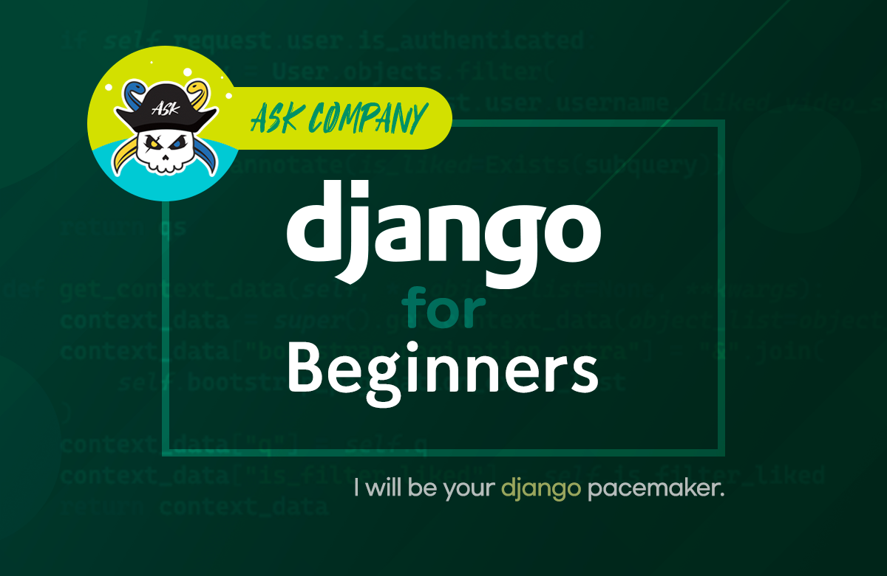
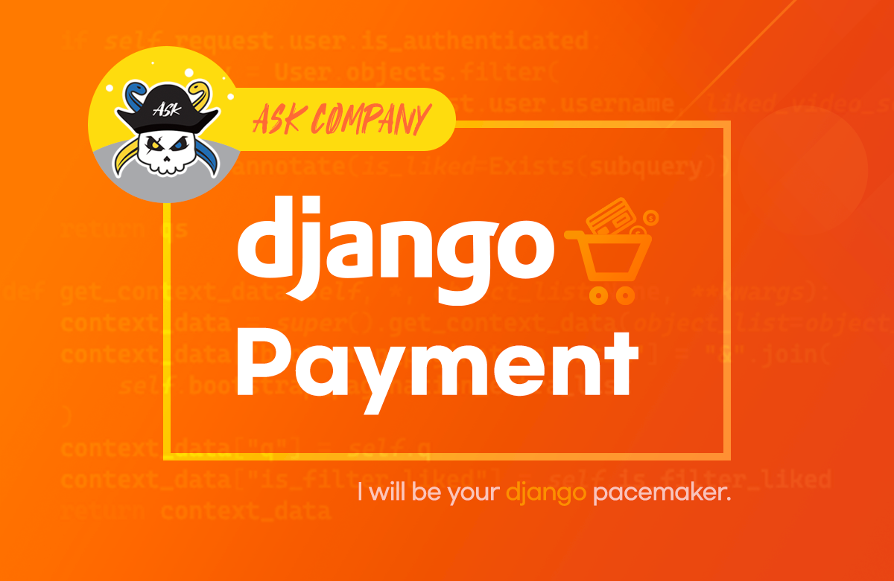
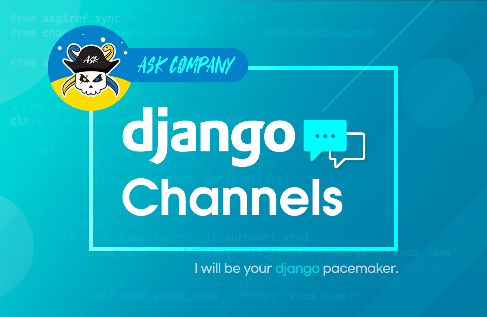
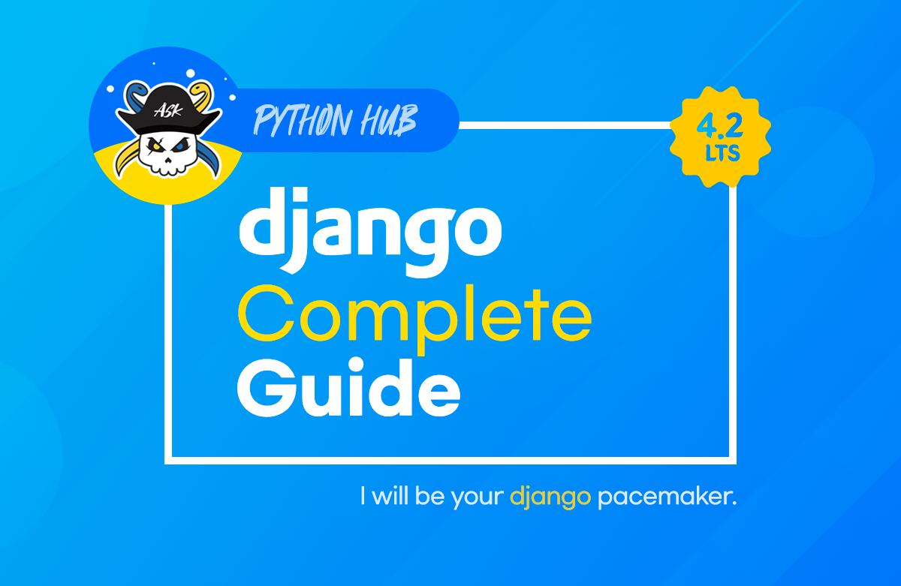

# 오프라인/온라인 강의

파이썬사랑방에서는 아래 5개의 장고 강의를 운영하고 있습니다. 간략한 소개와 대표 수강평을 소개드립니다.

## 오프라인 강의

파이썬/장고/리액트 웹서비스 개발 기술을 기반으로 다양한 주제의 오프라인 강의가 가능합니다.

+ 교육 문의 : [me@pyhub.kr](mailto:me@pyhub.kr?subject=%EA%B5%90%EC%9C%A1%20%EB%AC%B8%EC%9D%98%20%EB%93%9C%EB%A6%BD%EB%8B%88%EB%8B%A4.&body=%EC%95%88%EB%85%95%ED%95%98%EC%84%B8%EC%9A%94.)

## 온라인 강의

### 장고 기초

#### (무료) 장고 설계철학으로 시작하는 파이썬/장고 입문

- (무료강의) (인프런) [장고 설계철학으로 시작하는 파이썬 장고 입문](https://inf.run/7J1S)
- 29개 영상 (4시간 10분)
- 장고에 필요한 문법 설명과 함께 장고 설계 철학을 깊게 설명해 드리는 이론 중심의 입문 강의
- 웹개발이 처음이신 분들에게는 어려우실 수 있습니다. 웹개발이 처음이신 분들께서는 [생활코딩의 <Python Django Web Framework> 유튜브 강좌](https://www.youtube.com/playlist?list=PLuHgQVnccGMDLp4GH-rgQhVKqqZawlNwG)를 먼저 학습하시기를 추천드립니다.
- 대표 수강평
    - 챕터 하나하나에 장고 철학 뿐만 아니라 소중한 개발 꿀팁이 쏟아지네요. 가장 흔한 "작은 프로젝트 하나 따라하며 완성해보기" 방식이라기보다는(물론 실습이 있기는 합니다.) 개발 중에 만난, 혹은 분명히 만나게 될 문제 몇 가지를 어떻게 보완하거나 해결할지에 대한 생각거리와 썰을 풀어주시는 강의라고 생각합니다. 그런 맥락에서 웹개발 완전입문자 분들이 수강하시기에는 막연하게 느껴질 부분들이 있을 것 같습니다. 꾸역꾸역 눈에 보이는 프로젝트를 하나 끝내보는 데 집중하는 강의는 아니니까요. 고민거리, 공부할 내용도 많이 알려주시는 참 좋은 강의라고 생각합니다. ([전체보기](https://inf.run/GarTC)) by 일코 님

### 장고 활용

#### 파이썬/장고로 결제 시작하기 (Feat. 아임포트) - 기본편

- (인프런) [파이썬/장고로 결제 시작하기 (Feat. 아임포트) - 기본편](https://inf.run/A8Hm)
- 56개 영상 (5시간 28분)
- 아임포트 결제 API를 활용하여 쇼핑몰 서비스를 구축해보며, 장고 개발의 기초를 탄탄히 다집니다. 장고 기초를 학습하신 후에, 보다 효율적인 장고 개발을 익히고 싶으신 분들께 추천드립니다.
- 대표 수강평
    - iamport를 이용한 결제와 관련한 전반적인 내용을 학습할 수 있었다. 무엇보다, 실무에 바로 써먹을 핵심들을 강의에 잘 녹여들게 만들었다고 생각된다. 제품을 장바구니에 넣고, 결제하고, 결제 현황을 검증하고, 취소하는 일련의 과정이 잘 담겨 있다. 근래 결제한 많은 강의 중, 돈이 전혀 아깝지 않은 강의였다. ([전체보기](https://inf.run/XVYJ1)) by bluebamus 님

#### 파이썬/장고로 웹채팅 서비스 만들기 (Feat. Channels) - 기본편

- (인프런) [파이썬/장고로 웹채팅 서비스 만들기 (Feat. Channels) - 기본편](https://inf.run/iMQ9)
- 23개 영상 (2시간 24분)
- 본 "django-pyhub-ai 튜토리얼"의 기반이 되는 장고 채널스 강의입니다. 장고 채널스를 기반으로 장고 웹서비스에 실시간 성을 부여하고, 채팅 서비스를 구축하는 방법을 익히는 강의입니다.

#### ChatGPT 영어 상황극 채팅 서비스 만들기 (Feat. 파이썬/장고채널스)

- (인프런) [ChatGPT 영어 상황극 채팅 서비스 만들기 (Feat. 파이썬/장고채널스)](https://inf.run/ySNr)
- 40개 영상 (2시간 22분)
- OpenAI 챗봇 API로 실용적인 영어 상황극 서비스를 개발하는 방법을 알아봅니다. CLI 버전의 간결한 UI로 채팅을 구현하며 OpenAI 챗봇 API에 대한 이해를 쌓은 다음, 장고 채널스를 활용한 실시간 웹 채팅 서비스 개발까지 실습을 통해 차근차근 다루는 실속 강의이며, 위 웹채팅 기본편을 수강하지 않으셔도 본 강의를 수강하실 수 있습니다.
- 본 "django-pyhub-ai" 라이브러리는 HTMX 기반으로 웹소켓 구현이 되어있는 반면, 본 강의에서는 HTMX를 사용하지 않고 직접 바닐라 JS로 웹소켓 통신을 구현했기에, 수강 후에 손쉽게 리액트/Vue.js 애플리케이션으로 포팅하실 수 있습니다.
    - 장고를 활용하여 채팅방 생성/수정/목록/상세 페이지 만들기
    - 채널스와 웹소켓을 통한 서버와 1:1 채팅 구현하기
    - 상황극 채팅 서비스 부가 기능 만들기 (표현 추천, 음성 읽어주기)
- 대표 수강평
    - gpt를 이용하여 개인 프로젝트에 서비스를 만들어보고자 했는데 해당 강의를 들으면서 어떤 식으로 구상해야 할지 감을 잡을 수 있었습니다. 강의마다 코드 주소도 적혀 있고, 강사님께서 코드 작업 전 개념과 로직 흐름 설명해주시는 부분이 정말 좋은거 같아요. 다음에 또 좋은 강의 등록해주시면 수강하고 싶습니다. 잘 들었습니다. :) ([전체보기](https://inf.run/khPBN))by 스물다섯번째밤 님

### 장고 완벽 가이드

- (인프런) [파이썬/장고 웹서비스 개발 완벽 가이드 with 리액트 (장고 4.2 기준)](https://inf.run/Fcn6n)
- 295개 영상 (35시간 56분)
- 대표 수강평
    - 일단 강의가 많고요, 그만큼 설명을 자세히 해주십니다. 질문에 대한 답변도 잘해주셔서 너무 좋습니다. 여기서 다른 장고강의도 들어봤는데요, 무슨 대학교 교수님이 그냥 ppt읽으면서 강의하는 느낌나고 그리고  질문하면 chatGPT써서 복붙하는것도 봤습니다. 이 강의는 이런거 전혀 없고, 질문에 대한 답변도 너무 좋습니다. ([전체보기](https://inf.run/iWaUi)) by sunnnwo 님
    - 장고의 A부터 Z까지 단순히 코드를 클론하는게 아닌 실제 동작 원리까지 알려주셔서 너무 감사합니다 ^^ 이전 리뉴얼 전 강의도 잘 보고 있었는데 이렇게 리뉴얼 해주셔서 정말 편하고 효율적으로 장고 학습을 할 수 있어 감사하네요 ㅎㅎ ([전체보기](https://inf.run/Z6n7n)) by 백경민 님

이 강의는 여러분이 장고를 올바르게 이해하고 효과적으로 활용할 수 있도록 설계되었구요. **장고를 효율적으로 활용한 웹개발**을 완벽하게 익힐 수 있습니다.

+ 리액트와 Next.js 기술은 자유도가 높을 수는 있어도 장고에 비해서 개발비용이 높습니다.
+ 리액트와 Next.js 기술이 인기있다고 해서 서비스의 모든 페이지를 리액트와 Next.js 기술로 개발할 필요는 없습니다. 리액트와 Next.js 기술이 효용있는 페이지에 집중해서 개발하고, 그 외의 페이지에서는 **장고 기술로 생산성높게 시간을 아끼며** 웹서비스를 빠르게 개발하실 수 있습니다. 선택과 집중이죠.
+ 장고 중심으로 빠르게 웹서비스 개발을 개발하는 방법을 익히고, 장고 중심으로 다양한 웹 프론트엔드 기술을 통합하는 방법을 익힙니다. 이렇게 하면, 여러분은 다양한 웹 개발 요구에 대응할 수 있는 유연하고 효율적인 접근 방식을 갖출 수 있습니다. 이 강의를 통해 백엔드와 프론트엔드 모두에서 강력한 기술적 기반을 구축하는 데 필요한 지식과 경험을 얻을 수 있을 것입니다.
