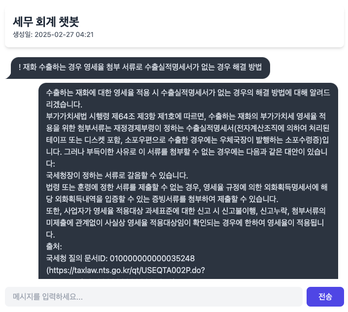

====================================
부록 #4. Anthropic API 응답 받기
====================================

.. admonition:: `관련 커밋 <https://github.com/pyhub-kr/django-webchat-rag-langcon2025/commit/3927187ffec09c8c6976ad21aae36e835d3263fc>`_
   :class: dropdown

   * 변경 파일을 한 번에 덮어쓰기 하실려면, :doc:`/utils/pyhub-git-commit-apply` 설치하신 후에, 프로젝트 루트에서 아래 명령 실행하시면
     지정 커밋의 모든 파일을 다운받아 현재 경로에 덮어쓰기합니다.

   .. code-block:: bash

      python -m pyhub_git_commit_apply https://github.com/pyhub-kr/django-webchat-rag-langcon2025/commit/3927187ffec09c8c6976ad21aae36e835d3263fc

   ``uv``\를 사용하실 경우 

   .. code-block:: bash

      uv run pyhub-git-commit-apply https://github.com/pyhub-kr/django-webchat-rag-langcon2025/commit/3927187ffec09c8c6976ad21aae36e835d3263fc

다양한 LLM API들이 있으며, 서비스의 목적에 맞는 LLM API들을 사용해야할 것입니다. 이에 Anthropic API를 추가로 지원해보겠습니다.

Anthropic의 Claude 모델은 OpenAI의 GPT 모델과 함께 가장 널리 사용되는 LLM 중 하나이며,
긴 컨텍스트 처리와 자연스러운 대화에 강점이 있습니다.

미리보기
=============

    같은 프롬프트의 claude-3-7-sonnet-20250219 모델 응답

라이브러리 설치
====================

.. code-block:: text
    :caption: ``requirements.txt`` 파일 덮어쓰기
    :emphasize-lines: 6
    :linenos:

    django-pyhub-rag
    django-environ
    django-extensions
    django-lifecycle
    openai
    anthropic

    # sqlite 데이터베이스를 사용할 경우
    sqlite-vec
    numpy

    # postgres 데이터베이스를 사용할 경우
    # psycopg2-binary
    # pgvector

    ipython

API_KEY 발급 및 등록
============================

Anthropic API Key는 https://console.anthropic.com/settings/keys 페이지에서 발급받으실 수 있습니다.

발급받으신 api key를 복사하여 ``.env`` 파일에 ``ANTHROPIC_API_KEY`` 환경변수로서 등록해주세요.

.. code-block:: text
    :caption: ``.env`` 파일

    OPENAI_API_KEY=sk-...
    ANTHROPIC_API_KEY=sk-ant-api03-...

``settings``\에서도 환경변수 참조를 위해 ``ANTHROPIC_API_KEY`` 설정을 추가합니다.

.. code-block:: python
    :caption: ``mysite/settings.py`` 파일에 추가

    # Anthropic API Key
    # default 값을 지정하지 않았기에 지정 환경변수가 없더라도 예외가 발생하지 않습니다.
    ANTHROPIC_API_KEY = env.str("ANTHROPIC_API_KEY", default=None)

model 인자에 따른 API 호출 분기
=====================================

``chat/llm.py`` 파일의 ``LLM`` 클래스에서 ``model`` 인자에 따라 API 호출을 분기하여 응답을 생성합니다.

.. admonition:: ``chat/llm.py`` 파일 덮어쓰기
    :class: dropdown

    .. code-block:: python
        :linenos:
        :caption: ``chat/llm.py`` 파일

        from typing import Dict, List, Optional, Literal, Union, cast

        from anthropic.types import ModelParam as AnthropicModelParam
        from django.conf import settings
        from anthropic import Anthropic
        from openai import OpenAI
        from openai.types import ChatModel as OpenAIChatModel
        from typing_extensions import TypeAlias

        # https://platform.openai.com/docs/models
        openai_client = OpenAI(api_key=settings.OPENAI_API_KEY)

        # https://docs.anthropic.com/en/docs/about-claude/models/all-models
        anthropic_client = Anthropic(api_key=settings.ANTHROPIC_API_KEY)

        # LLM Model Types
        LLMModelParams: TypeAlias = Union[str, AnthropicModelParam, OpenAIChatModel]

        class LLM:
            def __init__(
                self,
                model: LLMModelParams = "gpt-4o-mini",
                temperature: float = 0.2,
                max_tokens: int = 1000,
                system_prompt: str = "",
                initial_messages: Optional[List[Dict]] = None,
            ):
                self.model = model
                self.temperature = temperature
                self.max_tokens = max_tokens
                self.system_prompt = system_prompt
                self.history = initial_messages or []

            def make_reply(
                self,
                human_message: Optional[str] = None,
                model: Optional[LLMModelParams] = None,
            ):
                current_messages = [*self.history]
                current_model = model or self.model

                if human_message is not None:
                    current_messages.append({"role": "user", "content": human_message})

                try:
                    if "claude" in current_model.lower():
                        response = anthropic_client.messages.create(
                            model=cast(AnthropicModelParam, current_model),
                            system=self.system_prompt,
                            messages=current_messages,
                            temperature=self.temperature,
                            max_tokens=self.max_tokens,
                        )
                        ai_message = response.content[0].text
                    else:
                        response = openai_client.chat.completions.create(
                            model=cast(OpenAIChatModel, current_model),
                            messages=[
                                {
                                    "role": "system",
                                    "content": self.system_prompt,
                                },
                            ]
                            + current_messages,
                            temperature=self.temperature,
                            max_tokens=self.max_tokens,
                        )
                        ai_message = response.choices[0].message.content
                except Exception as e:
                    return f"API 호출에서 오류가 발생했습니다: {str(e)}"
                else:
                    self.history.extend(
                        [
                            {"role": "user", "content": human_message},
                            {"role": "assistant", "content": ai_message},
                        ]
                    )
                    return ai_message

LLM 인스턴스 생성 시에 anthropic 모델 지정
===============================================

이제 ``chat/models.py`` 파일에서 ``LLM`` 인스턴스 생성 시에 모델을 ``claude-3-7-sonnet-latest`` 로 변경하면 Claude API를 호출하여 응답을 생성합니다.
anthropic에서 지원하는 모델은 https://docs.anthropic.com/en/docs/about-claude/models/all-models 공식문서에서 확인하실 수 있습니다.

.. code-block:: python
    :linenos:
    :emphasize-lines: 3-4
    :caption: ``chat/models.py`` 파일 중 일부

    llm = LLM(
        # model="gpt-4o-mini",
        # model="claude-3-7-sonnet-20250219",
        model="claude-3-7-sonnet-latest",
        temperature=1,
        system_prompt=system_prompt,
        initial_messages=messages,
    )
