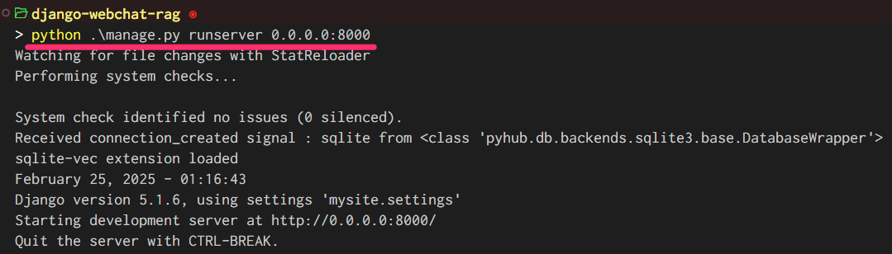
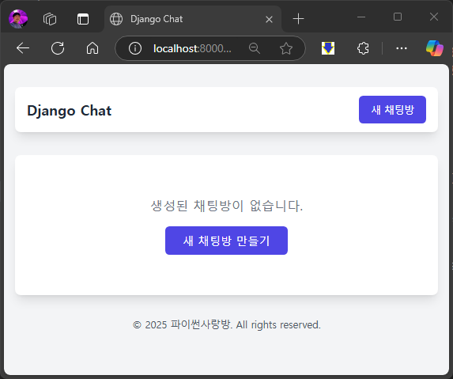
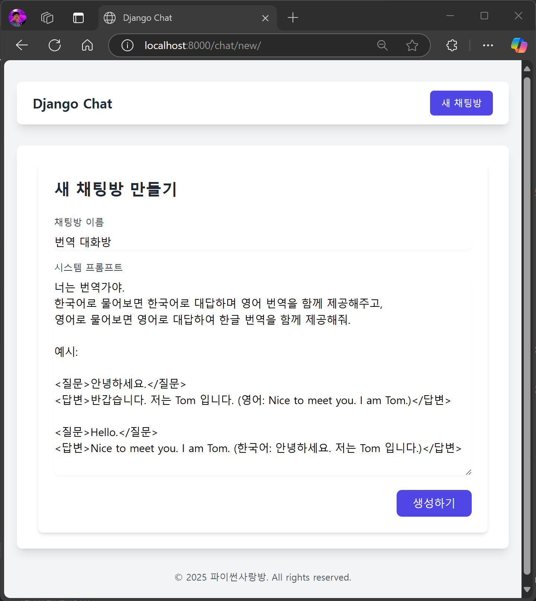
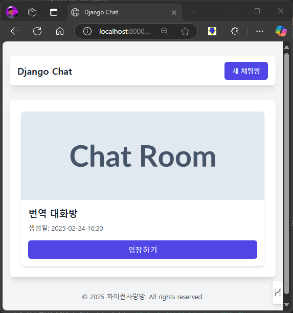
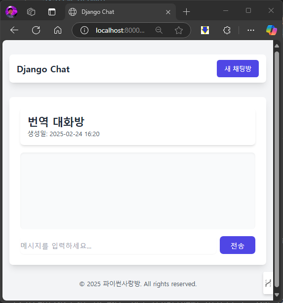

============================================
💬 채팅방/메시지 모델 및 기본 페이지 구성
============================================

모델
===========

채팅방을 저장할 모델로서 ``Room`` 모델을 정의합니다.
``.create_ai_message()`` 메서드를 호출하면 채팅방의 이전 메시지들을 수집하여 AI 응답을 생성하고, 새 AI 메시지로서 저장합니다.
채팅방의 시스템 프롬프트가 변경되면 이전 메시지들을 모두 삭제하도록 했습니다. 메시지 삭제는 상황에 따라 적용하지 않아도 됩니다.

* ``name``: 채팅방 이름
* ``system_prompt``: 채팅방 시스템 프롬프트
* ``created_at``: 채팅방 생성일시
* ``updated_at``: 채팅방 수정일시

채팅 메시지를 저장할 모델로서 ``Message`` 모델을 정의합니다.

* ``role``: 메시지 역할 (user, assistant)
* ``content``: 메시지 내용
* ``created_at``: 메시지 생성일시
* ``updated_at``: 메시지 수정일시
* ``room``: 채팅방 (Room 모델 외래키)

.. mermaid::

    erDiagram
        Room ||--o{ Message : has
        Room {
            string name
            string system_prompt
            datetime created_at
            datetime updated_at
        }
        Message {
            string role
            string content
            datetime created_at
            datetime updated_at
            string room_id
        }

.. tab-set::

    .. tab-item:: sqlite

        .. code-block:: python
            :linenos:
            :caption: ``chat/models.py`` 덮어쓰기
            :emphasize-lines: 1,2,5,16-50,53-68

            from django.db import models
            from django_lifecycle import AFTER_UPDATE, LifecycleModelMixin, hook
            from pyhub.rag.fields.sqlite import SQLiteVectorField
            from pyhub.rag.models.sqlite import SQLiteVectorDocument
            from chat.llm import LLM

            class TaxLawDocument(SQLiteVectorDocument):
                embedding = SQLiteVectorField(
                    dimensions=3072,
                    editable=False,
                    embedding_model="text-embedding-3-large",
                )

            class Room(LifecycleModelMixin, models.Model):
                name = models.CharField(max_length=255)
                system_prompt = models.TextField(blank=True)
                created_at = models.DateTimeField(auto_now_add=True)
                updated_at = models.DateTimeField(auto_now=True)

                def __str__(self):
                    return self.name

                @hook(AFTER_UPDATE, when="system_prompt", has_changed=True)
                def on_after_update(self):
                    self.message_set.all().delete()

                def create_ai_message(self):
                    # 현재 방의 이전 메시지들을 수집
                    message_qs = self.message_set.all()
                    messages = [{"role": msg.role, "content": msg.content} for msg in message_qs]

                    # AI 응답 생성
                    llm = LLM(
                        model="gpt-4o-mini",
                        temperature=1,
                        system_prompt=self.system_prompt,
                        initial_messages=messages,
                    )
                    ai_message = llm.make_reply()

                    # AI 응답을 새 메시지로 저장
                    return self.message_set.create(
                        role=Message.Role.ASSISTANT,
                        content=ai_message,
                    )

                class Meta:
                    ordering = ["-pk"]

            class Message(models.Model):
                class Role(models.TextChoices):
                    USER = "user"
                    ASSISTANT = "assistant"

                room = models.ForeignKey(Room, on_delete=models.CASCADE)
                role = models.CharField(max_length=255, choices=Role.choices, default=Role.USER)
                content = models.TextField()
                created_at = models.DateTimeField(auto_now_add=True)
                updated_at = models.DateTimeField(auto_now=True)

                def __str__(self):
                    return self.content

                class Meta:
                    ordering = ["pk"]

    .. tab-item:: postgres

        .. code-block:: python
            :linenos:
            :caption: ``chat/models.py`` 덮어쓰기
            :emphasize-lines: 1,2,5,16-50,53-68

            from django.db import models
            from django_lifecycle import AFTER_UPDATE, LifecycleModelMixin, hook
            from pyhub.rag.fields.postgres import PGVectorField
            from pyhub.rag.models.postgres import PGVectorDocument
            from chat.llm import LLM

            class TaxLawDocument(PGVectorDocument):
                embedding = PGVectorField(
                    dimensions=3072,
                    editable=False,
                    embedding_model="text-embedding-3-large",
                )

            class Room(LifecycleModelMixin, models.Model):
                name = models.CharField(max_length=255)
                system_prompt = models.TextField(blank=True)
                created_at = models.DateTimeField(auto_now_add=True)
                updated_at = models.DateTimeField(auto_now=True)

                def __str__(self):
                    return self.name

                @hook(AFTER_UPDATE, when="system_prompt", has_changed=True)
                def on_after_update(self):
                    self.message_set.all().delete()

                def create_ai_message(self):
                    # 현재 방의 이전 메시지들을 수집
                    message_qs = self.message_set.all()
                    messages = [{"role": msg.role, "content": msg.content} for msg in message_qs]

                    # AI 응답 생성
                    llm = LLM(
                        model="gpt-4o-mini",
                        temperature=1,
                        system_prompt=self.system_prompt,
                        initial_messages=messages,
                    )
                    ai_message = llm.make_reply()

                    # AI 응답을 새 메시지로 저장
                    return self.message_set.create(
                        role=Message.Role.ASSISTANT,
                        content=ai_message,
                    )

                class Meta:
                    ordering = ["-pk"]

            class Message(models.Model):
                class Role(models.TextChoices):
                    USER = "user"
                    ASSISTANT = "assistant"

                room = models.ForeignKey(Room, on_delete=models.CASCADE)
                role = models.CharField(max_length=255, choices=Role.choices, default=Role.USER)
                content = models.TextField()
                created_at = models.DateTimeField(auto_now_add=True)
                updated_at = models.DateTimeField(auto_now=True)

                def __str__(self):
                    return self.content

                class Meta:
                    ordering = ["pk"]

새로운 모델을 정의했으니, 마이그레이션 파일을 생성하고 (작업 지시서 생성), 마이그레이션을 통해 수행될 SQL 내역을 확인하고 (작업 지시서 확인), 마이그레이션을 수행합니다 (작업 지시서 실행).

.. tab-set::

    .. tab-item:: sqlite

        .. figure:: ./assets/chat-room/0002-migrate.png

폼
===========

유저에게 채팅방과 메시지를 입력할 수 있는 폼을 제공하고, 입력값에 대한 유효성 검증을 위해 모델폼을 생성합니다.

.. code-block:: python
    :linenos:
    :caption: ``chat/forms.py`` 파일 생성

    from django import forms
    from .models import Message, Room

    # 새 채팅방 생성 및 수정 페이지에서
    # 입력 HTML 폼 생성 및 유효성 검사를 담당
    class RoomForm(forms.ModelForm):
        class Meta:
            model = Room
            fields = ["name", "system_prompt"]

    # 채팅 메시지 입력/수정 폼을 생성하고 유효성 검사를 담당
    class MessageForm(forms.ModelForm):
        class Meta:
            model = Message
            fields = ["content"]

뷰
===========

3개의 페이지를 구현합니다.

* ``room_list``: 채팅방 목록 페이지

  - ``model = Room`` : 목록을 구성할 모델

* ``room_new``: 새 채팅방 생성 페이지

  - ``form = RoomForm`` : 입력값에 대한 유효성 검증을 수행하고, 입력폼 HTML을 생성할 폼
  - ``room = Room`` : 입력값을 저장할 모델
  - ``success_url = reverse_lazy("chat:room_list")`` : 입력값을 저장한 후 이동할 URL

* ``room_detail``: 채팅방 채팅 페이지

  - 지정 ``pk`` 의 채팅방을 조회하고, 해당 채팅방 내 모든 메시지를 조회합니다.

.. code-block:: python
    :linenos:
    :caption: ``chat/views.py`` 파일 수정

    from django.shortcuts import get_object_or_404, render
    from django.urls import reverse_lazy
    from django.views.generic import CreateView, ListView

    from .forms import RoomForm
    from .models import Room

    # 채팅방 목록 페이지 (클래스 기반 뷰)
    room_list = ListView.as_view(model=Room)

    # 새 채팅방 생성 페이지 (클래스 기반 뷰)
    room_new = CreateView.as_view(
        model=Room,
        form_class=RoomForm,
        success_url=reverse_lazy("chat:room_list"),
    )

    # 채팅방 채팅 페이지 (함수 기반 뷰)
    def room_detail(request, pk):
        # 지정 채팅방 조회하고, 데이터베이스에 없으면 404 오류 발생
        room = get_object_or_404(Room, pk=pk)
        # 지정 채팅방의 모든 대화 목록
        message_list = room.message_set.all()
        return render(
            request,
            "chat/room_detail.html",
            {
                "room": room,
                "message_list": message_list,
            },
        )

각 뷰에 대해 URL 패턴도 앞서 :doc:`./search` 문서에서 작성했었습니다.

템플릿
===========

.. code-block:: html+django
    :linenos:
    :caption: ``chat/templates/chat/room_list.html`` 파일 생성

    

    
        

            
                

                    
                    

                        <h2 class="text-xl font-semibold text-gray-800 mb-2">{{ room.name }}</h2>
                        
생성일: {{ room.created_at|date:"Y-m-d H:i" }}

                        <a href="" 
                        class="inline-block w-full text-center bg-indigo-600 text-white py-2 px-4 rounded-md hover:bg-indigo-700 transition-colors duration-300">
                            입장하기
                        </a>
                    

                

            
                

                    
생성된 채팅방이 없습니다.

                    <a href="" 
                    class="inline-block mt-4 bg-indigo-600 text-white py-2 px-6 rounded-md hover:bg-indigo-700 transition-colors duration-300">
                        새 채팅방 만들기
                    </a>
                

            
        

    

.. code-block:: html+django
    :linenos:
    :caption: ``chat/templates/chat/room_detail.html`` 파일 생성

    

    
        

            

                <h1 class="text-2xl font-bold text-gray-800">{{ room.name }}</h1>
                
생성일: {{ room.created_at|date:"Y-m-d H:i" }}

            

            

                

                    
                        

                            

                                

                                    {{ message.is_ai|yesno:"AI,You" }}
                                

                                
{{ message.content }}

                                

                                    {{ message.created_at|date:"H:i" }}
                                

                            

                        

                    
                

            

            <form class="flex gap-2" method="post">
                
                <input type="text" name="content" required autocomplete="off"
                    class="flex-1 rounded-lg border-gray-300 shadow-sm focus:border-indigo-300 focus:ring focus:ring-indigo-200 focus:ring-opacity-50"
                    placeholder="메시지를 입력하세요...">
                <button type="submit"
                    class="bg-indigo-600 text-white px-6 py-2 rounded-lg hover:bg-indigo-700 transition-colors duration-300">
                    전송
                </button>
            </form>
        

    

.. code-block:: html+django
    :linenos:
    :caption: ``chat/templates/chat/room_form.html`` 파일 생성

    

    
    

        

            <h1 class="text-2xl font-bold text-gray-800 mb-6">새 채팅방 만들기</h1>

            <form method="post" novalidate>
                

                

                    <label for="{{ form.name.id_for_label }}" class="block text-sm font-medium text-gray-700 mb-2">채팅방
                        이름</label>
                    <input type="text" name="{{ form.name.name }}" id="{{ form.name.id_for_label }}" required
                        class="w-full rounded-lg border-0 shadow-sm focus:border-indigo-300 focus:ring focus:ring-indigo-200 focus:ring-opacity-50"
                        value="{{ form.name.value }}" >
                    
                    
{{ form.name.errors.0 }}

                    
                

                

                    <label for="{{ form.system_prompt.id_for_label }}" class="block text-sm font-medium text-gray-700 mb-2">시스템
                        프롬프트</label>
                    <textarea name="{{ form.system_prompt.name }}" id="{{ form.system_prompt.id_for_label }}"
                        class="w-full rounded-lg border-0 shadow-sm focus:border-indigo-300 focus:ring focus:ring-indigo-200 focus:ring-opacity-50"
                        value="{{ form.system_prompt.value }}" ></textarea>
                    
                    
{{ form.system_prompt.errors.0 }}

                    
                

                

                    <button type="submit"
                        class="bg-indigo-600 text-white px-6 py-2 rounded-lg hover:bg-indigo-700 transition-colors duration-300">
                        생성하기
                    </button>
                

            </form>
        

    

    

웹 페이지 동작 확인
=========================

아래 명령으로 장고 개발 웹서버를 구동합니다.

.. code-block::

    python manage.py runserver 0.0.0.0:8000

크롬이나 엣지 브라우저를 통해 http://localhost:8000 주소로 접속해주세요.

그럼 ``mysite/urls.py``\에 정의된 ``RedirectView``\에 의해 ``/chat/`` 주소로 자동 이동합니다.
"새 채팅방 만들기" 버튼을 클릭하시면 ``/chat/new/`` 주소로 이동합니다.

http://localhost:8000/chat/new/ 주소에서는 새로운 채팅방을 생성할 수 있는 폼이 제공됩니다.
"채팅방 이름"과 채팅방에서 사용할 "시스템 프롬프트"를 입력하고 "생성하기" 버튼을 클릭하면 채팅방이 생성됩니다.

.. admonition:: 번역, 시스템 프롬프트
    :class: dropdown

    .. code-block::

        너는 번역가야.
        한국어로 물어보면 한국어로 대답하며 영어 번역을 함께 제공해주고,
        영어로 물어보면 영어로 대답하여 한글 번역을 함께 제공해줘.

        예시:

        <질문>안녕하세요.</질문>
        <답변>반갑습니다. 저는 Tom 입니다. (영어: Nice to meet you. I am Tom.)</답변>

        <질문>Hello.</질문>
        <답변>Nice to meet you. I am Tom. (한국어: 안녕하세요. 저는 Tom 입니다.)</답변>

.. note::

    ``chat/templates/chat/room_form.html`` 템플릿에서는 폼 필드마다 일일이 HTML 마크업을 작성했지만,
    ``django-crispy-forms`` 등의 라이브러리를 통해 폼 필드에 대한 마크업을 자동으로 생성할 수 있고,
    HTML 코드가 아닌 파이썬 코드로 레이아웃을 구성하고 위젯을 지정할 수 있습니다.

채팅방 생성 후에 자동으로 채팅방 목록 페이지로 이동했습니다.
"입장하기" 버튼을 클릭하시면 채팅방 채팅 페이지로 이동합니다.

http://localhost:8000/chat/1/ 주소에서는 채팅방 채팅 페이지가 제공됩니다.
채팅방에 따라 ``/chat/1/``, ``/chat/2/``, ``/chat/3/`` 등 주소가 달라집니다.
아직 채팅 메시지 전송 및 응답 기능이 구현되지 않았습니다.

