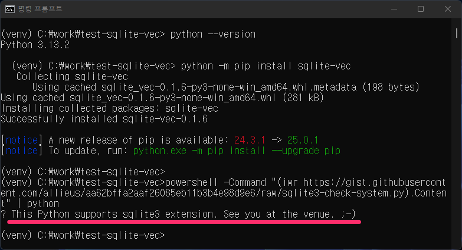

======================================
👨‍💻 핸즈온랩 시간. 실습환경 확인
======================================

본 튜토리얼에서 가장 오랜 시간이 걸릴 수 있는 부분이 실습환경 구성과 라이브러리 다운로드입니다.

튜토리얼을 시작하기 전에 :doc:`./preparation` 문서에서 확인했었던 실습환경을 재차 확인해주시고,
프로젝트 폴더 생성 후에 가상환경 생성 및 라이브러리 설치까지 완료 부탁드립니다. 🙇

* :ref:`sqlite-vec 라이브러리를 활용하실 경우 <sqlite-vec>`

  - 시스템 확인 코드 동작 확인

* :ref:`pgvector 라이브러리를 활용하실 경우 <pgvector>`

  - supabase.com 서비스에 가입하고, ``DATABASE_URL`` 환경변수 준비

sqlite-vec 라이브러리를 활용하실 경우
==============================================

.. _sqlite-vec:

실습환경 재확인
---------------------

시스템 확인 코드를 통해 실습환경을 확인합니다. 운영체제/쉘에 맞게 명령을 복사해서 실행해주세요.

.. tab-set::

    .. tab-item:: 윈도우 파워쉘/명령프롬프트

        .. code-block:: powershell

            powershell -Command "(iwr https://gist.githubusercontent.com/allieus/aa62bffa2aaf26085eb11b3b4e98d9e6/raw/sqlite3-check-system.py).Content" | python

    .. tab-item:: macOS 쉘

        .. code-block:: shell

            curl https://gist.githubusercontent.com/allieus/aa62bffa2aaf26085eb11b3b4e98d9e6/raw/sqlite3-check-system.py | python

실습환경 준비 완료
---------------------

``This Python supports sqlite3 extension. See you at the venue. ;-)`` 문장이 출력되면 실습환경 준비가 완료된 것입니다.

pgvector 라이브러리를 활용하실 경우
========================================

.. _pgvector:

https://supabase.com 서비스를 이용하시거나, 로컬에 ``pgvector`` 확장이 설치된 ``PostgreSQL`` 데이터베이스를 생성하신 후에,
``DATABASE_URL`` 환경변수로서 사용할 연결 문자열을 준비해주세요.

.. code-block:: text
    :caption: ``DATABASE_URL`` 환경변수 예시

    postgresql://postgres.euvmdqdkpiseywirljvs:암호@aws-0-ap-northeast-2.pooler.supabase.com:5432/postgres

프로젝트 폴더 생성, 가상환경 활성화 및 라이브러리 설치
==============================================================

원하시는 경로에 ``django-webchat-rag`` 프로젝트 폴더를 생성해주시고, 프로젝트 폴더에서 가상환경을 생성/활성화해주세요.

.. tab-set::

    .. tab-item:: 윈도우 파워쉘/명령프롬프트

        .. code-block:: text

            python -m venv venv
            venv\Scripts\activate

    .. tab-item:: macOS 쉘

        .. code-block:: shell

            python -m venv venv
            source ./venv/bin/activate

아래 명령을 복사해서, 필요한 라이브러리들을 한 번에 설치해주세요.

.. tab-set::

    .. tab-item:: sqlite로 진행하실 경우

        .. code-block:: text

            python -m pip install --upgrade sqlite-vec numpy pyhub-git-commit-apply django-pyhub-rag django-environ django-debug-toolbar django-extensions django-lifecycle openai ipython

    .. tab-item:: postgres로 진행하실 경우

        .. code-block:: text

            python -m pip install --upgrade psycopg2-binary pgvector pyhub-git-commit-apply django-pyhub-rag django-environ django-debug-toolbar django-extensions django-lifecycle openai ipython

``python -m pip list`` 명령으로 설치된 라이브러리 목록을 확인하실 수 있습니다.

.. admonition:: 라이브러리 목록 확인
    :class: dropdown

    버전은 정확히 일치하지 않아도 됩니다. :-)

    .. code-block:: text

        Package                Version
        ---------------------- ---------
        annotated-types        0.7.0
        anyio                  4.8.0
        asgiref                3.8.1
        asttokens              3.0.0
        certifi                2025.1.31
        charset-normalizer     3.4.1
        colorama               0.4.6
        decorator              5.2.1
        distro                 1.9.0
        Django                 5.1.6
        django-debug-toolbar   5.0.1
        django-environ         0.12.0
        django-extensions      3.2.3
        django-lifecycle       1.2.4
        django-pyhub-rag       0.6.2
        executing              2.2.0
        h11                    0.14.0
        httpcore               1.0.7
        httpx                  0.28.1
        idna                   3.10
        ipython                8.32.0
        jedi                   0.19.2
        jiter                  0.8.2
        matplotlib-inline      0.1.7
        numpy                  2.2.3
        openai                 1.65.1
        parso                  0.8.4
        pip                    24.3.1
        prompt_toolkit         3.0.50
        pure_eval              0.2.3
        pydantic               2.10.6
        pydantic_core          2.27.2
        Pygments               2.19.1
        pyhub_git_commit_apply 0.4.0
        regex                  2024.11.6
        requests               2.32.3
        sniffio                1.3.1
        sqlite-vec             0.1.6
        sqlparse               0.5.3
        stack-data             0.6.3
        tiktoken               0.9.0
        tqdm                   4.67.1
        traitlets              5.14.3
        typing_extensions      4.12.2
        tzdata                 2025.1
        urllib3                2.3.0
        wcwidth                0.2.13

.. tip::

    가상환경 생성 및 활성화, 라이브러리 설치에 어려움이 있으신 분은 주저없이 말씀해주세요. :-)

명령 테스트
==================

방금 ``pyhub-git-commit-apply`` 라이브러리도 설치했었구요.
**오타없는 빠른 튜토리얼 실습을 도와주는** 라이브러리입니다.
곧 사용할 것이구요.

``python -m pyhub_git_commit_apply`` 명령이 지원되는데요. 터미널에서 실행하시면 아래와 같이 명령이 동작하는 지를 확인해주세요.

.. code-block:: text
    :emphasize-lines: 1

    $ python -m pyhub_git_commit_apply
    usage: __main__.py [-h] [--all] commit_url
    __main__.py: error: the following arguments are required: commit_url

명령에서 필수 인자 ``commit_url``\을 지정하지 않았기 때문에 오류가 발생하는 것이 맞습니다.

Let's Go!
==========

그럼 모든 준비를 마치셨습니다. 시작할 때까지 잠시만 기다려주세요.

잘 부탁드립니다. 😉
