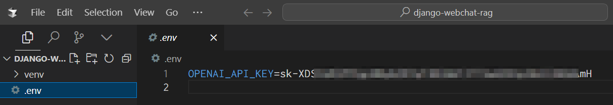
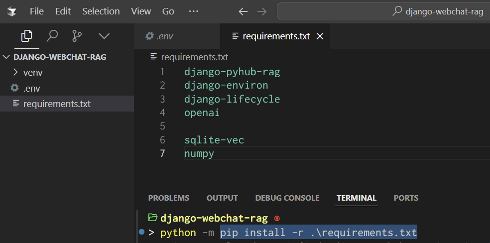
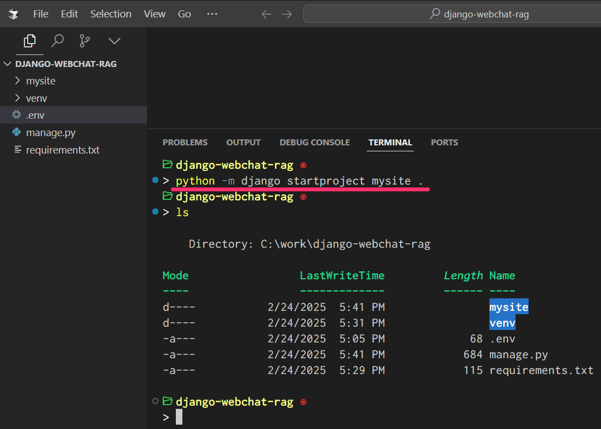
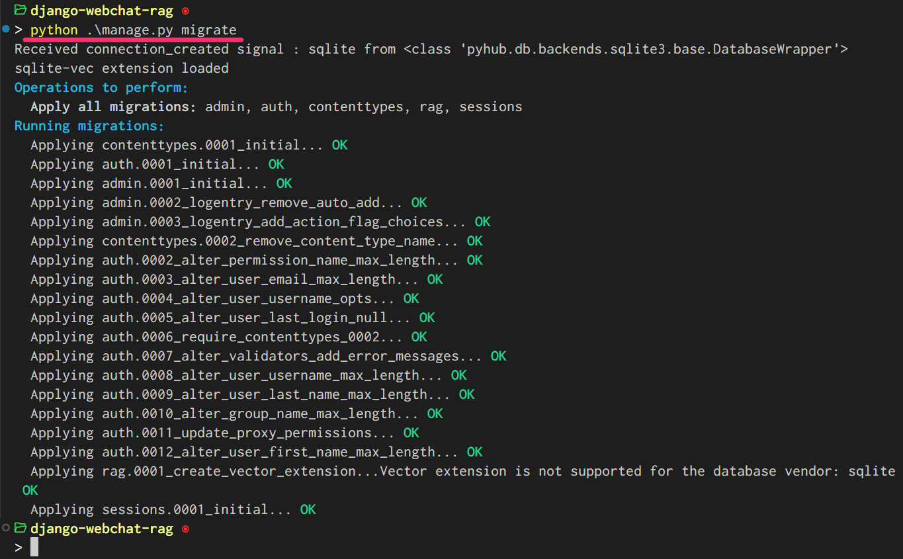

=============================================================
🔑 장고 프로젝트 생성 및 환경변수 ``OPENAI_API_KEY`` 설정
=============================================================

.. admonition:: `관련 커밋 <https://github.com/pyhub-kr/django-webchat-rag-langcon2025/commit/4b13ac63853b5fc1f47fcfe41206f384bc8af60a>`_
   :class: dropdown

   * 변경 파일을 한 번에 덮어쓰기 하실려면, :doc:`/utils/pyhub-git-commit-apply` 설치하신 후에, 프로젝트 루트에서 아래 명령 실행

   .. code-block:: bash

      uv run pyhub-git-commit-apply https://github.com/pyhub-kr/django-webchat-rag-langcon2025/commit/4b13ac63853b5fc1f47fcfe41206f384bc8af60a

1. 프로젝트 디렉토리 생성
==========================

원하시는 경로에 ``django-webchat-rag`` 프로젝트 폴더를 생성해주세요.

2. 가상환경 생성/활성화
============================

방금 생성하신 프로젝트 폴더로 이동하여 가상환경을 생성/활성화해주세요.

.. tab-set::

    .. tab-item:: 파워쉘/명령프롬프트

        .. code-block:: shell

            python -m venv venv
            venv\Scripts\activate

    .. tab-item:: macOS 쉘

        .. code-block:: shell

            python -m venv venv
            source ./venv/bin/activate
        
프로젝트 폴더를 편하신 에디터/IDE로 열어주시고, 에디터/IDE에 가상환경도 지정해주세요.

VSCode에서는 명령 팔레트에서  ``Python: Select Interpreter`` 명령으로 현재 프로젝트에서 사용할 가상환경을 선택해주세요.
그 후에 ``Terminal: Create New Terminal`` 명령으로 새로운 터미널을 여시면 자동으로 지정 가상환경이 활성화됩니다.

.. tab-set::

    .. tab-item:: 파워쉘/명령프롬프트

        가상환경 활성화한 후에, 파워쉘에서는 ``Get-Command python | Select-Object Source`` 명령으로
        현재 ``python`` 명령을 통해 수행되는 파이썬 경로를 확인할 수 있습니다.
        ``django-webchat-rag\venv`` 경로가 포함되어 있으면 가상환경이 활성화된 것입니다.

        .. figure:: ./assets/initial-project/verify-python-path-windows-powershell.png

        명령 프롬프트에서는 ``where python`` 명령으로 현재 ``python`` 명령을 통해 수행되는 파이썬 경로를 확인할 수 있습니다.
        ``django-webchat-rag\venv`` 경로가 포함되어 있으면 가상환경이 활성화된 것입니다.

        .. figure:: ./assets/initial-project/verify-python-path-windows-cmd.png

    .. tab-item:: macOS 쉘

        가상환경 활성화한 후에, macOS 쉘에서는 ``which python`` 명령으로
        현재 ``python`` 명령을 통해 수행되는 파이썬 경로를 확인할 수 있습니다.
        이를 통해 가상환경 활성화 여부를 확인하실 수 있습니다.
        ``django-webchat-rag/venv`` 경로가 포함되어 있으면 가상환경이 활성화된 것입니다.

        .. figure:: ./assets/initial-project/verify-python-path-macos.png

.. tip::

    혹시 VSCode/PyCharm 터미널에서 자동으로 가상환경이 활성화되지 않는다면 수동으로 가상환경을 활성화해주시고,
    쉬는 시간에 따로 질문주시면 정확히 해결해드리겠습니다.

3. .env 파일 생성
====================

소스코드 편집기를 통해 프로젝트 루트에 다음 내용으로 ``.env`` 파일을 생성해주세요.

* ``DATABASE_URL`` : 데이터베이스 연결 정보

  - 각자 SQLite/Postgres 환경에 맞게 ``DATABASE_URL`` 환경변수를 설정해주세요.

* ``OPENAI_API_KEY`` : OpenAI API 키

  - ``OPENAI_API_KEY`` 환경변수는 본인의 OpenAI API 키를 입력해주세요.
    OpenAI API Key는 https://platform.openai.com/api-keys 페이지에서 발급받으실 수 있습니다.
  - 본인의 OpenAI API Key 생성이 어려우신 분은 핸즈온랩 시간 동안에만 사용하실 Key를 제공해드립니다.

.. tab-set::

    .. tab-item:: sqlite-vec를 사용할 경우

        ``sqlite`` 에서는 ``DATABASE_URL`` 환경변수는 지정하지 않고, 장고 프로젝트 내에서 디폴트 경로를 생성해서 활용하겠습니다.

        .. code-block:: text

            OPENAI_API_KEY=sk-...

    .. tab-item:: pgvector를 사용할 경우

        .. code-block:: text

            DATABASE_URL=postgresql://postgres.euvmdqdkpiseywirljvs:암호@aws-0-ap-northeast-2.pooler.supabase.com:5432/postgres
            OPENAI_API_KEY=sk-...

.. warning::

    * 메모장을 통해 생성하실 경우, 확장자가 ``.txt`` 로서 ``.env.txt`` 파일명으로 생성되실 수 있습니다.
      반드시 확장자없이 ``.env`` 파일명으로 생성해주세요.
    * ``.env`` 파일은 ``key=value`` 형식으로 작성하시되, 등호 양쪽에 공백이 있으면 안됩니다.
      공백이 있으면 해당 설정은 무시되니 주의해주세요.

4. 라이브러리 설치
=======================

프로젝트 루트 경로에 ``requirements.txt`` 파일을 아래 내용으로 작성해주세요.

.. tab-set::

    .. tab-item:: sqlite-vec 확장을 사용하실 경우

        파이썬에서는 ``sqlite`` 드라이버를 기본 지원합니다.

        .. code-block:: text
            :caption: ``requirements.txt``
            :emphasize-lines: 8-9

            django-pyhub-rag
            django-environ
            django-debug-toolbar
            django-extensions
            django-lifecycle
            openai

            sqlite-vec
            numpy

            ipython

    .. tab-item:: pgvector 확장을 사용하실 경우

        ``psycopg2-binary`` 드라이버를 설치합니다.

        .. code-block:: text
            :caption: ``requirements.txt``
            :emphasize-lines: 8-9

            django-pyhub-rag
            django-environ
            django-debug-toolbar
            django-extensions
            django-lifecycle
            openai

            psycopg2-binary
            pgvector

            ipython

다음 명령으로 필요한 라이브러리를 한 번에 설치합니다.

.. code-block:: shell

    python -m pip install --upgrade -r requirements.txt

.. note::

    * ``django-pyhub-rag`` : pgvector/sqlite-vec 벡터스토어를 동일한 모델 코드로 지원
    * ``django-environ`` : ``.env`` 파일 로딩 및 환경변수 값 파싱
    * ``django-debug-toolbar`` : 장고 디버그 툴바 라이브러리
    * ``django-extensions`` : 다양한 장고 확장 편의 기능 제공
    * ``django-lifecycle`` : 장고 모델 레코드 생성/수정/삭제 시에 호출할 함수를 직관적으로 작성
    * ``openai`` : OpenAI API 라이브럴  
    * ``sqlite-vec`` : SQLite 벡터스토어 확장
    * ``numpy`` : 벡터 배열 데이터 변환에 활용
    * ``psycopg2-binary`` : PostgreSQL 데이터베이스 드라이버
    * ``pgvector`` : PostgreSQL 벡터스토어 확장
    * ``ipython`` : 향상된 파이썬 쉘

5. 프로젝트 생성
=======================

장고에서는 ``django-admin startproject`` 명령으로 프로젝트를 생성하며, ``python -m django startproject`` 명령으로도 동일하게 프로젝트를 생성할 수 있습니다.

.. code-block:: shell

    python -m django startproject mysite .

.. note::

    명령 끝에 ``.``\까지 꼭 포함해주세요. 현재 디렉토리를 기준으로 프로젝트를 생성합니다.

6. mysite/settings.py 파일 수정
====================================

``django-environ`` 라이브러리 설정
---------------------------------------

``.env`` 파일 로딩을 위해 ``django-environ`` 라이브러리를 사용합니다.
프로젝트 루트에 ``.env`` 파일이 있다면 환경변수로서 로딩합니다.

.. code-block:: python
    :caption: ``mysite/settings.py``
    :emphasize-lines: 2,6-10
    :linenos:

    from pathlib import Path
    from environ import Env

    BASE_DIR = Path(__file__).resolve().parent.parent

    env = Env()
    ENV_PATH = BASE_DIR / ".env"
    if ENV_PATH.is_file():
        # 지정 경로의 파일 읽기에 실패해도, 예외 발생없이 무시됩니다.
        env.read_env(ENV_PATH, overwrite=True)
    
    # ...

``"django_extensions"`` 앱과 ``"pyhub.rag"`` 앱을 활성화해주세요.

.. code-block:: python
    :caption: ``mysite/settings.py``

    INSTALLED_APPS = [
        # ...
        "django_extensions",  # 하이픈(-)이 아닌 언더바(_)임에 유의
        "pyhub.rag",
    ]

``DATABASE_URL`` 환경변수 설정
------------------------------------

``DATABASE_URL`` 환경변수 값을 읽어 ``default`` 데이터베이스 연결 정보를 설정합니다.
``DATABASE_URL`` 환경변수가 없다면 프로젝트 루트의 ``db.sqlite3`` 경로를 사용합니다.

``sqlite-vec`` 확장은 가상 테이블 (``CREATE VIRTUAL TABLE ...``) 방식으로만 동작합니다.
가상 테이블은 장고 기본에서 지원하지 않기에, 가상 테이블 지원을 위해 ``pyhub.db.backends.sqlite3`` 엔진을 사용합니다.

.. code-block:: python
    :caption: ``mysite/settings.py``

    DATABASES = {
        "default": env.db("DATABASE_URL", default=f"sqlite:///{BASE_DIR / 'db.sqlite3'}"),
    }
    if DATABASES["default"]["ENGINE"] == "django.db.backends.sqlite3":
        DATABASES["default"]["ENGINE"] = "pyhub.db.backends.sqlite3"

로깅 설정
--------------

``pyhub.rag`` 앱의 로깅 설정을 추가하여, 디버그 모드에서만 로깅이 활성화되도록 합니다.
``pyhub.rag`` 앱 내에서는 ``sqlite-vec extension loaded``\와 같은 디버그 메시지를 출력합니다.

.. code-block:: python
    :caption: ``mysite/settings.py``

    LOGGING = {
        "version": 1,
        "disable_existing_loggers": False,
        "filters": {
            "require_debug_true": {
                "()": "django.utils.log.RequireDebugTrue",
            },
        },
        "handlers": {
            "console": {
                "class": "logging.StreamHandler",
                "filters": ["require_debug_true"],
            },
        },
        "loggers": {
            "pyhub": {
                "handlers": ["console"],
                "level": "DEBUG",
            },
        },
    }

``django-debug-toolbar`` 앱 설정
------------------------------------

``django-debug-toolbar`` 앱은 개발모드(``DEBUG=True``)에서만 활성화되도록 합니다.

.. code-block:: python
    :caption: ``mysite/settings.py``

    # https://django-debug-toolbar.readthedocs.io
    if DEBUG:
        INSTALLED_APPS += [
            "debug_toolbar",
        ]

        # 미들웨어 처음에 위치해야만, 다른 미들웨어/View 단에서 수행된 내역을 수집할 수 있습니다.
        MIDDLEWARE = [
            "debug_toolbar.middleware.DebugToolbarMiddleware",
        ] + MIDDLEWARE

        # 장고 디버그 툴바를 보여줄 주소를 지정
        # 혹은 직접 함수를 지정하여 특정 조건에서만 활성화 여부를 결정할 수도 있습니다.
        INTERNAL_IPS = env.list("INTERNAL_IPS", default=["127.0.0.1"])

.. code-block:: python
    :caption: ``mysite/urls.py``

    from django.apps import apps

    if apps.is_installed("debug_toolbar"):
        urlpatterns = [
            path("__debug__/", include("debug_toolbar.urls")),
        ] + urlpatterns

OpenAI API Key 환경변수 설정
------------------------------------

장고 프로젝트 내에서 OpenAI API Key 참조를 위해 ``OPENAI_API_KEY`` 환경변수 값을 읽어 ``OPENAI_API_KEY`` 설정을 추가합니다.
환경변수 파싱은 ``settings.py`` 내에서만 수행하고, 장고 프로젝트 내에서는 환경변수 참조없이 ``settings`` 값 참조를 추천드립니다.

.. code-block:: python
    :caption: ``mysite/settings.py``

    # OpenAI API Key
    # default 값을 지정하지 않았기에 지정 환경변수가 없다면
    # ImproperlyConfigured: Set the OPENAI_API_KEY environment variable 예외 발생
    # 예외를 통해 필수 환경변수 로딩 여부를 명확하게 인지할 수 있습니다.
    # 필수 설정이 누락되면 애플리케이션이 구동되지 않아야 합니다.
    OPENAI_API_KEY = env.str("OPENAI_API_KEY")

settings 환경변수 적용 현황 확인
------------------------------------

다음 명령으로 장고 settings 내에서 환경변수 값을 ``settings`` 설정에 정확히 반영되었는 지 확인합니다.

* ``print(settings.DATABASES)`` : 데이터베이스 연결 정보 확인
* ``print(settings.OPENAI_API_KEY)`` : OpenAI API Key 확인

.. code-block:: shell

    python manage.py shell -c "from django.conf import settings; print(settings.DATABASES); print(settings.OPENAI_API_KEY);"

.. warning::

    현재 장고 프로세스에서 ``OPENAI_API_KEY`` 환경변수가 없다면 아래와 같이 ``ImproperlyConfigured`` 예외가 발생합니다.
    이 예외가 발생하신다면 ``.env`` 파일에서 ``OPENAI_API_KEY`` 환경변수를 지정을 확인해주시고, 환경변수명 오타도 확인해주세요.
    그래도 예외가 발생한다면 ``.env`` 파일 경로가 정확한지 확인해주세요.

    .. figure:: ./assets/initial-project/improperly-configured-openai-api-key.png

.. tab-set::

    .. tab-item:: sqlite

        ``sqlite``\의 경우 ``ENGINE`` 설정은 반드시 ``django.db.backends.sqlite3``\가 아닌 ``pyhub.db.backends.sqlite3`` 엔진으로 설정되어야 합니다.

        .. figure:: ./assets/initial-project-print-settings-sqlite.png

        ``showmigrations`` 명령을 수행해보시면 ``sqlite-vec extension loaded`` 메시지를 확인할 수 있습니다.
        이 메시지가 출력되지 않는다면 다음 2가지를 확인해주세요.

        #. ``settings.DATABASES`` 설정에 ``ENGINE`` 설정이 ``pyhub.db.backends.sqlite3`` 엔진으로 설정되어 있는지 확인
        #. ``settings.INSTALLED_APPS`` 설정에 ``pyhub.rag`` 앱이 포함되어 있는지 확인

        .. figure:: ./assets/initial-project-showmigrations-empty-sqlite.png

    .. tab-item:: postgres

        ``postgres``\의 경우 ``HOST``, ``PORT``, ``USER``, ``PASSWORD``, ``NAME`` 설정을 꼭 확인해주세요.

        .. figure:: ./assets/initial-project-print-settings-postgres.png

        .. figure:: ./assets/initial-project-showmigrations-empty-postgres.png

7. 기본 테이블 생성
=======================

현재 프로젝트에 등록된 장고 앱에 대한 마이그레이션을 수행하여, 데이터베이스 테이블을 생성해주세요.

.. code-block:: shell

    python manage.py migrate

