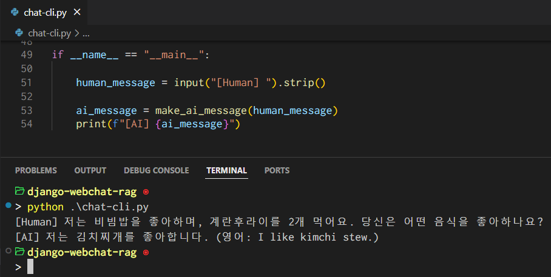
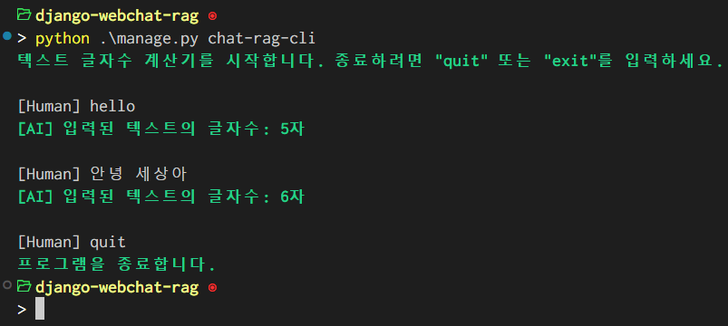
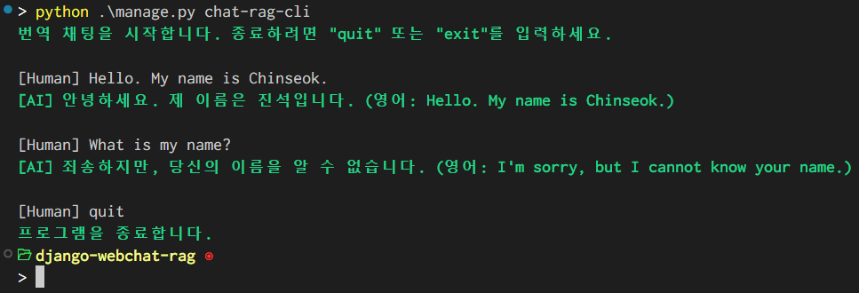
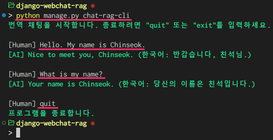
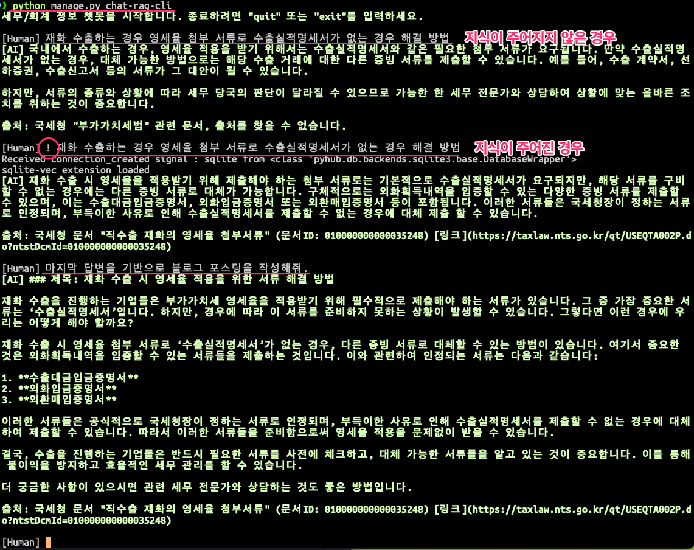

=========================
📚 명령행 RAG 채팅 구현
=========================

.. admonition:: `관련 커밋 <https://github.com/pyhub-kr/django-webchat-rag-langcon2025/commit/06e24f8260ea3d13dea4ed6d5363783bc8846341>`_
   :class: dropdown

   * 변경 파일을 한 번에 덮어쓰기 하실려면, :doc:`/utils/pyhub-git-commit-apply` 설치하신 후에, 프로젝트 루트에서 아래 명령 실행하시면
     지정 커밋의 모든 파일을 다운받아 현재 경로에 덮어쓰기합니다.

   .. code-block:: bash

      python -m pyhub_git_commit_apply https://github.com/pyhub-kr/django-webchat-rag-langcon2025/commit/06e24f8260ea3d13dea4ed6d5363783bc8846341

   ``uv``\를 사용하실 경우 

   .. code-block:: bash

      uv run pyhub-git-commit-apply https://github.com/pyhub-kr/django-webchat-rag-langcon2025/commit/06e24f8260ea3d13dea4ed6d5363783bc8846341

1. 싱글턴 LLM 대화
======================

장고 외적으로 파이썬 코드 만으로 OpenAI API를 활용하여 싱글턴 LLM 대화를 구현합니다.

장고 프로젝트 경로가 아닌 다른 경로에서도 특정 장고 프로젝트 내 자원(모델, 템플릿, 캐시 등)들을 사용할 수 있습니다.
OpenAI API Key 환경변수 값 로딩을 위해 장고 프로젝트를 로딩하여 ``settings.OPENAI_API_KEY`` 값을 참조합니다.

LLM 모델은 ``gpt-4o-mini`` 모델을 사용했으며, `다른 OpenAI API 모델 <https://platform.openai.com/docs/models>`_\을 사용하고 싶으시다면 아래 코드에서 ``model`` 변수 값을 변경하시면 됩니다.

.. admonition:: ``chat-cli.py``
    :class: dropdown

    .. code-block:: python
        :linenos:

        import os
        import django
        from openai import OpenAI

        os.environ.setdefault("DJANGO_SETTINGS_MODULE", "mysite.settings")
        django.setup()

        from django.conf import settings

        client = OpenAI(api_key=settings.OPENAI_API_KEY)

        def make_ai_message(human_message: str) -> str:
            """
            OpenAI의 Chat Completion API를 사용하여 응답을 생성하는 함수
            """

            system_prompt = """
        너는 번역가야.
        한국어로 물어보면 한국어로 대답하며 영어 번역을 함께 제공해주고,
        영어로 물어보면 영어로 대답하여 한글 번역을 함께 제공해줘.

        예시:

        <질문>안녕하세요.</질문>
        <답변>반갑습니다. 저는 Tom 입니다. (영어: Nice to meet you. I am Tom.)</답변>

        <질문>Hello.</질문>
        <답변>Nice to meet you. I am Tom. (한국어: 안녕하세요. 저는 Tom 입니다.)</답변>
            """

            try:
                response = client.chat.completions.create(
                    model="gpt-4o-mini",  # 또는 "gpt-4o" 등 다른 모델 사용 가능
                    messages=[
                        {
                            "role": "system",
                            "content": system_prompt,
                        },
                        {"role": "user", "content": human_message},
                    ],
                    temperature=0.2,
                    max_tokens=1000,
                )
                return response.choices[0].message.content
            except Exception as e:
                return f"API 호출에서 오류가 발생했습니다: {str(e)}"

        def main():
            human_message = input("[Human] ").strip()

            ai_message = make_ai_message(human_message)
            print(f"[AI] {ai_message}")

        if __name__ == "__main__":
            main()

프로젝트 루트 ``chat-cli.py`` 경로에 위 코드를 저장하시고 실행해주세요.
``[Human]`` 프롬프트를 통해 메시지를 입력하시면, OpenAI LLM을 통해 응답이 생성되고 영어/한글로 번역된 메시지도 같이 확인하실 수 있습니다.

2. 장고 명령으로 글자수 응답 채팅 CLI 구현
==========================================

이번에는 장고 명령을 통해 입력된 텍스트의 글자수를 반환하는 채팅 CLI를 구현합니다.
별도 파이썬 파일이 아닌 장고 명령으로 구현하면, 장고 프로젝트 내 다양한 자원들을 별도 설정없이 사용할 수 있고
장고 ``BaseCommand``\를 통해 다양한 명령 옵션을 손쉽게 제공할 수 있습니다.

.. admonition:: ``chat/management/commands/chat-rag-cli.py``
    :class: dropdown

    .. code-block:: python
        :linenos:

        from django.core.management.base import BaseCommand

        class Command(BaseCommand):
            help = "입력된 텍스트의 글자수를 반환하는 CLI 채팅"

            def handle(self, *args, **options):
                self.stdout.write(
                    self.style.SUCCESS(
                        '텍스트 글자수 계산기를 시작합니다. 종료하려면 "quit" 또는 "exit"를 입력하세요.'
                    )
                )

                while True:
                    try:
                        user_input = input("\n[Human] ").strip()
                    except (KeyboardInterrupt, EOFError):
                        self.stdout.write(self.style.SUCCESS("프로그램을 종료합니다."))
                        break

                    if user_input.lower() in ["quit", "exit"]:
                        self.stdout.write(self.style.SUCCESS("프로그램을 종료합니다."))
                        break

                    if user_input:
                        char_count = len(user_input)
                        self.stdout.write(
                            self.style.SUCCESS(f"[AI] 입력된 텍스트의 글자수: {char_count}자")
                        )

장고 명령은 항상 ``앱/managment/commands/`` 경로에 저장해야만 합니다. ``chat-rag-cli.py`` 파일로 저장했기 때문에
``python manage.py chat-rag-cli`` 명령을 통해 실행할 수 있습니다.

3. 번역 채팅 CLI 구현
=========================

LLM 응답을 생성하는 ``make_ai_message`` 함수는 재사용성을 높이기 위해 ``chat/llm.py`` 파일로 분리하고,
``model``, ``temperature``, ``max_tokens`` 등 모델 설정 인자를 추가하여 더 유연하게 사용할 수 있도록 합니다.

.. admonition:: ``chat/llm.py``
    :class: dropdown

    .. code-block:: python
        :linenos:

        from django.conf import settings
        from openai import OpenAI

        client = OpenAI(api_key=settings.OPENAI_API_KEY)

        def make_ai_message(
            system_prompt: str,
            human_message: str,
            model: str = "gpt-4o-mini",
            temperature: float = 0.2,
            max_tokens: int = 1000,
        ):
            """
            OpenAI의 Chat Completion API를 사용하여 응답을 생성하는 함수
            """

            try:
                response = client.chat.completions.create(
                    model=model,
                    messages=[
                        {
                            "role": "system",
                            "content": system_prompt,
                        },
                        {"role": "user", "content": human_message},
                    ],
                    temperature=temperature,
                    max_tokens=max_tokens,
                )
                return response.choices[0].message.content
            except Exception as e:
                return f"API 호출에서 오류가 발생했습니다: {str(e)}"

``chat-rag-cli.py`` 파일에서는 글자수를 계산하는 ``len(user_input)`` 대신 ``ai_message = make_ai_message(system_prompt, user_input)`` 함수를 호출하여 LLM 응답을 생성하겠습니다.

.. admonition:: ``chat/management/commands/chat-rag-cli.py``
    :class: dropdown

    .. code-block:: python
        :linenos:
        :emphasize-lines: 2,40

        from django.core.management.base import BaseCommand
        from chat.llm import make_ai_message

        system_prompt = """
        너는 번역가야.
        한국어로 물어보면 한국어로 대답하며 영어 번역을 함께 제공해주고,
        영어로 물어보면 영어로 대답하여 한글 번역을 함께 제공해줘.

        예시:

        <질문>안녕하세요.</질문>
        <답변>반갑습니다. 저는 Tom 입니다. (영어: Nice to meet you. I am Tom.)</답변>

        <질문>Hello.</질문>
        <답변>Nice to meet you. I am Tom. (한국어: 안녕하세요. 저는 Tom 입니다.)</답변>
        """

        class Command(BaseCommand):
            help = "OpenAI를 이용한 번역 채팅"

            def handle(self, *args, **options):
                self.stdout.write(
                    self.style.SUCCESS(
                        '번역 채팅을 시작합니다. 종료하려면 "quit" 또는 "exit"를 입력하세요.'
                    )
                )

                while True:
                    try:
                        user_input = input("\n[Human] ").strip()
                    except (KeyboardInterrupt, EOFError):
                        self.stdout.write(self.style.SUCCESS("프로그램을 종료합니다."))
                        break

                    if user_input.lower() in ["quit", "exit"]:
                        self.stdout.write(self.style.SUCCESS("프로그램을 종료합니다."))
                        break

                    if user_input:
                        ai_message = make_ai_message(system_prompt, user_input)
                        self.stdout.write(self.style.SUCCESS(f"[AI] {ai_message}"))

``python manage.py chat-rag-cli`` 명령을 실행하면, 채팅이 진행되며 번역된 메시지를 확인하실 수 있습니다.

그런데, 대화 기록을 저장하지 않아 대화가 연결되지 않습니다.
분명 제가 이름을 이야기하고 이름을 물어보는 데 이름을 모른다고 하네요. 😭

4. 멀티턴 LLM 대화
=====================

OpenAI LLM을 비롯한 모든 LLM은 대화 기록을 저장하는 기능이 없습니다.
따라서 애플리케이션에서 대화 기록을 저장하고, 매 대화마다 대화 기록을 전달하여 LLM 응답을 생성해야 합니다.

``make_ai_message`` 함수를 확장하여 ``LLM`` 클래스를 정의하고, 대화 기록을 저장하는 기능을 추가합니다.
``make_ai_message`` 함수 이름은 보다 명확하게 ``make_reply``\로 변경했습니다.

.. admonition:: ``chat/llm.py``
    :class: dropdown

    .. code-block:: python
        :linenos:
        :emphasize-lines: 8,23

        from typing import Optional, List, Dict
        from django.conf import settings
        from openai import OpenAI

        client = OpenAI(api_key=settings.OPENAI_API_KEY)

        class LLM:
            def __init__(
                self,
                model: str = "gpt-4o-mini",
                temperature: float = 0.2,
                max_tokens: int = 1000,
                system_prompt: str = "",
                initial_messages: Optional[List[Dict]] = None,
            ):
                self.model = model
                self.temperature = temperature
                self.max_tokens = max_tokens
                self.system_prompt = system_prompt
                self.history = initial_messages or []

            def make_reply(self, human_message: Optional[str] = None):
                current_messages = [
                    *self.history,
                ]

                if human_message is not None:
                    current_messages.append({"role": "user", "content": human_message})

                try:
                    response = client.chat.completions.create(
                        model=self.model,
                        messages=[
                            {
                                "role": "system",
                                "content": self.system_prompt,
                            },
                        ]
                        + current_messages,
                        temperature=self.temperature,
                        max_tokens=self.max_tokens,
                    )
                    ai_message = response.choices[0].message.content
                except Exception as e:
                    return f"API 호출에서 오류가 발생했습니다: {str(e)}"
                else:
                    self.history.extend(
                        [
                            {"role": "user", "content": human_message},
                            {"role": "assistant", "content": ai_message},
                        ]
                    )
                    return ai_message

``chat-rag-cli`` 명령에서는 ``LLM`` 클래스를 통해 대화 기록을 관리하고, ``make_reply`` 함수를 호출하여 LLM 응답을 생성합니다.

.. admonition:: ``chat/management/commands/chat-rag-cli.py``
    :class: dropdown

    .. code-block:: python
        :linenos:
        :emphasize-lines: 2,29,43

        from django.core.management.base import BaseCommand
        from chat.llm import LLM

        system_prompt = """
        너는 번역가야.
        한국어로 물어보면 한국어로 대답하며 영어 번역을 함께 제공해주고,
        영어로 물어보면 영어로 대답하여 한글 번역을 함께 제공해줘.

        예시:

        <질문>안녕하세요.</질문>
        <답변>반갑습니다. 저는 Tom 입니다. (영어: Nice to meet you. I am Tom.)</답변>

        <질문>Hello.</질문>
        <답변>Nice to meet you. I am Tom. (한국어: 안녕하세요. 저는 Tom 입니다.)</답변>
        """

        class Command(BaseCommand):
            help = "OpenAI를 이용한 번역 채팅"

            def handle(self, *args, **options):
                self.stdout.write(
                    self.style.SUCCESS(
                        '번역 채팅을 시작합니다. 종료하려면 "quit" 또는 "exit"를 입력하세요.'
                    )
                )

                llm = LLM(model="gpt-4o-mini", temperature=1, system_prompt=system_prompt)

                while True:
                    try:
                        user_input = input("\n[Human] ").strip()
                    except (KeyboardInterrupt, EOFError):
                        self.stdout.write(self.style.SUCCESS("프로그램을 종료합니다."))
                        break

                    if user_input.lower() in ["quit", "exit"]:
                        self.stdout.write(self.style.SUCCESS("프로그램을 종료합니다."))
                        break

                    if user_input:
                        ai_message = llm.make_reply(user_input)
                        self.stdout.write(self.style.SUCCESS(f"[AI] {ai_message}"))

실행해보시면, 대화 기록을 LLM이 알고 있기에 이름을 물어보는 대화가 이어짐을 확인하실 수 있습니다.

파이썬 리스트가 아닌 장고 모델을 통해서 대화 기록을 저장/관리하실 수도 있습니다.
이에 대해서는 다음 :doc:`./chat-room` 문서에서 이어 다루겠습니다.

5. RAG 대화
=====================

LLM은 검색엔진이 아닙니다. 단지 알고 있는 지식에 기반해서 답변을 생성할 뿐입니다.
따라서 LLM이 모르는 지식에 대해서는 환각 (Hallucination)이 발생할 수 밖에 없습니다.
충분한 지식이 있는 상황에서는 환각이 발생할 확률이 낮아집니다.

.. tip::

    RAG 개념에 대해서는 :doc:`/rag-01/index` 튜토리얼과 :doc:`/rag-02/index` 튜토리얼을 참고하세요.

.. figure:: /rag-01/assets/llm-rag.png
   :name: llm-rag

   관련 지식과 함께 질문하면, LLM이 모르는 지식(법령, 회사 정보 등)을 보충해서 정확한 답변을 할 수 있습니다.

RAG는 LLM에게 답변을 요청하기 전에, 미리 **질문과 비슷한 내용의  지식**\을 검색하여 찾은 지식과 질문을 LLM에게 함께 제공하여,
정확한 지식에 기반하여 LLM이 내용을 정리해주는 방식입니다.
이러한 지식 데이터베이스를 Vector Store라고 부릅니다. 다양한 Vector Store 솔루션이 있지만,
우리는 장고 모델을 통해 Vector Store를 구현했습니다.

sqlite-vec/pgvector 기반으로 장고 모델을 통해 벡터 스토어를 구현하면, 다음과 같은 장점이 있습니다:

1. 애플리케이션 통합성 - 별도 인프라 추가없이 빠르게 벡터 스토어를 구현할 수 있습니다. 물론 **문서만 별도 데이터베이스를 통해 관리할 수도** 있습니다.
2. 확장성 - 상황에 따라 (로컬환경, 소규모, 대규모 운영환경) SQLite, PostgreSQL 등 데이터베이스 백엔드를 변경할 수 있습니다.
3. 관리 용이성 - 장고 어드민을 통해 벡터 데이터를 쉽게 관리하고 모니터링할 수 있습니다.
4. 일관된 데이터 접근 - 다른 모델과 동일한 방식으로 벡터 데이터에 접근할 수 있어 개발 일관성이 유지됩니다.
5. 마이그레이션 지원 - 장고의 마이그레이션 시스템을 통해 벡터 스토어 스키마 변경을 관리할 수 있습니다.

다음과 같이 간결하게 지식을 찾고 프롬프트에 적용하여 RAG 답변을 생성할 수 있습니다.

.. code-block:: python

    user_input = "재화 수출하는 경우 영세율 첨부 서류로 수출실적명세서가 없는 경우 해결 방법"

    doc_list = TaxLawDocument.objects.similarity_search(user_input)
    지식 = str(doc_list)
    user_input = f"""<context>{지식}</context>\n\n질문 : {user_input}"""

.. admonition:: ``chat/management/commands/chat-rag-cli.py``
    :class: dropdown

    .. code-block:: python
        :linenos:
        :emphasize-lines: 3,6-30,38,54-60

        from django.core.management.base import BaseCommand
        from chat.llm import LLM
        from chat.models import TaxLawDocument

        system_prompt = """
        대한민국 세무/회계 정보 챗봇으로서, 주어진 질답 지식에서 사실과 의견을 구별하여 사실 정보만을 정리하고,
        각 답변에 해당 정보의 출처까지 함께 기입하여 답변하세요.

        # Steps

        1. 이해하기: 질문과 제공된 지식을 주의 깊게 읽고 정확히 이해합니다.
        2. 정보 구분하기: 질답 지식에서 사실과 의견을 식별합니다.
        - 사실: 검증 가능한 데이터, 법률, 규정 및 수치 등
        - 의견: 개인의 견해, 해석, 추천 등
        3. 사실 정리하기: 식별된 사실 정보를 논리적이고 명확하게 정리하며, 불필요한 부분은 제거합니다.
        4. 답변 작성하기: 정리된 사실 정보를 바탕으로 명료하고 간결한 문장으로 구성된 단락 형태의 답변을 작성합니다. 반드시 해당 사실 정보의 출처를 함께 명시합니다.
        - 가능한 경우 신뢰할 수 있는 출처(예: 정부 기관, 공식 문서, 학술자료 등)를 포함합니다.
        - 출처가 확인되지 않거나 없는 경우, “출처를 찾을 수 없습니다”라고 명시합니다.
        - 출처에 문서ID가 포함된 경우, 반드시 문서ID를 기입하고 아래 URL 형식을 참고하여 해당 URL도 함께 포함합니다.

        # Output Format

        - 명료하고 간결한 문장으로 구성된 단락 형태의 답변
        - 답변 내에 사용한 정보의 출처를 반드시 포함하여 작성

        # Notes

        - 각 세무/회계 정보를 객관적으로 평가하여 답변을 작성합니다.
        - 모호하거나 불확실한 정보는 제외합니다.
        - 답변에 반드시 관련 사실 정보의 출처를 함께 기입하여 객관성과 신뢰성을 높입니다.
        """

        class Command(BaseCommand):
            help = "OpenAI를 이용한 번역 채팅"

            def handle(self, *args, **options):
                self.stdout.write(self.style.SUCCESS('세무/회계 정보 챗봇을 시작합니다. 종료하려면 "quit" 또는 "exit"를 입력하세요.'))

                llm = LLM(model="gpt-4o-mini", temperature=1, system_prompt=system_prompt)

                while True:
                    try:
                        user_input = input("\n[Human] ").strip()
                    except (KeyboardInterrupt, EOFError):
                        self.stdout.write(self.style.SUCCESS("프로그램을 종료합니다."))
                        break

                    if user_input.lower() in ["quit", "exit"]:
                        self.stdout.write(self.style.SUCCESS("프로그램을 종료합니다."))
                        break

                    if user_input:
                        # 세법 해석례 문서 검색이 필요할 때
                        if user_input.startswith("!"):
                            user_input = user_input[1:].strip()
                            # RAG를 원하는 모델을 사용하여 유사 문서 검색
                            doc_list = TaxLawDocument.objects.similarity_search(user_input)
                            지식 = str(doc_list)
                            user_input = f"""<context>{지식}</context>\n\n질문 : {user_input}"""

                        ai_message = llm.make_reply(user_input)
                        self.stdout.write(self.style.SUCCESS(f"[AI] {ai_message}"))

