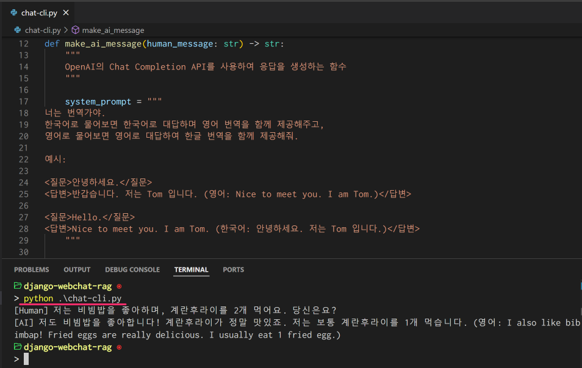
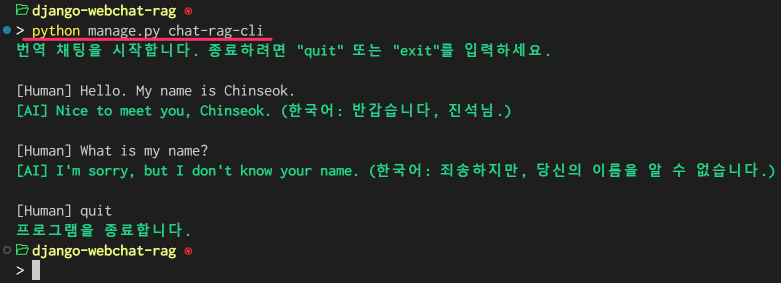

=========================
📚 명령행 RAG 채팅 구현
=========================

1. 싱글턴 LLM 대화
======================

장고 외적으로 파이썬 코드 만으로 OpenAI API를 활용하여 싱글턴 LLM 대화를 구현합니다.

장고 프로젝트 경로가 아닌 다른 경로에서도 특정 장고 프로젝트 내 자원(모델, 템플릿, 캐시 등)들을 사용할 수 있습니다.
OpenAI API Key 환경변수 값 로딩을 위해 장고 프로젝트를 로딩하여 ``settings.OPENAI_API_KEY`` 값을 참조합니다.

LLM 모델은 ``gpt-4o-mini`` 모델을 사용했으며, `다른 OpenAI API 모델 <https://platform.openai.com/docs/models>`_\을 사용하고 싶으시다면 아래 코드에서 ``model`` 변수 값을 변경하시면 됩니다.

.. admonition:: ``chat-cli.py``
    :class: dropdown

    .. code-block:: python
        :linenos:

        import os
        import django
        from openai import OpenAI

        os.environ.setdefault("DJANGO_SETTINGS_MODULE", "mysite.settings")
        django.setup()

        from django.conf import settings

        client = OpenAI(api_key=settings.OPENAI_API_KEY)

        def make_ai_message(human_message: str) -> str:
            """
            OpenAI의 Chat Completion API를 사용하여 응답을 생성하는 함수
            """

            system_prompt = """
        너는 번역가야.
        한국어로 물어보면 한국어로 대답하며 영어 번역을 함께 제공해주고,
        영어로 물어보면 영어로 대답하여 한글 번역을 함께 제공해줘.

        예시:

        <질문>안녕하세요.</질문>
        <답변>반갑습니다. 저는 Tom 입니다. (영어: Nice to meet you. I am Tom.)</답변>

        <질문>Hello.</질문>
        <답변>Nice to meet you. I am Tom. (한국어: 안녕하세요. 저는 Tom 입니다.)</답변>
            """

            try:
                response = client.chat.completions.create(
                    model="gpt-4o-mini",  # 또는 "gpt-4o" 등 다른 모델 사용 가능
                    messages=[
                        {
                            "role": "system",
                            "content": system_prompt,
                        },
                        {"role": "user", "content": human_message},
                    ],
                    temperature=0.2,
                    max_tokens=1000,
                )
                return response.choices[0].message.content
            except Exception as e:
                return f"API 호출에서 오류가 발생했습니다: {str(e)}"

        if __name__ == "__main__":

            human_message = input("[Human] ").strip()

            ai_message = make_ai_message(human_message)
            print(f"[AI] {ai_message}")

프로젝트 루트 ``chat-cli.py`` 경로에 위 코드를 저장하시고 실행해주세요.
``[Human]`` 프롬프트를 통해 메시지를 입력하시면, OpenAI LLM을 통해 응답이 생성되고 영어/한글로 번역된 메시지도 같이 확인하실 수 있습니다.

2. 장고 명령으로 글자수 응답 채팅 CLI 구현
==========================================

이번에는 장고 명령을 통해 입력된 텍스트의 글자수를 반환하는 채팅 CLI를 구현합니다.
별도 파이썬 파일이 아닌 장고 명령으로 구현하면, 장고 프로젝트 내 다양한 자원들을 별도 설정없이 사용할 수 있고
장고 ``BaseCommand``\를 통해 다양한 명령 옵션을 손쉽게 제공할 수 있습니다.

.. admonition:: ``chat/management/commands/chat-rag-cli.py``
    :class: dropdown

    .. code-block:: python
        :linenos:

        from django.core.management.base import BaseCommand

        class Command(BaseCommand):
            help = "입력된 텍스트의 글자수를 반환하는 CLI 채팅"

            def handle(self, *args, **options):
                self.stdout.write(
                    self.style.SUCCESS(
                        '텍스트 글자수 계산기를 시작합니다. 종료하려면 "quit" 또는 "exit"를 입력하세요.'
                    )
                )

                while True:
                    try:
                        user_input = input("\n[Human] ").strip()
                    except (KeyboardInterrupt, EOFError):
                        self.stdout.write(self.style.SUCCESS("프로그램을 종료합니다."))
                        break

                    if user_input.lower() in ["quit", "exit"]:
                        self.stdout.write(self.style.SUCCESS("프로그램을 종료합니다."))
                        break

                    if user_input:
                        char_count = len(user_input)
                        self.stdout.write(
                            self.style.SUCCESS(f"[AI] 입력된 텍스트의 글자수: {char_count}자")
                        )

장고 명령은 항상 ``앱/managment/commands/`` 경로에 저장해야만 합니다. ``chat-rag-cli.py`` 파일로 저장했기 때문에
``python manage.py chat-rag-cli`` 명령을 통해 실행할 수 있습니다.

.. figure:: ./assets/rag-cli/count-ch.png

3. 번역 채팅 CLI 구현
=========================

LLM 응답을 생성하는 ``make_ai_message`` 함수는 재사용성을 높이기 위해 ``chat/llm.py`` 파일로 분리하고,
``model``, ``temperature``, ``max_tokens`` 등 모델 설정 인자를 추가하여 더 유연하게 사용할 수 있도록 합니다.

.. admonition:: ``chat/llm.py``
    :class: dropdown

    .. code-block:: python
        :linenos:

        from django.conf import settings
        from openai import OpenAI

        client = OpenAI(api_key=settings.OPENAI_API_KEY)

        def make_ai_message(
            system_prompt: str,
            human_message: str,
            model: str = "gpt-4o-mini",
            temperature: float = 0.2,
            max_tokens: int = 1000,
        ):
            """
            OpenAI의 Chat Completion API를 사용하여 응답을 생성하는 함수
            """

            try:
                response = client.chat.completions.create(
                    model=model,
                    messages=[
                        {
                            "role": "system",
                            "content": system_prompt,
                        },
                        {"role": "user", "content": human_message},
                    ],
                    temperature=temperature,
                    max_tokens=max_tokens,
                )
                return response.choices[0].message.content
            except Exception as e:
                return f"API 호출에서 오류가 발생했습니다: {str(e)}"

``chat-rag-cli.py`` 파일에서는 글자수를 계산하는 ``len(user_input)`` 대신 ``ai_message = make_ai_message(system_prompt, user_input)`` 함수를 호출하여 LLM 응답을 생성하겠습니다.

.. admonition:: ``chat/management/commands/chat-rag-cli.py``
    :class: dropdown

    .. code-block:: python
        :linenos:
        :emphasize-lines: 2,40

        from django.core.management.base import BaseCommand
        from chat.llm import make_ai_message

        system_prompt = """
        너는 번역가야.
        한국어로 물어보면 한국어로 대답하며 영어 번역을 함께 제공해주고,
        영어로 물어보면 영어로 대답하여 한글 번역을 함께 제공해줘.

        예시:

        <질문>안녕하세요.</질문>
        <답변>반갑습니다. 저는 Tom 입니다. (영어: Nice to meet you. I am Tom.)</답변>

        <질문>Hello.</질문>
        <답변>Nice to meet you. I am Tom. (한국어: 안녕하세요. 저는 Tom 입니다.)</답변>
        """

        class Command(BaseCommand):
            help = "OpenAI를 이용한 번역 채팅"

            def handle(self, *args, **options):
                self.stdout.write(
                    self.style.SUCCESS(
                        '번역 채팅을 시작합니다. 종료하려면 "quit" 또는 "exit"를 입력하세요.'
                    )
                )

                while True:
                    try:
                        user_input = input("\n[Human] ").strip()
                    except (KeyboardInterrupt, EOFError):
                        self.stdout.write(self.style.SUCCESS("프로그램을 종료합니다."))
                        break

                    if user_input.lower() in ["quit", "exit"]:
                        self.stdout.write(self.style.SUCCESS("프로그램을 종료합니다."))
                        break

                    if user_input:
                        ai_message = make_ai_message(system_prompt, user_input)
                        self.stdout.write(self.style.SUCCESS(f"[AI] {ai_message}"))

``python manage.py chat-rag-cli`` 명령을 실행하면, 채팅이 진행되며 번역된 메시지를 확인하실 수 있습니다.

그런데, 대화 기록을 저장하지 않아 대화가 연결되지 않습니다.
분명 제가 이름을 이야기하고 이름을 물어보는 데 이름을 모른다고 하네요. 😭

4. 멀티턴 LLM 대화
=====================

OpenAI LLM을 비롯한 모든 LLM은 대화 기록을 저장하는 기능이 없습니다.
따라서 애플리케이션에서 대화 기록을 저장하고, 매 대화마다 대화 기록을 전달하여 LLM 응답을 생성해야 합니다.

``make_ai_message`` 함수를 확장하여 ``LLM`` 클래스를 정의하고, 대화 기록을 저장하는 기능을 추가합니다.
``make_ai_message`` 함수 이름은 보다 명확하게 ``make_reply``\로 변경했습니다.

.. admonition:: ``chat/llm.py``
    :class: dropdown

    .. code-block:: python
        :linenos:
        :emphasize-lines: 8,23

        from typing import Optional, List, Dict
        from django.conf import settings
        from openai import OpenAI

        client = OpenAI(api_key=settings.OPENAI_API_KEY)

        class LLM:
            def __init__(
                self,
                model: str = "gpt-4o-mini",
                temperature: float = 0.2,
                max_tokens: int = 1000,
                system_prompt: str = "",
                initial_messages: Optional[List[Dict]] = None,
            ):
                self.model = model
                self.temperature = temperature
                self.max_tokens = max_tokens
                self.system_prompt = system_prompt
                self.history = initial_messages or []

            def make_reply(self, human_message: Optional[str] = None):
                current_messages = [
                    *self.history,
                ]

                if human_message is not None:
                    current_messages.append({"role": "user", "content": human_message})

                try:
                    response = client.chat.completions.create(
                        model=self.model,
                        messages=[
                            {
                                "role": "system",
                                "content": self.system_prompt,
                            },
                        ]
                        + current_messages,
                        temperature=self.temperature,
                        max_tokens=self.max_tokens,
                    )
                    ai_message = response.choices[0].message.content
                except Exception as e:
                    return f"API 호출에서 오류가 발생했습니다: {str(e)}"
                else:
                    self.history.extend(
                        [
                            {"role": "user", "content": human_message},
                            {"role": "assistant", "content": ai_message},
                        ]
                    )
                    return ai_message

``chat-rag-cli`` 명령에서는 ``LLM`` 클래스를 통해 대화 기록을 관리하고, ``make_reply`` 함수를 호출하여 LLM 응답을 생성합니다.

.. admonition:: ``chat/management/commands/chat-rag-cli.py``
    :class: dropdown

    .. code-block:: python
        :linenos:
        :emphasize-lines: 2,29,43

        from django.core.management.base import BaseCommand
        from chat.llm import LLM

        system_prompt = """
        너는 번역가야.
        한국어로 물어보면 한국어로 대답하며 영어 번역을 함께 제공해주고,
        영어로 물어보면 영어로 대답하여 한글 번역을 함께 제공해줘.

        예시:

        <질문>안녕하세요.</질문>
        <답변>반갑습니다. 저는 Tom 입니다. (영어: Nice to meet you. I am Tom.)</답변>

        <질문>Hello.</질문>
        <답변>Nice to meet you. I am Tom. (한국어: 안녕하세요. 저는 Tom 입니다.)</답변>
        """

        class Command(BaseCommand):
            help = "OpenAI를 이용한 번역 채팅"

            def handle(self, *args, **options):
                self.stdout.write(
                    self.style.SUCCESS(
                        '번역 채팅을 시작합니다. 종료하려면 "quit" 또는 "exit"를 입력하세요.'
                    )
                )

                llm = LLM(model="gpt-4o-mini", temperature=1, system_prompt=system_prompt)

                while True:
                    try:
                        user_input = input("\n[Human] ").strip()
                    except (KeyboardInterrupt, EOFError):
                        self.stdout.write(self.style.SUCCESS("프로그램을 종료합니다."))
                        break

                    if user_input.lower() in ["quit", "exit"]:
                        self.stdout.write(self.style.SUCCESS("프로그램을 종료합니다."))
                        break

                    if user_input:
                        ai_message = llm.make_reply(user_input)
                        self.stdout.write(self.style.SUCCESS(f"[AI] {ai_message}"))

실행해보시면, 대화 기록을 LLM이 알고 있기에 이름을 물어보는 대화가 이어짐을 확인하실 수 있습니다.

파이썬 리스트가 아닌 장고 모델을 통해서 대화 기록을 저장/관리하실 수도 있습니다.
이에 대해서는 다음 :doc:`./chat-room` 문서에서 이어 다루겠습니다.
