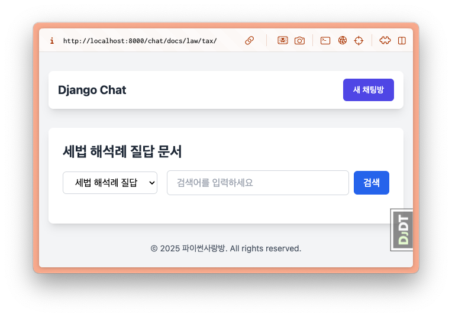
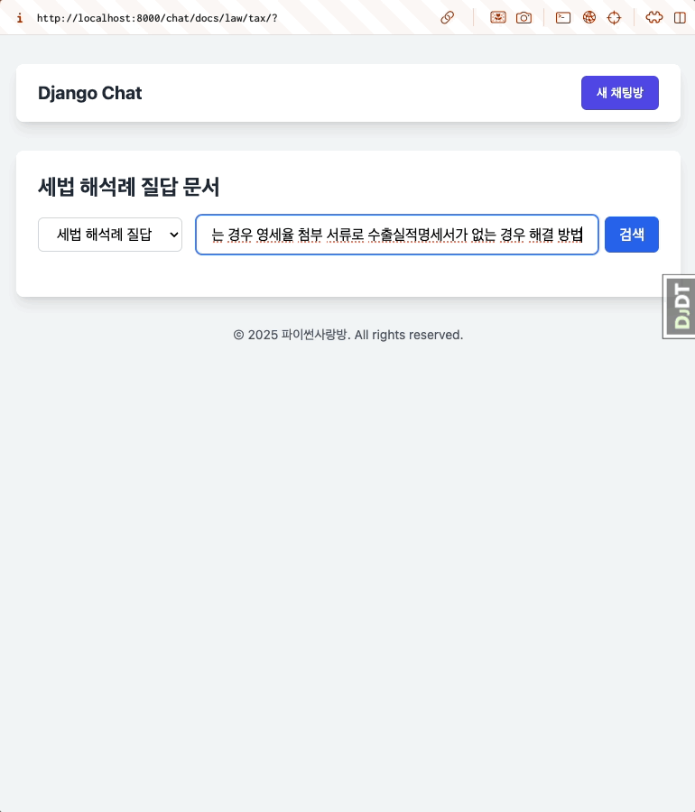

=========================
🔍 문서 검색 페이지
=========================

.. admonition:: `관련 커밋 <https://github.com/pyhub-kr/django-webchat-rag-langcon2025/commit/86a3570e017d916b894d8d0fd1c4cbfaa1492e37>`_
   :class: dropdown

   * 변경 파일을 한 번에 덮어쓰기 하실려면, :doc:`/utils/pyhub-git-commit-apply` 설치하신 후에, 프로젝트 루트에서 아래 명령 실행하시면
     지정 커밋의 모든 파일을 다운받아 현재 경로에 덮어쓰기합니다.

   .. code-block:: bash

      python -m pyhub_git_commit_apply https://github.com/pyhub-kr/django-webchat-rag-langcon2025/commit/86a3570e017d916b894d8d0fd1c4cbfaa1492e37

   ``uv``\를 사용하실 경우 

   .. code-block:: bash

      uv run pyhub-git-commit-apply https://github.com/pyhub-kr/django-webchat-rag-langcon2025/commit/86a3570e017d916b894d8d0fd1c4cbfaa1492e37

세법 해석례 질답 내용을 데이터베이스에 저장했으니 유사 문서 검색을 지원하는 페이지를 구현해봅시다.
장고 모델 기반으로 문서가 저장되어있어 손쉽게 유사 문서 검색을 지원할 수 있습니다.

모델에 ``page_content_obj`` 캐시 속성 추가
==============================================

문서 모델의 ``.page_content`` 속성은 문자열 타입인데,
"문서번호", "제목", "문서ID", "법령분류", "요지", "회신", "파일내용", "공개여부", "문서분류" 등의 정보가 JSON 포맷으로 저장되어있습니다.

각 Key 정보에 접근하기 위해서는 JSON 역직렬화가 필요하구요. 매 Key에 접근할 때마다 역직렬화를 하면 성능이 떨어지므로,
``page_content_obj`` 캐시 속성을 추가하여 각 인스턴스마다 1회만 역직렬화를 수행하고, 캐싱된 객체를 활용토록 합니다.

.. tab-set::

    .. tab-item:: sqlite

        .. code-block:: python
            :caption: ``chat/models.py`` 파일에 덮어쓰기
            :emphasize-lines: 1,3,14-16
            :linenos:

            import json

            from django.utils.functional import cached_property
            from pyhub.rag.fields.sqlite import SQLiteVectorField
            from pyhub.rag.models.sqlite import SQLiteVectorDocument

            class TaxLawDocument(SQLiteVectorDocument):
                embedding = SQLiteVectorField(
                    dimensions=3072,
                    editable=False,
                    embedding_model="text-embedding-3-large",
                )

                @cached_property
                def page_content_obj(self):
                    return json.loads(self.page_content)

    .. tab-item:: postgres

        .. code-block:: python
            :caption: ``chat/models.py`` 파일에 덮어쓰기
            :emphasize-lines: 1,3,14-16
            :linenos:

            import json

            from django.utils.functional import cached_property
            from pyhub.rag.fields.postgres import PGVectorField
            from pyhub.rag.models.postgres import PGVectorDocument

            class TaxLawDocument(PGVectorDocument):
                embedding = PGVectorField(
                    dimensions=3072,
                    editable=False,
                    embedding_model="text-embedding-3-large",
                )

                @cached_property
                def page_content_obj(self):
                    return json.loads(self.page_content)

이제 파이썬 코드 단에서는 ``doc.page_content_obj["제목"]`` 처럼 접근할 수 있으며,
템플릿 단에서는 ``{{ doc.page_content_obj.제목 }}`` 처럼 접근할 수 있습니다.

뷰 구현
==============

리스트 구현을 위해 ``ListView`` 클래스를 상속받은 ``TaxLawDocumentListView`` 클래스를 구현합니다.
``model`` 속성만 ``TaxLawDocument`` 모델로 지정하면 한 번에 전체 문서가 조회되니 조회 성능이 떨어집니다.
``paginate_by`` 속성을 지정하면 ``ListView``\를 통해 쿼리셋 기반에서 페이지네이션을 지원하지만,
유사 문서 검색 결과는 페이지네이션을 지원하지 않기에 ``paginate_by`` 속성은 지정하지 않겠습니다.

검색어 ``query`` 인자가 있을 경우, 모델 매니저의 ``similarity_search`` 메서드를 통해 유사 문서 검색을 수행합니다.

``ListView``\에서는 쿼리셋을 통해 디폴트 템플릿 이름을 찾는데요.

``django-pyhub-rag`` 라이브러리의 ``sqlite-vec`` 백엔드의 ``similarity_search`` 메서드는 쿼리셋이 아닌 리스트를 반환하고,
``get_queryset`` 메서드에서도 리스트를 반환하게 됩니다. 그럼 ``ListView`` 클래스에서 디폴트 템플릿 이름을 결정할 수 없기에,
``template_name`` 속성을 직접 지정해줍니다.

.. code-block:: python
    :caption: ``chat/views.py`` 파일에 덮어쓰기
    :linenos:
    :emphasize-lines: 1-2,9-26

    from django.views.generic import ListView
    from .models import TaxLawDocument

    # 템플릿에서의 URL Reverse 참조를 위해 빈 View 함수 정의
    def room_list(request): pass
    def room_new(request): pass
    def room_detail(request, pk): pass

    # 문서 검색 페이지
    class TaxLawDocumentListView(ListView):
        model = TaxLawDocument
        # sqlite의 similarity_search 메서드가 쿼리셋이 아닌 리스트를 반환하기 때문에
        # ListView에서 템플릿 이름을 찾지 못하기에 직접 지정해줍니다.
        template_name = "chat/taxlawdocument_list.html"

        def get_queryset(self):
            qs = super().get_queryset()

            query = self.request.GET.get("query", "").strip()
            if query:
                qs = qs.similarity_search(query)  # noqa: list 타입
            else:
                # 검색어가 없다면 빈 쿼리셋을 반환합니다.
                qs = qs.none()

            return qs

URL 매핑도 추가해주시구요.

.. code-block:: python
    :caption: ``chat/urls.py`` 파일에 덮어쓰기
    :emphasize-lines: 10

    from django.urls import path
    from . import views

    app_name = "chat"

    urlpatterns = [
        path("", views.room_list, name="room_list"),
        path("new/", views.room_new, name="room_new"),
        path("<int:pk>/", views.room_detail, name="room_detail"),
        path("docs/law/tax/", views.TaxLawDocumentListView.as_view()),
    ]

템플릿 구현
=======================

아래 내용으로 ``chat/templates/chat/base.html`` 경로에 부모 템플릿을 생성합니다.
현재 문서 목록 페이지 뿐만 아니라, 이후 채팅 페이지에서도 사용할 것입니다.

* ``tailwind css`` : 유틸리티 기반 CSS 프레임워크로 빠른 UI 구성을 위해 사용
* ``htmx`` : 서버와의 비동기 통신을 **자바스크립트없이** HTML 속성으로 간편하게 구현하기 위해 사용
* ``alpine.js`` : 상탯값에 따른 UI 동작을 **자바스크립트 없이** 간편하게 구현하기 위해 사용

.. admonition:: ``chat/templates/chat/base.html`` 파일 생성
    :class: dropdown

    .. code-block:: html+django
        :linenos:

        <!doctype html>
        <html>
        <head>
            <meta charset="UTF-8">
            <meta name="viewport" content="width=device-width, initial-scale=1.0">
            <title>Django Chat</title>
            
            
            
        </head>
        <body class="bg-gray-100">
            

                <header class="mb-8">
                    <nav class="bg-white shadow-lg rounded-lg">
                        

                            

                                

                                    

                                        <a href="" class="text-xl font-bold text-gray-800">
                                            Django Chat
                                        </a>
                                    

                                

                                

                                    <a href="" 
                                    class="inline-flex items-center px-4 py-2 border border-transparent text-sm font-medium rounded-md text-white bg-indigo-600 hover:bg-indigo-700">
                                        새 채팅방
                                    </a>
                                

                            

                        

                    </nav>
                </header>

                <main class="bg-white shadow-lg rounded-lg p-6">
                    
                    
                </main>

                <footer class="mt-8 text-center text-gray-600 text-sm">
                    
&copy; 2025 파이썬사랑방. All rights reserved.

                </footer>
            

        </body>
        </html>

``chat/templates/chat/taxlawdocument_list.html`` 경로에 위 부모 템플릿을 상속받은 템플릿을 아래와 같이 정의합니다.

* ``<form>`` 태그를 통해 검색폼을 구현했습니다.

  - ``<select>`` 태그를 통해 검색 대상을 선택할 수 있도록 했습니다.
  - ``<input>`` 태그를 통해 검색어를 입력할 수 있도록 했습니다.
  - ``<button>`` 태그를 통해 검색 버튼을 구현했습니다.

* ```` 템플릿 태그를 통해 검색결과가 없을 경우 검색결과가 없음을 알리는 메시지를 출력합니다.

* ```` 템플릿 태그를 통해 검색결과를 반복하여 출력합니다.

.. admonition:: ``chat/templates/chat/taxlawdocument_list.html`` 파일 생성
    :class: dropdown

    .. code-block:: html+django
        :caption: ``chat/templates/chat/taxlawdocument_list.html`` 파일 생성
        :linenos:

        

        

            <h2 class="text-2xl font-bold text-gray-800 mb-4">세법 해석례 질답 문서</h2>

            

                <form method="get" action="" class="flex items-center gap-2">
                    

                        <select name="document_type"
                                class="px-4 py-2 border border-gray-300 rounded-md focus:outline-none focus:ring-2 focus:ring-blue-500 focus:border-transparent">
                            <option value="tax_qa">세법 해석례 질답</option>
                        </select>
                    

                    

                        <input type="text" name="query" placeholder="검색어를 입력하세요" value="{{ request.GET.query|default:'' }}"
                            class="w-full px-4 py-2 border border-gray-300 rounded-md focus:outline-none focus:ring-2 focus:ring-blue-500 focus:border-transparent">
                    

                    <button type="submit"
                            class="px-4 py-2 bg-blue-600 text-white font-medium rounded-md hover:bg-blue-700 focus:outline-none focus:ring-2 focus:ring-blue-500 focus:ring-offset-2 transition-colors">
                        검색
                    </button>
                </form>
            

            
                

                    검색결과가 없습니다.
                

            

            
                

                    총
                    {{ object_list|length }}개의 문서가 검색되었습니다.
                

            

            
                

                    

                        <h3 class="text-lg font-semibold">
                            [{{ doc.page_content_obj.문서번호|default:"문서번호 없음" }}]

                            {{ doc.page_content_obj.제목|default:"제목 없음" }}

                            <small>
                                <a href="{{ doc.metadata.url }}" class="text-blue-600 hover:underline" target="_blank">
                                    출처
                                </a>
                            </small>
                        </h3>
                    

                    

                        <table class="min-w-full divide-y divide-gray-200 mt-4">
                            <tbody class="bg-white divide-y divide-gray-200">
                            
                                
                                    <tr class="">
                                        <th class="px-6 py-3 text-left text-xs font-medium text-gray-500 uppercase tracking-wider w-1/4">
                                            {{ key }}
                                        </th>
                                        <td class="px-6 py-4 text-sm text-gray-900">{{ value }}</td>
                                    </tr>
                                
                            
                            </tbody>
                        </table>
                    

                

            

        

웹브라우저를 열고 http://localhost:8000/chat/docs/law/tax/ 페이지에 접속해주세요.
아래와 같이 유사 문서 검색 페이지를 확인하실 수 있습니다.. 아래는 "재화 수출하는 경우 영세율 첨부 서류로 수출실적명세서가 없는 경우 해결 방법" 검색 결과입니다.

.. figure:: ./assets/search/page2.png

문서 제목 클릭하여, 내용 접고 펴기
========================================

``.similarity_search`` 메서드는 디폴트로 최대 4개의 문서를 반환합니다. 그런데, 각 문서의 내용이 너무 길어서 모바일 환경에서는 보기 어려운데요.
문서 제목을 클릭하면 내용을 접고 펴기 할 수 있도록 개선해보겠습니다.
경량 상태관리 라이브러리인 ``alpine.js`` :sup:`약 45KB 용량` 를 활용하여 문서 제목을 클릭하면 내용을 접고 펴기 할 수 있도록 템플릿을 수정합니다.
이 라이브러리는 부모 템플릿에서 이미 포함되어있습니다.

* 각 문서마다 ``x-data="{ opened: false }"`` 속성을 추가하여, 문서마다 별도의 상탯값을 가지도록 합니다.
* 문서 내용 요소는 ``x-show="opened"`` 속성을 추가하여, ``opened`` 상탯값이 ``참``\일 때에만 보이도록 합니다.
* 문서 제목 요소는 ``x-on:click="opened = ! opened"`` 속성을 추가하여, 클릭하면 ``opened`` 상탯값을 토글하도록 합니다.

.. admonition:: ``chat/templates/chat/taxlawdocument_list.html`` 파일 덮어쓰기
    :class: dropdown

    .. code-block:: html+django
        :linenos:
        :emphasize-lines: 41,46,48,58

        

        

            <h2 class="text-2xl font-bold text-gray-800 mb-4">세법 해석례 질답 문서</h2>

            

                <form method="get" action="" class="flex items-center gap-2">
                    

                        <select name="document_type"
                                class="px-4 py-2 border border-gray-300 rounded-md focus:outline-none focus:ring-2 focus:ring-blue-500 focus:border-transparent">
                            <option value="tax_qa">세법 해석례 질답</option>
                        </select>
                    

                    

                        <input type="text" name="query" placeholder="검색어를 입력하세요" value="{{ request.GET.query|default:'' }}"
                            class="w-full px-4 py-2 border border-gray-300 rounded-md focus:outline-none focus:ring-2 focus:ring-blue-500 focus:border-transparent">
                    

                    <button type="submit"
                            class="px-4 py-2 bg-blue-600 text-white font-medium rounded-md hover:bg-blue-700 focus:outline-none focus:ring-2 focus:ring-blue-500 focus:ring-offset-2 transition-colors">
                        검색
                    </button>
                </form>
            

            
                

                    검색결과가 없습니다.
                

            

            
                

                    총
                    {{ object_list|length }}개의 문서가 검색되었습니다.
                

            

            
                

                    

                        <h3 class="text-lg font-semibold">
                            [{{ doc.page_content_obj.문서번호|default:"문서번호 없음" }}]

                            <button x-on:click="opened = ! opened">
                                {{ doc.page_content_obj.제목|default:"제목 없음" }}
                            </button>

                            <small>
                                <a href="{{ doc.metadata.url }}" class="text-blue-600 hover:underline" target="_blank">
                                    출처
                                </a>
                            </small>
                        </h3>
                    

                    

                        <table class="min-w-full divide-y divide-gray-200 mt-4">
                            <tbody class="bg-white divide-y divide-gray-200">
                            
                                
                                    <tr class="">
                                        <th class="px-6 py-3 text-left text-xs font-medium text-gray-500 uppercase tracking-wider w-1/4">
                                            {{ key }}
                                        </th>
                                        <td class="px-6 py-4 text-sm text-gray-900">{{ value }}</td>
                                    </tr>
                                
                            
                            </tbody>
                        </table>
                    

                

            

        

