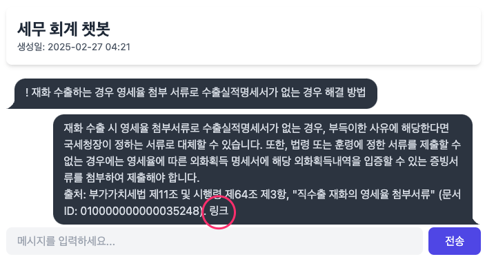

====================================
부록 #2. AI 응답 markdown 포맷 변환
====================================

.. admonition:: `관련 커밋 <https://github.com/pyhub-kr/django-webchat-rag-langcon2025/commit/9c58881adf937d87c513e8ae0b50cfb0b6ba36fc>`_
   :class: dropdown

   * 변경 파일을 한 번에 덮어쓰기 하실려면, :doc:`/utils/pyhub-git-commit-apply` 설치하신 후에, 프로젝트 루트에서 아래 명령 실행하시면
     지정 커밋의 모든 파일을 다운받아 현재 경로에 덮어쓰기합니다.

   .. code-block:: bash

      python -m pyhub_git_commit_apply https://github.com/pyhub-kr/django-webchat-rag-langcon2025/commit/9c58881adf937d87c513e8ae0b50cfb0b6ba36fc

   ``uv``\를 사용하실 경우 

   .. code-block:: bash

      uv run pyhub-git-commit-apply https://github.com/pyhub-kr/django-webchat-rag-langcon2025/commit/9c58881adf937d87c513e8ae0b50cfb0b6ba36fc

markdown to html 변환은 서버 단에서 해도 되고, 클라이언트 단에서 해도 됩니다.
서버 단에서 수행하면 보다 풍부한 포맷 변환이 가능하지만, markdown 변환은 클라이언트 단에서 수행해도 충분할 듯 보입니다.

여러 라이브러리가 있지만 `Showdown <https://showdownjs.com/>`_ 라이브러리를 적용해보겠습니다.

.. admonition:: ``chat/templates/chat/base.html`` 파일 덮어쓰기
    :class: dropdown

    .. code-block:: html+django
        :linenos:
        :emphasize-lines: 1,14-15

        

        <!doctype html>
        <html>
        <head>
            <meta charset="UTF-8">
            <meta name="viewport" content="width=device-width, initial-scale=1.0">
            <title>Django Chat</title>
            {# https://daisyui.com/docs/cdn/ #}
            <link href="https://cdn.jsdelivr.net/npm/daisyui@4.12.24/dist/full.min.css" rel="stylesheet" type="text/css" />
            
            
            
            
            
        </head>
        <body class="bg-gray-100">
            

                <header class="mb-8">
                    <nav class="bg-white shadow-lg rounded-lg">
                        

                            

                                

                                    

                                        <a href="" class="text-xl font-bold text-gray-800">
                                            Django Chat
                                        </a>
                                    

                                

                                

                                    <a href=""
                                    class="inline-flex items-center px-4 py-2 border border-transparent text-sm font-medium rounded-md text-white bg-indigo-600 hover:bg-indigo-700">
                                        새 채팅방
                                    </a>
                                

                            

                        

                    </nav>
                </header>

                <main class="bg-white shadow-lg rounded-lg p-6">
                    
                    
                </main>

                <footer class="mt-8 text-center text-gray-600 text-sm">
                    
&copy; 2025 파이썬사랑방. All rights reserved.

                </footer>
            

        </body>
        </html>

.. admonition:: ``chat/templates/chat/_message_list.html`` 파일 덮어쓰기
    :class: dropdown

    .. code-block:: html+django
        :linenos:
        :emphasize-lines: 1,11-23

        

        
            
                

                    

                        {{ message.content }}
                    

                

            
                {# uuid4 포맷의 랜덤 id 발행 #}
                
                {# 지정 id로 메시지 문자열을 json 변환 #}
                {{ message.content|json_script:message_id }}
                

                    

                    

                

            
        

