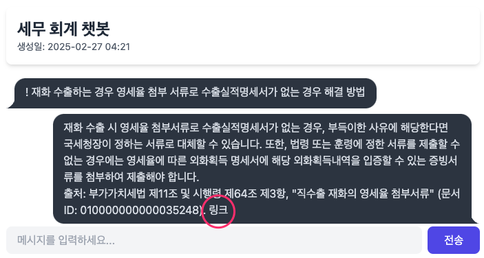
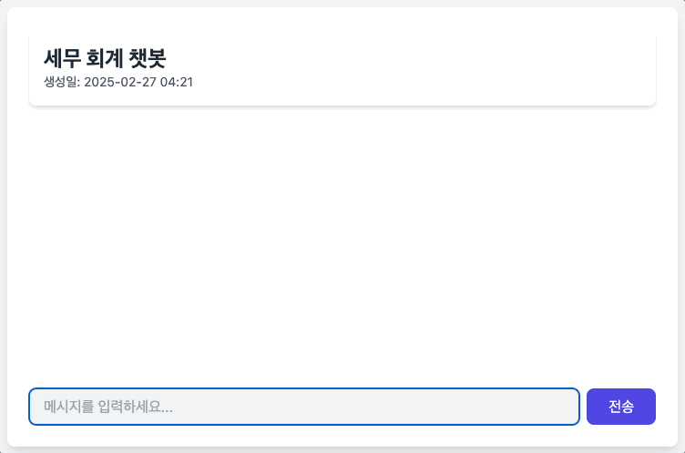

====================================
부록 #1. 채팅 스타일 개선
====================================

대화 풍선 스타일 개선
============================

tailwind css 계열 CSS 라이브러리 중에 daisyui의 `chat bubble 컴포넌트 <https://daisyui.com/components/chat/>`_\를 적용해보겠습니다.

.. tab-set::

    .. tab-item:: 이전

        .. figure:: ./assets/styles/daisyui-chat-bubble-01.png

    .. tab-item:: 개선

        .. figure:: ./assets/styles/daisyui-chat-bubble-02.png

.. admonition:: ``chat/templates/chat/base.html`` 파일 덮어쓰기
    :class: dropdown

    .. code-block:: html+django
        :linenos:
        :emphasize-lines: 7-8

        <!doctype html>
        <html>
        <head>
            <meta charset="UTF-8">
            <meta name="viewport" content="width=device-width, initial-scale=1.0">
            <title>Django Chat</title>
            {# https://daisyui.com/docs/cdn/ #}
            <link href="https://cdn.jsdelivr.net/npm/daisyui@4.12.24/dist/full.min.css" rel="stylesheet" type="text/css" />
            
            
            
        </head>
        <body class="bg-gray-100">
            

                <header class="mb-8">
                    <nav class="bg-white shadow-lg rounded-lg">
                        

                            

                                

                                    

                                        <a href="" class="text-xl font-bold text-gray-800">
                                            Django Chat
                                        </a>
                                    

                                

                                

                                    <a href=""
                                    class="inline-flex items-center px-4 py-2 border border-transparent text-sm font-medium rounded-md text-white bg-indigo-600 hover:bg-indigo-700">
                                        새 채팅방
                                    </a>
                                

                            

                        

                    </nav>
                </header>

                <main class="bg-white shadow-lg rounded-lg p-6">
                    
                    
                </main>

                <footer class="mt-8 text-center text-gray-600 text-sm">
                    
&copy; 2025 파이썬사랑방. All rights reserved.

                </footer>
            

        </body>
        </html>

.. admonition:: ``chat/templates/chat/_message_list.html`` 파일 덮어쓰기
    :class: dropdown

    .. code-block:: html+django
        :linenos:

        {# https://daisyui.com/components/chat/ #}

        
            
                

                    

                        {{ message.content }}
                    

                

            
                

                    

                        {{ message.content }}
                    

                

            
        

markdown 포맷 변환
============================

markdown to html 변환은 서버 단에서 해도 되고, 클라이언트 단에서 해도 됩니다.
서버 단에서 수행하면 보다 풍부한 포맷 변환이 가능하지만, markdown 변환은 클라이언트 단에서 수행해도 충분할 듯 보입니다.

여러 라이브러리가 있지만 `Showdown <https://showdownjs.com/>`_ 라이브러리를 적용해보겠습니다.

.. admonition:: ``chat/templates/chat/base.html`` 파일 덮어쓰기
    :class: dropdown

    .. code-block:: html+django
        :linenos:
        :emphasize-lines: 1,12-14

        

        <!doctype html>
        <html>
        <head>
            <meta charset="UTF-8">
            <meta name="viewport" content="width=device-width, initial-scale=1.0">
            <title>Django Chat</title>
            <link href="https://cdn.jsdelivr.net/npm/daisyui@4.12.24/dist/full.min.css" rel="stylesheet" type="text/css" />
            
            
            
            
            
        </head>
        <body class="bg-gray-100">
            

                <header class="mb-8">
                    <nav class="bg-white shadow-lg rounded-lg">
                        

                            

                                

                                    

                                        <a href="" class="text-xl font-bold text-gray-800">
                                            Django Chat
                                        </a>
                                    

                                

                                

                                    <a href=""
                                    class="inline-flex items-center px-4 py-2 border border-transparent text-sm font-medium rounded-md text-white bg-indigo-600 hover:bg-indigo-700">
                                        새 채팅방
                                    </a>
                                

                            

                        

                    </nav>
                </header>

                <main class="bg-white shadow-lg rounded-lg p-6">
                    
                    
                </main>

                <footer class="mt-8 text-center text-gray-600 text-sm">
                    
&copy; 2025 파이썬사랑방. All rights reserved.

                </footer>
            

        </body>
        </html>

.. admonition:: ``chat/templates/chat/_message_list.html`` 파일 덮어쓰기
    :class: dropdown

    .. code-block:: html+django
        :linenos:
        :emphasize-lines: 1,11-23

        

        
            
                

                    

                        {{ message.content }}
                    

                

            
                {# uuid4 포맷의 랜덤 id 발행 #}
                
                {# 지정 id로 메시지 문자열을 json 변환 #}
                {{ message.content|json_script:message_id }}
                

                    

                    

                

            
        

응답 대기 중 표시
============================

.. admonition:: ``chat/templates/chat/room_detail.html`` 파일 덮어쓰기
    :class: dropdown

    .. code-block:: html+django
        :linenos:
        :emphasize-lines: 5,13-21,24-26,32-35

        

        
        

            

                <h1 class="text-2xl font-bold text-gray-800">{{ room.name }}</h1>
                
생성일: {{ room.created_at|date:"Y-m-d H:i" }}

            

            

                
 {
                                $el.scrollTo({ top: $el.scrollHeight, behavior: 'smooth'})
                            });
                        }
                    }"
                    x-init="scrollToBottom()"
                    @htmx:after-settle="scrollToBottom()">
                    

                    

                        응답 대기 중 ...
                    

                

            

            <form hx-post=""
                hx-target="previous .chat-messages"
                hx-swap="beforeend"
                @htmx:before-request="loading = true; $el.reset()"
                @htmx:after-request="loading = false" novalidate class="mt-4">
                
                

                    <input type="text" name="content" required autocomplete="off" placeholder="메시지를 입력하세요..." autofocus
                        class="flex-1 bg-gray-100 rounded-lg px-4 py-2">
                    <button type="submit"
                        class="bg-indigo-600 text-white px-6 py-2 rounded-lg hover:bg-indigo-700 transition-colors duration-300">
                        전송
                    </button>
                

            </form>
        

        
