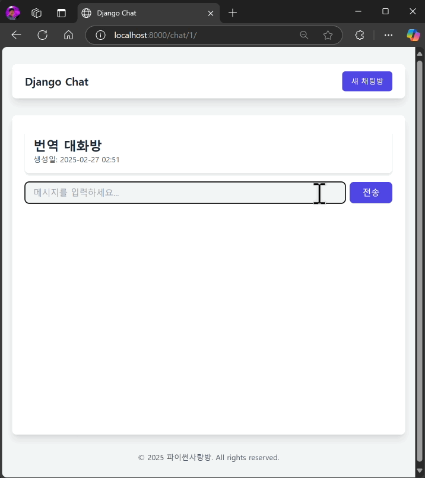

================================================================
📝 HTML Form과 장고 Form을 활용한 채팅 메시지 전송 및 응답
================================================================

채팅 메시지 전송 뷰
======================

새로운 채팅 메시지를 전송받을 View를 전통적인 장고 Form 패턴으로 구현합니다.

* 생성 요청은 항상 ``POST`` 요청으로 받습니다.
* 요청의 파일 데이터는 ``request.FILES`` 속성을 통해 참조할 수 있으며, 그 외 POST 데이터는 ``request.POST`` 속성을 통해 참조할 수 있습니다.
* 요청 데이터에 대한 유효성 검사는 장고 Form 인스턴스를 생성하고, ``.is_valid()`` 메서드를 호출하여 수행합니다. 단 하나의 유효성 검사라도 실패하면 ``False``\를 반환합니다.

  - 🔥 중요: 클라이언트로부터 전달받은 데이터는 절대 신뢰해서는 안 됩니다. 당연히 잘 맞춰 전달했을 것이라 가정해서는 안 됩니다. 반드시 유효성 검사를 수행하여 데이터 값/포맷/타입 등을 확인해야 합니다. 프론트엔드 단에서 입력값을 잘 구성해서 보냈다하더라도, 누군가 악의적인 목적으로 중간에 값을 변조할 수 있습니다. **장고 Form을 통해 효율적으로 유효성 검사를 수행할 수 있습니다.**

* 유효성 검사에 통과하면, 모델 폼을 통해 데이터베이스에 저장하고, AI 메시지를 생성한 후에 채팅방 페이지로 이동시킵니다.

  - 1개의 채팅 메시지를 받고 페이지를 이동시키는 UI가 좋은 경험은 아닙니다. 하지만 이는 **장고를 효율적으로 활용한 생산성 높은 개발 방법**\입니다.
  - 다음 :doc:`./web-chat-using-htmx` 문서에서 자바스크립트 없이도 장고 중심으로 효율적으로 UX를 향상시킬 수 있는 방법을 소개합니다.

* 유효성 검사에 실패하면, 에러 메시지와 함께 에러 HTML 폼 화면을 응답합니다.

.. code-block:: python
    :linenos:
    :caption: ``chat/views.py`` 파일에 추가

    from django.shortcuts import redirect, render, get_object_or_404
    from django.views.decorators.http import require_POST
    from .forms import MessageForm

    @require_POST
    def message_new(request, room_pk):
        room = get_object_or_404(Room, pk=room_pk)

        form = MessageForm(data=request.POST, files=request.FILES)
        if form.is_valid():
            message = form.save(commit=False)
            message.room = room
            message.save()
            # 대화 목록에 기반해서 AI 응답 생성하고 데이터베이스에 저장합니다.
            # 방금 입력된 유저 메시지가 대화 기록 마지막에 추가되어 있습니다.
            ai_message = room.create_ai_message()
            return redirect("chat:room_detail", pk=room_pk)

        return render(
            request,
            "chat/message_form.html",
            {
                "room": room,
                "form": form,
            },
        )

방금 구현한 ``message_new`` 뷰를 호출하는 URL 패턴을 추가합니다.

.. code-block:: python
    :linenos:
    :caption: ``chat/urls.py`` 파일에 추가
    :emphasize-lines: 10

    from django.urls import path
    from . import views

    app_name = "chat"

    urlpatterns = [
        path("", views.room_list, name="room_list"),
        path("new/", views.room_new, name="room_new"),
        path("<int:pk>/", views.room_detail, name="room_detail"),
        path("<int:room_pk>/messages/new/", views.message_new, name="message_new"),
    ]

간소화한 room_detail.html 템플릿 코드
============================================

이전 문서에서 사용한 템플릿은 스타일이 복잡해서 코드를 간소화하여 예제를 진행하겠습니다.

* ``<form>`` 태그에 ``method="post"`` 속성을 추가하여 ``POST`` 방식으로 요청을 전송하고,
* ``action`` 속성으로 메시지를 전송할 주소를 지정합니다.
* ``novalidate`` 속성을 추가하여 브라우저의 기본 유효성 검사를 비활성화합니다.

.. code-block:: html+django
    :linenos:
    :caption: ``chat/templates/chat/room_detail.html`` 파일 수정
    :emphasize-lines: 18

    

    
    

        

            <h1 class="text-2xl font-bold text-gray-800">{{ room.name }}</h1>
            
생성일: {{ room.created_at|date:"Y-m-d H:i" }}

        

        

            

                
                    
[{{ message.role }}] : {{ message.content }}

                
            

        

        <form method="post" action="" novalidate>
            
            

                <input type="text" name="content" required autocomplete="off" placeholder="메시지를 입력하세요..."
                    autofocus class="flex-1 bg-gray-100 rounded-lg px-4 py-2">
                <button type="submit"
                    class="bg-indigo-600 text-white px-6 py-2 rounded-lg hover:bg-indigo-700 transition-colors duration-300">
                    전송
                </button>
            

        </form>
    

    

이렇게 브라우저 기본의 ``<form>`` 전송을 활용하여 채팅 메시지를 전송할 수 있습니다.
파일 업로드가 필요할 때에는 ``<form>`` 태그에 ``enctype="multipart/form-data"`` 속성을 추가하시면 브라우저에서 알아서 파일 전송까지 해줍니다.
자바스크립트를 써야만 모던한 애플리케이션이 되는 것은 아닙니다.

.. note::

    ``room_detail.html`` 템플릿에서도 채팅메시지 입력폼 필드 렌더링을 장고 Form을 활용해서 구현할 수 있습니다.

동작 화면
================

위 내용을 모두 적용하고 채팅방에서 채팅 메시지를 입력하면 페이지 전환이 발생하며, 대화 메시지가 전송되고 AI 응답까지 표시됨을 확인하실 수 있습니다.

