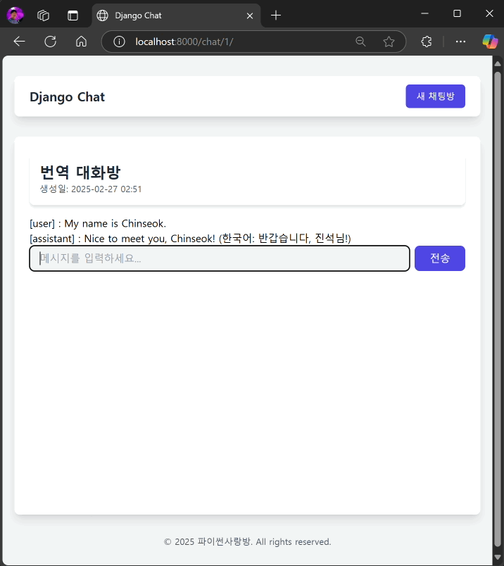

============================================
❣️ HTMX를 통해 JS없이 모던 웹 채팅 UI
============================================

.. admonition:: `관련 커밋 <https://github.com/pyhub-kr/django-webchat-rag-langcon2025/commit/418d068e26c893befa9b91c324c67ae390810db7>`_
   :class: dropdown

   * 변경 파일을 한 번에 덮어쓰기 하실려면, :doc:`/utils/pyhub-git-commit-apply` 설치하신 후에, 프로젝트 루트에서 아래 명령 실행하시면
     지정 커밋의 모든 파일을 다운받아 현재 경로에 덮어쓰기합니다.

   .. code-block:: bash

      python -m pyhub_git_commit_apply https://github.com/pyhub-kr/django-webchat-rag-langcon2025/commit/418d068e26c893befa9b91c324c67ae390810db7

   ``uv``\를 사용하실 경우 

   .. code-block:: bash

      uv run pyhub-git-commit-apply https://github.com/pyhub-kr/django-webchat-rag-langcon2025/commit/418d068e26c893befa9b91c324c67ae390810db7

채팅 메시지 렌더링 템플릿
===============================

채팅 메시지 목록을 렌더링하는 코드는 ``message_new`` 뷰에서도 필요하기에,
``chat/room_detail.html`` 템플릿에서 채팅 메시지 목록을 렌더링하는 코드를 ``chat/_message_list.html`` 템플릿으로 분리합니다.

.. code-block:: html+django
    :linenos:
    :caption: ``chat/templates/chat/_message_list.html`` 파일 생성

    
        
[{{ message.role }}] : {{ message.content }}

    

HTMX를 활용한 채팅 메시지 전송 및 응답 화면 렌더링
=======================================================

채팅 메시지 목록 렌더링 부분을 ```` 템플릿 태그 호출로 대체합니다.
``with``\를 통해 지정 템플릿에서 사용할 값을 추가로 전달할 수 있습니다.

``chat/base.html`` 템플릿에서는 이미 HTMX 라이브러리를 포함하고 있습니다. ``<form>`` 태그에서는 htmx 라이브러리를 통해 메시지를 전송하고, 응답을 화면에 반영하겠습니다.

* ``hx-post``: 메시지 전송 요청 URL

  - HTMX에서는 ``action`` 속성을 사용하지 않습니다. ``hx-요청방식`` 속성을 통해 요청 URL을 지정합니다.

* ``hx-target``: 응답을 반영할 태그 ID

  - HTMX에서는 항상 서버로부터 HTML 응답을 받고, ``hx-target`` 속성으로 지정한 요소에 응답을 반영합니다.

* ``hx-swap``: 응답을 반영하는 방법

  - ``innerHTML``: 요소의 내용을 대체합니다. (디폴트)
  - ``outerHTML``: 요소 자체를 대체합니다.
  - ``beforeend``: **요소의 마지막에 응답을 추가합니다.** (채팅 UI에 적합)
  - ``afterend``: 요소의 다음에 응답을 추가합니다.
  - ``delete``: 요소를 삭제합니다.
  - ``none``: 응답을 무시합니다.

* ``hx-on::before-request``: 요청 전에 실행할 자바스크립트 코드

  - ``this.reset()`` 코드를 호출하여 폼 요소를 초기화시킵니다.

* ``hx-on::after-request``: 요청 후에 실행할 자바스크립트 코드

.. code-block:: html+django
    :linenos:
    :caption: ``chat/templates/chat/room_detail.html`` 파일 덮어쓰기
    :emphasize-lines: 12,16-19

    

    
    

        

            <h1 class="text-2xl font-bold text-gray-800">{{ room.name }}</h1>
            
생성일: {{ room.created_at|date:"Y-m-d H:i" }}

        

        

            

                
            

        

        <form hx-post=""
              hx-target="#chat-messages"
              hx-swap="beforeend"
              hx-on::before-request="this.reset()"
              novalidate>
            
            

                <input type="text" name="content" required autocomplete="off" placeholder="메시지를 입력하세요..." autofocus
                    class="flex-1 bg-gray-100 rounded-lg px-4 py-2">
                <button type="submit"
                    class="bg-indigo-600 text-white px-6 py-2 rounded-lg hover:bg-indigo-700 transition-colors duration-300">
                    전송
                </button>
            

        </form>
    

    

채팅/AI 메시지 저장 후에 페이지 이동없이 HTML 응답
===================================================

**HTMX에서는 처리 결과에 대한 HTML 응답을 요구**\하므로, 채팅/AI 메시지 저장 후에
방금 저장한 채팅/AI 메시지에 대한 HTML 응답을 ``chat/_message_list.html`` 템플릿을 통해 생성하여 응답합니다.
그럼 페이지 전환없이 HTMX에 의해 ``#chat-messages`` 요소 끝에 방금 저장한 채팅/AI 메시지가 추가됩니다.

.. code-block:: python
    :linenos:
    :caption: ``chat/views.py`` 파일 수정
    :emphasize-lines: 11-16

    @require_POST
    def message_new(request, room_pk):
        room = get_object_or_404(Room, pk=room_pk)

        form = MessageForm(data=request.POST, files=request.FILES)
        if form.is_valid():
            message = form.save(commit=False)
            message.room = room
            message.save()
            ai_message = message.create_ai_message()
            # return redirect("chat:room_detail", pk=room_pk)
            return render(
                request,
                "chat/_message_list.html",
                {"message_list": [message, ai_message]},
            )

        return render(
            request,
            "chat/message_form.html",
            {
                "room": room,
                "form": form,
            },
        )

동작 화면
================

채팅 메시지를 입력해보세요. 이전과는 다른 점이 느껴지시나요?

이번에는 페이지 전환이 발생하지 않았습니다.

새로운 채팅 메시지를 ``/chat/1/messages/new/`` 주소로 ``POST`` 방식으로 보냈구요.
서버에서 AI 응답 생성 후에 유저/AI 메시지 목록을 포함한 HTML 응답을 상태코드 200으로 응답했습니다.

이에 HTMX 라이브러리는 서버 응답을 받아 ``#chat-messages`` 요소 끝에 추가했습니다.

서버 로그를 보시면 아래와 같이 1개의 요청으로만 동작함을 확인하실 수 있습니다.

.. code-block:: text

    [28/Feb/2025 06:19:03] "POST /chat/1/messages/new/ HTTP/1.1" 200 349
