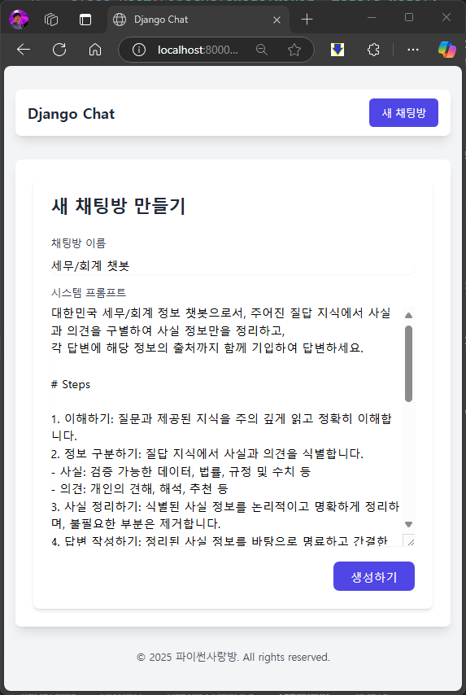
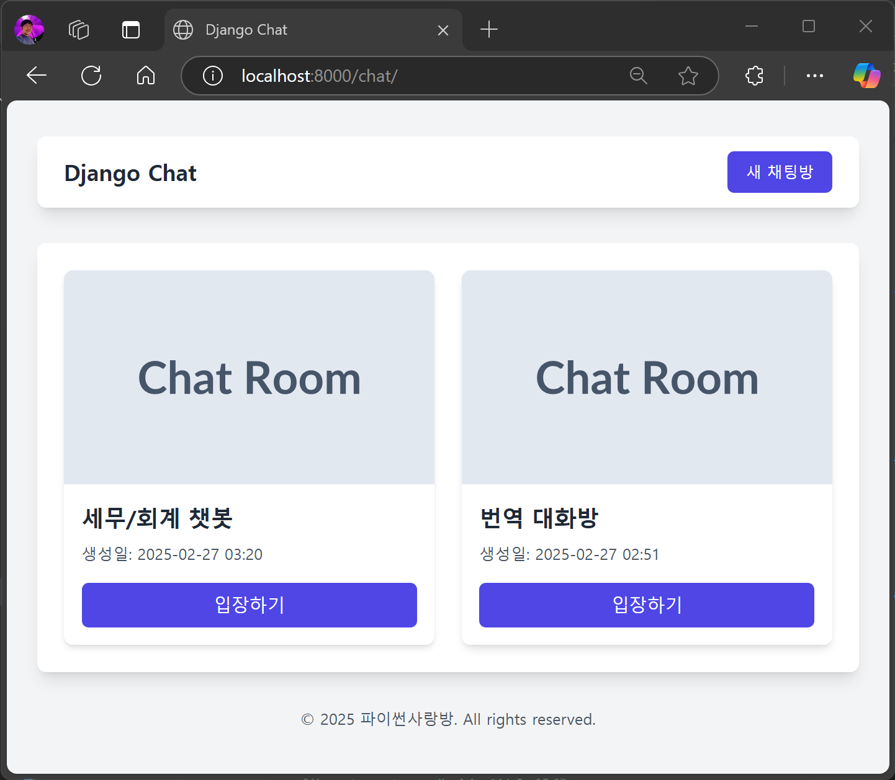
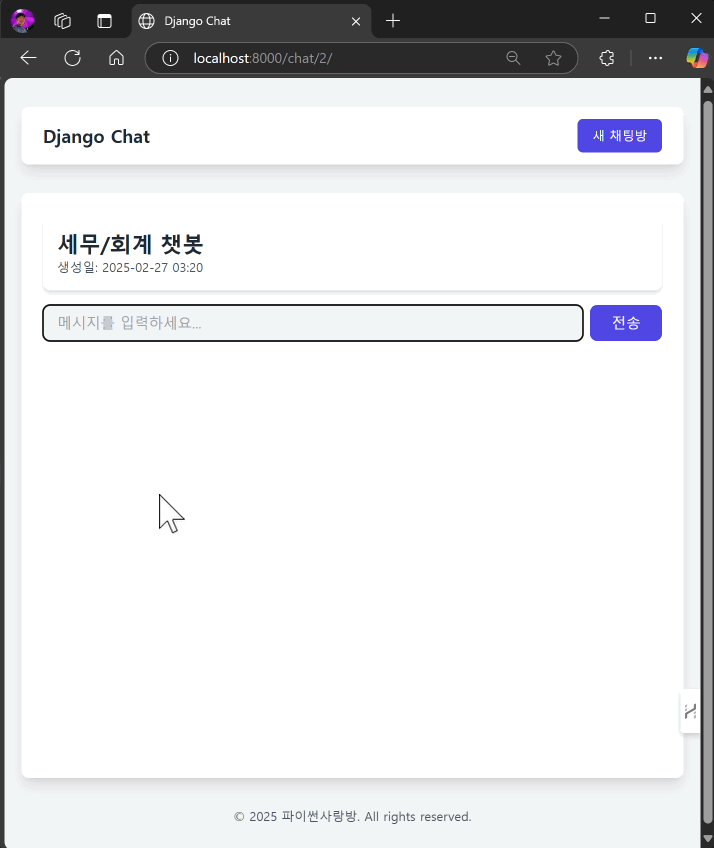

============================
📕 LLM 채팅에 RAG 끼얹기
============================

AI 메시지 생성 시에 유사 문서를 지식으로 활용하기
=================================================

AI 메시지 생성 시에 프롬프트에 유사 문서를 지식으로 활용하면 RAG가 됩니다.
``Room`` 모델의 ``create_ai_message`` 메서드 내에서 "세법 해석례" 문서 검색이 필요할 때,
``TaxLawDocument`` 모델을 통해 유사 문서를 검색하고, 검색된 문서를 지식으로 활용합니다.

.. code-block:: python
    :linenos:
    :caption: ``chat/models.py`` 파일 덮어쓰기
    :emphasize-lines: 34-43,49

    from django.db import models
    from django_lifecycle import AFTER_UPDATE, LifecycleModelMixin, hook
    from pyhub.rag.fields.sqlite import SQLiteVectorField
    from pyhub.rag.models.sqlite import SQLiteVectorDocument
    from chat.llm import LLM

    class TaxLawDocument(SQLiteVectorDocument):
        embedding = SQLiteVectorField(
            dimensions=3072,
            editable=False,
            embedding_model="text-embedding-3-large",
        )

    class Room(LifecycleModelMixin, models.Model):
        name = models.CharField(max_length=255)
        system_prompt = models.TextField(blank=True)
        created_at = models.DateTimeField(auto_now_add=True)
        updated_at = models.DateTimeField(auto_now=True)

        def __str__(self):
            return self.name

        @hook(AFTER_UPDATE, when="system_prompt", has_changed=True)
        def on_after_update(self):
            self.message_set.all().delete()

        def create_ai_message(self):
            # 현재 방의 이전 메시지들을 수집
            message_qs = self.message_set.all()
            messages = [{"role": msg.role, "content": msg.content} for msg in message_qs]

            # 세법 해석례 문서 검색이 필요할 때
            user_message = messages[-1]["content"].strip()
            if user_message.startswith("!"):
                user_message = user_message[1:]
                # RAG를 원하는 모델을 사용하여 유사 문서 검색
                doc_list = TaxLawDocument.objects.similarity_search(user_message)
                지식 = str(doc_list)
                system_prompt = self.system_prompt + "\n\n" + f"참고문서 : {지식}"
            else:
                system_prompt = self.system_prompt

            # AI 응답 생성
            llm = LLM(
                model="gpt-4o-mini",
                temperature=1,
                system_prompt=system_prompt,
                initial_messages=messages,
            )
            ai_message = llm.make_reply()

            # AI 응답을 새 메시지로 저장
            return self.message_set.create(
                role=Message.Role.ASSISTANT,
                content=ai_message,
            )

        class Meta:
            ordering = ["-pk"]

    class Message(models.Model):
        class Role(models.TextChoices):
            USER = "user"
            ASSISTANT = "assistant"

        room = models.ForeignKey(Room, on_delete=models.CASCADE)
        role = models.CharField(max_length=255, choices=Role.choices, default=Role.USER)
        content = models.TextField()
        created_at = models.DateTimeField(auto_now_add=True)
        updated_at = models.DateTimeField(auto_now=True)

        def __str__(self):
            return self.content

        class Meta:
            ordering = ["pk"]

.. note::

    지금은 모든 메시지마다 유사 문서를 검색하지만, 이를 고도화하여 유사 문서 검색이 필요한지 여부를 LLM을 통해 판단하고,
    유사 문서 검색이 필요한 경우에만 유사 문서를 검색하도록 할 수 있습니다.

동작 화면
==============

http://localhost:8000/chat/new/ 페이지에서 새로운 세무/회계 챗봇 채팅방을 생성합니다.

.. admonition:: 시스템 프롬프트 예시
    :class: dropdown

    .. code-block:: text

        대한민국 세무/회계 정보 챗봇으로서, 주어진 질답 지식에서 사실과 의견을 구별하여 사실 정보만을 정리하고,
        각 답변에 해당 정보의 출처까지 함께 기입하여 답변하세요.

        # Steps

        1. 이해하기: 질문과 제공된 지식을 주의 깊게 읽고 정확히 이해합니다.
        2. 정보 구분하기: 질답 지식에서 사실과 의견을 식별합니다.
        - 사실: 검증 가능한 데이터, 법률, 규정 및 수치 등
        - 의견: 개인의 견해, 해석, 추천 등
        3. 사실 정리하기: 식별된 사실 정보를 논리적이고 명확하게 정리하며, 불필요한 부분은 제거합니다.
        4. 답변 작성하기: 정리된 사실 정보를 바탕으로 명료하고 간결한 문장으로 구성된 단락 형태의 답변을 작성합니다. 반드시 해당 사실 정보의 출처를 함께 명시합니다.
        - 가능한 경우 신뢰할 수 있는 출처(예: 정부 기관, 공식 문서, 학술자료 등)를 포함합니다.
        - 출처가 확인되지 않거나 없는 경우, “출처를 찾을 수 없습니다”라고 명시합니다.
        - 출처에 문서ID가 포함된 경우, 반드시 문서ID를 기입하고 아래 URL 형식을 참고하여 해당 URL도 함께 포함합니다.

        # Output Format

        - 명료하고 간결한 문장으로 구성된 단락 형태의 답변
        - 답변 내에 사용한 정보의 출처를 반드시 포함하여 작성

        # Notes

        - 각 세무/회계 정보를 객관적으로 평가하여 답변을 작성합니다.
        - 모호하거나 불확실한 정보는 제외합니다.
        - 답변에 반드시 관련 사실 정보의 출처를 함께 기입하여 객관성과 신뢰성을 높입니다.

채팅방이 생성되었구요.

세무/회계 챗봇에게 느낌표로 시작하는 ``! 재화 수출하는 경우 영세율 첨부 서류로 수출실적명세서가 없는 경우 해결 방법`` 메시지를 보내면,
아래와 같이 십여초 후에 RAG 결과를 포함한 답변을 얻을 수 있습니다.

