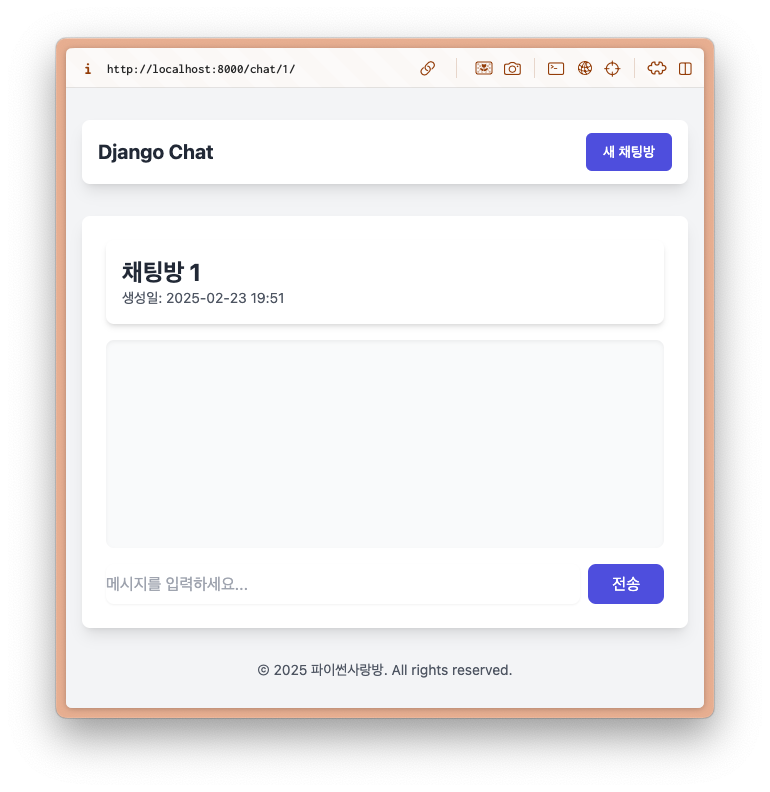

============================================
채팅방/메시지 모델 및 기본 페이지 구성
============================================

AI 응답 생성 유틸
=================

.. code-block:: python
    :linenos:
    :caption: ``chat/utils.py`` 파일 생성

    from django.conf import settings
    from openai import OpenAI

    client = OpenAI(api_key=settings.OPENAI_API_KEY)

    def make_ai_message(
        system_prompt: str,
        messages: list,
        temperature: float = 0.2,
        max_tokens: int = 1000,
    ):
        """
        OpenAI의 Chat Completion API를 사용하여 응답을 생성하는 함수
        """

        try:
            messages = [
                {"role": "system", "content": system_prompt},
            ] + messages
            response = client.chat.completions.create(
                model="gpt-4o-mini",  # 또는 "gpt-4" 등 다른 모델 사용 가능
                messages=messages,
                temperature=temperature,
                max_tokens=max_tokens,
            )
            return response.choices[0].message.content
        except Exception as e:
            return f"API 호출에서 오류가 발생했습니다: {str(e)}"

모델
===========

.. code-block:: python
    :linenos:
    :caption: ``chat/models.py`` 파일에 추가

    from django.db import models
    from django_lifecycle import AFTER_UPDATE, LifecycleModelMixin, hook
    from .llm import make_ai_message

   class Room(LifecycleModelMixin, models.Model):
        name = models.CharField(max_length=255)
        system_prompt = models.TextField(blank=True)
        created_at = models.DateTimeField(auto_now_add=True)
        updated_at = models.DateTimeField(auto_now=True)

        def __str__(self):
            return self.name

        @hook(AFTER_UPDATE, when="system_prompt", has_changed=True)
        def on_after_update(self):
            self.message_set.all().delete()

        class Meta:
            ordering = ["-pk"]

    class Message(models.Model):
        class Role(models.TextChoices):
            USER = "user"
            ASSISTANT = "assistant"

        room = models.ForeignKey(Room, on_delete=models.CASCADE)
        role = models.CharField(max_length=255, choices=Role.choices, default=Role.USER)
        content = models.TextField()
        created_at = models.DateTimeField(auto_now_add=True)
        updated_at = models.DateTimeField(auto_now=True)

        def __str__(self):
            return self.content

        def create_ai_message(self):
            # 현재 방의 이전 메시지들을 수집
            message_qs = self.room.message_set.all().order_by("pk")
            messages = [{"role": msg.role, "content": msg.content} for msg in message_qs]

            # AI 응답 생성
            ai_message = make_ai_message(
                system_prompt=self.room.system_prompt,
                messages=messages,
            )

            # AI 응답을 새 메시지로 저장
            return Message.objects.create(
                room=self.room,
                role=self.Role.ASSISTANT,
                content=ai_message,
            )

        class Meta:
            ordering = ["pk"]

폼
===========

.. code-block:: python
    :linenos:
    :caption: ``chat/forms.py`` 파일 생성

    from django import forms
    from .models import Message, Room

    class RoomForm(forms.ModelForm):
        class Meta:
            model = Room
            fields = ["name", "system_prompt"]

    class MessageForm(forms.ModelForm):
        class Meta:
            model = Message
            fields = ["content"]

뷰
===========

.. code-block:: python
    :linenos:
    :caption: ``chat/views.py`` 파일 생성

    from django.shortcuts import get_object_or_404, render
    from django.urls import reverse_lazy
    from django.views.generic import CreateView, ListView

    from .forms import RoomForm
    from .models import Room

    room_list = ListView.as_view(model=Room)

    room_new = CreateView.as_view(
        model=Room,
        form_class=RoomForm,
        success_url=reverse_lazy("chat:room_list"),
    )

    def room_detail(request, pk):
        room = get_object_or_404(Room, pk=pk)
        message_list = room.message_set.all()
        return render(
            request,
            "chat/room_detail.html",
            {
                "room": room,
                "message_list": message_list,
            },
        )

.. code-block:: python
    :linenos:
    :caption: ``chat/urls.py`` 파일에 추가

    from django.urls import path
    from . import views

    app_name = "chat"

    urlpatterns = [
        path("", views.room_list, name="room_list"),
        path("new/", views.room_new, name="room_new"),
        path("<int:pk>/", views.room_detail, name="room_detail"),
    ]

템플릿
===========

.. code-block:: html+django
    :linenos:
    :caption: ``chat/templates/chat/base.html`` 파일 생성

    <!doctype html>
    <html>
    <head>
        <meta charset="UTF-8">
        <meta name="viewport" content="width=device-width, initial-scale=1.0">
        <title>Django Chat</title>
        
        
    </head>
    <body class="bg-gray-100">
        

            <header class="mb-8">
                <nav class="bg-white shadow-lg rounded-lg">
                    

                        

                            

                                

                                    <a href="" class="text-xl font-bold text-gray-800">
                                        Django Chat
                                    </a>
                                

                            

                            

                                <a href="" 
                                class="inline-flex items-center px-4 py-2 border border-transparent text-sm font-medium rounded-md text-white bg-indigo-600 hover:bg-indigo-700">
                                    새 채팅방
                                </a>
                            

                        

                    

                </nav>
            </header>

            <main class="bg-white shadow-lg rounded-lg p-6">
                
                
            </main>

            <footer class="mt-8 text-center text-gray-600 text-sm">
                
&copy; 2025 파이썬사랑방. All rights reserved.

            </footer>
        

    </body>
    </html>

.. code-block:: html+django
    :linenos:
    :caption: ``chat/templates/chat/room_list.html`` 파일 생성

    

    
        

            
                

                    
                    

                        <h2 class="text-xl font-semibold text-gray-800 mb-2">{{ room.name }}</h2>
                        
생성일: {{ room.created_at|date:"Y-m-d H:i" }}

                        <a href="" 
                        class="inline-block w-full text-center bg-indigo-600 text-white py-2 px-4 rounded-md hover:bg-indigo-700 transition-colors duration-300">
                            입장하기
                        </a>
                    

                

            
                

                    
생성된 채팅방이 없습니다.

                    <a href="" 
                    class="inline-block mt-4 bg-indigo-600 text-white py-2 px-6 rounded-md hover:bg-indigo-700 transition-colors duration-300">
                        새 채팅방 만들기
                    </a>
                

            
        

    

.. code-block:: html+django
    :linenos:
    :caption: ``chat/templates/chat/room_detail.html`` 파일 생성

    

    
        

            

                <h1 class="text-2xl font-bold text-gray-800">{{ room.name }}</h1>
                
생성일: {{ room.created_at|date:"Y-m-d H:i" }}

            

            

                

                    
                        

                            

                                

                                    {{ message.is_ai|yesno:"AI,You" }}
                                

                                
{{ message.content }}

                                

                                    {{ message.created_at|date:"H:i" }}
                                

                            

                        

                    
                

            

            <form class="flex gap-2" method="post">
                
                <input type="text" name="content" required autocomplete="off"
                    class="flex-1 rounded-lg border-gray-300 shadow-sm focus:border-indigo-300 focus:ring focus:ring-indigo-200 focus:ring-opacity-50"
                    placeholder="메시지를 입력하세요...">
                <button type="submit"
                    class="bg-indigo-600 text-white px-6 py-2 rounded-lg hover:bg-indigo-700 transition-colors duration-300">
                    전송
                </button>
            </form>
        

    

.. code-block:: html+django
    :linenos:
    :caption: ``chat/templates/chat/room_form.html`` 파일 생성

    

    
    

        

            <h1 class="text-2xl font-bold text-gray-800 mb-6">새 채팅방 만들기</h1>

            <form method="post" novalidate>
                

                

                    <label for="{{ form.name.id_for_label }}" class="block text-sm font-medium text-gray-700 mb-2">채팅방
                        이름</label>
                    <input type="text" name="{{ form.name.name }}" id="{{ form.name.id_for_label }}" required
                        class="w-full rounded-lg border-0 shadow-sm focus:border-indigo-300 focus:ring focus:ring-indigo-200 focus:ring-opacity-50"
                        value="{{ form.name.value }}" >
                    
                    
{{ form.name.errors.0 }}

                    
                

                

                    <label for="{{ form.system_prompt.id_for_label }}" class="block text-sm font-medium text-gray-700 mb-2">시스템
                        프롬프트</label>
                    <textarea name="{{ form.system_prompt.name }}" id="{{ form.system_prompt.id_for_label }}"
                        class="w-full rounded-lg border-0 shadow-sm focus:border-indigo-300 focus:ring focus:ring-indigo-200 focus:ring-opacity-50"
                        value="{{ form.system_prompt.value }}" ></textarea>
                    
                    
{{ form.system_prompt.errors.0 }}

                    
                

                

                    <button type="submit"
                        class="bg-indigo-600 text-white px-6 py-2 rounded-lg hover:bg-indigo-700 transition-colors duration-300">
                        생성하기
                    </button>
                

            </form>
        

    

    