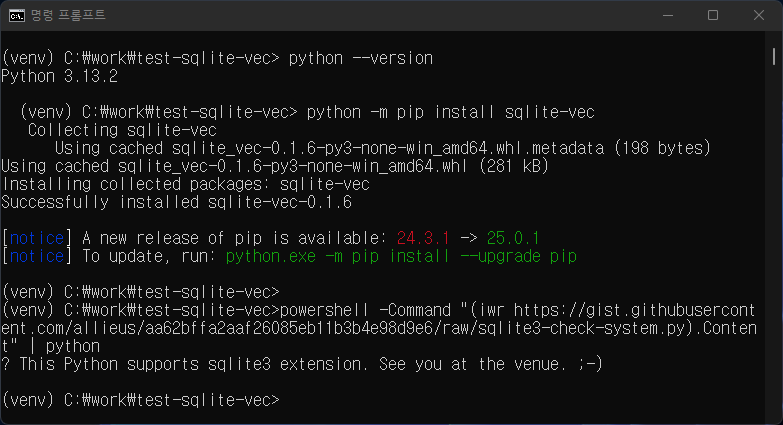

================================
핸즈온랩 시간. 실습환경 확인
================================

:doc:`./preparation` 문서를 참고하여 실습환경을 확인해주세요.

sqlite-vec 라이브러리를 활용하실 경우
==============================================

실습환경 재확인
---------------------

위 문서에서 확인한 실습환경이 정상적으로 작동하는지 재확인해주세요.

.. code-block:: powershell
    :caption: 윈도우

    powershell -Command "(iwr https://gist.githubusercontent.com/allieus/aa62bffa2aaf26085eb11b3b4e98d9e6/raw/sqlite3-check-system.py).Content" | python

.. code-block:: shell
    :caption: macOS

    curl https://gist.githubusercontent.com/allieus/aa62bffa2aaf26085eb11b3b4e98d9e6/raw/sqlite3-check-system.py | python

실습환경 준비 완료
---------------------

``This Python supports sqlite3 extension. See you at the venue. ;-)`` 문장이 출력되면 실습환경 준비가 완료된 것입니다.

pgvector 라이브러리를 활용하실 경우
========================================

https://supabase.com 서비스를 이용하시거나, 로컬에 ``pgvector`` 확장이 설치된 ``PostgreSQL`` 데이터베이스를 생성하신 후에,
``DATABASE_URL`` 환경변수로서 사용할 연결 문자열을 준비해주세요.

.. code-block:: text
    :caption: ``DATABASE_URL`` 환경변수 예시

    postgresql://postgres.euvmdqdkpiseywirljvs:암호@aws-0-ap-northeast-2.pooler.supabase.com:5432/postgres

Let's Go!
==========

잘 부탁드립니다. 😉
