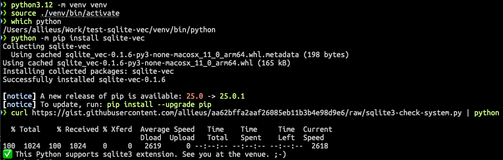
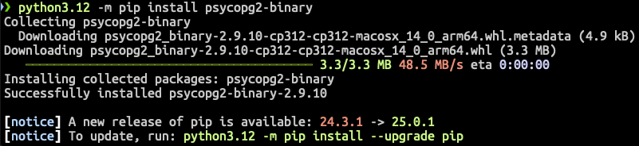

==============================================
핸즈온랩에 오시기 전에 미리 확인해주세요.
==============================================

본 튜토리얼 진행을 위해서는 파이썬 3.10 이상이 설치된 윈도우/맥 환경이 필요합니다.
(`장고 5.0 부터 파이썬 3.10 이상이 필요 <https://docs.djangoproject.com/en/5.1/faq/install/>`_\합니다.)

단톡방
============

원활한 진행을 위해 단톡방을 운영합니다. 랭콘 2025 공식 단톡방이 아니라, 본 핸즈온랩 세션 만을 위한 단톡방입니다.

.. admonition:: 파이썬사랑방 랭콘 2025 핸즈온랩
    :class: dropdown

    https://open.kakao.com/o/gmXZwNhh (참여코드: 2025)

    .. image:: ./assets/qrcode.png

핸즈온랩 참여 전에 미리 들어오셔서, 실습환경 확인과 관련하여 궁금하신 부분은 언제든 문의주세요. 😉

공통
============

사용할 데이터베이스
-----------------------------

본 핸즈온랩에서는 벡터스토어로서 다음 2개의 데이터베이스 중에 하나를 사용하실 수 있습니다. 

* ``sqlite-vec`` 라이브러리를 활용한 ``SQLite`` 데이터베이스
* ``pgvector`` 라이브러리를 활용한 ``PostgreSQL`` 데이터베이스 (``pgvector`` 확장이 설치 필요)

.. note::

    벡터스토어(Vector Store)는 텍스트나 이미지와 같은 데이터를 벡터(숫자 배열) 형태로 저장하고 검색할 수 있게 해주는 특수한 데이터베이스입니다.
    일반적인 데이터베이스가 정확한 단어나 구문 매칭으로 검색을 수행하는 것과 달리, 벡터스토어는 "의미적 유사도"를 기반으로 검색이 가능합니다. 예를 들어 "강아지"라고 검색했을 때 "반려견"이나 "애완견"과 같은 의미상 유사한 내용도 함께 찾을 수 있습니다.

    이러한 특성 때문에 벡터스토어는 AI 챗봇이나 **RAG 시스템에서 자주 활용** 됩니다.

현장의 네트워크 사정이 좋지 않을 수 있으므로, 로컬 데이터베이스인 ``SQLite`` 기반으로 진행하는 것을 권장합니다.
그런데, 사용하시는 파이썬 인터프리터에서 ``SQLite`` 확장을 지원하지 않거나 ``sqlite-vec`` 라이브러리를 지원하지 않을 수 있습니다.
사용하시는 운영체제에 맞게 아래 내용을 확인해주세요.

``SQLite`` 데이터베이스를 사용하기 어려우실 경우 (특히 macOS 에서는 ``sqlite3`` 확장이 지원되지 않을 수 있습니다.)
대체 방안으로 ``pgvector`` 확장이 설치된 ``PostgreSQL`` 데이터베이스를 사용합니다.
이 경우에는 파이썬은 3.10 이상이시면 되구요.
:doc:`/setup/databases/postgres/supabase` 문서를 참고하여 ``supabase`` 서비스에 가입하시고, ``DATABASE_URL`` 환경변수만 생성해서 가져와주시면 됩니다. :-)

시스템 확인 코드
---------------------

아래 코드를 수행하여, 현재 사용 중이신 파이썬이 핸즈온랩 진행에 적합한지 확인합니다.
운영체제에 맞게 아래 섹션 내용을 확인해주세요.

* :ref:`윈도우 바로가기 <windows-label>`
* :ref:`macOS 바로가기 <macOS-label>`

.. _check-system-code:

아래 코드는 스크립트를 통해 자동 다운로드 후에 파이썬 명령을 통해 수행하므로, 따로 저장하지 않으셔도 됩니다.

.. code-block:: python
    :caption: ``sqlite3-check-system.py``
    :linenos:

    import sys
    import sqlite3

    is_windows = sys.platform == "win32"
    is_arm = "ARM" in sys.version
    is_python_3_10_or_later = sys.version_info[:2] >= (3, 10)

    try:
        import sqlite_vec
    except ImportError:
        sqlite_vec = None

    if is_windows and is_arm:
        print("❌ ARM version of Python does not support sqlite-vec library. Please reinstall AMD64 version of Python.")
        sys.exit(1)

    if not is_python_3_10_or_later:
        print("❌ Python 3.10 or later is required.")
        sys.exit(1)

    if sqlite_vec is None:
        print("❌ Please install sqlite-vec library.")
        sys.exit(1)

    with sqlite3.connect(":memory:") as db:
        try:
            db.enable_load_extension(True)
            sqlite_vec.load(db)  # Loading sqlite-vec extension
            db.enable_load_extension(False)
        except AttributeError:
            print("❌ This Python does not support sqlite3 extension. Please refer to the guide and reinstall Python.")
            sys.exit(1)
        else:
            print("✅ This Python supports sqlite3 extension. See you at the venue. ;-)")

윈도우
============

.. _windows-label:

파이썬 3.10 이상, AMD64 버전
-----------------------------------

**파이썬은 3.10 이상이시고, https://www.python.org 에서 다운받으신 AMD64 버전의 파이썬은 모두 가능** 합니다.

시스템 확인 코드 수행
--------------------------

``pip install sqlite-vec`` 명령으로 ``sqlite-vec`` 라이브러리를 먼저 설치하시고,
아래 명령을 수행하여 :ref:`시스템 확인 코드 <check-system-code>` 동작을 확인해주세요.

.. note::

    ``python`` 명령으로 실행합니다.
    상황에 맞춰 ``python`` 명령 대신 현재의 파이썬 인터프리터에 맞춰 실행해주세요.

.. tab-set::

    .. tab-item:: 파워쉘

        가상환경을 먼저 생성하고, 활성화하고, ``sqlite-vec`` 라이브러리를 설치합니다.

        .. code-block:: powershell

            # python 명령은 여러분 환경에 맞춰 실행해주세요.
            python -m venv venv

            venv\Scripts\activate
            python -m pip install sqlite-vec

        이어서 시스템 확인 코드를 수행합니다.

        .. code-block:: powershell

            (iwr https://gist.githubusercontent.com/allieus/aa62bffa2aaf26085eb11b3b4e98d9e6/raw/sqlite3-check-system.py).Content | python

    .. tab-item:: 명령프롬프트

        가상환경을 먼저 생성하고, 활성화하고, ``sqlite-vec`` 라이브러리를 설치합니다.

        .. code-block:: text

            @REM python 명령은 여러분 환경에 맞춰 실행해주세요.
            python -m venv venv

            venv\Scripts\activate
            python -m pip install sqlite-vec

        이어서 시스템 확인 코드를 수행합니다.

        .. code-block:: text

            powershell -Command "(iwr https://gist.githubusercontent.com/allieus/aa62bffa2aaf26085eb11b3b4e98d9e6/raw/sqlite3-check-system.py).Content" | python

.. figure:: ./assets/win-check-system.png

* 위와 같이 ``✅ This Python supports sqlite3 extension. See you at the venue. ;-)`` 라는 메시지가 출력되시면 핸즈온랩 준비 완료입니다. 행사장에서 뵙겠습니다. 😉
* ``❌ Please install sqlite-vec library.`` 라는 메시지가 출력되시면 ``sqlite-vec`` 라이브러리를 설치하신 후에, 다시 코드를 실행해주세요.
* ``❌ ARM version of Python does not support sqlite-vec library. Please reinstall AMD64 version of Python.`` 라는 메시지가 출력되시면
  `파이썬을 3.10 이상, AMD64 버전으로 재설치 <https://www.python.org/ftp/python/3.13.2/python-3.13.2-amd64.exe>`_\해주세요. 
* ``❌ Python 3.10 or later is required.`` 라는 메시지가 출력되시면 `파이썬을 3.10 이상으로 재설치 (AMD64) <https://www.python.org/ftp/python/3.13.2/python-3.13.2-amd64.exe>`_\해주세요.
* ``❌ This Python does not support sqlite3 extension. Please refer to the guide and reinstall Python.`` 라는 메시지가 출력되시면 파이썬을 3.10 이상으로  재설치하신 후에, 다시 가상환경 생성하시고, 라이브러리 설치하신 후에 코드를 실행해주세요.
  윈도우에서는 이 메시지가 뜨실 일은 없을 것입니다.

.. warning::

    ARM64 버전의 파이썬은 ``sqlite-vec`` 라이브러리가 지원되지 않습니다.
    위와 같이 ``ARM64`` 버전으로 출력되시는 분은 `파이썬 3.10 이상, AMD64 버전 <https://www.python.org/ftp/python/3.13.2/python-3.13.2-amd64.exe>`_\으로 재설치해주세요.

    .. figure:: ./assets/win-arm64-sqlite-vec-error.png

macOS
============

.. _macOS-label:

파이썬 3.10 이상, 직접 빌드가 필요
---------------------------------------

macOS 에서는 보안을 이유로 ``sqlite3`` 모듈에서 ``enable_load_extension`` 메서드가 비활성화되어있습니다.
https://www.python.org 에서 다운받아 설치한 버전도 마찬가지입니다.

시스템 확인 코드 수행
--------------------------

``pip install sqlite-vec`` 명령으로 ``sqlite-vec`` 라이브러리를 먼저 설치하시고,
아래 명령을 수행하여 :ref:`시스템 확인 코드 <check-system-code>` 동작을 확인해주세요.

.. note::

    ``python`` 명령으로 실행합니다.
    상황에 맞춰 ``python`` 명령 대신 현재의 파이썬 인터프리터에 맞춰 실행해주세요.

.. tab-set::

    .. tab-item:: 쉘

        가상환경을 먼저 생성하고, 활성화하고, ``sqlite-vec`` 라이브러리를 설치합니다.

        .. code-block:: shell

            python -m venv venv  # python 명령은 여러분 환경에 맞춰 실행해주세요.
            source ./venv/bin/activate
            python -m pip install sqlite-vec

        이어서 시스템 확인 코드를 수행합니다.

        .. code-block:: shell

            curl https://gist.githubusercontent.com/allieus/aa62bffa2aaf26085eb11b3b4e98d9e6/raw/sqlite3-check-system.py | python

* 위와 같이 ``✅ This Python supports sqlite3 extension. See you at the venue. ;-)`` 라는 메시지가 출력되시면 핸즈온랩 준비 완료입니다. 행사장에서 뵙겠습니다. 😉
* ``❌ Please install sqlite-vec library.`` 라는 메시지가 출력되시면 ``sqlite-vec`` 라이브러리를 설치하신 후에, 다시 코드를 실행해주세요.
* ``❌ Python 3.10 or later is required.`` 라는 메시지가 출력되시면 `파이썬을 3.10 이상으로 재설치 (macOS) <https://www.python.org/ftp/python/3.13.2/python-3.13.2-macos11.pkg>`_\해주세요.
* ``❌ This Python does not support sqlite3 extension. Please refer to the guide and reinstall Python.`` 라는 메시지가 출력되시면 **파이썬을 직접 빌드**\하셔야 합니다.

선택 #1) 파이썬을 직접 빌드하실려면?
-----------------------------------------

``sqlite3`` 확장이 지원되는 파이썬을 설치하실려면 직접 빌드가 필요합니다

``pyenv``\를 사용하시는 경우 :doc:`/setup/python/macos` 문서를 참고하여 ``sqlite3`` 확장이 지원되는 파이썬을 설치하실 수 있습니다.
``asdf``\에서도 동일한 방법으로 설치하실 수 있습니다. 다음 순서로 진행됩니다.

#. ``brew``\를 통해 ``sqlite`` 팩키지를 최신 버전으로 설치
#. ``pyenv``\를 통한 파이썬 빌드에서 ``LDFLAGS``, ``CPPFLAGS``, ``CFLAGS``, ``PYTHON_CONFIGURE_OPTS`` 환경변수를 통해 ``sqlite`` 빌드 옵션을 지정하여 설치

선택 #2) 재설치없이 진행할려면?
-----------------------------------------

파이썬 빌드가 어려우실 경우, 대체 방안으로 ``pgvector`` 확장이 설치된 ``PostgreSQL`` 데이터베이스를 사용하실 수 있습니다.
대신 현장 네트워크가 좋지 않을 경우 데이터베이스 접속에 문제가 생길 수 있습니다.

이 경우에는 파이썬 버전이 3.10 이상이시면 되구요.
``psycopg2-binary`` 라이브러리만 설치되시면 됩니다. 별 이슈없이 잘 설치되실 것입니다.

``PostgreSQL`` 데이터베이스는 ``supabase.com`` 서비스를 활용하겠습니다.
:doc:`/setup/databases/postgres/supabase` 문서를 참고하여 ``supabase`` 서비스에 가입하시고, ``DATABASE_URL`` 환경변수만 생성해서 가져와주시면 됩니다. :-)

.. code-block:: text
    :caption: ``DATABASE_URL`` 환경변수 예시

    postgresql://postgres.euvmdqdkpiseywirljvs:암호@aws-0-ap-northeast-2.pooler.supabase.com:5432/postgres

혹은 Docker 가 가능하신 분은 :doc:`/setup/databases/postgres/docker` 문서를 참고하여, 도커 이미지만 ``pgvector/pgvector:pg17``\로 지정하시면 로컬에서 pgvector 확장이 설치된 ``PostgreSQL`` 데이터베이스를 사용할 수 있습니다.
