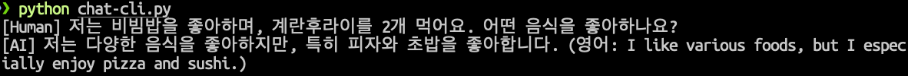
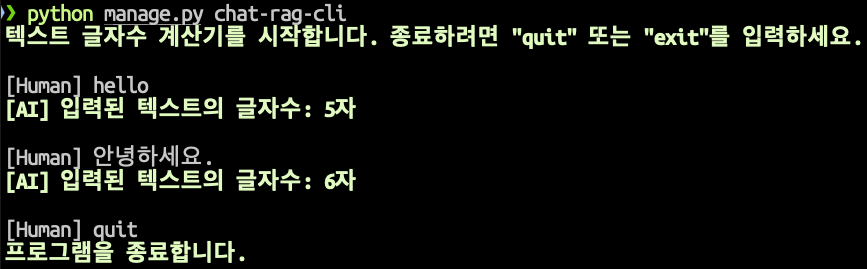
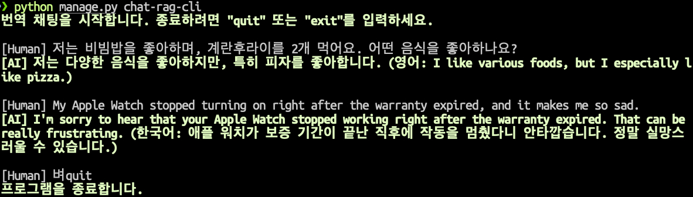
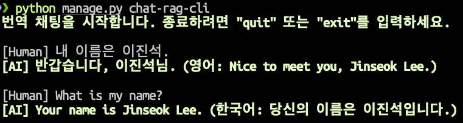

=========================
명령행 RAG 채팅 구현
=========================

OpenAI API, Chat Completion API 예시
==========================================

.. admonition:: ``chat-cli.py``
    :class: dropdown

    .. code-block:: python
        :linenos:

        import os
        import django
        from openai import OpenAI

        os.environ.setdefault("DJANGO_SETTINGS_MODULE", "mysite.settings")
        django.setup()

        from django.conf import settings

        client = OpenAI(api_key=settings.OPENAI_API_KEY)

        def make_ai_message(human_message: str) -> str:
            """
            OpenAI의 Chat Completion API를 사용하여 응답을 생성하는 함수
            """

            system_prompt = """
        너는 번역가야.
        한국어로 물어보면 한국어로 대답하며 영어 번역을 함께 제공해주고,
        영어로 물어보면 영어로 대답하여 한글 번역을 함께 제공해줘.

        예시:

        <질문>안녕하세요.</질문>
        <답변>반갑습니다. (영어: Hello.)</답변>

        <질문>Hello.</질문>
        <답변>안녕하세요. (영어: Hello.)</답변>
            """

            try:
                response = client.chat.completions.create(
                    model="gpt-4o-mini",  # 또는 "gpt-4" 등 다른 모델 사용 가능
                    messages=[
                        {
                            "role": "system",
                            "content": system_prompt,
                        },
                        {"role": "user", "content": human_message},
                    ],
                    temperature=0.2,
                    max_tokens=1000,
                )
                return response.choices[0].message.content
            except Exception as e:
                return f"API 호출에서 오류가 발생했습니다: {str(e)}"

        if __name__ == "__main__":

            human_message = input("[Human] ").strip()

            ai_message = make_ai_message(human_message)
            print(f"[AI] {ai_message}")

간단 채팅 CLI 구현
====================

.. admonition:: ``chat/management/commands/chat-rag-cli.py``
    :class: dropdown

    .. code-block:: python
        :linenos:

        from django.core.management.base import BaseCommand

        class Command(BaseCommand):
            help = "입력된 텍스트의 글자수를 반환하는 CLI 채팅"

            def handle(self, *args, **options):
                self.stdout.write(
                    self.style.SUCCESS(
                        '텍스트 글자수 계산기를 시작합니다. 종료하려면 "quit" 또는 "exit"를 입력하세요.'
                    )
                )

                while True:
                    user_input = input("\n[Human] ").strip()

                    if user_input.lower() in ["quit", "exit"]:
                        self.stdout.write(self.style.SUCCESS("프로그램을 종료합니다."))
                        break

                    if user_input:
                        char_count = len(user_input)
                        self.stdout.write(
                            self.style.SUCCESS(f"[AI] 입력된 텍스트의 글자수: {char_count}자")
                        )

채팅 + LLM 번역
===================

.. admonition:: ``chat/management/commands/chat-rag-cli.py``
    :class: dropdown

    .. code-block:: python
        :linenos:

        from django.conf import settings
        from django.core.management.base import BaseCommand
        from openai import OpenAI

        client = OpenAI(api_key=settings.OPENAI_API_KEY)

        def make_ai_message(human_message: str):
            """
            OpenAI의 Chat Completion API를 사용하여 응답을 생성하는 함수
            """

            system_prompt = """
        너는 번역가야.
        한국어로 물어보면 한국어로 대답하며 영어 번역을 함께 제공해주고,
        영어로 물어보면 영어로 대답하여 한글 번역을 함께 제공해줘.

        예시:

        <질문>안녕하세요.</질문>
        <답변>반갑습니다. (영어: Hello.)</답변>

        <질문>Hello.</질문>
        <답변>안녕하세요. (영어: Hello.)</답변>
            """

            try:
                response = client.chat.completions.create(
                    model="gpt-4o-mini",  # 또는 "gpt-4" 등 다른 모델 사용 가능
                    messages=[
                        {
                            "role": "system",
                            "content": system_prompt,
                        },
                        {"role": "user", "content": human_message},
                    ],
                    temperature=0.2,
                    max_tokens=1000,
                )
                return response.choices[0].message.content
            except Exception as e:
                return f"API 호출에서 오류가 발생했습니다: {str(e)}"

        class Command(BaseCommand):
            help = "OpenAI를 이용한 번역 채팅"

            def handle(self, *args, **options):
                self.stdout.write(
                    self.style.SUCCESS(
                        '번역 채팅을 시작합니다. 종료하려면 "quit" 또는 "exit"를 입력하세요.'
                    )
                )

                while True:
                    user_input = input("\n[Human] ").strip()

                    if user_input.lower() in ["quit", "exit"]:
                        self.stdout.write(self.style.SUCCESS("프로그램을 종료합니다."))
                        break

                    if user_input:
                        ai_message = make_ai_message(user_input)
                        self.stdout.write(self.style.SUCCESS(f"[AI] {ai_message}"))

멀티턴 대화
================

.. admonition:: ``chat/management/commands/chat-rag-cli.py``
    :class: dropdown

    .. code-block:: python
        :linenos:

        from django.conf import settings
        from django.core.management.base import BaseCommand
        from openai import OpenAI

        client = OpenAI(api_key=settings.OPENAI_API_KEY)

        def make_ai_message(messages: list):
            """
            OpenAI의 Chat Completion API를 사용하여 응답을 생성하는 함수
            """

            system_prompt = """
        너는 번역가야.
        한국어로 물어보면 한국어로 대답하며 영어 번역을 함께 제공해주고,
        영어로 물어보면 영어로 대답하여 한글 번역을 함께 제공해줘.

        예시:

        <질문>안녕하세요.</질문>
        <답변>반갑습니다. (영어: Hello.)</답변>

        <질문>Hello.</질문>
        <답변>안녕하세요. (영어: Hello.)</답변>
            """

            try:
                messages = [{"role": "system", "content": system_prompt}] + messages
                response = client.chat.completions.create(
                    model="gpt-4o-mini",  # 또는 "gpt-4" 등 다른 모델 사용 가능
                    messages=messages,
                    temperature=0.2,
                    max_tokens=1000,
                )
                return response.choices[0].message.content
            except Exception as e:
                return f"API 호출에서 오류가 발생했습니다: {str(e)}"

        class Command(BaseCommand):
            help = "OpenAI를 이용한 번역 채팅"

            def handle(self, *args, **options):
                self.stdout.write(
                    self.style.SUCCESS(
                        '번역 채팅을 시작합니다. 종료하려면 "quit" 또는 "exit"를 입력하세요.'
                    )
                )

                # 대화 기록을 저장할 리스트
                conversation_history = []

                while True:
                    user_input = input("\n[Human] ").strip()

                    if user_input.lower() in ["quit", "exit"]:
                        self.stdout.write(self.style.SUCCESS("프로그램을 종료합니다."))
                        break

                    if user_input:
                        # 사용자 입력을 대화 기록에 추가
                        conversation_history.append({"role": "user", "content": user_input})

                        # 전체 대화 기록을 전달하여 응답 생성
                        ai_message = make_ai_message(conversation_history)

                        # AI 응답을 대화 기록에 추가
                        conversation_history.append(
                            {"role": "assistant", "content": ai_message}
                        )

                        self.stdout.write(self.style.SUCCESS(f"[AI] {ai_message}"))

