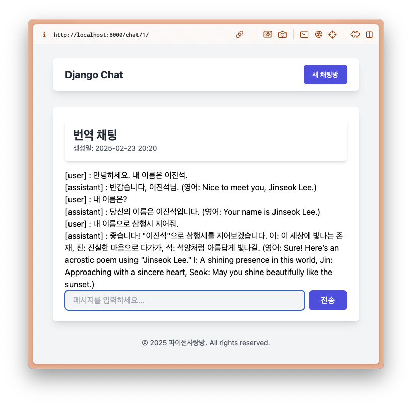

==================================
웹 채팅 UI (HTMX 활용하여 개선)
==================================

.. code-block:: html+django
    :linenos:
    :caption: ``chat/templates/chat/_message_list.html`` 파일 생성

    
        
[{{ message.role }}] : {{ message.content }}

    

.. code-block:: html+django
    :linenos:
    :caption: ``chat/templates/chat/room_detail.html`` 파일 수정
    :emphasize-lines: 12,16-19

    

    
    

        

            <h1 class="text-2xl font-bold text-gray-800">{{ room.name }}</h1>
            
생성일: {{ room.created_at|date:"Y-m-d H:i" }}

        

        

            

                
            

        

        <form hx-post=""
              hx-target="#chat-messages"
              hx-swap="beforeend"
              hx-on::before-request="this.reset()"
              novalidate>
            
            

                <input type="text" name="content" required autocomplete="off" placeholder="메시지를 입력하세요..." autofocus
                    class="flex-1 bg-gray-100 rounded-lg px-4 py-2">
                <button type="submit"
                    class="bg-indigo-600 text-white px-6 py-2 rounded-lg hover:bg-indigo-700 transition-colors duration-300">
                    전송
                </button>
            

        </form>
    

    

.. code-block:: python
    :linenos:
    :caption: ``chat/views.py`` 파일 수정
    :emphasize-lines: 10-15

    def message_new(request, room_pk):
        room = get_object_or_404(Room, pk=room_pk)
        if request.method == "POST":
            form = MessageForm(data=request.POST)
            if form.is_valid():
                message = form.save(commit=False)
                message.room = room
                message.save()
                ai_message = message.create_ai_message()
                # return redirect("chat:room_detail", pk=room_pk)
                return render(
                    request,
                    "chat/_message_list.html",
                    {"message_list": [message, ai_message]},
                )
        else:
            form = MessageForm()

        return render(
            request,
            "chat/message_form.html",
            {
                "room": room,
                "form": form,
            },
        )

