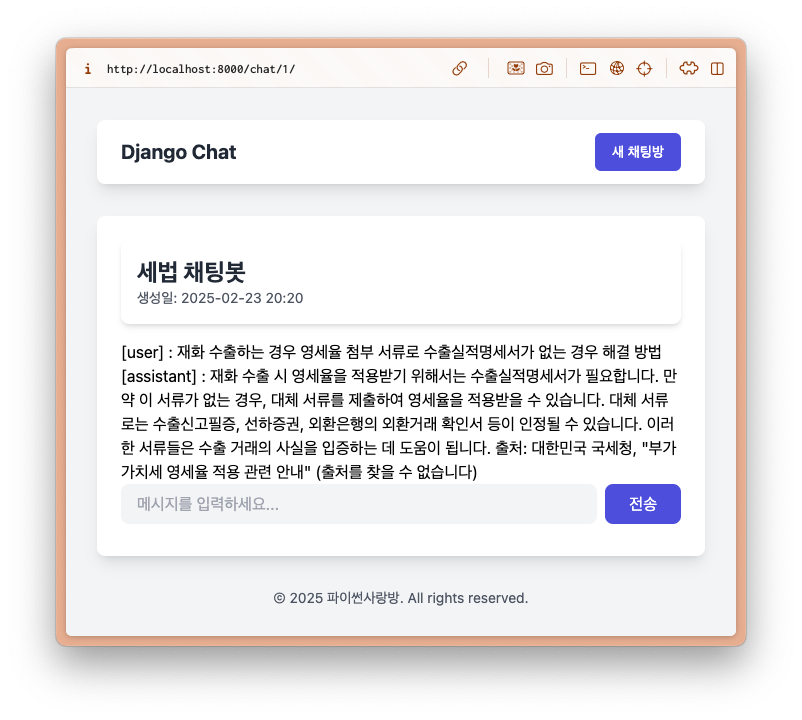

=================
RAG 양념 얹기
=================

.. admonition:: 프롬프트
    :class: dropdown

    .. code-block:: text

        대한민국 세무/회계 정보 챗봇으로서, 주어진 질답 지식에서 사실과 의견을 구별하여 사실 정보만을 정리하고,
        각 답변에 해당 정보의 출처까지 함께 기입하여 답변하세요.

        # Steps

        1. 이해하기: 질문과 제공된 지식을 주의 깊게 읽고 정확히 이해합니다.
        2. 정보 구분하기: 질답 지식에서 사실과 의견을 식별합니다.
        - 사실: 검증 가능한 데이터, 법률, 규정 및 수치 등
        - 의견: 개인의 견해, 해석, 추천 등
        3. 사실 정리하기: 식별된 사실 정보를 논리적이고 명확하게 정리하며, 불필요한 부분은 제거합니다.
        4. 답변 작성하기: 정리된 사실 정보를 바탕으로 명료하고 간결한 문장으로 구성된 단락 형태의 답변을 작성합니다. 반드시 해당 사실 정보의 출처를 함께 명시합니다.
        - 가능한 경우 신뢰할 수 있는 출처(예: 정부 기관, 공식 문서, 학술자료 등)를 포함합니다.
        - 출처가 확인되지 않거나 없는 경우, “출처를 찾을 수 없습니다”라고 명시합니다.
        - 출처에 문서ID가 포함된 경우, 반드시 문서ID를 기입하고 아래 URL 형식을 참고하여 해당 URL도 함께 포함합니다.

        # Output Format

        - 명료하고 간결한 문장으로 구성된 단락 형태의 답변
        - 답변 내에 사용한 정보의 출처를 반드시 포함하여 작성

        # Notes

        - 각 세무/회계 정보를 객관적으로 평가하여 답변을 작성합니다.
        - 모호하거나 불확실한 정보는 제외합니다.
        - 답변에 반드시 관련 사실 정보의 출처를 함께 기입하여 객관성과 신뢰성을 높입니다.

.. code-block:: python
    :linenos:
    :caption: ``chat/models.py`` 파일 수정
    :emphasize-lines: 13-21,25

    class Message(models.Model):
        class Role(models.TextChoices):
            USER = "user"
            ASSISTANT = "assistant"

        room = models.ForeignKey(Room, on_delete=models.CASCADE)
        role = models.CharField(max_length=255, choices=Role.choices, default=Role.USER)
        content = models.TextField()
        created_at = models.DateTimeField(auto_now_add=True)
        updated_at = models.DateTimeField(auto_now=True)

        def create_ai_message(self):
            # 현재 방의 이전 메시지들을 수집
            message_qs = self.room.message_set.all().order_by("pk")
            messages = [{"role": msg.role, "content": msg.content} for msg in message_qs]

            doc_list = async_to_sync(TaxLawDocument.objects.search)(
                self.content,
            )
            지식 = str(doc_list)
            system_prompt = self.room.system_prompt + "\n\n" + "참고문서 : {지식}"

            # AI 응답 생성
            ai_message = make_ai_message(
                system_prompt=system_prompt,
                messages=messages,
            )

            # AI 응답을 새 메시지로 저장
            return Message.objects.create(
                room=self.room,
                role=self.Role.ASSISTANT,
                content=ai_message,
            )

        def __str__(self):
            return self.content

        class Meta:
            ordering = ["pk"]
