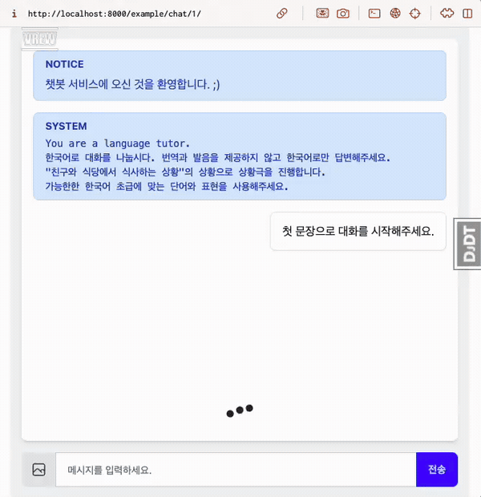
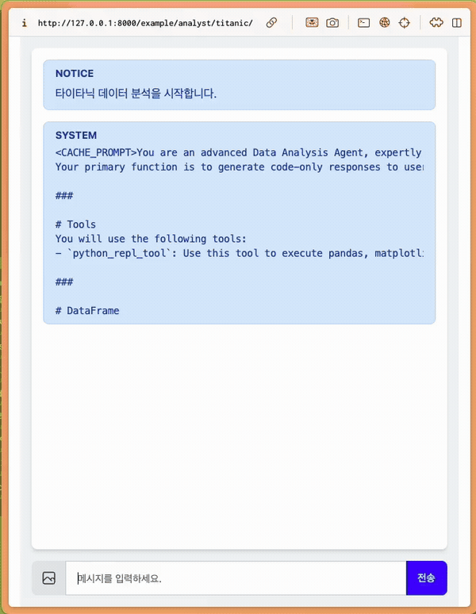

# django-pyhub-ai 튜토리얼

django-pyhub-ai 라이브러리는 장고의 핵심 철학 중 DRY(Don’t Repeat Yourself) 철학을 기반으로 반복적이고 번거로운 작업을 제거하고, 효율적인 에이전트 기반 채팅 서비스를 손쉽게 구축할 수 있도록 돕는 라이브러리입니다.

Streamlit 라이브러리는 LLM(대규모 언어 모델) 기반 웹서비스를 간결하게 구현하기에는 적합하지만, 웹서비스의 전반적인 확장성, 사용자 인증, 권한 관리, 그리고 복잡한 백엔드 로직 처리에는 제약이 있을 수 있습니다. 따라서 Streamlit은 프로토타이핑이나 단순한 웹 애플리케이션 제작에는 유용하지만, 완전한 웹서비스 개발에는 한계가 있습니다.

반면, 장고는 강력한 생태계를 바탕으로 다양한 기능을 제공합니다. django-pyhub-ai는 장고의 이러한 생태계를 활용해 확장성 있고 견고한 에이전트 기반 시스템을 개발할 수 있도록 돕습니다. 예를 들어, 장고의 ORM(Object-Relational Mapping), 사용자 인증 및 권한 관리 시스템, 그리고 REST API 통합 기능은 복잡한 웹서비스의 요구 사항을 충족시키기에 충분합니다.

django-pyhub-ai는 Django 프로젝트에 자연스럽게 통합되며, OpenAI API와 같은 최신 AI 기술을 활용한 기능들을 간단하게 구현할 수 있는 도구들을 제공합니다. 복잡한 설정이나 반복적인 코드를 작성할 필요 없이, 이 라이브러리를 통해 에이전트 채팅 서비스 개발을 더욱 간편하고 직관적으로 만들어보세요.

```{toctree}
:maxdepth: 2
:caption: 목차

quickstart/index
consumers/index
tools/index
courses/index
```

## 튜토리얼 영상

```{raw} html
<div class="video-container">
    <iframe
        src="https://www.youtube.com/embed/10Fp78n3jSw"
        frameborder="0"
        allowfullscreen>
    </iframe>
</div>
```

## 스크린샷

::::{grid} 2
:::{grid-item} LLM 채팅 챗봇 시연

:::
:::{grid-item} 데이터 분석 에이전트 챗봇 시연

:::
::::
