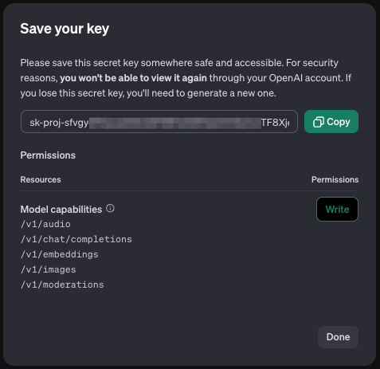
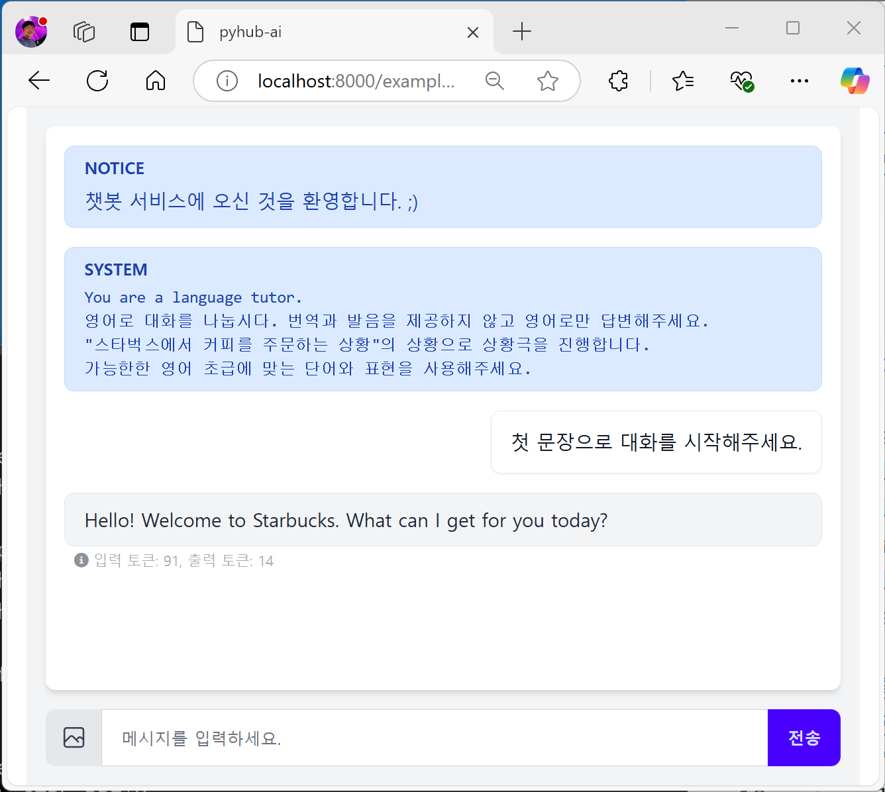
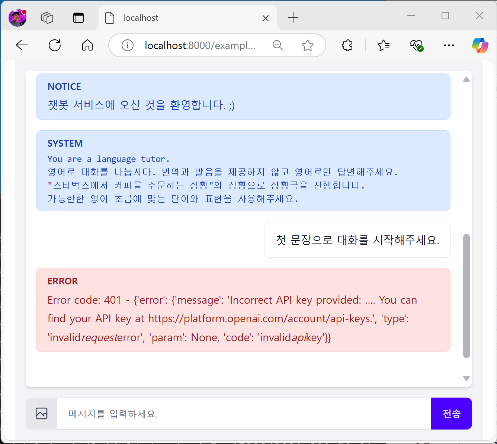

# 첫 LLM 채팅 챗봇 만들기

LLM API를 활용하거나 LLM 에이전트를 만드셨다고 해도, 이를 웹서비스에 접목할려면 백엔드에서는 API 개발이 필요하고 프론트엔드에서는 UI를 구성하고 API 요청을 보내고 응답을 받아 화면에 표시하는 등의 작업이 필요합니다.

본 실습에서는 `django-pyhub-ai` 라이브러리를 활용하여 HTML/CSS/JS 프론트엔드 코드는 일절 없이, 백엔드 코드도 설정에 가까운 코드 만으로 LLM 챗봇을 구현해보겠습니다.

## 튜토리얼 영상

7분 33초부터 시작합니다.
<iframe width="100%" height="500" src="https://www.youtube.com/embed/10Fp78n3jSw?start=453" frameborder="0" allowfullscreen></iframe>

## 이 페이지를 시작하기에 앞서

1. 장고 프로젝트 생성 및 ASGI 활성화가 필요하신 분은 [](basic-setup) 페이지를 참고해서 설정해주세요.
2. `django-pyhub-ai` 라이브러리를 아직 설치 못하신 분은 [](install-django-pyhub-ai) 페이지를 참고해서 설치해주세요.

## 웹소켓 요청도 처리할 준비

현재 장고 프로젝트는 ASGI로 구동되지만, HTTP 요청 만을 지원하고 있습니다. 웹소켓 요청도 처리할 수 있도록 준비를 해보겠습니다.

`mysite/asgi.py` 파일을 열어주세요. 상단 주석은 제거하셔도 됩니다.

```{code-block} python
:caption: mysite/asgi.py

import os

from django.core.asgi import get_asgi_application

os.environ.setdefault('DJANGO_SETTINGS_MODULE', 'mysite.settings')

application = get_asgi_application()
```

이 파일은 ASGI 애플리케이션 구동의 진입점입니다. 위 `application` 객체로부터 장고 애플리케이션이 구동됩니다.

아래와 같이 수정해주세요. `ProtocolTypeRouter`를 통해 HTTP 요청과 웹소켓 요청을 분기해서 처리할 수 있습니다.

```{code-block} python
:caption: mysite/asgi.py
import os

from channels.routing import ProtocolTypeRouter
from django.core.asgi import get_asgi_application

os.environ.setdefault('DJANGO_SETTINGS_MODULE', 'mysite.settings')

django_asgi_app = get_asgi_application()

application = ProtocolTypeRouter({
    "http": django_asgi_app,
    # "websocket": ...  # example 앱을 통해 추가할 예정
})
```

## example 앱 생성하고 활성화하기

채팅 페이지를 만들기 위해 `example` 앱을 생성합니다.

```shell
python manage.py startapp example
```

생성하신 앱은 반드시 `mysite/settings.py` 파일의 `INSTALLED_APPS` 리스트에 추가하셔야만, 현재 장고 프로젝트에 등록되고 장고 앱으로서 대접을 받을 수 있습니다.

```{code-block} python
:caption: mysite/settings.py

INSTALLED_APPS = [
    ...
    'example',
]
```

`example` 앱 내에는 `urls.py` 파일이 없습니다. `example/urls.py` 파일에 아래 코드를 적용해주세요.

```{code-block} python
:caption: example/urls.py

from django.urls import path
from . import views

urlpatterns = []
```

현 장고 프로젝트의 ROOT URL 설정인 `mysite/urls.py`가 아래와 같이 있습니다.

```{code-block} python
:caption: mysite/urls.py

from django.contrib import admin
from django.urls import path

urlpatterns = [
    path('admin/', admin.site.urls),
]
```

아래와 같이 `example.urls`를 포함하도록 수정해주세요. 그리고 최상위 URL로 접근했을 때 `example/`로 페이지 이동하도록 설정해줍니다.

```{code-block} python
:caption: mysite/urls.py

from django.contrib import admin
from django.urls import path, include
from django.views.generic import RedirectView

urlpatterns = [
    path('admin/', admin.site.urls),
    path('example/', include('example.urls')),
    path('', RedirectView.as_view(url='/example/')),
]
```

## OpenAI API Key 얻기

현재 `django-pyhub-ai` 라이브러리에서는 OpenAI API 만을 지원합니다. OpenAI 대시보드의 [API Keys 페이지](https://platform.openai.com/api-keys)에서 "Create new secret key"를 클릭해 API Key를 생성해주세요. API KEY 생성 시에 권한을 세부 설정하실 수 있는 데요. 본 실습을 위해서는 API KEY 권한(Permissions)은 최소한 `Model capabilities`는 있어야 합니다.



생성된 API Key를 복사해서 메모장에 임시 보관해주시구요. 생성된 API Key는 절대 소스코드에 포함시키지 마세요. 실수로라도 커밋하시고 github에 올리시게 되면 API Key가 유출되는 보안 사고가 발생할 수 있습니다.

## OpenAI API Key 환경변수로 등록하기

API Key 등의 민감한 정보는 소스코드에 포함시키지 않는 것이 좋습니다. 일반적으로 환경변수에 등록하고 프로그램에서는 환경변수를 읽어 사용합니다.

환경변수로 등록하는 방법은 여러 가지가 있습니다. 본 실습에서는 `.env` 파일을 사용하는 방법을 설명하겠습니다.

`c:/work/myproj` 경로에 `.env` 파일을 생성해서 `OPENAI_API_KEY` 이름으로 저장해주세요.

```text
OPENAI_API_KEY=sk-proj-생략AA
```

등호(=) 앞 뒤로 띄워쓰기를 하지 않도록 주의해주세요. 띄워쓰기를 하시면 해당 값은 환경변수로서 등록되지 않고 무시됩니다.

`.env` 파일은 절대 커밋되지 않아야 합니다. 실수로라도 커밋되지 않도록 `.gitignore` 파일에 .env 패턴을 지금 등록해주세요.

```text
.env
```

```{note}
마침표로 시작하는 `.env` 파일명은 다소 낯설게 느껴질 수 있습니다. 리눅스 환경에서는 파일명이 마침표(.)로 시작하면 해당 파일울 숨김 파일로 인식합니다. 개발 환경에서는 이러한 특징을 활용하여 설정 파일의 이름을 마침표(.)로 시작하는 방식이 관습적으로 많이 사용되고 있습니다.
```

## `.env` 파일 로딩하기

장고 기본에서는 `.env` 파일 로딩을 지원하지 않습니다. `django-environ` 라이브러리를 활용하겠습니다. 라이브러리를 먼저 설치해주시구요.

```shell
python -m pip install django-environ
```

`mysite/settings.py` 코드를 열어 최상단으로 이동해주세요. `.env` 파일을 로딩하는 코드를 추가해주겠습니다.

```{code-block} python
:caption: mysite/settings.py

from pathlib import Path
BASE_DIR = Path(__file__).resolve().parent.parent
# 나머지 기존 코드 생략
```

아래와 같이 `.env` 경로를 계산하고, `.env` 경로에 파일이 있을 때 환경변수로서 로딩토록 합니다. `overwrite=True` 옵션은 기존 환경변수를 덮어쓰는 옵션입니다. 이를 지정하지 않는다면 `.env` 파일에 환경변수를 명시했다하더라도 같은 이름의 환경변수가 이미 등록되어있는 경우 덮어쓰지 않고 무시됩니다.

```{code-block} python
:caption: mysite/settings.py

from pathlib import Path
from environ import Env
BASE_DIR = Path(__file__).resolve().parent.parent
env_path = BASE_DIR / '.env'

env = Env()

if env_path.is_file():
    env.read_env(env_path, overwrite=True)

# 나머지 기존 코드 생략
```

## `OPENAI_API_KEY` 환경변수 읽어서 settings에 저장하기

그리고 `mysite/settings.py` 코드 끝에 아래와 같이 환경변수를 읽어오는 코드를 추가해주세요.

```python
OPENAI_API_KEY = env.str("OPENAI_API_KEY")
```

`python manage.py runserver` 개발서버가 오류없이 수행 중인지 터미널을 확인해주세요.

`env.str("OPENAI_API_KEY")` 코드는 지정 환경변수가 없다면 `django.core.exceptions.ImproperlyConfigured: Set the OPENAI_API_KEY environment variable` 에러를 발생시키며 개발서버가 종료됩니다. `.env` 파일에 지정한 `OPENAI_API_KEY` 환경변수 이름에 오타는 없는 지 확인해주세요. 미심쩍으면 `OPENAI_API_KEY` 환경변수 이름을 복사해서 적용하시고, 꼭 저장해주세요.

```{caution}
많은 분들이 소스코드를 변경하시고나서 저장(Save)하지 않으시는 경우가 많습니다. 소스코드를 변경하셨다면 반드시 저장(Save)해주세요.
저장하지 않으시면 변경하신 내용으로 프로그램이 동작하지 않습니다.
Visual Studio Code에서는 File 메뉴에 "모두 저장 (Save All)" 메뉴가 있습니다. 수정된 모든 파일을 일괄 저장하는 메뉴입니다. 단축키를 꼭 기억하시고 사용하세요.

+ 윈도우 : `Ctrl + M` `S`
+ 맥 : `Option + Cmd + S`
```

```{tip}
`OPENAI_API_KEY` 환경변수가 정의되어있지 않더라도, 오류없이 동작토록 하실려면 아래와 같이 디폴트 값을 지정해주세요. 그럼 해당 환경변수가 없어도 오류없이 디폴트 값으로 동작합니다.

    OPENAI_API_KEY = env.str("OPENAI_API_KEY", default=None)
```

다시 개발서버 터미널을 확인해주시구요. 개발 서버가 중단되어있다면 `python manage.py runserver` 명령으로 개발서버를 다시 구동해주세요.

## LLM 채팅 요청을 처리할 Consumer 구현하기

이제 LLM 채팅 웹소켓 요청을 처리할 Consumer를 구현해보겠습니다.
`pyhub_ai.consumers` 모듈에서 `AgentChatConsumer`를 상속받아 LLM 채팅을 설정에 가까운 코드로 손쉽게 구현할 수 있습니다.

`AgentChatConsumer`는 아래 3가지 방법 중 하나로 `OPENAI_API_KEY`를 설정하실 수 있습니다.

+ 1순위) `AgentChatConsumer` 클래스의 `llm_openai_api_key` 속성
+ 2순위) settings의 `OPENAI_API_KEY` 설정 : 우리가 사용할 방법
+ 3순위) 환경변수 `OPENAI_API_KEY`

아래 코드를 `example/consumers.py` 경로에 복사해주세요. `settings.OPENAI_API_KEY`를 활용하여 동작할 것입니다. 각 Consumer 마다 다른 `OPENAI_API_KEY`를 사용하고 싶다면 `AgentChatConsumer` 클래스의 `llm_openai_api_key` 속성을 활용하시면 됩니다.

```{code-block} python
:caption: example/consumers.py

from pyhub_ai.consumers import AgentChatConsumer
from pyhub_ai.specs import LLMModel

class LanguageTutorChatConsumer(AgentChatConsumer):
    llm_model = LLMModel.OPENAI_GPT_4O
    llm_temperature = 1
    llm_system_prompt_template = """
You are a language tutor.
{언어}로 대화를 나눕시다. 번역과 발음을 제공하지 않고 {언어}로만 답변해주세요.
"{상황}"의 상황으로 상황극을 진행합니다.
가능한한 {언어} {레벨}에 맞는 단어와 표현을 사용해주세요.
    """
    llm_first_user_message_template = "첫 문장으로 대화를 시작해주세요."
    llm_prompt_context_data = {
        "언어": "영어",
        "상황": "스타벅스에서 커피를 주문하는 상황",
        "레벨": "초급",
    }

    # 로그인 여부에 상관없이, 웹소켓 접속을 허용하기
    async def can_accept(self) -> bool:
        return True
```

`AgentChatConsumer`에서는 디폴트 설정으로 유저가 로그인된 상황에서만 웹소켓 접속을 허용합니다.
지금은 간단한 구현을 위해 비로그인 상황에서도 웹소켓 접속을 허용하겠구요.
`can_accept` 메서드를 재정의하여 `True`를 반환토록 했습니다.

## Routing을 통해 Consumer 연결하기

장고 View가 `urls.py`를 통해 URL 매핑하듯이, Consumer도 `example/routing.py` 파일을 통해 URL 매핑을 해주어야 합니다. 아래 코드를 `example/routing.py` 경로에 복사해주세요.

```{code-block} python
:caption: example/routing.py

from django.urls import path
from .consumers import LanguageTutorChatConsumer

websocket_urlpatterns = [
    path("ws/example/chat/language-tutor/", LanguageTutorChatConsumer.as_asgi()),
]
```

`urls.py` 에서는 반드시 `urlpatterns` 이름의 리스트를 정의해야만 하지만,
`routing.py` 에서는 반드시 `websocket_urlpatterns` 이름이어야하는 것은 아닙니다.
다른 이름을 쓸 수도 있지만 관습적으로 `websocket_urlpatterns` 이름을 사용합니다.

## 최상위 라우터에 등록하기

`example/routing.py` 내역은 자동으로 등록되지 않습니다. `mysite/asgi.py` 파일에 직접 등록해주셔야 합니다.

`mysite/asgi.py` 파일은 현재 아래와 같구요.

```{code-block} python
:caption: mysite/asgi.py

import os

from channels.routing import ProtocolTypeRouter
from django.core.asgi import get_asgi_application

os.environ.setdefault('DJANGO_SETTINGS_MODULE', 'mysite.settings')

django_asgi_app = get_asgi_application()

application = ProtocolTypeRouter({
    "http": django_asgi_app,
    # "websocket": ...
})
```

아래와 같이 수정해주세요.

+ `AuthMiddlewareStack`를 통해 웹소켓 요청 처리 시에 쿠키/세션/인증 처리를 지원합니다.
+ `URLRouter`를 통해 URL 매핑을 지원합니다.

```{code-block} python
:caption: mysite/asgi.py

import os

from channels.routing import ProtocolTypeRouter, URLRouter
from channels.auth import AuthMiddlewareStack
from django.core.asgi import get_asgi_application
from example.routing import websocket_urlpatterns

os.environ.setdefault('DJANGO_SETTINGS_MODULE', 'mysite.settings')

django_asgi_app = get_asgi_application()

application = ProtocolTypeRouter({
    "http": django_asgi_app,
    "websocket": AuthMiddlewareStack(URLRouter(websocket_urlpatterns)),
})
```

이제 HTML 페이지를 통해 웹소켓 요청을 보내면 챗봇 페이지를 사용할 수 있습니다.

## 챗봇 페이지 구현하기

챗봇 페이지 템플릿은 HTMX 기반으로 구현된 `pyhub_ai/chat_room_ws.html` 템플릿을 제공해드립니다. View 내에서 `ws_url` 값으로만 웹소켓 주소만 지정해주시면 기본 동작합니다. `example/routing.py` 파일에 명시한 웹소켓 주소를 참고해주세요. URL은 절대 주소로 지정하므로 웹소켓 주소를 슬래시(/)로 시작토록 합니다.

```{code-block} python
:caption: example/views.py

from django.shortcuts import render


def language_tutor_chat(request):
    return render(request, "pyhub_ai/chat_room_ws.html", {
        "ws_url": "/ws/example/chat/language-tutor/",
    })
```

웹소켓 접속 프로토콜은 `ws://` 혹은 `wss://`를 사용하는 데요. http 서버와 웹소켓 서버가 같은 호스트일 경우, HTMX 라이브러리에서는 `ws://`, `wss://` 프로토콜을 자동으로 붙여주므로 별도로 지정해주지 않아도 됩니다.

```{code-block} python
:caption: example/urls.py

from django.urls import path
from . import views

urlpatterns = [
    path("chat/language-tutor/", views.language_tutor_chat),
]
```

이제 웹브라우저를 열어, [http://localhost:8000/example/chat/language-tutor/](http://localhost:8000/example/chat/language-tutor/) 경로로 접속해주세요. 아래와 같이 LLM으로부터 첫 인사를 받으시면 성공입니다!!! 🥳



혹시 아래와 같이 OpenAI API Key 에러가 발생하시면, `.env` 파일에 지정한 `OPENAI_API_KEY` 환경변수 이름에 오타가 없는 지 확인해주시고, `mysite/settings.py` 파일에 지정한 `OPENAI_API_KEY` 환경변수 이름에 오타가 없는 지 확인해주세요.



프론트엔드 코드 하나 없이 LLM 챗봇 페이지를 구현했습니다. ;-)

이제 데이터 분석 에이전트 챗봇을 구현해보겠습니다.
