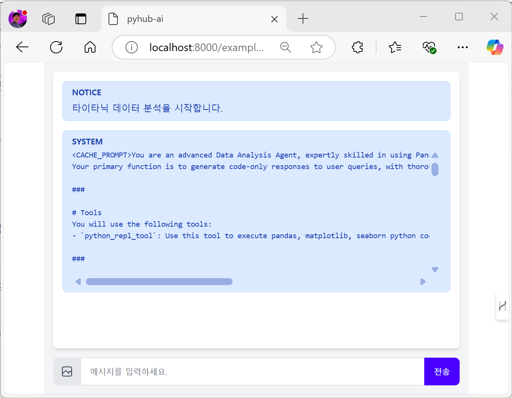
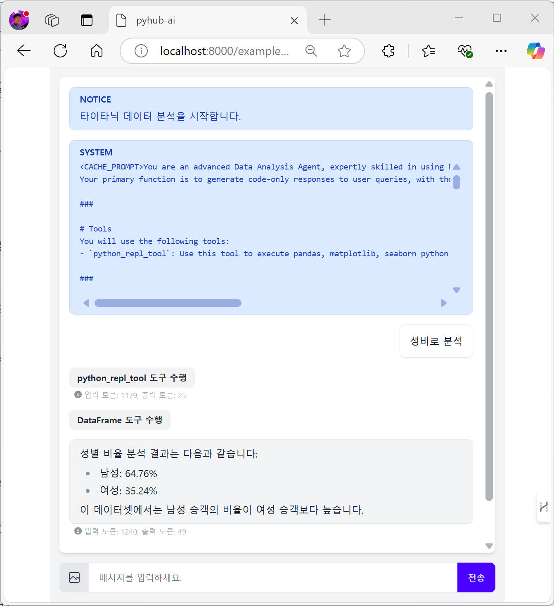
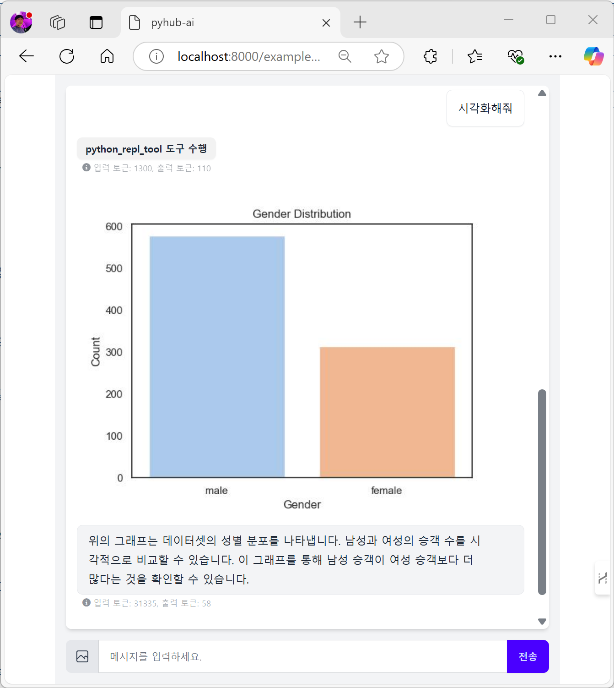

# 첫 데이터 분석 에이전트 챗봇

## 시작하기 전에

[첫 LLM 채팅 챗봇 만들기](first-chat-bot) 실습은 어떠셨나요?

챗봇 웹서비스 개발에 있어 반복적인 부분은 `AgentChatConsumer`를 통해 누리셨구요. 여러분은 여러분의 챗봇에 있어서 꼭 필요한 부분만 설정에 가까운 코드로 구현하셨습니다. 챗봇 설정은 클래스 변수로서 정적으로 설정했었지만, `get_속성명` 메서드도 지원되기에 동적으로 데이터베이스 기반으로 동작토록 구현하실 수도 있습니다. 장고의 클래스 기반 뷰 (Class based view) 컨셉과 같습니다. 데이터베이스 연동 부분은 차차 살펴보겠습니다.

앞선 실습에서의 핵심 코드는 웹소켓 연결을 처리하는 Consumer였습니다. 그 외 라우팅은 단지 URL만 연결해줄 뿐이었구요. 챗봇 페이지는 `pyhub_ai/chat_room_ws.html` 템플릿만 렌더링하면서 `ws_url` 값만 지정해주면 동작했었습니다. 물론 챗봇 페이지 템플릿도 커스터마이징 가능합니다.

```python
# example/consumers.py

from pyhub_ai.consumers import AgentChatConsumer
from pyhub_ai.specs import LLMModel

class LanguageTutorChatConsumer(AgentChatConsumer):
    llm_model = LLMModel.OPENAI_GPT_4O
    llm_temperature = 1
    llm_system_prompt_template = """
You are a language tutor.
{언어}로 대화를 나눕시다. 번역과 발음을 제공하지 않고 {언어}로만 답변해주세요.
"{상황}"의 상황으로 상황극을 진행합니다.
가능한한 {언어} {레벨}에 맞는 단어와 표현을 사용해주세요.
    """
    llm_first_user_message_template = "첫 문장으로 대화를 시작해주세요."
    llm_prompt_context_data = {
        "언어": "영어",
        "상황": "스타벅스에서 커피를 주문하는 상황",
        "레벨": "초급",
    }

    # 로그인 여부에 상관없이, 웹소켓 접속을 허용하기
    async def can_accept(self) -> bool:
        return True
```

이번 실습에서는 첫 데이터 분석 에이전트 챗봇을 구현해보겠습니다. 데이터 분석 에이전트도 Consumer만 구현해주시고, 라우팅 연결과 챗봇 페이지 화면만 만들어주시면 동작합니다.

## Consumer 구현

`pyhub_ai.consumers` 팩키지는 다음 2개의 Consumer를 지원합니다.

+ `AgentChatConsumer` : LLM 에이전트 챗봇
    - LLM 속성 변경 만으로 다양한 챗봇을 찍어낼 수 있습니다.
+ `DataAnalystChatConsumer` : 데이터 분석 에이전트 챗봇
    - AgentChatConsumer를 상속받아 구현되었기에 LLM 관련 속성과 메서드를 모두 지원합니다.
    - Pandas를 통한 데이터 분석 기능과 matplotlib/seaborn 기능의 그래프 출력 기능을 제공합니다.

그럼 `DataAnalystChatConsumer`를 상속받아 `TitanicDataAnalystChatConsumer` 클래스를 구현해보겠습니다.

+ `llm_system_prompt_path` 속성
    - 데이터 분석을 위한 시스템 프롬프트가 78줄로 꽤 깁니다. 그래서 `example/prompts/data-analyst-v02-en.yaml` 경로에 시스템 프롬프트를 저장하고 상대경로를 지정하여 로딩토록 구현했습니다.
    - 매 웹소켓 연결이 맺어질 때마다 동적으로 시스템 프롬프트를 지정하실려면 `get_llm_system_prompt` 메서드를 구현해주세요.
    - 이 파일은 제가 [gist에 올려둔 페이지](https://gist.github.com/allieus/4df0933815c0437ed3e77ea3ffe592bd#file-data-analyst-v02-en-yaml)에서 다운받으실 수 있습니다. 복사해서 `example` 앱의 `prompts/data-analyst-v02-en.yaml` 경로에 저장해주세요.
+ `dataframe_path` 속성
    - 데이터 분석에 사용할 데이터프레임 파일 경로를 지정합니다.
    - 절대경로로 지정하실 수 있구요. 상대경로로 지정하실 경우, 현재 프로젝트에 활성화된 모든 "장고앱/" 경로에서 파일을 찾습니다. 장고 템플릿/static 파일처럼 다른 앱과 상대경로명이 중복되지 않게 주의해주세요. 우선순위에 따라 어느 한 파일만 로딩됩니다.
    - 매 웹소켓 연결이 맺어질 때마다 동적으로 데이터프레임을 로딩하실려면 `get_dataframe` 메서드를 구현해주세요.
    - 이 파일은 제가 [gist에 올려둔 페이지](https://gist.github.com/allieus/4df0933815c0437ed3e77ea3ffe592bd#file-titanic-csv)에서 다운받으실 수 있습니다. 복사해서 `example` 앱의 `data/titanic.csv` 경로에 저장해주세요.
+ `column_guideline` 속성
    - `data-analyst-v02-en.yaml` 프롬프트에서는 컬럼 가이드라인을 받도록 설계되어있습니다. 이에 데이터의 컬럼 가이드라인을 지정해줍니다.
    - 매 웹소켓 연결이 맺어질 때마다 동적으로 컬럼 가이드라인을 지정하실려면 `get_column_guideline` 메서드를 구현해주세요.

```python
# example/consumers.py

from pyhub_ai.consumers import DataAnalystChatConsumer

class TitanicDataAnalystChatConsumer(DataAnalystChatConsumer):
    llm_model = LLMModel.OPENAI_GPT_4O
    llm_temperature = 0
    llm_system_prompt_path = "prompts/data-analyst-v02-en.yaml"
    dataframe_path = "data/titanic.csv"
    column_guideline = """
PassengerId: 승객 번호
Survived: 생존 여부 (0: 사망, 1: 생존)
Pclass: 승객 클래스 (1: 1등석, 2: 2등석, 3: 3등석)
Name: 이름
Sex: 성별
Age: 나이
SibSp: 형제 또는 배우자 수
    """
    welcome_message_template = "<span class='font-bold'>타이타닉 데이터 분석</span>을 시작합니다."

    # 로그인 여부에 상관없이, 웹소켓 접속을 허용하기
    async def can_accept(self) -> bool:
        return True
```

이 Consumer 구현이 "데이터 분석 에이전트 챗봇" 구현에서 가장 어려운 부분이었구요.
나머진 연결만 시켜주시면 데이터 분석 에이전트 챗봇 구현 끝입니다.

```python
# example/routing.py 에 추가
path("ws/example/analyst/titanic/", TitanicDataAnalystChatConsumer.as_asgi()),
```

위 웹소켓 연결 주소와 맞춰 장고 뷰 함수를 구현해주세요.

```python
# example/urls.py 에 추가

path("analyst/titanic/", views.titanic_data_analyst_chat, name="analyst-titanic"),
```

뷰 함수도 이전 `language_tutor_chat` 뷰 함수와 `ws_url` 값만 다를 뿐, 그 외 코드는 동일합니다.

```python
# example/views.py 에 추가

def titanic_data_analyst_chat(request):
    return render(request, "pyhub_ai/chat_room_ws.html", {
        "ws_url": "/ws/example/analyst/titanic/",
    })
```

이제 웹브라우저를 열어, [http://localhost:8000/example/analyst/titanic/](http://localhost:8000/example/analyst/titanic/) 경로로 접속해주세요. 오류없이 시스템 프롬프트 안내가 출력되면 성공입니다!!! 🥳



"성비로 분석" 해보시면 데이터 분석이 되구요. 각 도구를 클릭하시면 수행된 코드와 생성된 데이터프레임 내용도 확인하실 수 있습니다.



"시각화 해줘" 라고도 명령해보세요. 아래처럼 시각화 이미지도 잘 생성해줍니다. ;-)



## 마치며

첫 데이터 분석 에이전트 챗봇 구현을 마칩니다.

어떠셨나요? 간단한 감상이나 의견을 아래 댓글로 남겨주시면 저에게 큰 힘이 됩니다.

적극 반영해서, `django-pyhub-ai` 라이브러리도 발전시키고, 더 많은 LLM 에이전트 예시도 만들어보겠습니다.

앞으로 많은 응원 부탁드리구요. 주변에도 많이 알려주세요. ;-)
