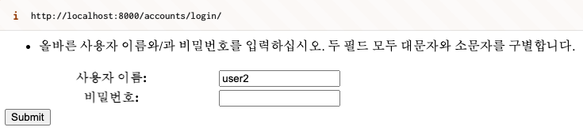

# 인증 구현하기

채팅 기록 모델인 `pyhub_ai.models.ConversationMessage` 모델 클래스는 유저 모델에 대한 외래키를 가지므로, 채팅 기록 저장을 위해서는 반드시 로그인 과정이 필요합니다.

```{eval-rst}
.. autoclass:: pyhub_ai.models.ConversationMessage
    :members:
    :special-members: _meta
    :noindex:
```

## `django.contrib.auth` 기본 앱 활용하기

장고에서는 `django.contrib.auth` 기본 앱을 통해 회원가입/로그인/로그아웃/프로필/암호변경/암호재설정 기능을 바로 가져다쓸 수 있을 정도로 지원해주고 있습니다.

또한, `django.contrib.auth`는 보안적인 고려도 충분히 되어 제공됩니다.

- **비밀번호 해싱**: 사용자의 비밀번호는 `PBKDF2`(기본값), `Argon2`, `BCrypt`, `SHA-1` 등의 강력한 해시 알고리즘을 사용하여 저장됩니다.
- **비밀번호 검증 정책**: `settings.AUTH_PASSWORD_VALIDATORS` 설정을 통해 최소 길이, 숫자 포함 여부, 이전 비밀번호 재사용 제한 등의 정책을 적용할 수 있습니다.
- **세션 기반 인증 및 CSRF 보호**: Django의 `SessionMiddleware`와 `CSRF`(Cross-Site Request Forgery) 방어 기능이 자동으로 적용됩니다.
- **사용자 권한 및 그룹 관리**: 기본적으로 `User` 모델과 `Permission` 모델이 제공되며, 세분화된 권한 관리를 쉽게 설정할 수 있습니다.
- **OAuth 및 소셜 로그인 확장**: `django-allauth` 같은 패키지를 통해 Google, Facebook, GitHub 등의 소셜 로그인 기능을 간편하게 추가할 수 있습니다.
- **이메일 기반 비밀번호 재설정**: Django의 내장 `PasswordResetView`를 활용하면 이메일을 통한 안전한 비밀번호 재설정 기능을 구현할 수 있습니다.

이처럼 `django.contrib.auth`는 인증과 권한 관리뿐만 아니라 보안적인 측면에서도 강력한 보호 기능을 제공하여 안전한 사용자 인증 시스템을 구축할 수 있도록 지원합니다.

## 마이그레이션 수행

현재 프로젝트에 활성화된 장고 앱에 대한 데이터베이스 테이블 생성하지 않으셨다면 아래 명령으로 데이터베이스 테이블을 생성해주세요. 디폴트 설정으로 프로젝트 루트의 `db.sqlite3` 경로에 `sqlite3` 데이터베이스입니다.

```{code-block} shell
# 가상환경을 먼저 활성화하신 후에, 아래 명령을 수행해주세요.

# 마이그레이션 적용 현황 출력하기 (데이터베이스 테이블 생성 현황)
python manage.py showmigrations
# 마이그레이션 수행 (미수행 마이그레이션을 순차적으로 적용합니다. 여러 번 수행하시더라도 괜찮습니다.)
python manage.py migrate
```

## `accounts` 앱 생성 및 활성화

`django.contrib.auth` 앱을 바로 쓰기보다, `accounts` 이름의 장고 앱을 생성하고, 이를 통해 `django.contrib.auth` 앱의 기능들을 커스터마이징해서 인증을 구현해보겠습니다.

장고에서 디폴트 로그인 주소가 `/accounts/login/` 이므로 이 URL을 따라서 앱 이름을 정했습니다.

먼저 `manage.py` 파일이 있는 프로젝트 루트에서 아래의 명령으로 `accounts` 앱을 생성해주세요.

```{code-block} shell
# 가상환경을 먼저 활성화하신 후에, 아래 명령을 수행해주세요.
python manage.py startapp accounts
```

그럼 `accounts` 폴더가 생성됩니다. `accounts/urls.py` 경로에 아래 내용으로 새 파일을 생성해주세요. 장고에서는 장고 앱 별로 View 구현이 있구요. 장고 앱 별로 URL 패턴 설정도 따로 둡니다.

```{code-block} python
:caption: accounts/urls.py 파일 생성

from django.urls import path
from . import views

urlpatterns = []
```

각 장고 앱은 현재 장고 프로젝트에 활성화되어야만 장고 앱으로서 대접을 받아 모델/admin/templates/static 등이 자동으로 탐지됩니다. `accounts` 앱을 현재 장고 프로젝트에 활성화하기 위해 `settings.INSTALLED_APPS` 리스트에 `"accounts",` 앱 이름을 추가해주세요.

```{code-block} python
:caption: mysite/settings.py

INSTALLED_APPS = [
    # ...
    "accounts",
]
```

```{admonition} Tip
:class: Tip

파이썬 리스트에서는 각 항목 끝에 콤마(,)를 꼭 넣어주세요. 그래야만 위/아래 앱 이름 문자열과 연결되지 않습니다. (파이썬 문법 특성)
```

`accounts` 앱이 프로젝트에 등록되어 활성화되더라도 `accounts/urls.py` 파일은 자동으로 프로젝트 URL 패턴으로 등록되지 않습니다. 아래와 같이 최상위 URL 패턴인 `mysite/urls.py` 의 `urlpatterns` 리스트에 `accounts.urls`를 추가해주세요.

```{code-block} python
:caption: mysite/urls.py

urlpatterns = [
    # ...
    path("accounts/", include("accounts.urls")),
]
```

그럼 `accounts` 활성화 과정은 끝났습니다. 회원가입부터 차근차근 구현해보실까요? ;-)

## 회원가입 구현하기

회원가입 과정은 새로운 포스팅을 작성하는 과정과 새로운 댓글을 작성하는 과정과 프로세스가 똑같습니다. 입력받는 필드와 저장되는 모델이 다를 뿐입니다.

+ 새로운 포스팅을 작성하는 과정은 제목과 내용을 입력받아 제목/내용 값에 대한 유효성 검사를 한 뒤에 유효성 검사를 통과하면 포스팅 모델을 통해 데이터베이스에 저장하구요.
+ 새로운 댓글을 작성하는 과정은 댓글 내용을 입력받아 내용 값에 대한 유효성 검사를 한 뒤에 유효성 검사를 통과하면 댓글 모델을 통해 데이터베이스에 저장합니다.
+ 회원가입 과정은 유저명과 암호를 입력받아 유저명/암호 값에 대한 유효성 검사를 한 뒤에 유효성 검사를 통과하면 유저 모델을 통해 데이터베이스에 저장합니다.

`django.contrib.auth` 앱에서는 기본 유저 모델로서 `User` 모델을 지원해주구요. 새로운 유저 생성 입력 폼을 위한 `UserCreationForm` 장고 폼 클래스도 지원해줍니다. [`UserCreationForm` 클래스는 `User` 모델에 대한 모델폼](https://github.com/django/django/blob/main/django/contrib/auth/forms.py#L265)입니다. `UserCreationForm`를 활용하면 새로운 유저 생성 입력 폼 HTML 생성부터 입력값에 대한 유효성 검사, 그리고 데이터베이스 저장까지 모두 한 번에 지원해주어 편리합니다.

`UserCreationForm`을 직접 사용하지 않고, 이를 상속받은 `SignupForm` 클래스를 정의하여 추후에 회원가입 폼을 빠르게 커스터마이징할 수 있도록 하겠습니다. 입력 폼 필드를 추가할 수도 있고, 입력 위젯을 변경할 수도 있고, 유효성 검사 로직도 추가할 수 있습니다.

```{code-block} python
:caption: accounts/forms.py

from django.contrib.auth.forms import UserCreationForm

class SignupForm(UserCreationForm):
    pass
```

장고에서는 모델폼을 활용한 View 구현에서는 `CreateView` 클래스 기반 뷰를 활용하시면 편리합니다. 장고에서는 함수 기반 뷰 (FBV, Function Based View)와 클래스 기반 뷰 (CBV, Class Based View)가 지원되며, 모든 View는 기본적으로 함수입니다. `CBV`는 재사용성을 목적으로 함수 View 생성기의 역할을 합니다.

새 포스팅 생성 폼, 새 댓글 생성 폼, 새 리뷰 생성 폼 등에서 다음 설정만 달리 주고, 똑같이 `CreateView`를 활용하실 수 있습니다.

+ `form_class` : 입력 폼 HTML 렌더링 및 입력 값 유효성 검사 및 데이터 저장을 담당할 폼 클래스를 지정합니다. 대개 `Form`이 아닌 `ModelForm`을 지정하면 모델 클래스 지정 만으로 손쉽게 데이터베이스 저장을 지원할 수 있어 편리합니다.
+ `template_name` : 뷰에서 HTML 응답을 생성할 때 사용할 템플릿 경로를 지정합니다. 장고 폼을 사용할 경우 폼 필드 정의는 폼 클래스를 통해서 이뤄지고, 템플릿에서는 폼 필드 관련 코드가 없습니다. 그래서 템플릿은 여러 폼에 걸쳐서 재사용될 수 있습니다.
+ `success_url` : 폼 입력값에 대한 유효성 검사에 통과하면 그 값을 데이터베이스에 저장합니다. 그 후에 대개 현재 입력 폼 페이지에 머물러있지 않고, 다른 페이지로 이동을 하죠. 새로운 포스팅이 생성되면, 생성된 포스팅 페이지을 조회할 수 있는 페이지로 이동을 하는 것은 자연스럽습니다. `success_url` 설정에는 이동할 URL 주소 문자열을 지정합니다. 아직 로그인 페이지는 구현하지 않았지만, 회원가입을 하면 로그인 페이지로 이동토록 설정해주겠습니다.

```{code-block} python
:caption: accounts/views.py

from django.views.generic import CreateView
from .forms import SignupForm

# CBV 의 .as_view() 클래스 메서드는 View 함수를 생성/반환합니다.
# 즉 signup는 생성된 함수 View 입니다.
signup = CreateView.as_view(
    form_class=SignupForm,
    template_name="form.html",
    success_url="/accounts/login/",
)
```

```{admonition} 파이썬/장고 코드에서 모든 URL 계산은 URL Reverse 기능을 활용하여야 합니다.
:class: Tip

장고 앱은 여러 장고 프로젝트에 의해 사용될 수 있구요. 장고 앱은 사용되어지는 프로젝트에 따라 다른 URL Prefix 주소를 가질 수 있습니다. URL 문자열 주소는 언제든 변경될 수 있는 거죠.

매번 번거롭게 개발자가 모든 View에 대한 URL 문자열과 패턴들을 기억하고 일일이 조합하실 필요가 전혀 없습니다. URL 문자열 조합에서 실수할 여지가 있고 실수하더라도 이를 빠르게 인지하기 어렵습니다.
URL 패턴명과 인자를 지정하면, 장고의 URL Reverse 기능을 통해 자동으로 URL 문자열을 조합해주고, URL 문자열 조합에 실패하면 그 즉시 서버 오류로서 확인할 수 있기에, 실수를 빠르게 인지할 수 있습니다.

`"/accounts/login/"` 문자열은 `reverse_lazy("accounts:login")`을 통해 안전하고 확실한 방법으로 URL 문자열을 생성할 수 있습니다.
이 외에도 `reverse`, `resolve_url`, 그리고 `` 템플릿 태그를 통해 URL Reverse가 지원됩니다.

장고 처음에는 URL Reverse를 쓰지 않으시더라도, 장고 초급을 벗어나실 때에는 꼭 URL Reverse를 활용하시길 적극 추천드립니다.
```

장고 폼 템플릿은 다른 폼에 의해서도 재사용될 수 있도록, 아래와 같이 템플릿을 구성하겠구요. 여러 장고 앱에서 의해서 두루 두루 사용할 것이기에 특정 `장고앱/templates` 경로가 아닌 `templates/form.html` 경로에 생성하겠습니다.

```{code-block} django
:caption: templates/form.html

<form action="" method="post" enctype="multipart/form-data">
    
    <table>
        {{ form.as_table }}
    </table>
    <input type="submit" />
</form>
```

특정 장고 앱 내에서만 사용되어지는 템플릿이 아니라, 여러 앱에 의해 두루 두루 사용되는 템플릿은 장고 앱 내의 `templates` 폴더가 아닌, 장고 앱 외부 경로에 생성하고 활용합니다. 해당 템플릿 경로는 `settings.TEMPLATES` 의 `DIRS` 리스트에 등록합니다.

```{code-block} python
:caption: mysite/settings.py

TEMPLATES = [
    {
        # ...
        'DIRS': [
            BASE_DIR / 'templates',  # 추가
        ],
        # ...
    },
]
```

회원가입 View 구현은 끝났구요. `signup` 뷰에 대해 URL 패턴을 등록합니다.

```{code-block} python
:caption: accounts/urls.py

from django.urls import path
from . import views

app_name = "accounts"

urlpatterns = [
    path("signup/", views.signup, name="signup"),
]
```

장고 개발서버를 아직 실행하지 않으셨다면 `python manage.py runserver 0.0.0.0:8000` 명령으로 띄워주시구요.

웹 브라우저로 [http://localhost:8000/accounts/signup/](http://localhost:8000/accounts/signup/) 페이지를 방문하시면 아래의 회원가입 화면을 확인하실 수 있습니다. `Username`, `Password`, `Password confirmation` 필드는 우리가 정의한 적이 없는 데 이렇게 폼 HTML이 렌더링이 됩니다. 이는 `UserCreationForm` 모델폼을 통해 정의된 폼 필드 들입니다.


필드명과 도움말(`help_text`)들이 영어로 보여지는 데요. 장고 기본 앱의 모든 텍스트들은 [97개 언어의 다국어 번역을 지원](https://docs.djangoproject.com/en/dev/topics/i18n/translation/)합니다. `settings.LANGUAGE_CODE` 설정이 `"en-us"` 이기에 영어로 보여지는 것이구요.

```{code-block} python
:caption: mysite/settings.py

# LANGUAGE_CODE = 'en-us'
LANGUAGE_CODE = 'ko-kr'  # 디폴트 언어코드를 한국어로 변경
```

이를 `"ko-kr"`로 번경하시면, 아래와 같이 한국어로 보여집니다. `settings.LANGUAGE_CODE` 설정은 디폴트 언어코드 설정이구요. 미들웨어 설정과 세션을 통해 유저 별로 다른 언어 코드로 서비스할 수 있습니다.


`username` 값은 데이터베이스 유저 테이블 내에서 유일해야 합니다. 이에 대한 유일성 검사는 `UserCreationForm`을 통해 자동으로 이뤄집니다.

유저 데이터는 현재 프로젝트의 `db.sqlite3` 데이터베이스 파일에 저장됩니다. 외부 서비스에 저장되는 것이 아니므로, 마음놓고 테스트 성격으로 새로운 유저명을 입력하고 입력값을 전송해주세요.

암호에 대한 검증은 디폴트로 4가지 검증기가 적용되어있습니다. 기본 검증기 만으로도 안전한 암호인지 충분한 검증이 이뤄지는 데요. 커스텀 검증 로직이 추가하실려면 `settings.AUTH_PASSWORD_VALIDATORS` 설정을 통해 추가하실 수 있습니다.

회원가입에 성공하시면 아래 화면을 만나시게 됩니다. 오류 화면에 당황하지 마세요. 브라우저 주소를 보시면 `/accounts/login/` 이죠. `signup` 뷰에서 `success_url` 설정으로 지정한 주소로 이동한 상황이구요.


즉 회원가입이 성공했는 데, 로그인 기능이 아직 구현되지 않은 것 뿐입니다.

## 로그인 구현하기

`django.contrib.auth` 앱에서 로그인 기능은 `LoginView`를 통해서 직접적으로 지원해주고 있습니다. 여러 옵션들이 지원되지만, 다음 2개 옵션만 지정해주겠습니다.

+ `redirect_authenticated_user` : 이미 로그인된 상황에서는 로그인 폼을 보여주지 않고, 즉시 success url 페이지로 이동할 것인지 여부 (디폴트: `False`)
+ `template_name` : 뷰에서 HTML 응답을 생성할 때 사용할 템플릿 경로를 지정합니다. 위 회원가입 뷰에서 사용했었던 폼 템플릿을 재사용하겠습니다. 같은 폼 템플릿을 사용하더라도 폼 클래스가 다르기에 다른 폼 필드 구성으로 화면이 보여집니다.

```{code-block} python
:caption: accounts/views.py

from django.contrib.auth.views import LoginView

login = LoginView.as_view(
    # form_class=AuthenticationForm,  # 디폴트 폼 클래스
    redirect_authenticated_user=True,
    template_name="form.html",
    # success_url="/accounts/profile/",  # 디폴트 이동 주소
)
```

`LoginView`에서는 디폴트로 `AuthenticationForm` 클래스가 지정되어있구요. 유저명과 암호를 입력받고, 유효성 검사 시에 입력받은 암호를 암호화하여 데이터베이스에 저장된 암호화된 암호와 비교하여 암호 매칭 여부를 확인합니다. 유저 암호는 평문으로 절대 저장되지 않고, 안전하게 암호화되어 데이터베이스에 저장되니 안심하고 사용하세요.

`login` 뷰에 대해 URL 패턴을 등록해줍시다.

```{code-block} python
:caption: accounts/urls.py

urlpatterns = [
    # ...
    path("login/", views.login, name="login"),
]
```

[http://localhost:8000/accounts/login/](http://localhost:8000/accounts/login/) 주소로 방문하시면 아래와 같이 로그인 폼을 확인하실 수 있습니다.


유저명이나 암호가 다를 경우 아래와 같이 유효성 검사 에러 내용까지 확인하실 수 있습니다.



폼 화면 스타일이 너무 엉성하다구요? 걱정하지마세요. [`django-bootstrap5` 라이브러리](https://django-bootstrap5.readthedocs.io/en/latest/quickstart.html)나 [`django-crispy-forms` 라이브러리](https://django-crispy-forms.readthedocs.io/en/latest/install.html)를 통해 `bootstrap5` 혹은 `tailwindcss`가 적용된 폼 화면을 파이썬 코드 만으로 만드실 수 있습니다.

로그인에 성공하면 디폴트 로그인 성공 주소인 `/accounts/profile/` 페이지로 이동하게 됩니다.


## 프로필 페이지 구현하기

프로필 페이지는 특별한 것은 없구요. 로그인 상황에서만 화면을 보여주고, 로그아웃 상황에서는 로그인을 요구토록 `@login_required` 장식자를 뷰 함수에 적용합니다.

그럼 로그아웃 상황에서 프로필 페이지에 접근하면 `http://localhost:8000/accounts/login/?next=/accounts/profile/` 주소처럼 로그인 페이지로 자동 이동하구요. 이때 `next=` 쿼리 파라미터로 프로필 페이지 주소가 자동 지정됩니다. `LoginView`에서는 로그인 후에 이동할 주소로서 `next=` 인자가 있다면 이 주소로 이동을 하고, 이 인자가 없다면 디폴트 이동 주소로서 `/accounts/profile/` 주소로 이동하게 됩니다. 이 디폴트 주소는 [`settings.LOGIN_REDIRECT_URL` 설정](https://github.com/django/django/blob/main/django/conf/global_settings.py#L534)으로 변경할 수 있습니다.

```{code-block} python
:caption: accounts/views.py

from django.contrib.auth.decorators import login_required
from django.shortcuts import render

@login_required
def profile(request):
    return render(request, "accounts/profile.html")
```

모든 템플릿 파일에서는 현재 요청의 로그인 유저 객체를 `user` 이름으로 context processors를 통해 공급받습니다. 이는 View에서는 요청 객체의 `request.user` 속성입니다.

+ 로그아웃 상황일 때 `django.contrib.auth` 앱의 `AnonymousUser` 파이썬 클래스의 인스턴스
+ 로그인 상황일 때 `django.contrib.auth` 앱의 `User` 모델 클래스의 인스턴스

```{code-block} django
:caption: accounts/templates/accounts/profile.html

<!doctype html>
<html lang="ko">
<head>
    <meta charset="UTF-8" />
    <title>프로필</title>
</head>
<body>

    <h2>{{ user }}'s 프로필</h2>

    <table>
        <tbody>
        <tr>
            <th>email</th>
            <td>{{ user.email|default:"&dash;" }}</td>
        </tr>
        <tr>
            <th>last_login</th>
            <td>{{ user.last_login|date:"Y년 m월 d일" }}</td>
        </tr>
        <tr>
            <th>date_joined</th>
            <td>{{ user.date_joined|date:"Y년 m월 d일" }}</td>
        </tr>
        </tbody>
    </table>

</body>
</html>
```

`profile` 뷰에 대해 URL 패턴을 등록해줍시다.

```{code-block} python
:caption: accounts/urls.py

urlpatterns = [
    # ...
    path("profile/", views.profile, name="profile"),
]
```

그럼 아래와 같이 프로필 페이지에서 로그인 유저의 정보를 확인하실 수 있습니다.


```{admonition} accounts/profile.html 템플릿을 못 찾는 TemplateDoesNotExist 오류가 발생하시나요?
:class: warning

장고에서는 템플릿을 찾아주는 Template Loader가 있습니다. 이 Template Loader는 템플릿 파일들이 저장된 경로를 장고 서버가 시작될 때 딱 1번 확인합니다. `python manage.py runserver` 서버는 파이썬 소스코드가 변경될 때마자 자동 재시작되고 있습니다. 현재 `TemplateDoesNotExist` 오류가 발생하신다면 장고 개발서버를 `Ctrl-C` 키를 눌러 수동으로 정지시키신 후에 다시 재구동하셔서 웹페이지 새로고침을 해보세요. 템플릿 경로를 재인식시켜주는 과정입니다.

혹시 여전히 `TemplateDoesNotExist` 오류가 발생하신다면, 다음을 확인해보세요.

1. `settings.INSTALLED_APPS` 리스트 설정에 `'accounts',` 앱이 포함되어있는지 확인해보세요.
    - 프로젝트에 등록된 장고 앱 내의 `templates` 폴더는 Template Loader에 의해 자동으로 경로가 인식되므로, 굳이 `settings.TEMPLATES` 설정의 `DIRS` 항목에 명시적으로 경로를 지정해주지 않아도 됩니다.
2. `accounts/templates/accounts/profile.html` 템플릿 파일이 존재하는지 확인해보세요. 경로명에 오타가 있을 수도 있습니다. 오타는 눈에 잘 띄지 않으니 주의해주세요. 옆 사람에게 오타를 확인해봐달라고 요청해보시는 것도 한 방법입니다. 바둑에서도 훈수를 둘 때 길이 더 잘 보이잖아요.
```

## 로그아웃 구현하기

인증 기능 구현의 마지막 단계로 로그아웃을 구현해보겠습니다. 이 역시 `django.contrib.auth` 앱을 통해 `LogoutView`가 직접적으로 지원되고 있습니다.

+ `next_page` 설정 : 로그아웃 후에 이동할 주소를 지정합니다. URL Reverse가 자동 동작하므로 URL 문자열이 아니라, URL 패턴명을 지정하시면 자동으로 URL 문자열로 변환되어 처리됩니다.

`next_page` 설정을 하지 않으면 로그아웃 후에 장고 admin 스타일의 로그아웃 안내 페이지가 뜹니다.


그러니 반드시 `next_page` 인자를 지정해주시길 추천드리구요. 향후에 django messages 프레임워크를 통해 "로그아웃했습니다." 등의 안내 메시지를 띄우도록 개선해보실 수도 있습니다.

```{code-block} python
:caption: accounts/views.py

from django.contrib.auth.views import LoginView, LogoutView

logout = LogoutView.as_view(
    next_page="accounts:login",
)
```

`logout` 뷰에 대해 URL 패턴을 등록해줍시다.


```{code-block} python
:caption: accounts/urls.py

urlpatterns = [
    # ...
    path("logout/", views.logout, name="logout"),
]
```

로그아웃 링크를 템플릿에 노출을 해줘야하는 데요. 장고 5부터는 `LogoutView`는 GET 요청은 거부하고 POST 요청만 허용합니다. 이에 대한 자세한 설명은 제가 작성한 [장고 5부터 LogoutView로의 요청은 POST 방식만 허용](https://pyhub.kr/recipe/Y8b3dWNOkN4D5/) 포스팅을 참고하세요. 장고 5 이상에서 브라우저 주소창에 직접 [http://localhost:8000/accounts/logout/](http://localhost:8000/accounts/logout/) 입력하여 페이지에 접근하시면 (이때는 GET 요청), 아래의 405 Method Not Allowed 응답을 받으시게 됩니다. 장고 4까지는 GET 요청을 허용합니다.


`logout` 뷰에서 POST 요청을 받기 위해서는 아래와 같이 `<form>` 태그를 활용한 방법이 가장 간단합니다. 이 외에도 자바스크립트를 활용하거나 `htmx`를 활용하실 수도 있습니다.

```{code-block} django
:caption: templates/accounts/profile.html

    {# 장고 5 이전까지 가능 #}
    <a href="/accounts/logout/">로그아웃</a>
    <a href="">로그아웃</a>  {# URL Reverse 활용 #}

    {# 장고 5 부터 LogoutView는 POST 요청만 허용합니다. #}
    <form action="/accounts/logout/" method="post"
          style="display: inline-block;">
        
        <input type="submit" value="로그아웃" />
    </form>
</body>
</html>
```

로그아웃에 성공하시면 아래와 같이 로그인 페이지로 이동하시게 될 겁니다.


## 상단 메뉴에 인증 관련 메뉴 배치하기

지금까지 회원가입, 로그인, 프로필, 로그아웃 기능을 구현했는 데요.

+ 로그아웃 상황에서는 회원가입, 로그인 링크를 유저에게 노출이 필요하구요.
+ 로그인 상황에서는 프로필, 로그아웃 링크를 유저에게 노출해야만 합니다.

현재 요청의 인증 여부는 `user.is_authenticated` (bool 타입) 속성을 통해 확인하실 수 있습니다.

+ `AnonymousUser` 파이썬 인스턴스에서는 `.is_authenticated` 속성값은 항상 `False` 이구요.
+ `User` 모델 인스턴스에서는 `.is_authenticated` 속성값은 항상 `True` 입니다.

이러한 인증 메뉴는 모든 페이지에 걸쳐서 동일한 노출이 필요합니다. 그래서 최상위 부모 템플릿으로서 `templates/base.html` 템플릿을 아래와 같이 만들구요. 인증 여부에 따라 인증 메뉴를 다르게 노출시켜주도록 하겠습니다.

`base.html` 템플릿을 상속받은 자식 템플릿의 HTML을 렌더링할 위치로서 `main` block을 정의하겠습니다.

```{code-block} django
:caption: templates/base.html

<!doctype html>
<html lang="ko">
<head>
    <meta charset="UTF-8"/>
    <title>튜토리얼 #02</title>
</head>
<body>

<nav>
    <ul>
        
            <li><a href="">회원가입</a></li>
            <li><a href="">로그인</a></li>
        
            <li><a href="">프로필</a></li>
            <li>
                <form action="/accounts/logout/" method="post"
                      style="display: inline-block;">
                    
                    <input type="submit" value="로그아웃"/>
                </form>
            </li>
        
    </ul>
</nav>

<main>
    
    
</main>

<footer>
    &copy; 2025. 파이썬사랑방.
</footer>

</body>
</html>
```

프로필 템플릿에서는 `base.html` 템플릿을 상속받구요. `base.html` 템플릿에서 정의한 `main` block에 프로필 페이지 내용을 채워넣습니다.

```{admonition} 중요. 자식 템플릿은 부모가 정의한 block 만을 사용할 수 있습니다.
:class: important

자식 템플릿에서 부모 템플릿에서 정의하지 않은 block을 사용할 경우, 해당 block은 무시됩니다. block을 사용하지 않은 코드도 무시됩니다.
```

```{code-block} django
:caption: accounts/templates/accounts/profile.html




    <h2>{{ user }}'s 프로필</h2>

    <table>
        <tbody>
        <tr>
            <th>email</th>
            <td>{{ user.email|default:"&dash;" }}</td>
        </tr>
        <tr>
            <th>last_login</th>
            <td>{{ user.last_login|date:"Y년 m월 d일" }}</td>
        </tr>
        <tr>
            <th>date_joined</th>
            <td>{{ user.date_joined|date:"Y년 m월 d일" }}</td>
        </tr>
        </tbody>
    </table>

```

공용 폼 템플릿인 `form.html` 템플릿에서도 `base.html` 템플릿을 상속토록 합니다.

```{code-block} django
:caption: templates/form.html




    <form action="" method="post" enctype="multipart/form-data">
        
        <table>
            {{ form.as_table }}
        </table>
        <input type="submit"/>
    </form>

```

그럼 아래와 같이 페이지 상단에 인증 관련 메뉴가 동일하게 보여짐을 확인하실 수 있습니다.


## `django.contrib.auth` 앱에서 지원하는 View

[django/contrib/auth/urls.py](https://github.com/django/django/blob/main/django/contrib/auth/urls.py) 코드를 확인해보시면, `django.contrib.auth` 앱에서 지원하는 다른 View들을 확인하실 수 있습니다. 회원가입/로그인/프로필/로그아웃 외에도 아래 View들이 지원되니 필요하신 기능들을 활용해서 구현해보세요. ;-)

+ `password_change/` 주소에 대해 `PasswordChangeView` : 암호 변경 요청 페이지
+ `password_change/done/` 주소에 대해 `PasswordChangeDoneView` : 암호 변경 완료 안내 페이지
+ `password_reset/` 주소에 대해 `PasswordResetView` : 암호 재설정 요청 페이지 (이메일 설정 필요)
+ `password_reset/done/` 주소에 대해 `PasswordResetDoneView` : 암호 재설정 요청 완료 안내 페이지
    - User 모델에 등록된 `email` 필드 주소로 암호 재설정 메일을 보냅니다.
+ `reset/<uidb64>/<token>/` 주소에 대해 `PasswordResetConfirmView` : 암호를 재설정할 수 있는 암호 입력 페이지
+ `reset/done/` 주소에 대해 `PasswordResetCompleteView` : 암호 재설정 완료 안내 페이지
