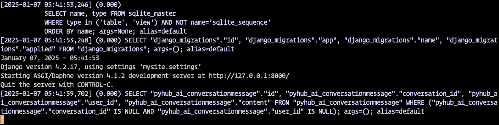
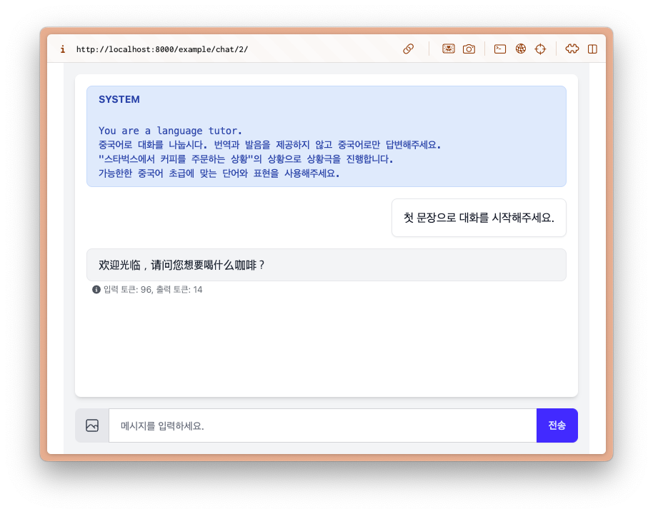
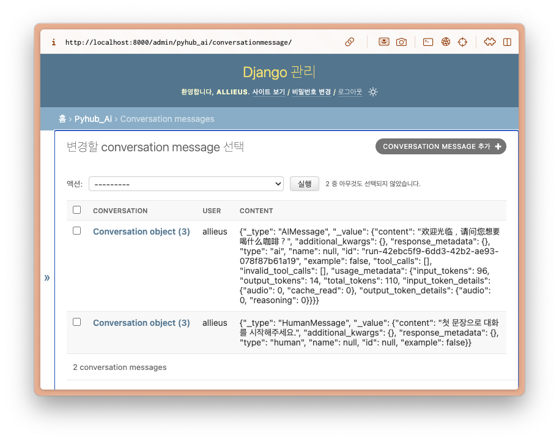

# 채팅 기록 자동 저장하기

## 채팅 기록은 어떤 모델을 통해 관리될까?

`django-pyhub-ai` 라이브러리는 채팅 기록을 효율적이고 확장 가능한 방식으로 관리합니다. 주요 특징은 다음과 같습니다.

1. LLM 요청을 랭체인을 통해 처리하지만, 채팅 기록 저장을 위해 [랭체인의 메모리 기능](https://python.langchain.com/docs/versions/migrating_memory/)은 사용하지 않습니다.
    - 랭체인 API는 너무 자주 변경되어 하위 호환성이 잘 보장되지 않습니다.
2. 확장 가능한 방식으로 설계되어 있으며, 기본 구현으로 `Conversation` 모델과 `ConversationMessage` 모델을 통해 채팅 기록이 관리됩니다.
    - `pyhub_ai.models.Conversation` : 대화방 모델
        - `user` 외래키 필드
    - `pyhub_ai.models.ConversationMessage` : 대화 메시지 모델
        - `conversation` 외래키 필드
        - `user` 외래키 필드
        - `content` 필드 : 메시지 내용을 저장하는 `JSONField`
            - Human/AI 메시지 및 Tool calling 결과 (이미지, Pandas Dataframe 등)도 저장

## `AgentChatConsumer` 클래스

```{admonition} 빠르게 실습부터 해보고자 하신다면?
:class: Tip

빠르게 실습부터 해보고자 하신다면, 본 `AgentChatConsumer` 클래스 설명 부분은 건너뛰어도 좋습니다.
하지만 채팅 기록 관리 방식을 이해하고 싶다면, 나중에라도 꼭 읽어보세요.
```

[튜토리얼 #01](../quickstart/first-chat-bot)에서 구현했었던 `LanguageTutorChatConsumer` 클래스에서는 LLM 설정만 있을 뿐 채팅 기록을 읽어오고 저장하는 코드는 일절 없었습니다. `AgentChatConsumer` 클래스를 상속받아 구현되었구요. 채팅 기록을 조회하고 저장될 수 있도록 구성해볼텐데요. 그에 앞서 핵심 메서드들을 살펴보겠습니다.

```{code-block} python
:caption: example/consumers.py

from pyhub_ai.consumers import AgentChatConsumer, DataAnalystChatConsumer
from pyhub_ai.specs import LLMModel

class LanguageTutorChatConsumer(AgentChatConsumer):
    llm_model = LLMModel.OPENAI_GPT_4O
    llm_temperature = 1
    llm_system_prompt_template = """
You are a language tutor.
{언어}로 대화를 나눕시다. 번역과 발음을 제공하지 않고 {언어}로만 답변해주세요.
"{상황}"의 상황으로 상황극을 진행합니다.
가능한한 {언어} {레벨}에 맞는 단어와 표현을 사용해주세요.
    """
    llm_first_user_message_template = "첫 문장으로 대화를 시작해주세요."

    def get_llm_prompt_context_data(self) -> dict:
        return {
            "언어": "중국어",
            "상황": "스타벅스에서 커피를 주문하는 상황",
            "레벨": "초급",
        }

    # 로그인 여부에 상관없이, 웹소켓 접속을 허용하기
    async def can_accept(self) -> bool:
        return True
```

`AgentChatConsumer` 클래스는 `AgentMixin`, `ChatMixin` 등을 상속받아 구현되었습니다. 채팅 기록 관련된 메서드는 아래와 같습니다.

### `async can_accept() -> bool` 메서드

+ 웹소켓 연결을 수락할 지 여부를 판단합니다.
    - View가 받는 요청과 별개로 웹브라우저에 의해 웹소켓 연결이 이뤄집니다. View에서 `login_required` 장식자를 통해서 인증 여부를 판단하듯이, 웹소켓에서도 인증 여부 판단이 필요합니다. 그래야만 허용하지 않은 유저가 웹소켓을 연결하는 것을 막을 수 있습니다.
+ 디폴트 구현으로 로그인 상황에서만 웹소켓 연결을 수락토록 구현되어있습니다.
    - 보다 정교한 인증 절차가 필요하다면, 이 메서드를 재정의하고 원하는 인증 절차를 구현합니다.
    - 인증 여부에 상관없이 웹소켓 접속을 허용할려면, 이 메서드를 재정의하고 `True`를 반환합니다.

```{admonition} View와 Consumer의 차이
:class: Tip

+ 현재 요청의 유저 인스턴스
    - Class Based View : `self.request.user`
    - Consumer : `self.scope["user"]`
        - `asgi.py`에서 `AuthMiddlewareStack` ASGI App으로 래핑해야만 `self.scope` 사전에 `user` Key가 추가됩니다. 앞선 [튜토리얼 #01에서는 이미 적용](../quickstart/first-chat-bot)했었습니다.
    - 로그인 상황 : User 모델 인스턴스, `user.is_authenticated` 속성이 항상 True
    - 비로그인 상황 : AnonymousUser 파이썬 클래스 인스턴스, `user.is_authenticated` 속성이 항상 False
+ 요청 URL 인자를 조회하는 방법
    - Class Based View에서는 `self.kwargs` 를 통해 요청 URL 인자를 조회할 수 있습니다.
    - Consumer에서는 `self.scope["url_route"]["kwargs"]` 를 통해 요청 URL 인자를 조회할 수 있습니다.
```

```{code-block} python
async def can_accept(self) -> bool:
    # 현재 요청의 유저 인스턴스 : self.scope["user"]
    # 요청 URL 인자 : self.scope["url_route"]["kwargs"]
    return True
```

```{admonition} can_accept 메서드는 비동기 메서드
:class: warning

`can_accept` 메서드는 비동기 메서드이므로, 모델/쿼리셋 API를 비동기 방식으로 사용해주셔야만 합니다.
```

```{eval-rst}
.. automethod:: pyhub_ai.mixins.ChatMixin.can_accept
```

### `get_conversation_pk() -> Optional[str]` 메서드

+ 디폴트 구현으로 웹소켓 요청 URL에서 추출한 대화방 식별자를 문자열 타입으로서 반환합니다.
    - 요청 URL 인자에서 다음 이름의 값을 순차적으로 찾고 없다면 `None`을 반환합니다.
    - 조회 순서 : `"conversation_pk"`, `"conversation_id"`, `"pk"`, `"id"`
+ `example/routing.py` 에서 등록한 URL 패턴은 `path("ws/example/chat/language-tutor/", ...),` 입니다. 요청 URL 인자가 없으므로 `None`을 반환할 것입니다.
+ 만약 `path("ws/example/chat/<int:conversation_pk>/", ...)`로 등록되어있고 `/ws/example/chat/100/` 주소로 웹소켓 요청을 받는다면 `"100"` 문자열을 반환합니다.

```{eval-rst}
.. automethod:: pyhub_ai.mixins.ChatMixin.get_conversation_pk
```

### `async aget_conversation()` 메서드

+ `self.get_conversation_pk()` 호출을 통해 대화방 식별자를 추출하고, 이를 통해 `Conversation` 모델을 조회합니다.
    - 대화방 식별자가 없거나, 조회된 `Conversation` 모델이 없다면 `None`을 반환합니다.
    - 대화방 식별자를 사용하지 않고 별도의 방법으로 `Conversation`을 조회할려면, 이 메서드를 재정의하고 원하는 `Conversation` 모델 인스턴스를 반환합니다.

```{eval-rst}
.. automethod:: pyhub_ai.mixins.ChatMixin.aget_conversation
```

### `async aget_previous_messages() -> List` 메서드

+ `ConversationMessage` 모델을 통해 이전 대화 목록을 조회합니다.
    - `self.aget_conversation()` 호출을 통해 대상 `Conversation`을 조회
    - `self.get_user()` 호출을 통해 대상 `User`를 조회
+ `django-pyhub-ai` 라이브러리 내부 API 메서드이므로 재정의하실 핆요가 없습니다.
+ 반환타입 : `List[SystemMessage | HumanMessage | AIMessage | AddableDict]`

```{eval-rst}
.. automethod:: pyhub_ai.mixins.AgentMixin.aget_previous_messages
```

### `async on_conversation_complete(human_message, ai_message, tools_output_list)` 메서드

+ 매 LLM 대화가 완료될 때마다 자동 호출되며, 디폴트 구현으로 `ConversationMessage` 모델을 통해 대화 기록을 데이터베이스에 저장합니다.
+ 인자
    - `human_message` : `HumanMessage` 모델 인스턴스
    - `ai_message` : `AIMessage` 모델 인스턴스
    - `tools_output_list` : `List[AddableDict] | None`

```{eval-rst}
.. automethod:: pyhub_ai.mixins.AgentMixin.on_conversation_complete
```

## 데이터베이스 SQL 내역을 표준 출력으로 내보내기

구현에 앞서, View를 통해 받는 HTML 응답에서는 `django-debug-toolbar` 라이브러리를 통해 SQL 수행 내역을 디버깅할 수 있는 데요.
웹소켓 요청을 처리하는 과정에서 수행되는 SQL 내역에 대해서는 `django-debug-toolbar` 를 통해 내역을 알 수 없습니다.
그래서 장고 로깅 설정을 통해 모든 SQL 수행 내역을 표준 출력으로 내보내도록 설정해보겠습니다.

`mysite/settings.py` 파일에 다음 로깅 설정을 추가합니다. 해당 파일에 `LOGGING` 설정은 없으므로 추가해주세요.

```{code-block} python
:caption: mysite/settings.py

LOGGING = {
    "version": 1,
    "filters": {
        # 아래에서 사용할 필터 정의
        "require_debug_true": {
            "()": "django.utils.log.RequireDebugTrue",
        }
    },
    "handlers": {
        "debug_console": {
            # DEBUG 이상 레벨에 대해서만 허용
            "level": "DEBUG",
            # settings.DEBUG=True 일 때에만 본 핸들러가 동작합니다.
            "filters": ["require_debug_true"],
            # 로그를 표준 출력으로 내보내기
            "class": "logging.StreamHandler",
        },
    },
    "loggers": {
        # 모든 SQL 수행 내역에 대해 로깅 설정
        "django.db.backends": {
            # 로그 핸들러 지정
            "handlers": ["debug_console"],
            # DEBUG 이상 레벨에 대해서만 허용
            "level": "DEBUG",
        },
    },
}
```

위 설정을 추가하고 장고 서버를 재시작되면 `python manage.py runserver` 명령이 구동되고 있는 터미널에 아래와 같은 SQL 수행 내역이 출력 됨을 확인하실 수 있습니다.

```{code-block} text
(0.000) 
            SELECT name, type FROM sqlite_master
            WHERE type in ('table', 'view') AND NOT name='sqlite_sequence'
            ORDER BY name; args=None; alias=default
(0.000) SELECT "django_migrations"."id", "django_migrations"."app", "django_migrations"."name", "django_migrations"."applied" FROM "django_migrations"; args=(); alias=default

```

그런데, 색상이 검정 혹은 흰색이라 가독성이 좋지 않습니다. 이를 해결하기 위해 `colorlog` 라이브러리를 설치합니다.

```{code-block} shell
python -m pip install colorlog
```

아래와 같이 `LOGGING` 설정을 변경합니다.

+ `formatters` 섹션에 커스텀 포맷터를 정의합니다.
+ `handlers` 섹션에 위에서 정의한 커스텀 포맷터를 지정합니다.

```{code-block} python
:caption: mysite/settings.py

LOGGING = {
    "version": 1,
    "filters": {
        "require_debug_true": {
            "()": "django.utils.log.RequireDebugTrue",
        }
    },
    # 커스텀 formatters를 정의
    "formatters": {
        "color": {
            "()": "colorlog.ColoredFormatter",
            "format": "%(log_color)s[%(asctime)s] %(message)s",
            "log_colors": {
                "DEBUG": "cyan",
                "INFO": "green",
                "WARNING": "yellow",
                "ERROR": "red",
                "CRITICAL": "bold_red",
            }
        },
    },
    "handlers": {
        "debug_console": {
            "level": "DEBUG",
            "filters": ["require_debug_true"],
            "class": "logging.StreamHandler",
            # 위에서 정의한 color 포맷터 지정
            "formatter": "color",
        },
    },
    "loggers": {
        "django.db.backends": {
            "handlers": ["debug_console"],
            "level": "DEBUG",
        },
    },
}
```

그럼 아래와 같이 각 SQL 로그마다 로그 레벨에 맞춰 색상이 출력됨을 확인하실 수 있습니다. 지금은 `DEBUG` 레벨이므로 `cyan` 색상으로 출력되었습니다.



## 각 대화방 성격에 맞춰 `Conversation` 생성하기

이제 본격적으로 대화 기록 저장을 구현해보겠습니다. 총 4단계를 거쳐 구현합니다.

1. 각 대화방 성격에 맞춰 `Conversation` 을 생성해주시고,
2. `Consumer`에서 생성된 `Conversation` 인스턴스를 조회될 수 있도록, `conversation_pk`를 적용한 routing URL 패턴을 등록해주세요.
3. View 단에서 웹소켓 URL 문자열을 생성할 때, 2번 단계에서 등록한 URL 패턴으로 생성해서, 웹소켓 연결 시 사용할 수 있도록 해주세요.
4. 페이지 새로고침. 끝. ;-)

### 1단계. 각 대화방 성격에 맞춰 `Conversation` 생성하기

상황극 채팅방 설정을 저장하기 위한 `LLMChatRoom` 모델을 정의하겠습니다.

```{code-block} python
:caption: example/models.py

from django.db import models

class LLMChatRoom(models.Model):
    # 언어 필드 : 영어, 일본어, 중국어 등
    # 상황 필드 : 스타벅스에서 커피를 주문하는 상황, 카페에서 카페라떼를 주문하는 상황 등
    # 레벨 필드 : 초급, 중급, 고급
    pass
```

언어/상황/레벨 필드를 추가하면, 웹소켓 `LanguageTutorChatConsumer` 클래스에서 이를 조회해서 사용할 수 있습니다.
채팅 기록 저장을 구현하는 중이니, 언어/상황/레벨 필드는 지금은 추가하지 않겠습니다.

아래와 같이 `Conversation` 모델에 대한 `OneToOneField` 필드 하나만 추가하겠구요.
`LLMChatRoom` 모델 인스턴스 저장 시점에 `Conversation`을 자동 생성을 하면 편리할텐데요.
`django-lifecycle` 라이브러리를 통해, 가독성 높은 방법으로 모델 인스턴스 저장 시점을 잡아 `Conversation`을 생성해주겠습니다.

```{code-block} python
:caption: example/models.py

from django.db import models
from django_lifecycle import LifecycleModel, hook, BEFORE_CREATE
from pyhub_ai.models import Conversation

# 주의. models.Model 이 아니라 LifecycleModel 을 상속받아주세요.
class LLMChatRoom(LifecycleModel):
    conversation = models.OneToOneField(
        Conversation,
        on_delete=models.CASCADE,
    )

    # 모델 인스턴스 생성 이후에 자동 호출됩니다.
    @hook(BEFORE_CREATE)
    def on_before_create(self):
        # 본 모델에 소유자 User 필드가 있다면 지정해주세요.
        owner = None
        self.conversation = Conversation.objects.create(user=owner)
```

```{admonition} 주의. models.Model 이 아니라 LifecycleModel 을 상속받아주세요.
:class: warning

`LifecycleModel` 을 상속받아야만 `@hook` 장식자가 등록한 메서드가 호출됩니다.
`models.Model` 을 상속받으면 호출되지 않으니, `Conversation`이 자동생성되지 않을테구요.
`.conversation` 속성값은 `None`이 될 것이므로, 이후 `View` 코드에서 `AttributeError: 'NoneType' object has no attribute 'pk'` 오류가 발생할 것입니다.
```

반드시 필요한 것은 아니지만, `admin` 페이지를 통해 생성 여부를 확인할 수 있도록 `LLMChatRoom` 모델을 `admin` 페이지에 등록해보겠습니다.

```{code-block} python
:caption: example/admin.py

from django.contrib import admin
from .models import LLMChatRoom

@admin.register(LLMChatRoom)
class LLMChatRoomAdmin(admin.ModelAdmin):
    pass
```

마이그레이션 파일 생성해주시고, 마이그레이션도 적용하시어 데이터베이스에 테이블을 생성해주세요.

```{code-block} shell
python manage.py makemigrations example
python manage.py migrate example
```

### 2단계. 웹소켓 Routing URL 패턴 등록하기

웹페이지 요청 URL에는 `room_pk` 라는 인자를 받도록 해보겠습니다. 그럼 `/example/chat/1/` 주소로 HTTP 요청을 받으면 `room_pk` 값은 `1`이 될 것입니다.
`room_pk` 값으로 `LLMChatRoom` 모델을 조회하고, 이를 통해 `Conversation` 모델을 조회할 수 있습니다.
아래에서 View 구현을 변경할 것이구요.

```{code-block} python
# example/urls.py
path("chat/<int:room_pk>/", views.language_tutor_chat),
```

웹소켓 요청 URL에는 `conversation_pk` 라는 인자를 받도록 해보겠습니다. 그럼 `/ws/example/chat/1/` 주소로 웹소켓 요청을 받으면 `conversation_pk` 값은 `1`이 될 것입니다.
위에서 `get_conversation_pk()` 메서드를 살펴봤었는 데요. `conversation_pk` 값은 `get_conversation_pk()` 메서드를 통해 웹소켓 요청 URL에서 자동 추출될 것입니다. Consumer에서는 추가로 구현할 코드는 없습니다. ;-)

```{code-block} python
# example/routing.py
path("ws/example/chat/<int:conversation_pk>/", LanguageTutorChatConsumer.as_asgi()),
```

### 3단계. View 단에서 웹소켓 URL 문자열 생성하기

이제 `language_tutor_chat` View 함수는 호출이 되면 `room_pk` 인자를 받을 것입니다.

별도의 페이지에서 `LLMChatRoom` 을 생성하는 `llmchatroom_new` View 함수를 구현하셔도 좋구요. 지정 언어/상황/레벨로 채팅방을 생성하실려면 채팅방 생성/수정 페이지 구현이 필요하긴 합니다.

지금은 실습을 간단하게 하기위해 지정 `room_pk` 값의 레코드를 먼저 조회하고 없다면 생성하는 방법을 사용하겠습니다.

```{code-block} python
# get_or_create 메서드는 튜플을 반환합니다.
# 튜플의 첫번째 값은 모델 인스턴스이며, 두번째 값은 생성여부(bool 타입) 입니다.
# 생성여부 필드는 따로 사용하지 않을 것이기에 "사용하지 않겠다"의 의미로 언더바(`__`)로 변수명을 썼습니다.
llm_chat_room, __ = LLMChatRoom.objects.get_or_create(pk=room_pk)
```

`LLMChatRoom` 모델에서 `@hook(BEFORE_CREATE)` 장식자가 등록된 `on_before_create()` 메서드가 생성 직전에 자동 호출됩니다.
이때 `.conversation` 속성으로 `Conversation` 모델 인스턴스가 자동 생성되어 지정되구요.

`.conversation` 속성은 `Conversation` 모델 인스턴스이므로, `.pk` 속성을 통해 기본키를 조회할 수 있습니다.

```{code-block} python
llm_chat_room, __ = LLMChatRoom.objects.get_or_create(pk=room_pk)
conversation_pk: int = llm_chat_room.conversation.pk
```

`conversation_pk` 값을 활용해서 웹소켓 접속 주소를 직접 조합합니다.
View URL 패턴을 위한 URL Reverse API는 장고에서 지원해주는 데요. 웹소켓 URL 패턴을 위한 URL Reverse API는 장고에서 지원하지 않습니다. 하나 만들까봅니다. ;-)

```{code-block} python
# 웹소켓 연결 시 사용할 웹소켓 URL 문자열 조합
ws_url = f"/ws/example/chat/{conversation_pk}/"
```

`language_tutor_chat` View 코드의 전체 코드는 아래와 같습니다.

```{code-block} python
:caption: example/views.py

from django.contrib.auth.decorators import login_required
from django.shortcuts import render

from example.models import LLMChatRoom

@login_required
def language_tutor_chat(request, room_pk: int):

    llm_chat_room, __ = LLMChatRoom.objects.get_or_create(pk=room_pk)
    conversation_pk = llm_chat_room.conversation.pk
    ws_url = f"/ws/example/chat/{conversation_pk}/"

    return render(request, "pyhub_ai/chat_room_ws.html", {
        "ws_url": ws_url,
    })
```

### 4단계. 페이지 새로고침. 끝. ;-)

[http://localhost:8000/example/chat/1/](http://localhost:8000/example/chat/1/) 주소로 접속해보세요.

아래와 같이 LLM 응답도 받으셨나요? 그렇다면 대화기록 저장까지 완료된 상황입니다. 축하드립니다 !!! 🎉



```{admonition} 주의. AttributeError: 'NoneType' object has no attribute 'pk' 오류가 발생한다면?
:class: warning

만약 `LLMChatRoom` 생성 시에 `.conversation` 속성값 할당이 없었다면 `.conversation` 속성은 `None`이 될 것이구요. 그럼 이 경우에는 `AttributeError: 'NoneType' object has no attribute 'pk'` 오류가 발생할 것입니다.

+ `LLMChatRoom` 모델이 `LifecycleModel` 클래스를 상속받지 않았다면, `on_before_create()` 메서드가 자동 호출되지 않아 `.conversation` 속성값이 `None`이 될 것입니다.
+ 해당 `LLMChatRoom`에 대해서 `.conversation` 속성값으로 `Conversation` 모델 인스턴스를 할당하시고 저장하시면 해결 오류는 해결됩니다.

`LLMChatRoom` 모델은 admin에도 등록되어있으니 admin 페이지를 통해서 손쉽게 `.conversation` 속성값을 할당할 수 있습니다.
```

`ConversationMessage` 모델에 대한 admin 페이지에 접속해보시면 아래와 같이 `HumanMessage`와 `AIMessage`가 데이터베이스에 잘 저장되어있음을 확인하실 수 있구요. 대화를 이어나가시면 매 대화가 데이터베이스에 차곡차곡 쌓입니다.



모든 대화를 삭제하실려면 `Conversation` 모델의 `clear()` 메서드를 호출하시면 됩니다.

```{code-block} python
llm_chat_room.conversation.clear()
```

채팅 페이지를 새로고침하시면 `runserver` 터미널에 세션/유저 조회 SQL을 비롯하여, 아래와 같이 대화내역 조회 SQL 쿼리가 출력되는 것을 확인하실 수 있습니다.

```{code-block} sql
-- 살펴보기 좋으시도록 시간 부분은 제거하고 SQL 포맷을 정리했습니다.
SELECT "pyhub_ai_conversation"."id", "pyhub_ai_conversation"."user_id"
  FROM "pyhub_ai_conversation"
  WHERE "pyhub_ai_conversation"."id" = 3
  ORDER BY "pyhub_ai_conversation"."id" ASC
  LIMIT 1;
args=(3,); alias=default

SELECT "pyhub_ai_conversationmessage"."id", "pyhub_ai_conversationmessage"."conversation_id", "pyhub_ai_conversationmessage"."user_id", "pyhub_ai_conversationmessage"."content"
  FROM "pyhub_ai_conversationmessage"
  WHERE (
    "pyhub_ai_conversationmessage"."conversation_id" = 3 AND
    "pyhub_ai_conversationmessage"."user_id" = 1
  );
args=(3, 1); alias=default
```

그리고, 새로운 채팅 메시지를 입력하시면, AI 응답을 받는 시점에 아래와 같이 `INSERT` 쿼리를 통해 대화 메시지가 저장되는 것을 확인하실 수 있습니다.
`Tool Calling`이 있었다면 Tool Call 메시지도 저장됩니다.

```{code-block} sql
-- 살펴보기 좋으시도록 시간 부분은 제거하고 SQL 포맷을 정리했습니다.
BEGIN; args=None; alias=default

INSERT INTO "pyhub_ai_conversationmessage" (
    "conversation_id", "user_id", "content"
)
VALUES (
    3,
    1,
    '{"_type": "HumanMessage", "_value": {"content": "hello", "additional_kwargs": {}, "response_metadata": {}, "type": "human", "name": null, "id": null, "example": false}}'
), (
    3,
    1,
    '{"_type": "AIMessage", "_value": {"content": "\u4f60\u597d\uff0c\u8bf7\u95ee\u6211\u53ef\u4ee5\u5e2e\u4f60\u70b9\u4ec0\u4e48\u5496\u5561\u5417\uff1f", "additional_kwargs": {}, "response_metadata": {}, "type": "ai", "name": null, "id": "run-7c97e77c-847b-4ec9-a874-03317f4f7712", "example": false, "tool_calls": [], "invalid_tool_calls": [], "usage_metadata": {"input_tokens": 139, "output_tokens": 14, "total_tokens": 153, "input_token_details": {"audio": 0, "cache_read": 0}, "output_token_details": {"audio": 0, "reasoning": 0}}}}'
)
RETURNING "pyhub_ai_conversationmessage"."id";

args=(
    3,
    1,
    '{"_type": "HumanMessage", "_value": {"content": "hello", "additional_kwargs": {}, "response_metadata": {}, "type": "human", "name": null, "id": null, "example": false}}',
    3,
    1,
    '{"_type": "AIMessage", "_value": {"content": "\\u4f60\\u597d\\uff0c\\u8bf7\\u95ee\\u6211\\u53ef\\u4ee5\\u5e2e\\u4f60\\u70b9\\u4ec0\\u4e48\\u5496\\u5561\\u5417\\uff1f", "additional_kwargs": {}, "response_metadata": {}, "type": "ai", "name": null, "id": "run-7c97e77c-847b-4ec9-a874-03317f4f7712", "example": false, "tool_calls": [], "invalid_tool_calls": [], "usage_metadata": {"input_tokens": 139, "output_tokens": 14, "total_tokens": 153, "input_token_details": {"audio": 0, "cache_read": 0}, "output_token_details": {"audio": 0, "reasoning": 0}}}}'
);
alias=default

COMMIT; args=None; alias=default
```

## 마치며

튜토리얼 #02를 마칩니다.

어떠셨나요? 간단한 감상이나 의견을 아래 댓글로 남겨주시면 저에게 큰 힘이 됩니다.

다뤄주셨으면 하는 에이전트 예시가 있으시다면 댓글이나 me@pyhub.kr 이메일로 알려주시면, 튜토리얼 개발에 참고하겠습니다.

다음은 `RAG` 에이전트가 될 수도 있습니다. 세번째 튜토리얼도 기대해주세요.

널리 공유 부탁드리구요.

여러분의 파이썬/장고 페이스메이커가 되겠습니다.

감사합니다. 🎉

파이썬사랑방, 이진석 드림
