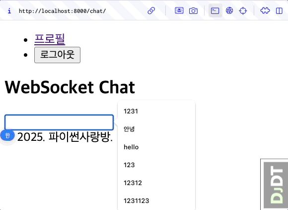
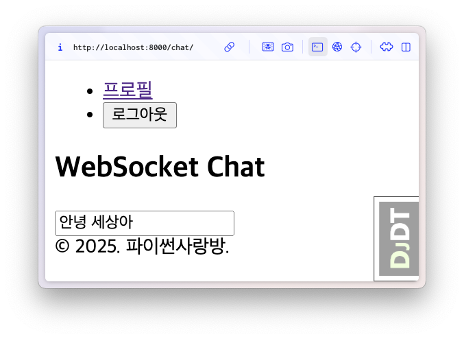
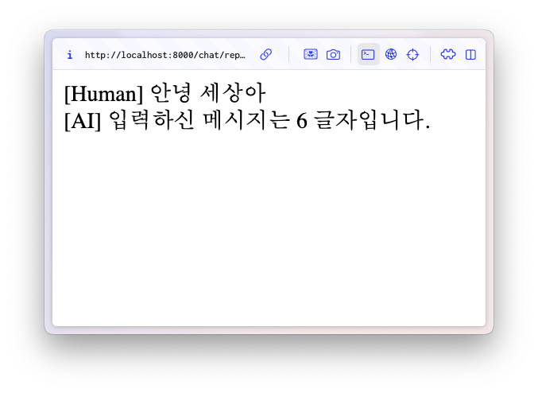

# HTML Form 기반으로 AI 응답 받기

+ [관련 커밋](https://github.com/pyhub-kr/django-llm-chat-proj/commit/9b7aa6c24bc3c3d6ae800470951489e060da175a)

## 웹소켓 채팅 코드

기존 프로젝트에서는 웹소켓 채팅이 기본 구현되어있습니다.

+ 백엔드 : 장고 채널스를 통해 웹소켓 채팅 서버 구현
+ 프론트엔드 : `WebSocket` JS API 활용하여 웹소켓 서버에 연결하고, 메시지 송수신



```{admonition} 웹소켓 기반의 채팅은 실시간 양방향 통신이 가능합니다.
:class: tip

HTTP 기반의 채팅은.

+ 1개의 메시지에 여러 번의 응답을 끊어서 받을려면 SSE (Server-Sent Events) 구현이 필요합니다.
+ 메시지를 보내지 않으면 응답을 받을 수 없습니다.

웹소켓은 클라이언트와 서버가 연결된 상태를 유지하므로.

+ 1개의 메시지에 대한 응답을 여러 번에 나눠받을 수 있습니다.
+ 메시지를 보내지 않아도 서버 응답을 받을 수 있습니다.
```

HTTP 기반의 채팅이 구현이 쉽습니다.
ChatGPT와 같은 챗봇 서비스는 대부분의 경우 HTTP 채팅으로 충분할 수 있습니다.

## HTML Form을 통한 유저 메시지 전송

HTML에서는 유저에게 입력폼 UI를 제공하고, 입력폼을 통해 전송받은 값을 지정 주소의 Endpoint로 전송하는 기능을 제공합니다.

+ `action` : 입력폼 데이터를 전송할 주소를 지정합니다.
    - 현재 서버의 `/chat/reply/` 주소로 전송합니다.
+ `method` : 입력폼 데이터를 전송할 방식을 지정합니다.
    - `GET` 방식 : 조회 목적으로 사용 - 엽서 방식이기에 파일 업로드 불가
    - `POST` 방식 : 조회 이외의 목적으로 사용 (생성/수정/삭제 등) - 택배 방식이기에 파일 업로드 가능
+ ``
    - CSRF 공격 (사이트 간 요청 위조)을 막기 위한 장고의 보안 기능

```{code-block} html
:caption: `chat/templates/chat/index.html`

<form id="form" action="/chat/reply/" method="post">
    
    <input type="text" name="message" />
</form>

<div id="messages"></div>

<!-- script 태그는 모두 제거합니다. -->
```

`/chat/reply/` 요청을 처리하는 View를 구현합니다. 아직 LLM API를 호출하지는 않구요. 단순히 유저로부터 받은 메시지가 몇 글자인지로만 응답하겠습니다.

```{code-block} python
:caption: `chat/views.py`

from django.http import HttpResponse
from django.utils.html import format_html

def reply(request):
    if request.method == "POST":
        human_message = request.POST.get("message", "")
        ai_message = f"입력하신 메시지는 {len(human_message)} 글자입니다."
        return HttpResponse(
            format_html(
                "<div>[Human] {}</div><div>[AI] {}</div>", human_message, ai_message
            )
        )
    else:
        return HttpResponse("<div>허용하지 않는 메서드</div>")
```

```{code-block} python
:caption: `chat/urls.py`

urlpatterns = [
    # ...
    path("reply/", views.reply, name="reply"),
]
```

[http://localhost:8000/chat/](http://localhost:8000/chat/) 주소로 접속해서 입력폼을 띄우시고, 입력폼을 전송해보세요.

::::{tab-set}

:::{tab-item} 입력폼

:::

:::{tab-item} 전송후

:::

::::

리액트 등에서 JS의 `fetch`, `axios` API를 통해 입력폼을 전송토록 구현하는 경우가 많습니다만, 최대한 HTML Form을 적극 활용하시기를 추천드립니다.
