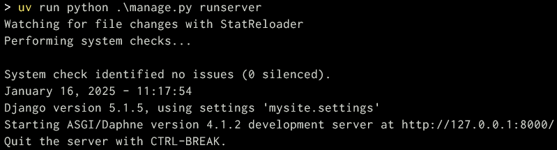

프로젝트 다운로드 및 초기 구동
================================

.. raw:: html

    

        <iframe
            src="https://www.youtube.com/embed/9ayknWI-VcI?start=5105"
            frameborder="0"
            allowfullscreen>
        </iframe>
    

    <small>본 페이지는 1:25:05 지점부터 1:46:38 지점까지 보시면 됩니다.</small>

프로젝트 다운로드
-----------------

`기본 설정이 된 장고 프로젝트를 zip 파일로 다운로드 <https://github.com/pyhub-kr/django-llm-chat-proj/archive/c222291075ed2be0624c93b270ba15b10b3d5128.zip>`_ 하시고, 압축을 풀어주시고, 적절한 경로에 복사해주세요.

.. code-block:: bash
   :linenos:

   # 압축을 해제하시고, 프로젝트 디렉토리로 이동합니다.
   cd django-llm-chat-proj

혹은 :doc:`/utils/pyhub-git-commit-apply` 명령을 사용하신다면 해당 라이브러리 설치 후에
빈 폴더에서 아래 명령으로 지정 커밋의 프로젝트 코드를 한 번에 받으실 수 있습니다.

.. code-block:: bash

   # 이 단계를 수행하셨다면, 아래 "가상환경 생성 및 라이브러리 설치" 단계는 넘어가셔도 됩니다.
   python -m pip install --upgrade uv
   uv venv
   uv pip install --upgrade pyhub-git-commit-apply
   uv run pyhub-git-commit-apply --all https://github.com/pyhub-kr/django-llm-chat-proj/commit/c222291075ed2be0624c93b270ba15b10b3d5128
   uv pip install -r requirements.txt

.. tip::

   가상환경에 대해서 보다 자세히 알고 싶으시다면, :doc:`/setup/venv` 문서를 참고해주세요.

구현된 기능
-----------

이 장고 프로젝트에는 빠른 실습을 위해 아래 기능들이 미리 구현되어있습니다.

* 기본 인증 구현 : 회원가입, 로그인, 로그아웃, 로그아웃
* 각종 라이브러리 적용

  * `django-debug-toolbar <https://django-debug-toolbar.readthedocs.io>`_ : 장고 HTTP 요청/응답 디버깅 도구
  * `django-environ <https://django-environ.readthedocs.io>`_ : 환경변수 파싱 도구
  * `django-extensions <https://django-extensions.readthedocs.io>`_ : 각종 장고 편의 기능 제공

* HTMX 확장

  * `streaming-htmx <https://github.com/pyhub-kr/django-llm-chat-proj/blob/main/static/streaming-html.js>`_ : 스트리밍 응답 처리 지원 (made by 파이썬사랑방)

* ASGI 활성화 및 웹소켓 간단 채팅 구현

가상환경 생성 및 라이브러리 설치
--------------------------------

파이썬은 동일 라이브러리에 대해서 하나의 버전만 설치할 수 있습니다.
컴퓨터에 파이썬이 하나 설치되어 있고, 여러 프로젝트에서 동일 라이브러리를 사용하는 경우 라이브러리 버전이 맞지 않게 됩니다.

가상환경은 파이썬 팩키지를 별도 디렉토리로 격리해서 설치/활용하는 방식입니다.
각 프로젝트마다 가상환경을 생성해서 사용하시기를 추천드립니다.
``venv`` 외에 `conda 환경 <https://docs.conda.io/projects/conda/en/latest/user-guide/tasks/manage-environments.html>`_, `도커 <https://www.docker.com/>`_ 등 다른 편하신 방법을 사용하셔도 됩니다.

.. admonition:: `requirements.txt <https://github.com/pyhub-kr/django-llm-chat-proj/blob/main/requirements.txt>`_
   :class: dropdown

   .. code-block:: text
      :linenos:

      django~=5.1.0
      daphne
      channels

      django-debug-toolbar
      django-environ
      django-extensions

      openai
      langchain
      langchain-core
      scikit-learn
      numpy

      colorlog

가상환경을 생성하시고, 라이브러리를 한 번에 설치해줍니다.
라이브러리 버전 충돌이 발생하신다면 ``requirements.txt`` 파일에서 라이브러리 버전을 제거하고 라이브러리 이름만 남기고 다시 설치해주세요.

.. tab-set::

   .. tab-item:: uv 명령을 사용하지 않을 경우

      .. code-block:: bash
         :linenos:

         # .venv 경로에 가상환경을 생성합니다.
         python -m venv .venv

         # 가상환경 활성화
         .venv\Scripts\activate     # 윈도우
         source .venv/bin/activate  # 맥/리눅스

         # 패키지 설치
         python -m pip install -r requirements.txt

   .. tab-item:: uv 명령을 사용할 경우

      .. code-block:: bash
         :linenos:

         # uv 설치
         python -m pip install -U uv

         # uv를 통한 가상환경 생성
         # 디폴트로 .venv 경로에 가상환경이 생성됩니다.
         uv venv

         # uv를 통한 패키지 설치
         # 가상환경을 활성화하지 않아도 자동으로 사용됩니다.
         uv pip install -r requirements.txt

.env 파일 복사
------------------

Open API 키 사용을 위해 :doc:`../setup` 단계에서 생성하셨던 ``.env`` 파일을 장고 프로젝트 루트 디렉토리에 복사해주세요.
반드시 ``manage.py`` 파일이 있는 디렉토리에 복사해주세요. 다른 경로에 복사하시면 현재 ``mysite/settings.py`` 설정으로는
``.env`` 파일을 로딩하지 못합니다.

OpenAI API 키 로딩을 확인해보실려면, 다음과 같이 장고 쉘을 실행해서 확인하실 수 있습니다.

.. code-block:: text

   $ python manage.py shell
   >>> from django.conf import settings
   >>> print(settings.OPENAI_API_KEY)  # settings 값 확인
   >>>
   >>> import os
   >>> print(os.getenv('OPENAI_API_KEY'))  # 환경변수 값 확인

.. admonition:: 당연한 것은 없습니다.
   :class: tip

   API Key 값이 엉뚱한 값으로 조회가 된다면, 이렇게 쉘을 구동하신 후에 각 값을 확인해보세요.

   환경변수 값부터 조회가 안된다면 엉뚱한 경로에 ``.env`` 파일이 있거나, ``.env`` 내용이 비어있을 수도 있습니다.
   환경변수 값은 맞는 데 ``settings`` 값이 다르다면, ``settings.py`` 파일에서 환경변수 값을 로딩하는 코드에서 오류가 있을 것입니다.

   생각하신 대로 동작하지 않으신다고 해서, 이곳 저곳 감으로 수정하면서 오류가 없어지길 기도하는 것은 좋지 않습니다.
   당연하다고 생각되는 곳부터 차근차근 확인해보세요. 오류를 해결하는 가장 빠른 방법입니다.

장고 개발서버 구동
--------------------

장고 프로젝트에는 여러 장고 앱들이 활성화되어있고, 각 장고 앱에는 데이터베이스 테이블 스키마 설정(마이그레이션 파일)이 있습니다. ``python manage.py migrate`` 명령으로 데이터베이스에 데이터베이스 테이블을 생성해줍니다.

.. tip::

   장고 프로젝트 디폴트로 `SQLite3 <https://news.hada.io/topic?id=6557>`_ 데이터베이스를 사용합니다. SQLite3 데이터베이스는 파일 데이터베이스이고 파이썬 기본에서 지원하기에 별도 설치가 필요없이 사용할 수 있습니다. `소규모의 웹서비스에서도 충분히 사용할 수 있습니다 <https://blog.pecar.me/django-sqlite-benchmark>`_. (장고 ``settings.DATABASES`` 에서 추가 설정이 필요합니다.)

장고 기본에서 인증 기능을 제공해줍니다. ``python manage.py createsuperuser`` 명령으로 관리자 유저 계정을 생성해줍니다.
현재 데이터베이스 설정이 로컬 데이터베이스를 가리키고 있으므로, 어떤 아이디라도 사용하실 수 있습니다.

.. attention::

   ``Password:`` 입력에서는 암호를 입력하셔도 입력 피드백이 없습니다. 입력 피드백이 없는 이유는 암호가 노출되지 않도록 하기 위해서입니다.
   입력 피드백이 없더라도 암호가 입력되고 있으니 걱정마세요.
   암호 입력 부분은 파이썬 기본의 `getpass <https://docs.python.org/3/library/getpass.html>`_ 모듈을 사용됩니다.

   .. code-block:: text
      :emphasize-lines: 1

      $ python manage.py createsuperuser
      사용자 이름 (leave blank to use 'allieus'): pyhub
      이메일 주소: me@pyhub.kr
      Password:
      Password (again):
      Superuser created successfully.

이제 ``python manage.py runserver 0.0.0.0:8000`` 명령으로 장고 개발서버를 띄워줍니다. 서버 중지는 ``Ctrl+C`` 를 눌러주세요. 윈도우 GUI 애플리케이션에서는 ``Ctrl+C`` 키는 복사 명령이지만, 윈도우/맥/리눅스 터미널에서 ``Ctrl+C`` 키는 인터럽트(Interrupt) 명령으로서 프로세스를 중지시킵니다.

사용 명령은 아래와 같습니다.

.. tab-set::

   .. tab-item:: uv 명령을 사용하지 않을 경우

      ``uv``\ 로 가상환경을 생성했더라도, 가상환경을 직접 활성화하여 ``python`` 명령에서 가상환경을 사용할 수 있습니다.

      .. code-block:: bash
         :linenos:

         # 가상환경 활성화
         .venv\Scripts\activate     # 윈도우
         source .venv/bin/activate  # 맥/리눅스

         python manage.py migrate  # 데이터베이스에 테이블 생성
         python manage.py createsuperuser  # 암호 입력에서는 입력 피드백이 없습니다.
         python manage.py runserver 0.0.0.0:8000  # 장고 개발서버 구동

   .. tab-item:: uv 명령으로 실행할 경우

      .. code-block:: bash
         :linenos:

         # 가상환경을 활성화하지 않아도 자동으로 사용됩니다.
         uv run python manage.py migrate  # 데이터베이스에 테이블 생성
         uv run python manage.py createsuperuser  # 암호 입력에서는 입력 피드백이 없습니다.
         uv run python manage.py runserver 0.0.0.0:8000  # 장고 개발서버 구동

개발 서버 구동 확인
---------------------

장고 개발서버가 정상적으로 구동되면 아래와 같은 화면이 터미널에 출력됩니다.

.. note::

   ``python manage.py runserver`` 명령은 개발에 최적화된 웹서버입니다.
   실제 운영에서는 사용하셔서는 안 됩니다. 동시 요청 처리 능력이 매우 떨어집니다.
   실제 운영 환경에서는 gunicorn, uvicorn 등의 프로덕션용 WSGI/ASGI 서버를 사용하셔야만 합니다.

소스코드 편집기로 열기
------------------------

`Visual Studio Code <https://code.visualstudio.com/>`_ 편집기나 `PyCharm Professional <https://www.jetbrains.com/pycharm/>`_ 등의 IDE(통합 개발 환경)로 프로젝트를 열어주시고, 편집기에서 가상환경도 활성화해주세요.

* Visual Studio Code에서는 ``Python`` 확장 설치 후에 명령 팔레트에서 ``Python: Select Interpreter`` 명령으로 사용하실 가상환경을 선택합니다.
* PyCharm Professional에서는 ``Settings`` → ``Project: <project_name>`` → ``Python Interpreter`` 에서 사용하실 가상환경을 선택합니다. 그리고 ``Settings`` → ``Languages & Frameworks`` → ``Django`` 에서 장고 지원을 활성화해주시고 (PyCharm Professional 버전에서만 지원됩니다.) ``Django project root`` 및 ``Settings`` 설정까지 지정해주셔야만, 파이참에서 장고 지원 기능을 누리실 수 있습니다.

.. admonition:: 장고 웹 개발의 최적의 툴은 PyCharm Professional
   :class: tip

   Visual Studio Code 편집기가 좋고 확장도 많고 커스터마이징도 지원하지만,
   장고 웹 개발에 있어서 불편한 점이 있는 것은 사실입니다. 일일이 설정해줘야하는 것도 많구요.

   그에 비해 PyCharm Professional은 설치 만으로 장고 웹 개발에 필요한 대부분의 기능을 제공합니다.
   무료인 PyCharm Community은 파이썬 기능만 제공할 뿐 웹 개발 기능은 제공하지 않습니다.
   PyCharm Professional은 1개월 체험을 지원하고 있구요. 일단 1개월 체험을 먼저 써보시고 파이참을 좀 더 써보고자 하신다면,
   본 RAG 튜토리얼을 완료하신 후에 인증샷과 함께 help@pyhub.kr 메일로 리딤코드를 요청해주시면,
   제가 여유가 되는 대로 **파이참 프로페셔널 6개월 리딤코드** 를 보내드리겠습니다.
   상황에 따라 늦게 보내드릴 수도 있습니다.

   파이참 개발사인 JetBrains에서는 `For students and educators <https://www.jetbrains.com/lp/leaflets-gdc/students/>`_ 무료 라이센스를 지원해주고 있습니다.
   학교 이메일이 있으신 분은 1년 단위로 JetBrains의 모든 개발 툴들을 무료로 이용하실 수 있으니 참고해주세요.
   대개 신청하시면 1~2일 이내에 승인 메일이 오더라구요.

   파이참이 장고 개발에 있어서 좋지만, 요즘 다양한 AI 개발툴들이 VSCode 기반으로 나오고 있죠. (예: Cursor IDE)
   저는 파이참과 Cursor IDE를 병행해서 개발하고 있습니다.
   AI 기능 활용에서는 Cursor IDE를 사용하고 그 외 개발에서는 파이참을 사용합니다.
