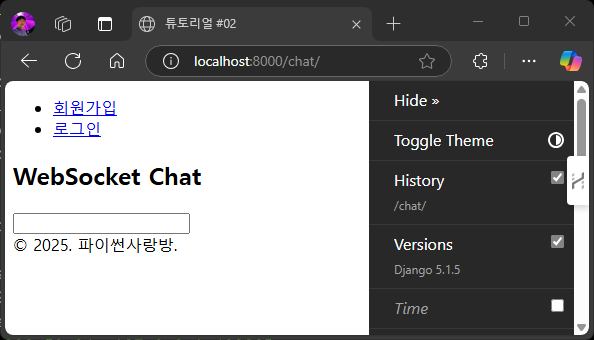
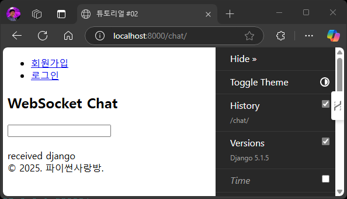
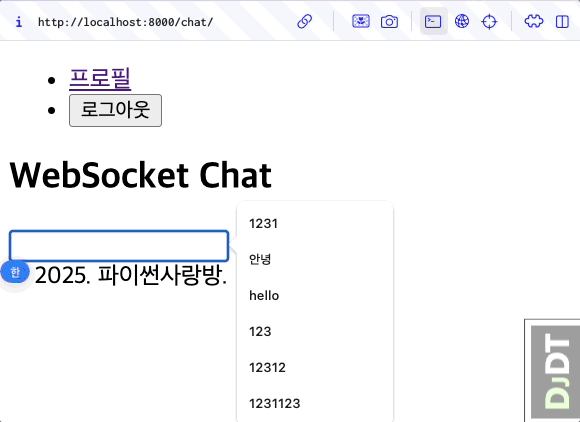

웹소켓 채팅 페이지 접속 테스트
==============================

본 페이지는 1:46:39 지점부터 1:48:51 지점까지 보시면 됩니다.

.. raw:: html

  

    <iframe
        src="https://www.youtube.com/embed/9ayknWI-VcI?start=6399"
        frameborder="0"
        allowfullscreen>
    </iframe>
  

----

웹페이지 접속
---------------

웹 브라우저로 `http://localhost:8000 <http://localhost:8000>`_ 에 접속하시면, ``/chat/`` 경로로 자동 이동이 되고 아래 화면을 확인하실 수 있습니다.

   웹소켓 채팅 초기 화면

웹소켓 기반의 채팅 화면이구요. 개발서버 터미널를 보시면 아래와 같이 웹소켓 로그를 확인하실 수 있습니다.
웹 프론트엔드와 웹 백엔드가 웹소켓을 통해 연결된 상황입니다.
페이지를 새로고침하시면 연결이 끊어지고 페이지가 로드될 때 자바스크립트 `WebSocket API <https://developer.mozilla.org/ko/docs/Web/API/WebSocket>`_ 를 통해 다시 접속됩니다.

.. code-block:: text
   :emphasize-lines: 6-7

   HTTP GET /chat/ 200 [0.06, 127.0.0.1:52998]
   HTTP GET /static/debug_toolbar/css/toolbar.css 304 [0.01, 127.0.0.1:52998]
   HTTP GET /static/debug_toolbar/js/toolbar.js 304 [0.03, 127.0.0.1:52999]
   HTTP GET /static/debug_toolbar/css/print.css 304 [0.01, 127.0.0.1:52998]
   HTTP GET /static/debug_toolbar/js/utils.js 304 [0.00, 127.0.0.1:52998]
   WebSocket HANDSHAKING /ws/chat/ [127.0.0.1:53002]
   WebSocket CONNECT /ws/chat/ [127.0.0.1:53002]

채팅 메시지 전송 및 서버 응답 수신
-----------------------------------

입력 박스에 ``django`` 메시지를 입력하고 엔터를 누르면, 웹소켓 서버로 즉시 전송됩니다. 그리고 웹소켓 서버인 장고 채널스에서는 ``received django`` 메시지를 전송하구요. 웹 프론트엔드에서는 ``received django`` 메시지를 수신하고 채팅 화면에 출력합니다.

   웹소켓 채팅 메시지 수신 화면

.. seealso::

   웹소켓 연결을 담당하는 코드는 다음 코드가 전부입니다. (`chat/consumers.py <https://github.com/pyhub-kr/django-llm-chat-proj/blob/main/chat/consumers.py>`_)
   장고에서는 ``View`` 에서 HTTP 요청을 처리하고, 채널스의 ``Consumer`` 를 통해 다양한 프로토콜을 처리할 수 있는 데요.
   그 중 ``WebsocketConsumer`` 를 통해 웹소켓 요청을 손쉽게 처리할 수 있습니다.

   .. code-block:: python
      :caption: ``chat/consumers.py``

      from typing import Dict
      from channels.generic.websocket import JsonWebsocketConsumer

      class ChatConsumer(JsonWebsocketConsumer):
         def receive_json(self, request_data: Dict):
            message = request_data.get("message", "")

            # 수신한 message를 응답 메시지에 그대로 담아 송신합니다.
            response_obj = {"message": f"received {message}"}
            self.send_json(response_obj)

이어서 여러 메시지를 입력하고 전송해보시면, 아래에 수신 메시지들이 추가됨을 확인하실 수 있습니다.

   웹소켓 채팅 화면

정리
------

본 튜토리얼에서는 간결한 구현을 위해 웹소켓을 제거하고 http 요청을 통해 채팅 기능을 구현해보겠습니다.

.. note::

   고급 채팅 기능 (예: 실시간 음성 대화 AI 에이전트) 개발에서는 웹소켓이 필수이지만, http 방식으로도 대다수의 기능들을 구현할 수 있습니다.
   http 방식이 웹소켓 방식보다 서버 아키텍처가 훨씬 단순해지고 개발/운영 비용이 낮을 수 있습니다.

   HTTP 기반의 채팅은.

   + 1개의 메시지에 여러 번의 응답을 끊어서 받을려면 SSE (Server-Sent Events) 구현이 필요합니다. `HTMX 라이브러리 <https://htmx.org>`_ 를 활용하면 손쉽게 구현할 수 있습니다.
   + 메시지를 보내지 않으면 응답을 받을 수 없습니다.

   웹소켓은 클라이언트와 서버가 연결된 상태를 유지하므로.

   + 1개의 메시지에 대한 응답을 여러 번에 나눠받을 수 있습니다.
   + 메시지를 보내지 않아도 서버 응답을 받을 수 있습니다.
   + 텍스트 뿐만 아니라 오디오(음성) 등의 바이너리 데이터도 실시간으로 송수신할 수 있습니다.

.. admonition:: 참고: 실시간 음성 대화 AI 에이전트 (Django 버전)
   :class: note

   `pyhub-kr/pyhub-django-react-voice-agent <https://github.com/pyhub-kr/pyhub-django-react-voice-agent>`_ 프로젝트는
   `langchain-ai/react-voice-agent <https://github.com/langchain-ai/react-voice-agent>`_ 의 코드(`Starlette` 기반)를
   Django/Channels로 포팅한 버전입니다 (웹소켓).
   테디노트의 `#OpenAI #Realtime API 음성 속도체감 Demo <https://www.youtube.com/watch?v=8uzUJR51CBg>`_ 에서 영감을 받아 개발했습니다.
