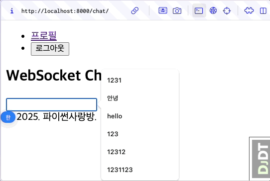

HTML Form + 바닐라 자바스크립트 기반으로 페이지 전환없이 AI 응답 받기
================================================================================

.. admonition:: `관련 커밋 <https://github.com/pyhub-kr/django-llm-chat-proj/commit/e1ec4b164acdbfb6cf2f03654838ffa4494dd4e6>`_
   :class: dropdown

   * 변경 파일을 한 번에 덮어쓰기 하실려면, :doc:`/utils/pyhub-git-commit-apply` 설치하신 후에, 현재 프로젝트 루트 경로에서 명령어 실행

   .. code-block:: bash

      uv run pyhub-git-commit-apply https://github.com/pyhub-kr/django-llm-chat-proj/commit/e1ec4b164acdbfb6cf2f03654838ffa4494dd4e6

본 페이지는 2:04:54 지점부터 2:11:24 지점까지 보시면 됩니다.

.. raw:: html

  

    <iframe
        src="https://www.youtube.com/embed/9ayknWI-VcI?start=7494"
        frameborder="0"
        allowfullscreen>
    </iframe>
  

----

미리보기
-----------

   자바스크립트를 통해 폼 전송을 하여, 페이지 전환이 없습니다.

장고 HTML 템플릿
-------------------

아래 ``action`` 속성에서 사용한 ```` 템플릿 태그 호출은 ``/chat/reply/`` 문자열을 반환합니다.
장고의 `URL Reverse <https://docs.djangoproject.com/en/dev/topics/http/urls/#reverse-resolution-of-urls>`_ 기능입니다.
URL 문자열 계산을 직접 하지 마시고 장고에게 양보하세요.

``<form>`` 요소(Element)에서는 폼 전송 요청에서 ``submit`` 이벤트가 발생합니다.
``submit`` 이벤트 핸들러를 등록하고, ``submit`` 이벤트가 발생하면 지정 이벤트 핸들러가 호출되구요. 이때 인자로 이벤트 객체 ``e`` 가 전달됩니다.
``submit`` 이벤트 핸들러가 수행된 후에 기본 동작인 페이지 전환이 이뤄지며 폼 전송이 자동으로 이뤄지는 데요.
기본 동작인 페이지 전환을 막기 위해 ``e.preventDefault()`` 를 호출해야만 합니다.
그럼 ``form`` 요소 자체적인 전송은 수행되지 않구요. 대신 자바스크립트를 통해 폼 전송을 합니다.

자바스크립트를 통한 HTTP 요청을 흔히 Ajax (Asynchronous JavaScript and XML) 라고 부릅니다.
최신 브라우저에서는 `fetch API <https://developer.mozilla.org/ko/docs/Web/API/Fetch_API>`_ 를 통해 HTTP 요청을 보내고, 리액트 애플리케이션에서도 많이 사용합니다.

``fetch`` API는 비동기 호출을 지원하구요. ``await`` 를 사용하기 위해 이벤트 리스너 함수를 ``async`` 로 선언합니다.
``await response.text()`` 호출은 응답 텍스트를 반환하며, 서버의 응답 텍스트를 HTML 포맷으로 보고 ``id="messages"`` 요소 끝에 추가합니다.

.. code-block:: html+django
    :caption: chat/templates/chat/index.html
    :emphasize-lines: 6,12-31
    :linenos:

    

    
        <h2>WebSocket Chat</h2>

        <form id="form" action="" method="post">
            
            <input type="text" name="message" />
        </form>

        

        
    

책임을 분리하세요.
-------------------

자바스크립트에서 폼 전송 시에 아래와 같이 구현하시는 분들이 많습니다.

.. code-block:: html

    <form action="" method="post">
        <input type="text" name="username" />
        <input type="password" name="password" />
        <input id="button" type="submit" />
    </form>

    

위 코드는 동작은 하지만 ``<form>`` 의 ``submit`` 이벤트를 처리하지 않았습니다. 단순히 ``id=button`` 요소의 ``click`` 이벤트로 처리했기에

* 버튼 클릭 시에는 폼 전송이 동작하더라도 폼 필드에서 엔터키를 눌렀을 때에는 전송되지 않습니다. ``<form>`` 의 기본 동작을 무시한 사례입니다. 사용자 경험을 저하시키며, 폼 동작의 일관성이 깨집니다. ``form`` 요소의 ``action`` 속성은 사용되지 않았습니다.

* 이벤트 객체 ``e`` 의 ``.target`` 속성은 버튼이 됩니다. 그래서 이벤트 객체 ``e`` 는 ``e.preventDefault()`` 외에는 쓸모가 없습니다.

* 그래서 이벤트 핸들러 내에서 폼 필드 별로 일일이 DOM 조회를 하고 값을 찾습니다. 폼 필드가 추가/변경되면 자바스크립트 코드도 변경되어야 합니다. 유지보수성이 낮습니다. 게다가 DOM 조회 Query Selector는 ``id`` 가 아닌 전체 문서에서 ``name`` 속성을 사용했습니다. 이는 문서에 같은 ``name`` 속성을 가진 요소가 여러 개 있을 수 있기 때문에, 엉뚱한 요소를 참조할 수도 있습니다.

  - ``<form>`` 태그 안에 ```` 템플릿 태그가 추가되면 자바스크립트 코드도 변경해야 합니다.

* 폼 전송 주소를 하드코딩하였기에, 구동환경 (로컬/스테이징/프로덕션)이 바뀔 때마다 코드 수정이 필요합니다.

저는 아래와 같이 구현합니다.

.. code-block:: html

    <!-- 엄격한 UI 책임 분리 : UI 구성에 집중하고 행동을 제어하지 않습니다. -->
    <form id="login-form" action="/accounts/login/" method="post">
        <input type="text" name="username" />
        <input type="password" name="password" />
        <input type="submit" />
    </form>

    <!-- 엄격한 동작 책임 분리 : 동작 구현에 집중하고, UI 요소에 의존하지 않습니다. -->
    

* ``<form>`` 요소의 ``submit`` 이벤트를 처리했기에, 폼의 기본 동작을 사용하며 폼 필드에서 엔터키를 눌렀을 때에도 ``submit`` 이벤트가 발생하며 전송이 이뤄집니다.

* 이벤트 객체 ``e`` 의 ``.target`` 속성은 폼 요소가 됩니다. 그래서 ``e.target`` 은 ``submit`` 이벤트가 발생한 폼 요소가 됩니다. 이벤트 핸들러는 항상 정확히 ``submit`` 이벤트가 발생한 폼 요소를 참조합니다.

* 이벤트 핸들러 내에서 폼 필드 별로 일일이 DOM 조회를 하지 않아도, 폼 데이터를 한 번에 추출할 수 있습니다. 폼 필드가 추가/변경되더라도 자바스크립트 코드는 변경될 필요가 없습니다. 이 코드는 재사용성이 높고, 다른 폼에서도 사용될 수 있습니다.

  - ``<form>`` 태그 안에 ```` 템플릿 태그가 추가되더라도 자바스크립트 코드는 변경할 필요가 없습니다.

* 폼 전송은 대개 같은 호스트로 이뤄지기에, 폼 전송 주소를 하드코딩할 필요가 없습니다. 구동환경 (로컬/스테이징/프로덕션)이 바뀌더라도 코드 수정이 필요없습니다.

저는 리액트 개발에서도 이렇게 구현합니다.
자바스크립트 코드 내에서는 전송 행위에 관심이 있을 뿐, 필드 값을 추출하는 것에 관심이 없습니다.
따라서 폼 필드가 변경되더라도 자바스크립트 코드는 변경되지 않습니다.
그래서 이 코드는 여러 폼 전송에 두루 두루 사용될 수 있습니다.
이 JS 코드는 제거할 수도 있다는 뜻이 됩니다. 다음 :doc:`04-htmx` 페이지에서 이어 설명하겠습니다.
