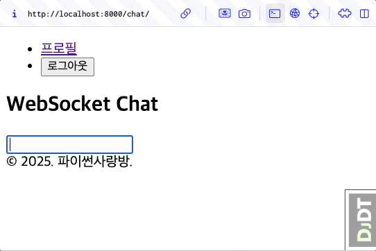

HTML Form + HTMX 기반으로 페이지 전환없이 AI 응답 받기
===============================================================

.. admonition:: `관련 커밋 <https://github.com/pyhub-kr/django-llm-chat-proj/commit/c21bacf0e48a310877b89da2b3bcf27a03cd5683>`_
   :class: dropdown

   * 변경 파일을 한 번에 덮어쓰기 하실려면, :doc:`/utils/pyhub-git-commit-apply` 설치하신 후에, 현재 프로젝트 루트 경로에서 명령어 실행

   .. code-block:: bash

      uv run pyhub-git-commit-apply https://github.com/pyhub-kr/django-llm-chat-proj/commit/c21bacf0e48a310877b89da2b3bcf27a03cd5683

본 페이지는 2:11:29 지점부터 본 영상 끝까지 보시면 됩니다. (라이브 #2 마지막 페이지)

.. raw:: html

  

    <iframe
        src="https://www.youtube.com/embed/9ayknWI-VcI?start=7889"
        frameborder="0"
        allowfullscreen>
    </iframe>
  

----

미리보기
--------

앞선 :doc:`03-vanilla-js` 에서 UI와 책임을 엄격하게 분리하여 채팅 UI를 구현했습니다.
책임 부분의 코드는 특정 폼에 종속적이지 않고 재사용성을 높여 구현이 되었었습니다.

HTMX 라이브러리는 특정 화면에 종속적이지 않고 재사용성이 극대화된 라이브러리인데요.
이를 적용하면 자바스크립트 코드를 모두 제거하고 작성하지 않고도 동일한 동작을 구현할 수 있게 됩니다.
웹 프론트엔드에서 자바스크립트 코드를 대다수 줄일 수 있게 된다면, 웹 프론트엔드 개발 비용을 크게 절감할 수 있게 됩니다.

   앞선 :doc:`03-vanilla-js` 와 동일한 동작을 하지만, 자바스크립트 코드가 없습니다.

HTMX 라이브러리
---------------

HTML을 확장하여 동적인 웹 기능을 구현할려면 자바스크립트 사용이 필수적입니다.
자바스크립트 사용이 필수이지만, 자바스크립트 코드를 작성하는 것은 번거로운 일입니다.

동적인 웹 기능에 대해서도 재사용성을 높여, HTML 속성 만으로 동적인 웹 기능을 구현할 수 있도록 도와주는 라이브러리가 있습니다.
우리는 자바스크립트를 직접 작성하진 않지만 내부에서는 자바스크립트로 동작합니다.

자바스크립트로 구현하던 동작을 HTMX 라이브러리와 함께 HTML 속성 만으로 동일한 동작을 구현할 수 있는 경우가 많습니다.
100% 대응할 수는 없겠지만, 대부분의 동작을 대응할 수 있습니다.

코드가 읽기 쉬워지고 짧아지면 그 만큼 유지보수가 쉬워지고 비용이 절감됩니다. 무엇보다 쉽게 배울 수 있습니다.

.. tab-set::

   .. tab-item:: 자바스크립트 코드

      웹페이지가 로드될 때, ``/melon/songs/`` 경로에서 노래 목록을 가져와서
      ``id="song-list"`` 요소 안에 덮어씁니다.

      .. code-block:: html
         :linenos:

         <table id="song-list"></table>

         

   .. tab-item:: HTMX를 사용하여 동일한 동작

      앞선 코드와 동일한 동작을 자바스크립트 코드를 작성하지 않고도, HTMX 라이브러리를 사용하여 동일한 동작을 구현했습니다.

      .. code-block:: html
         :linenos:

         
         <table hx-get="/melon/songs/"
             hx-trigger="load"
             hx-swap="innerHTML"></table>

* 선언적 (Declarative) 접근

  - 자바스크립트 코드없이, HTML 태그의 속성 지정으로 동작을 정의합니다.

  - 물론 자바스크립트 코드를 통해 동작을 확장할 수도 있습니다.

* 간결하게 RESTful 통신 방식 지원

  - ``GET``, ``POST``, ``PUT``, ``DELETE`` 등의 HTTP 메서드 지원

  - ``hx-get`` 속성, ``hx-post`` 속성, ``hx-put`` 속성, ``hx-delete`` 속성

* 점진적 적용 가능

  - 기존 HTML 코드 구조 변경을 최소화하고, 특정 부분만 HTMX를 적용할 수 있습니다.

* SSE, 웹소켓 등의 확장을 통해 기능을 확장하고 다양한 통신 프로토콜과 연동할 수 있습니다.

.. note::

    HTMX 라이브러리는 Server Driven UI 를 구현하는데 매우 유용합니다.
    Server Driven UI 는 서버에서 렌더링 된 HTML 을 클라이언트에게 전달하는 방식입니다.
    HTMX 만으로 모든 케이스에 대응할 수는 없구요.
    보조적으로 Client 단에서의 UI 구현이 필요하다면 alpine.js 라이브러리를 추천합니다.
    HTMX 라이브러리와 궁합이 아주 좋습니다.

    HTMX + alpine.js + tailwindcss 는 장고 뿐만 아니라, 다양한 프레임워크에서 많이 사용되고 있습니다.
    alpine.js + tailwindcss 기반의 UI 컴포넌트 라이브러리인 `Pines UI <https://devdojo.com/pines>`_ 도 추천드립니다.

    대다수의 웹 애플리케이션은 HTMX + alpine.js + tailwindcss 조합으로 낮은 비용으로 빠르게 대응할 수 있지만,
    아주 복잡한 UI 인터랙션이 필요한 컴포넌트는 리액트/스벨트 등의 UI 라이브러리가 필요할 수도 있습니다.

장고 HTML 템플릿
-------------------

먼저 ``HTMX`` 라이브러리 임포트가 필요한데요. CDN 버전의 라이브러리를 추가하겠습니다. 2025년 1월 기준으로 2.0.4 버전이 최신입니다.
장고 템플릿에서는 상속을 지원합니다. 여러 템플릿에 공통적으로 사용되는 부분은 부모 템플릿에 정의하고, 자식 템플릿은 부모 템플릿을 상속받는 것 만으로 부모 템플릿의 HTML 마크업이 적용됩니다.
현재 프로젝트에서 최상위 부모 템플릿인 ``templates/base.html`` 파일에서 HTMX 라이브러리를 임포트하겠습니다.

.. code-block:: html+django
   :caption: templates/base.html
   :emphasize-lines: 6
   :linenos:

   <!doctype html>
   <html lang="ko">
   <head>
       <meta charset="UTF-8"/>
       <title>튜토리얼 #02</title>
       
   </head>
   <body>
   {# 생략 #}

``chat/templates/chat/index.html`` 파일에서는 `` -->

.. admonition:: 적정 기술
   :class: note

   HTMX는 리액트/스벨트와 같은 SPA (Single Page Application)를 절대 대체할 수 없습니다.

   다만 SPA가 필요하지 않은 수많은 서비스들이, 남들이 하니까, 트렌디해보이니까, 리액트 개발자가 많아보여서 등의 이유로
   리액트/스벨트를 사용하는 경우가 많습니다. 소 잡는 칼로 닭은 잡는 형국이죠.
   SPA가 꼭 필요하다면 써야겠지만, 그렇지 않다면 HTMX를 통해 많은 동작을 구현할 수 있습니다.

   DjangoCon EU 2022의 `From React to htmx on a real-world SaaS product: we did it, and it's awesome! <https://www.youtube.com/watch?v=3GObi93tjZI>`_ 세션에서는 기존의 리액트 애플리케이션을 HTMX 기반으로 마이그레이션한 경험을 나누고 있습니다. 참고해보세요.

   어떤 기술을 알고 있느냐보다, 상황에 맞춰 적절 기술을 사용할 줄 아는 안목이 중요하지 않을까요?
   