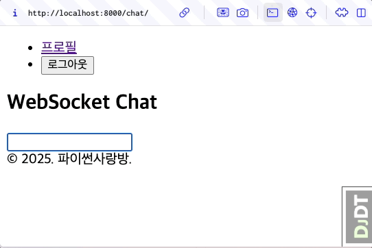

OpenAI LLM을 활용하여 AI 응답 생성
=====================================

.. admonition:: `관련 커밋 <https://github.com/pyhub-kr/django-llm-chat-proj/commit/91eb633465e829892b8b85a29a40c8d1880f7753>`_
   :class: dropdown

   * 변경 파일을 한 번에 덮어쓰기 하실려면, :doc:`/utils/pyhub-git-commit-apply` 설치하신 후에, 현재 프로젝트 루트 경로에서 명령어 실행

   .. code-block:: bash

      uv run pyhub-git-commit-apply https://github.com/pyhub-kr/django-llm-chat-proj/commit/91eb633465e829892b8b85a29a40c8d1880f7753

미리보기
--------

"입력하신 글자는 10 글자입니다." 응답은 너무 부실하죠.
이제 OpenAI LLM을 통해 응답을 생성해봅시다. 서버 응답 루틴만 변경해주면 됩니다.
대화 내역은 관리하지 않기에 맥락은 유지되지 않구요.
매번 대화 메시지를 기반으로 응답을 생성합니다.

   입력 메시지를 OpenAI LLM에게 전달하고, 그 응답을 화면에 추가합니다.

OpenAI LLM 호출
----------------

OpenAI API 호출을 위해 ``openai`` 패키지를 설치합니다.

.. code-block:: text
   :caption: requirements.txt 에 추가

   openai

.. code-block:: bash
   :caption: 라이브러리 설치

   # pip를 사용할 경우
   python -m pip install openai

   # uv를 사용할 경우
   uv pip install openai

``chat/ai.py`` 파일을 생성하고, 아래와 같이 ``make_ai_message`` 함수를 구현합니다.
시스템 프롬프트와 유저 메시지를 인자로 받아 OpenAI Chat Completion API를 호출하고 그 응답을 반환합니다.
모델은 비용이 저렴한 ``gpt-4o-mini`` 로 고정했습니다.

``openai.OpenAi()`` 인스턴스 생성 시에 ``api_key`` 인자로 사용할 API Key를 지정할 수 있는 데요.
지정하지 않았으니, :doc:`../api-key` 페이지에서 설정했던 ``OPENAI_API_KEY`` 환경 변수가 디폴트로 사용됩니다.

.. code-block:: python
   :caption: chat/ai.py 생성
   :linenos:

   from openai import OpenAI

   def make_ai_message(system_prompt: str, human_message: str) -> str:
       client = OpenAI()

       completion = client.chat.completions.create(
           model="gpt-4o-mini",
           messages=[
               {"role": "system", "content": system_prompt},
               {"role": "user", "content": human_message},
           ],
       )
       ai_message = completion.choices[0].message.content
       return ai_message

``chat/views.py`` 에서는 ``make_ai_message`` 함수를 호출하여 생성된 응답을 ``ai_message`` 변수에 할당합니다.

.. code-block:: python
   :caption: chat/views.py 수정
   :linenos:

   from chat.ai import make_ai_message

   def reply(request):
       # ...

       # BEFORE
       # ai_message = f"입력하신 메시지는 {len(human_message)} 글자입니다."

       # AFTER
       system_prompt = "당신은 친절한 AI 어시스턴트입니다."
       try:
           ai_message = make_ai_message(system_prompt, human_message)
       except Exception as e:
           ai_message = f"죄송합니다. 응답을 생성하는 중 오류가 발생했습니다. ({e})"

만약 아래와 같은 에러 메시지가 발생하면, :doc:`../api-key` 페이지의 ``OPENAI_API_KEY`` 환경 변수 부분을 다시 확인해주세요.

.. error::

   죄송합니다. 응답을 생성하는 중 오류가 발생했습니다. (The api_key client option must be set either by passing api_key to the client or by setting the OPENAI_API_KEY environment variable)

환경변수 개념이 익숙하지 않으시다면, 테스트 성격으로 ``client = OpenAI()`` 코드에 ``api_key`` 인자로 사용할 API Key를 하드코딩해서 동작을 확인해보세요. ``api_key`` 인자 지정 후에 잘 동작하신다면 API Key는 문제가 없습니다. 환경변수 이름을 잘못 지정했거나 관련 설정에서 오류가 있을 수 있습니다. :doc:`../api-key` 페이지 내용을 다시 확인해주세요. 하지만 이 방법은 API Key 노출 위험이 있습니다. 동작을 테스트하신 후에 반드시 다시 하드코딩한 API Key를 삭제해주셔야만 합니다.
