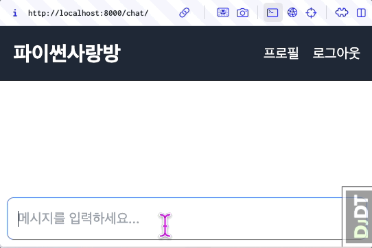
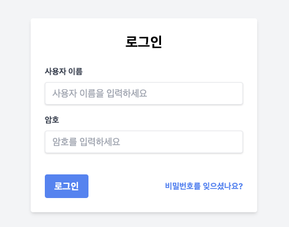

tailwindcss/daisyui를 활용한 스타일링
=====================================

.. admonition:: `관련 커밋 <https://github.com/pyhub-kr/django-llm-chat-proj/commit/d338364896984aa0a0e535926fea77d60c88347d>`_
   :class: dropdown

   * 변경 파일을 한 번에 덮어쓰기 하실려면, :doc:`/utils/pyhub-git-commit-apply` 설치하신 후에, 현재 프로젝트 루트 경로에서 명령어 실행

   .. code-block:: bash

      uv run pyhub-git-commit-apply https://github.com/pyhub-kr/django-llm-chat-proj/commit/d338364896984aa0a0e535926fea77d60c88347d

미리보기
--------

   디자인을 추가하고 스타일링을 합니다.

tailwindcss 와 UI 컴포넌트 라이브러리
-------------------------------------

`https://tailwindcss.com <https://tailwindcss.com>`_

``tailwindcss`` 는 미리 정의된 유틸리티 클래스를 제공해줍니다. 이를 통해 개발자가 CSS 없이 HTML 코드 만으로 빠르게 디자인을 적용할 수 있습니다. 개발자가 HTML 코드 만으로 응집력있게 UI를 설계하고 컴포넌트를 관리하는 것이 쉬워집니다.
 

무엇보다 LLM과 궁합이 좋아서 `"tailwindcss 기반으로 유저명/암호 로그인 HTML 페이지를 작성해줘." <https://chatgpt.com/share/6789a91a-f7c4-800c-abfa-8aa142a954fe>`_ 라고 요청하면 대부분 만족스러운 결과를 얻을 수 있습니다. 물론 LLM 통해서 수정 요청도 잘 처리됩니다.

   ChatGPT가 뚝딱 생성해준 tailwindcss 기반의 로그인 페이지

``tailwindcss`` 기반으로 다양한 컴포넌트 라이브러리들이 많고, 미리 스타일링된 컴포넌트를 사용해서 빠르게 디자인을 적용할 수 있습니다.
이 중에 ``daisyUI`` 를 적용하여, 간결하게 채팅 화면을 구성해보겠습니다.

* ``daisyUI`` : `https://daisyui.com/components/ <https://daisyui.com/components/>`_

* ``pines.ui`` : `https://devdojo.com/pines/docs/ <https://devdojo.com/pines/docs/>`_

  - alpine.js 라이브러리와 함께 동적인 UI 컴포넌트를 제공합니다. (추천)

* ``flowbite`` : `https://flowbite.com/blocks/ <https://flowbite.com/blocks/>`_

.. tip::

   유려한 UI 컴포넌트를 사용하기 위해서 반드시 React를 사용해야 한다고 오해하시는 분들이 많습니다. 하지만 이는 사실이 아닙니다.  
   React는 HTML, CSS, JavaScript를 활용하는 UI 라이브러리일 뿐이며, 실제로 React에서도 TailwindCSS와 같은 도구를 많이 활용합니다.  
   React를 사용하지 않더라도, HTML, CSS, JavaScript를 사용하는 어떤 코드나 라이브러리에서도 충분히 유려한 UI 컴포넌트를 만들거나, 다양한 UI 컴포넌트를 사용할 수 있습니다.  

   Django 템플릿에서도 TailwindCSS와 같은 도구를 활용하여 유려한 UI 컴포넌트를 제작할 수 있습니다. Django 템플릿에서 HTML 코드를 생성하면서 TailwindCSS 클래스를 추가하거나,
   JavaScript 라이브러리를 연동하여 다양한 동작을 구현할 수 있습니다.

변경내역
--------

전체 레이아웃 구성과 상단 네비게이션에 회원가입, 로그인, 프로필, 로그아웃 메뉴 추가
~~~~~~~~~~~~~~~~~~~~~~~~~~~~~~~~~~~~~~~~~~~~~~~~~~~~~~~~~~~~~~~~~~~~~~~~~~~~~~~~~~~~~~~~~

빠른 실습을 위해 CDN 버전의 ``tailwindcss`` 와 ``daisyUI`` 를 사용해보겠습니다.
CDN 버전은 프로젝트 내에서 사용하지 않는 스타일과 컴포넌트가 있어 파일 크기가 큽니다.

실서비스에서는 ``django-tailwindcss`` 라이브러리를 사용하여 필요한 스타일만 포함해서 파일 크기를 줄여 성능을 개선할 수 있습니다.
(참고: :doc:`/django/tailwind/index`)

.. code-block:: html+django
   :caption: templates/base.html
   :linenos:
   :emphasize-lines: 9-10,13,14-34,36,39

    <!doctype html>
    <html lang="ko">

    <head>
        <meta charset="UTF-8"/>
        <title>튜토리얼 #02</title>
        

        <link href="//cdn.jsdelivr.net/npm/daisyui@latest/dist/full.min.css" rel="stylesheet" type="text/css"/>
        
    </head>

    <body class="min-h-screen">
    <nav class="bg-gray-800 p-4 w-full z-50">
        

            <h1 class="text-white text-2xl font-bold">
                <a href="/" class="hover:text-gray-300">파이썬사랑방</a>
            </h1>
            <ul class="flex space-x-4 text-white">
                
                    <li><a href="" class="hover:text-gray-300">회원가입</a></li>
                    <li><a href="" class="hover:text-gray-300">로그인</a></li>
                
                    <li><a href="" class="hover:text-gray-300">프로필</a></li>
                    <li>
                        <form action="/accounts/logout/" method="post" class="inline-block">
                            
                            <button type="submit" class="hover:text-gray-300">로그아웃</button>
                        </form>
                    </li>
                
            </ul>
        

    </nav>

    <main class="overflow-y-hidden flex">
        
        
    </main>
    </body>

    </html>

채팅 화면 개선
~~~~~~~~~~~~~~~

채팅 화면에서도 tailwindcss를 적용해서 이렇게 간결하게 스타일링을 할 수 있습니다.

.. code-block:: html+django
   :caption: chat/templates/chat/index.html
   :linenos:
   :emphasize-lines: 5,7,18

   

   

       

           

           

           <form id="form"
                 hx-post=""
                 hx-target="#messages"
                 hx-swap="beforeend"
                 hx-on::after-request="this.reset();">
                 
                 <input type="text" name="message"
                    class="w-full p-3 border border-gray-300 rounded-lg shadow-sm focus:outline-none focus:border-blue-500"
                    autocomplete="off"
                    placeholder="메시지를 입력하세요..."/>
           </form>
       

   

AI 응답에 ``daisyUI`` 컴포넌트 적용
~~~~~~~~~~~~~~~~~~~~~~~~~~~~~~~~~~~

AI 응답에서는 ``daisyUI`` 의 `Chat bubble <https://daisyui.com/components/chat/>`_ 컴포넌트를 사용하겠습니다.
아래의 같이 ``chat chat-start`` 클래스와 ``chat-bubble`` 클래스를 사용하는 것 만으로 ``Chat bubble`` 컴포넌트를 사용하실 수 있습니다.

.. tab-set::

   .. tab-item:: View에서 직접 HTML 문자열 반환

      View에서의 HTML 문자열 조합은 간단한 값 조합이라면 충분하지만,
      조금만 복잡해져도 대응이 어렵고 유지보수가 어렵습니다.
      더군다나 파이썬 코드 내에서 HTML 코드는 파이썬 문자열로서 취급되기에 문법 강조도 안 되어 코드 읽기도 어렵습니다.
      특별한 경우가 아니라면 장고 템플릿 시스템을 활용하는 것을 권장합니다.

      .. code-block:: python
         :emphasize-lines: 6,8-15
         :linenos:

         # chat/views.py

         def reply(request):
             if request.method == 'POST':
                 # ...
                 # https://daisyui.com/components/chat/
                 return HttpResponse(
                     format_html(
                         """
                             

{}

                             

{}

                         """,
                         human_message,
                         ai_message,
                     )
                 )
              # ...

   .. tab-item:: 장고 템플릿 시스템을 활용한 렌더링

      템플릿 시스템을 활용하면 파이썬 코드와 HTML 코드를 분리해서 유지보수가 쉬워집니다.
      HTML 문자열 조합 뿐만 아니라 이메일/푸쉬 메시지 문자열 조합에도 템플릿 시스템을 활용하세요.

      .. code-block:: python
         :emphasize-lines: 7-10
         :linenos:

         # chat/views.py
         from django.shortcuts import render

         def reply(request):
             if request.method == 'POST':
                 # ...
                 return render(request, 'chat/_chat_message.html', {
                     "human_message": human_message,
                     "ai_message": ai_message,
                 })
             # ...

      .. code-block:: html+django

         {# chat/templates/chat/_chat_message.html #}
         

{{ human_message }}

         

{{ ai_message }}

