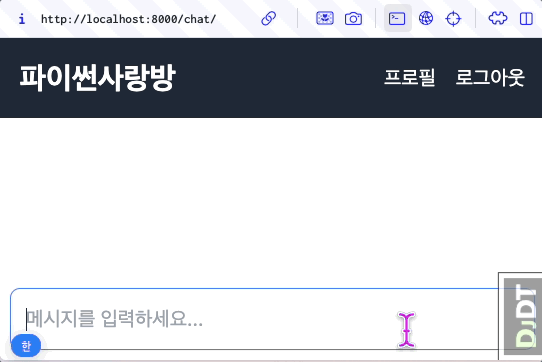
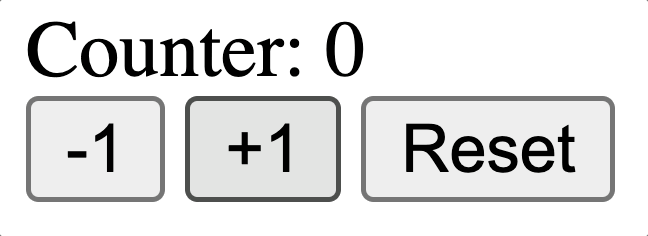

alpine.js를 활용한 채팅폼 enable/focus 상탯값 처리
======================================================

.. admonition:: `관련 커밋 <https://github.com/pyhub-kr/django-llm-chat-proj/commit/62e083731c222d848166db42d1ebffca12387180>`_
   :class: dropdown

   * 변경 파일을 한 번에 덮어쓰기 하실려면, :doc:`/utils/pyhub-git-commit-apply` 설치하신 후에, 현재 프로젝트 루트 경로에서 명령어 실행

   .. code-block:: bash

      uv run pyhub-git-commit-apply https://github.com/pyhub-kr/django-llm-chat-proj/commit/62e083731c222d848166db42d1ebffca12387180

.. raw:: html

    45분 37초부터 54분 32초까지 보시면 됩니다.

    

        <iframe
            src="https://www.youtube.com/embed/Lzy9F_Hv4z8?si=jGIgze35S5n27ztg&start=2737"
            frameborder="0"
            allowfullscreen>
        </iframe>
    

----

미리보기
--------

   새로운 AI 응답을 받으면 자동으로 화면 스크롤이 부드럽게 아래로 이동하고, 응답 대기 중에는 입력 폼 자동 비활성화

alpine.js 소개
--------------

웹 프론트엔드에서 UI 동작을 구현하기 위해서는 자바스크립트 구현이 필수적입니다.

alpine.js 라이브러리는 경량 자바스크립트 라이브러리로서 HTML 속성으로 간단하고 직관적으로 상태 관리와 UI 상호 작용을 구현할 수 있도록 도와줍니다.
리액트와 달리 별도의 JSX 문법을 배우지 않아도 되며, HTML 속성을 통해 상태 관리와 이벤트 핸들러를 쉽게 구현할 수 있습니다.
그래서 별도의 빌드도 필요없습니다.

아래는 `카운터 컴포넌트 예시 <https://codesandbox.io/p/sandbox/xt9n2s>`_ 입니다.

* ``x-data`` 속성으로 상탯값 및 관련 메서드를 정의할 수 있습니다.
* ``@`` 접두사로 이벤트 핸들러를 정의할 수 있습니다.
* ``x-text`` 속성으로 상탯값을 텍스트로 출력할 수 있습니다.

.. code-block:: text

    <html>
    <head>
       
    </head>
    <body>
        

            Counter: 
            

                <button @click="count--">-1</button>
                <button @click="count++">+1</button>
                <button @click="count = 0">Reset</button>
            

        

    </body>
    </html>

HTMX 라이브러리와 함께 사용하면 더욱 강력합니다.
HTMX 응답으로 alpine.js 컴포넌트 코드를 응답하면 적용된 요소에서 별다른 설정없이 alpine.js 컴포넌트가 동작합니다.

컴포넌트 팩키징이 필요하다면, `django-cotton <https://django-cotton.com/>`_ 라이브러리를 통해 장고 템플릿 기반으로 관리하시길 추천드립니다.
``cotton/counter-html`` 경로에 카운터 컴포넌트를 정의했다면, 장고 템플릿에서 아래와 같이 컴포넌트를 사용하실 수 있습니다.

.. code-block:: html+django

   <c-counter initial=0 />
   <c-counter initial=10 />
   <c-counter initial=20 />

alpine.js 라이브러리 추가
-------------------------

``alpine.js`` 설치 공식 문서 : https://alpinejs.dev/essentials/installation

.. code-block:: html
   :caption: ``templates/base.html``
   :emphasize-lines: 2

       
       
   </head>

응답 대기 중에는 입력필드 비활성화
------------------------------------

채팅 메시지는 그때 그때 ``id=messages`` 요소에 추가되므로 상탯값으로 관리하지 않았습니다.
모든 UI 관련 대상들을 상탯값으로 관리할 필요는 없습니다. 필요한 상탯값만 관리하시면 됩니다.

* ``x-data="{ enable: true }"`` 속성으로 ``enable`` 상탯값을 정의합니다.

  - 해당 요소 안에서 이 상탯값을 사용할 수 있습니다.
  - 커스텀 이벤트 ``enable`` 이벤트 핸들러에서는 ``enable`` 상탯값을 ``true`` 로 설정합니다.
  - 커스텀 이벤트 ``disable`` 이벤트 핸들러에서는 ``enable`` 상탯값을 ``false`` 로 설정합니다.
  - ``input[name=message]`` 요소에 ``:disabled="!enable"`` 속성을 추가하여, ``enable`` 상탯값이 ``false`` 일 때 입력 필드를 비활성화합니다. 그리고 ``x-effect="if(enable) $el.focus()"`` 속성을 추가하여, ``enable`` 상탯값이 ``true`` 로 변경되었을 때 입력 필드로 포커스를 이동시킵니다.

* ``hx-on::before-request`` 이벤트 핸들러는 요청 전송 전에 호출됩니다.

  - ``disable`` 이벤트를 발생시켜 ``enable`` 상탯값을 ``false`` 로 설정합니다.

* ``hx-on::after-settle`` 이벤트 핸들러는 요소가 HTMX를 통한 변경에서 완전히 렌더링된 후에 호출됩니다.

  - 즉 메시지 내용의 변화가 있다면 자동으로 화면 스크롤이 부드럽게 아래로 이동하고, 입력 필드를 다시 활성화시킵니다.

.. code-block:: text
   :caption: ``chat/templates/chat/index.html``
   :emphasize-lines: 6-8,12-15,22-23,30-31
   :linenos:

   

   

       

           

           

           <form id="form"
                 hx-post=""
                 hx-target="#messages"
                 hx-swap="beforeend"
                 hx-on::before-request="htmx.trigger(this, 'disable');"
                 hx-on::after-request="this.reset();">
               
               <input type="text" name="message"
                      class="w-full p-3 border border-gray-300 rounded-lg shadow-sm focus:outline-none focus:border-blue-500"
                      autocomplete="off"
                      autofocus="autofocus"
                      placeholder="메시지를 입력하세요..."
                      :disabled="!enable"
                      x-effect="if(enable) $el.focus()"/>
           </form>
       

   
