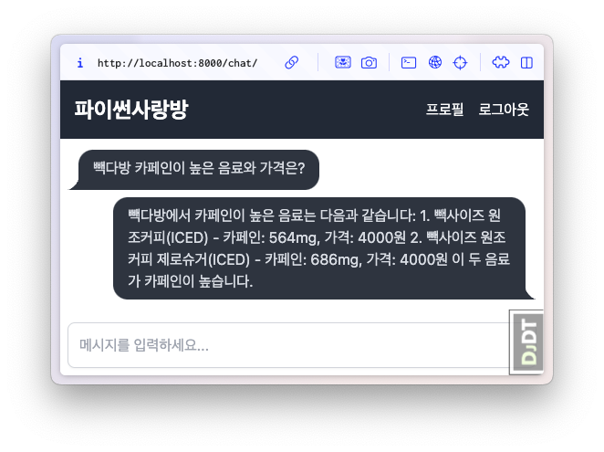

AI RAG 응답 생성
====================

.. admonition:: 관련 커밋
   :class: dropdown

   * `VectorStore 생성명령 make_vector_store 구현 <https://github.com/pyhub-kr/django-llm-chat-proj/commit/dac2dd355cfe152fcba08eaa1285ed6ef03d3b68>`_
   * `빽다방 RAG를 통한 답변 생성 <https://github.com/pyhub-kr/django-llm-chat-proj/commit/6f0426c43f76bdee0cd9dce1cca37c7c9d3746ea>`_
   
   * 변경 파일을 한 번에 덮어쓰기 하실려면, :doc:`/utils/pyhub-git-commit-apply` 설치하신 후에, 현재 프로젝트 루트 경로에서 명령어 실행

   .. code-block:: bash

      uv run pyhub-git-commit-apply https://github.com/pyhub-kr/django-llm-chat-proj/commit/dac2dd355cfe152fcba08eaa1285ed6ef03d3b68
      uv run pyhub-git-commit-apply https://github.com/pyhub-kr/django-llm-chat-proj/commit/6f0426c43f76bdee0cd9dce1cca37c7c9d3746ea

미리보기
--------

:doc:`../typical/index` 에서 다뤘던 RAG 로직을 장고 프로젝트에 적용합니다.

#. 먼저 커스텀 장고 관리명령 ``make_vector_store`` 를 구현하여, ``load``, ``split``, ``embed``, ``store`` 단계를 한 번에 수행하여 VectorStore를 생성합니다.
#. 생성된 VectoreStore를 장고 서버에서 로딩하여, 빽다방 메뉴 정보를 RAG로서 활용하여 답변을 생성합니다.

   RAG 응답 수신 화면

VectorStore 생성명령 make_vector_store 구현
---------------------------------------------------

지식파일 준비
~~~~~~~~~~~~~~~~~~

먼저 빽다방.txt 지식 파일 원본을 ``chat/assets/빽다방.txt`` 경로에 복사합니다.
``make_vector_store`` 명령을 실행할 때 원본 지식 파일의 경로를 지정합니다.

.. admonition:: 빽다방.txt
   :class: dropdown

   .. code-block:: text

       1. 아이스티샷추가(아.샷.추)
         - SNS에서 더 유명한 꿀팁 조합 음료 :) 상콤달콤한 복숭아맛 아이스티에 진한 에스프레소 샷이 어우러져 환상조합
         - 가격: 3800원

       2. 바닐라라떼(ICED)
         - 부드러운 우유와 달콤하고 은은한 바닐라가 조화를 이루는 음료
         - 가격: 4200원

       3. 사라다빵
         - 빽다방의 대표메뉴 :) 추억의 감자 사라다빵
         - 가격: 3900원

       4. 빽사이즈 아메리카노(ICED)
         - 에스프레소 4샷이 들어가 깊고 진한 맛의 아메리카노
         - 가격: 3500원

       5. 빽사이즈 원조커피(ICED)
         - 빽다방의 BEST메뉴를 더 크게 즐겨보세요 :) [주의. 564mg 고카페인으로 카페인에 민감한 어린이, 임산부는 섭취에 주의바랍니다]
         - 가격: 4000원

       6. 빽사이즈 원조커피 제로슈거(ICED)
         - 빽다방의 BEST메뉴를 더 크게, 제로슈거로 즐겨보세요 :) [주의. 686mg 고카페인으로 카페인에 민감한 어린이, 임산부는 섭취에 주의바랍니다]
         - 가격: 4000원

       7. 빽사이즈 달콤아이스티(ICED)
         - 빽다방의 BEST메뉴를 더 크게 즐겨보세요 :) 시원한 복숭아맛 아이스티
         - 가격: 4300원

       8. 빽사이즈 아이스티샷추가(ICED)
         - SNS에서 더 유명한 꿀팁 조합 음료 :) 상콤달콤한 복숭아맛 아이스티에 진한 에스프레소 2샷이 어우러져 환상조합
         - 가격: 4800원

       9. 빽사이즈 아이스티 망고추가+노란빨대
         - SNS핫메뉴 아이스티에 망고를 한가득:)
         - 가격: 6300원

       10. 빽사이즈 초코라떼(ICED)
         - 빽다방의 BEST메뉴를 더 크게 즐겨보세요 :) 진짜~완~전 진한 초코라떼
         - 가격 : 5500원

의존 라이브러리
~~~~~~~~~~~~~~~~~~~

.. code-block:: text
   :caption: ``requirements.txt`` 파일에 없다면 추가하고 라이브러리 설치

    openai
    langchain
    langchain-core
    scikit-learn
    numpy

.. code-block:: bash

   uv pip install -r requirements.txt

커스텀 settings 설정 추가
~~~~~~~~~~~~~~~~~~~~~~~~~~~~

.. code-block:: python
   :caption: ``mysite/settings.py`` 파일에 추가

    # 암시적으로 OPENAI_API_KEY 환경변수를 사용하지 않고, 명시적으로 OPENAI_API_KEY 설정을 참조하겠습니다.
    # 설정을 추가하여 LLM마다 다른 API 키를 명시적으로 지정할 수도 있습니다.
    OPENAI_API_KEY = env.str("OPENAI_API_KEY", default=None)

    # RAG 임베딩 모델도 명시적으로 설정/주입하겠습니다.
    # 구동환경에 따라 환경변수를 통해 손쉽게 임베딩 모델을 변경할 수 있습니다.
    RAG_EMBEDDING_MODEL = env.str("RAG_EMBEDDING_MODEL", default="text-embedding-3-small")

    # 임베딩 파일 경로도 명시적으로 설정/주입하겠습니다.
    VECTOR_STORE_PATH = env.str(
        "VECTOR_STORE_PATH",
        default=(BASE_DIR / "vector_store.pickle"),
    )

.. admonition:: 환경변수 값 참조는 settings 에서만 수행하고, 코드에서는 settings 만 참조토록 합니다.
   :class: tip

   #. 모든 환경변수 참조를 ``settings`` 에 모아두면 설정값 관리가 단순해집니다. 환경변수 이름이나 디폴트 값을 변경해야할 때 여러 파일을 수정할 필요없이 ``settings`` 파일만 수정하면 됩니다.
   #. 애플리케이션 코드에서 의미있는 설정 이름을 참조하므로,코드의 의도가 명확해지고 IDE 자동완성 기능을 통해 설정값을 쉽게 참조할 수 있습니다.
   #. 애플리케이션 코드에서 환경변수를 직접 참조하지 않으므로 보안이 강화됩니다.
   #. 환경변수 값에 대한 값 변환을 ``settings`` 에서 일원화하여 처리할 수 있습니다.
   #. 테스트 코드에서 ``settings`` 값을 쉽게 변경/주입할 수 있어, 환경변수를 직접 조작하는 것보다 테스트 작성과 관리가 용이합니다.
    
이전에 구현한 RAG 모듈
~~~~~~~~~~~~~~~~~~~~~~

:doc:`../typical/index` 에서 구현한 RAG 모듈을 재사용합니다. 아래 코드를 복사해주세요.

``settings`` 에서 다음 2가지 설정을 참조합니다.

* ``OPENAI_API_KEY``
* ``RAG_EMBEDDING_MODEL``

.. admonition:: ``chat/rag.py``
   :class: dropdown

   .. code-block:: python

        import pickle
        from pathlib import Path
        from typing import List
        from langchain_core.documents import Document
        from sklearn.metrics.pairwise import cosine_similarity
        import numpy as np
        import openai
        from django.conf import settings

        client = openai.Client(api_key=settings.OPENAI_API_KEY)

        def load(txt_file_path: Path) -> List[Document]:
            지식: str = txt_file_path.open("rt", encoding="utf-8").read()
            return [
                Document(
                    metadata={"source": txt_file_path.name},
                    page_content=지식,
                )
            ]

        def split(src_doc_list: List[Document]) -> List[Document]:
            new_doc_list = []
            for doc in src_doc_list:
                for new_page_content in doc.page_content.split("\n\n"):
                    new_doc_list.append(
                        Document(
                            metadata=doc.metadata.copy(),
                            page_content=new_page_content,
                        )
                    )
            return new_doc_list

        class VectorStore(list):
            embedding_model = settings.RAG_EMBEDDING_MODEL

            @classmethod
            def make(cls, doc_list: List[Document]) -> "VectorStore":
                vector_store = cls()
                for doc in doc_list:
                    text = doc.page_content
                    response = client.embeddings.create(model=cls.embedding_model, input=text)
                    vector_store.append(
                        {
                            "text": text,
                            "embedding": response.data[0].embedding,
                        }
                    )
                return vector_store

            @classmethod
            def load(cls, vector_store_path: Path) -> "VectorStore":
                with open(vector_store_path, "rb") as f:
                    return pickle.load(f)

            def save(self, vector_store_path: Path) -> None:
                with vector_store_path.open("wb") as f:
                    pickle.dump(self, f)
                    print(f"saved vector store to {vector_store_path}")

            def search(self, question: str, top_k: int = 4) -> List[Document]:
                # pip install -U scikit-learn
                response = client.embeddings.create(model=self.embedding_model, input=question)
                question_embedding = response.data[0].embedding
                embedding_list = [row["embedding"] for row in self]

                # 모든 데이터와 코사인 유사도 계산
                similarities = cosine_similarity([question_embedding], embedding_list)[0]

                # 유사도가 높은 순으로 정렬하여 top_k 개 선택
                top_indices = np.argsort(similarities)[::-1][:top_k]

                return [
                    Document(
                        metadata={"similarity": similarities[idx]},
                        page_content=self[idx]["text"],
                    )
                    for idx in top_indices
                ]

        def print_prices(input_tokens: int, output_tokens: int) -> None:
            input_price = (input_tokens * 0.150 / 1_000_000) * 1_500
            output_price = (output_tokens * 0.600 / 1_000_000) * 1_500
            print("input: tokens {}, krw {:.4f}".format(input_tokens, input_price))
            print("output: tokens {}, krw {:4f}".format(output_tokens, output_price))

커스텀 장고 명령 make_vector_store 구현
~~~~~~~~~~~~~~~~~~~~~~~~~~~~~~~~~~~~~~~

장고에서는 ``python manage.py ...`` 명령을 통해 다양한 장고 명령을 실행할 수 있습니다.

각 장고 명령은 장고앱 폴더 안에 ``management/commands/`` 폴더 안에 구현합니다.
별도로 등록과정은 없으며 해당 장고 앱이 ``settings.INSTALLED_APPS`` 에 등록되어 있으면
그 장고앱의 장고 명령을 실행할 수 있습니다.

명령 이름은 파일명입니다. ``chat/management/commands/make_vector_store.py`` 경로에 명령을 구현했다면
``python manage.py make_vector_store`` 명령으로 실행할 수 있으며, 명령 옵션도 명령 파일에 정의하여 지원할 수 있습니다.

모든 장고 명령은 ``BaseCommand`` 클래스를 상속받아 구현합니다.

* 원본 지식 파일의 경로를 받도록 옵션을 추가했습니다.
* 명령이 수행되면 ``handle`` 메서드가 호출됩니다. ``handle`` 메서드에서 원본 지식 파일을 읽어들여 ``chat.rag`` 모듈을 통해 벡터 스토어를 생성하고, ``settings.VECTOR_STORE_PATH`` 경로에 저장합니다.

이 과정은 지식 파일이 변경되었을 때마다 수행되어야하며, 생성된 벡터 스토어 파일은 장고 서버에 배포하고 장고 서버를 재시작시켜 다시 로딩해야 합니다.

.. code-block:: python
   :caption: ``chat/management/commands/make_vector_store.py`` 파일

    from pathlib import Path
    from django.conf import settings
    from django.core.management import BaseCommand
    from chat import rag

    class Command(BaseCommand):
        def add_arguments(self, parser):
            parser.add_argument(
                "txt_file_path",
                type=str,
                help="VectorStore로 저장할 원본 텍스트 파일 경로",
            )

        def handle(self, *args, **options):
            txt_file_path = Path(options["txt_file_path"])

            doc_list = rag.load(txt_file_path)
            print(f"loaded {len(doc_list)} documents")

            doc_list = rag.split(doc_list)
            print(f"split into {len(doc_list)} documents")

            vector_store = rag.VectorStore.make(doc_list)
            vector_store.save(settings.VECTOR_STORE_PATH)

빽다방 RAG를 통한 답변 생성
------------------------------

``make_ai_message`` 메서드는 삭제하고, 빽다방 AI 클래스를 정의했습니다.

클래스로 호출 가능한 인스턴스를 사용하여 함수처럼 사용할 수 있습니다.
인스턴스 생성 및 벡터 스토어 로딩은 서버 시작 시 한 번만 수행됩니다.

PaikdabangAI
~~~~~~~~~~~~~~

.. code-block:: python

    import openai
    from django.conf import settings
    from . import rag

    # 명시적으로 OPENAI_API_KEY 설정을 지정합니다.
    client = openai.Client(api_key=settings.OPENAI_API_KEY)

    # def make_ai_message(system_prompt: str, human_message: str) -> str:
    #     completion = client.chat.completions.create(
    #         model="gpt-4o-mini",
    #         messages=[
    #             {"role": "system", "content": system_prompt},
    #             {"role": "user", "content": human_message},
    #         ],
    #     )
    #     ai_message = completion.choices[0].message.content

    #     return ai_message

    class PaikdabangAI:
        # 서버 시작할 때에만 1회 호출되어, 벡터 스토어 파일을 로딩합니다.
        def __init__(self):
            try:
                self.vector_store = rag.VectorStore.load(settings.VECTOR_STORE_PATH)
                print(f"Loaded vector store {len(self.vector_store)} items")
            except FileNotFoundError as e:
                print(f"Failed to load vector store: {e}")
                self.vector_store = rag.VectorStore()

        # 매 AI 답변을 요청받을 때마다 호출됩니다.
        def __call__(self, question: str) -> str:
            # 답변과 유사한 지식을 찾습니다.
            search_doc_list = self.vector_store.search(question)
            # 찾은 지식을 문자열로 변환합니다.
            지식 = "\n\n".join(doc.page_content for doc in search_doc_list)

            res = client.chat.completions.create(
                messages=[
                    {
                        "role": "system",
                        # 지식을 포함한 시스템 프롬프트를 생성합니다.
                        "content": f"넌 AI Assistant. 모르는 건 모른다고 대답.\n\n[[빽다방 메뉴 정보]]\n{지식}",
                    },
                    {
                        "role": "user",
                        # 커밋에서는 질문이 하드코딩되어있습니다.
                        "content": question,
                    },
                ],
                model="gpt-4o-mini",
                temperature=0,
            )
            ai_message = res.choices[0].message.content

            return ai_message

    # 함수처럼 사용할 수 있는 인스턴스를 생성합니다.
    # 인자로 질문 문자열 인자 하나만 받습니다.
    ask_paikdabang = PaikdabangAI()

ask_paikdabang
~~~~~~~~~~~~~~~

``make_ai_message`` 함수가 아닌, ``ask_paikdabang`` 함수 호출을 통해 답변을 생성합니다.

.. code-block:: python
   :caption: ``chat/views.py``

    # from chat.ai import make_ai_message
    from chat.ai import ask_paikdabang

    def reply(request):
        # ...

        # system_prompt = "당신은 친절한 AI 어시스턴트입니다."
        try:
            # ai_message = make_ai_message(system_prompt, human_message)
            ai_message = ask_paikdabang(human_message)
        except Exception as e:
            ai_message = f"죄송합니다. 응답을 생성하는 중 오류가 발생했습니다. ({e})"

        # ...
