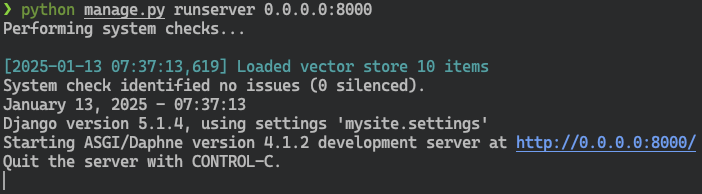

ColorLog
========

.. admonition:: `관련 커밋 <https://github.com/pyhub-kr/django-llm-chat-proj/commit/e53acc7e1a68eb148f30f48857b27005286602cd>`_
   :class: dropdown

   * 변경 파일을 한 번에 덮어쓰기 하실려면, :doc:`/utils/pyhub-git-commit-apply` 설치하신 후에, 현재 프로젝트 루트 경로에서 명령어 실행

   .. code-block:: bash

      uv run pyhub-git-commit-apply https://github.com/pyhub-kr/django-llm-chat-proj/commit/e53acc7e1a68eb148f30f48857b27005286602cd

미리보기
--------

애플리케이션을 상황을 파악하는 방법으로서 로그가 있습니다.
로그는 단순하게는 ``print(...)`` 함수를 통해 출력할 수 있는 데요. 이는 로그 처리 방식까지 "표준출력"으로서 결정해버린 것입니다.
표준출력된 로그를 끌려면 해당 ``print(...)`` 함수를 모두 찾아서 수정해야 합니다. 너무 번거롭죠.

로그는 생성하되 상황에 따라 다른 방식으로 처리할 수 있어야 하며, 포맷도 다양하게 적용할 수 있어야 합니다.
파이썬의 표준 라이브러리인 ``logging`` 모듈에서 이를 지원하며, 장고의 로깅 기능도 이를 활용합니다.

``logging`` 모듈을 통해 로그를 남기면, 아래와 같이 임의 포맷으로 출력할 수도 있고, 로깅 코드를 건드리지 않고 ``settings`` 변경 만으로
파일에 저장하거나 메일로 보내도록 설정할 수도 있습니다. 그리고 로그가 필요없을 때에는 해당 로그 처리를 끄는 것도 가능합니다.

   로그에 색상 적용된 서버 로그 화면

settings.LOGGING
------------------

색상 지원을 위해 ``colorlog`` 라이브러리를 설치해야 합니다.

.. code-block:: text
   :caption: requirement.txt 파일에 추가

   colorlog

.. code-block:: bash

   uv pip install colorlog 

``mysite/settings.py`` 파일에 로깅 설정을 아래와 같이 추가합니다.
``chat`` 로거는 ``settings.DEBUG = True`` 상황에서만 ``debug_console`` 핸들러에서 ``color`` 포맷터를 통해 출력됩니다.

.. code-block:: python
   :caption: ``mysite/settings.py``

    # ...

    LOGGING = {
        "version": 1,
        "disable_existing_loggers": False,  # 기본 로깅을 비활성화하지 않음
        "filters": {
            "require_debug_true": {
                "()": "django.utils.log.RequireDebugTrue",
            },
        },
        "formatters": {
            "color": {
                "()": "colorlog.ColoredFormatter",
                "format": "%(log_color)s[%(asctime)s] %(message)s",
                "log_colors": {
                    "DEBUG": "cyan",
                    "INFO": "green",
                    "WARNING": "yellow",
                    "ERROR": "red",
                    "CRITICAL": "bold_red",
                },
            },
        },
        "handlers": {
            "debug_console": {
                "level": "DEBUG",
                "class": "logging.StreamHandler",
                "filters": ["require_debug_true"],
                "formatter": "color",
            },
        },
        "loggers": {
            "chat": {
                "handlers": ["debug_console"],
                "level": "DEBUG",
            }
        },
    }

``chat/ai.py`` 파일과 ``chat/rag.py`` 파일에서는 아래와 같이 ``getLogger(__name__)`` 호출을 통해 로거 인스턴스를 생성합니다.

.. code-block:: python
   :caption: ``chat/ai.py``

    from logging import getLogger

    logger = getLogger(__name__)

``__name__`` 은 내장 변수로서 파이썬 실행 진입점이 되는 파이썬 파일에서는 ``__name__`` 이 ``__main__`` 이 되지만, 그 외의 임포트되는 파일에서는 모듈 경로가 됩니다. ``chat/ai.py`` 파일은 ``"chat.ai"`` 가 되며, ``chat/rag.py`` 파일은 ``"chat.rag"`` 가 됩니다.
위 설정에서 ``loggers`` 에 ``chat`` 이라는 로거를 지정했기에, ``chat`` 아래의 모든 로거에 대해서 ``DEBUG`` 이상의 레벨의 로그를 ``debug_console`` 핸들러를 통해 처리하도록 설정했습니다.

로거 적용
--------------

``print(...)`` 함수를 사용하는 모든 코드를 찾아서 아래와 같이 ``logger.debug(...)`` 함수를 통해 로깅하도록 변경합니다.

.. code-block:: python
   :caption: ``chat/ai.py``

    import logging
    logger = logging.getLogger(__name__)

    # 아래 모든 print를 logger.debug로 변경

    # print(f"Loaded vector store {len(self.vector_store)} items")
    logger.debug("Loaded vector store %s items", len(self.vector_store))

    # print(f"Failed to load vector store: {e}")
    logger.error("Failed to load vector store: %s", e)

    # ...

.. code-block:: python
   :caption: ``chat/rag.py``

    import logging
    logger = logging.getLogger(__name__)

    # 아래 모든 print를 logger.debug로 변경

    # print(f"saved vector store to {vector_store_path}")
    logger.debug(f"saved vector store to %s", vector_store_path)

.. admonition:: 로깅 인자를 직접 조합하지 마세요.
   :class: warning

   .. code-block:: python

       # ❌ 올바르지 않은 예
       logger.debug("Loaded vector store %s items" % len(self.vector_store))

       # ✅ 올바른 예
       logger.debug("Loaded vector store %s items", len(self.vector_store), extra={})

   로깅 템플릿과 인자를 분리하면

   * 다국어 지원 : 메시지 본문만 손쉽게 다른 언어로 교체하거나 번역할 수 있습니다.
   * 메시지와 데이터를 분리해두면, 향후 로그 파싱 및 분석 툴에서 메타정보나 통계치로 활용하기 유리합니다.
   * 민감 정보가 포함된 로그의 경우 핸들러를 통해 안전하게 처리하여 잘못 출력하는 경우를 방지할 수 있습니다.
