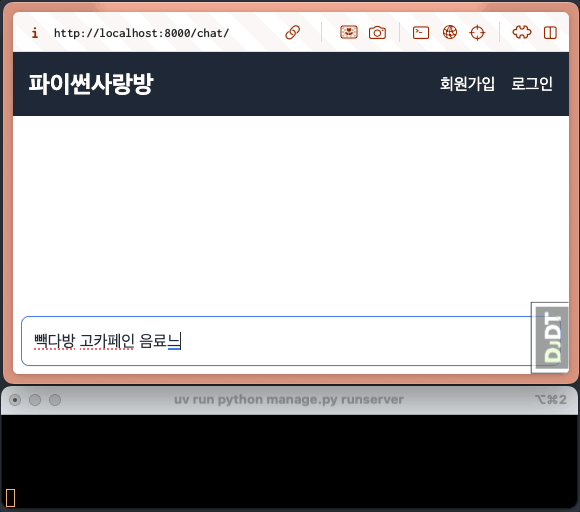
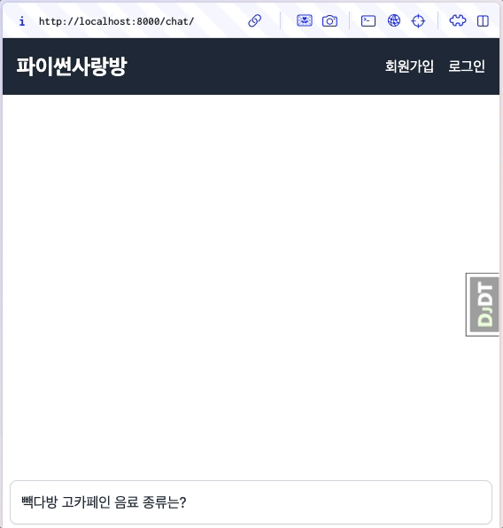

비동기 뷰와 스트림 처리
==================================

.. admonition:: `관련 커밋 <https://github.com/pyhub-kr/django-llm-chat-proj/commit/d06a5a7a1ea679e20fb768de2b6c5586fe535d0d>`_
   :class: dropdown

   * 변경 파일을 한 번에 덮어쓰기 하실려면, :doc:`/utils/pyhub-git-commit-apply` 설치하신 후에, 현재 프로젝트 루트 경로에서 명령어 실행

   .. code-block:: bash

      uv run pyhub-git-commit-apply https://github.com/pyhub-kr/django-llm-chat-proj/commit/d06a5a7a1ea679e20fb768de2b6c5586fe535d0d

미리보기
------------------

ChatGPT와 같은 대화형 AI 서비스에서는 응답이 생성되는 데 수 초에서 수십 초가 걸릴 수 있습니다. 
일반적인 동기 방식에서는 AI가 전체 응답을 완성할 때까지 사용자는 아무런 피드백 없이 기다려야 합니다.
유저는 애플리케이션이 멈춘 것은 아닌 지 걱정하게 됩니다.
아래와 같이 빠르게 UI 피드백이 있다면 유저는 안심하고 기다릴 수 있습니다.

장고 백엔드 단에서 스트림 처리를 먼저 구현하고, 다음 :doc:`12-async-stream` 페이지에서 프론트 단과 연동해보겠습니다.

비동기 방식의 필요성
--------------------------------

CPU 계산이 아닌, 외부 API 호출같이 입출력이 많은 작업의 경우, 동기 방식보다 비동기 방식이 보다 효율적입니다.
동기 방식에서는 하나의 API 응답을 대기하는 동안 다른 요청을 처리할 수 없습니다.
그에 반해 비동기 방식은 API 응답을 기다리는 동안 다른 작업을 처리할 수 있어 서버의 처리량을 향상시킬 수 있습니다.
파이썬에서는 ``async``\/``await`` 키워드를 사용해 비동기 함수를 정의하고 호출할 수 있습니다.

.. code-block:: python

    def sync_view(request):
        # 동기 방식에서는 하나의 API 응답을 대기하는 동안 다른 요청을 처리할 수 없습니다.
        api_response = api_call()
        return HttpResponse(str(api_response))

    async def async_view(request):
        # 비동기 방식에서는 API 응답을 기다리는 동안 다른 작업을 처리할 수 있어 서버의 처리량을 향상시킬 수 있습니다.
        api_response = await async_api_call()
        return HttpResponse(str(api_response))

장고에서는 `장고 3.0 부터 비동기를 지원 <https://docs.djangoproject.com/en/dev/topics/async/>`_\하며,
장고를 비롯한 파이썬 웹 프레임워크에서는 비동기 지원을 위해 ``ASGI`` 설정이 필수입니다.
``WSGI``\에서도 비동기를 지원하지만 오류없이 호출만 될 뿐 실제 비동기 동작은 이루어지지 않습니다.

현재 장고 프로젝트에는 비동기 View 동작을 위한 ASGI 설정이 이미 되어있습니다.

.. tip::

    장고 프로젝트 ASGI 설정 방법에 대해서는 :doc:`/quickstart/basic-setup` 문서 하단에서
    ``daphne``, ``channels`` 팩키지 설치 및 ``settings.ASGI_APPLICATION`` 설정 부분을 참고해주세요.

.. tip::

    보통 동기 방식의 장고 코드에 익숙하실텐데요. 장고의 여러 API들이 대다수 비동기를 지원하지만,    
    ``enumerate`` 함수 ``login_required`` 장식자 등 아직 비동기를 지원하지 않는 API도 있습니다.

    * :doc:`/python/async`
    * :doc:`/django/async/decorators`

스트림 처리의 필요성
--------------------------------

ChatGPT와 같은 대화형 AI 서비스에서는 응답이 생성되는 데 수 초에서 수십 초가 걸릴 수 있습니다. 
일반적인 동기 방식에서는 AI가 전체 응답을 완성할 때까지 사용자는 아무런 피드백 없이 기다려야 합니다.
유저는 애플리케이션이 멈춘 것은 아닌 지 걱정하게 됩니다. 느리게 처리되어도 UI 피드백이 있다면 유저는 안심하고 기다릴 수 있습니다.

    모든 응답이 다 생성되고 나서야, 화면에 보여지고 있습니다.

대다수의 `LLM API에서는 stream 옵션을 지원 <https://cookbook.openai.com/examples/how_to_stream_completions>`_\하고,
순차적으로 생성되는 문자열들을 생성되는 즉시 LLM API 서버로부터 순차적으로 받을 수 있습니다.
이를 유저에게 실시간으로 보여주는 것을 스트림 처리하고 합니다.
첫 응답이 생성되는 즉시 화면에 표시되므로, 사용자가 체감하는 응답 시간도 크게 단축됩니다.

.. figure:: ./assets/12-async-stream-02.gif

    첫 응답을 받자마자 화면에 즉시 표시하고, 나머지 응답은 받는 대로 실시간으로 보충해서 화면에 표시합니다.

비동기 API 호출로 변경
--------------------------------

``stream`` 처리를 위해서는 먼저 비동기 구현이 필요합니다. ``openai`` 라이브러리에서는 ``AsyncClient``\를 통해 비동기 API 호출을 지원합니다.

.. code-block:: python
    :caption: chat/ai.py

    sync_client = openai.Client(api_key=settings.OPENAI_API_KEY)
    async_client = openai.AsyncClient(api_key=settings.OPENAI_API_KEY)

``make_ai_message`` 함수는 기존대로 동기 방식으로 두겠구요.
``PaikdabangAI`` 클래스의 ``__call__`` 메서드 내에서 ``await async_client.chat.completions.create`` 처럼 비동기 메서드를 호출하는 데,
``await``\를 통해 비동기 메서드를 호출할려면 그 함수는 반드시 ``async`` 함수여야 합니다. 그래서 ``__call__`` 메서드도 비동기 함수로 변경합니다.

.. code-block:: python
   :caption: chat/ai.py
   :emphasize-lines: 5,11-12,17,38,43
   :linenos:

   import logging

   import openai
   from django.conf import settings
   from openai.types.chat import ChatCompletion

   from . import rag

   logger = logging.getLogger(__name__)

   sync_client = openai.Client(api_key=settings.OPENAI_API_KEY)
   async_client = openai.AsyncClient(api_key=settings.OPENAI_API_KEY)

   def make_ai_message(system_prompt: str, human_message: str) -> str:
       # sync_client 사용
       completion = sync_client.chat.completions.create(
           model="gpt-4o-mini",
           messages=[
               {"role": "system", "content": system_prompt},
               {"role": "user", "content": human_message},
           ],
       )
       ai_message = completion.choices[0].message.content

       return ai_message

   class PaikdabangAI:
       def __init__(self):
           try:
               self.vector_store = rag.VectorStore.load(settings.VECTOR_STORE_PATH)
               logger.debug("Loaded vector store %s items", len(self.vector_store))
           except FileNotFoundError as e:
               logger.error("Failed to load vector store: %s", e)
               self.vector_store = rag.VectorStore()

       async def __call__(self, question: str) -> str:
           search_doc_list = self.vector_store.search(question)
           지식 = "\n\n".join(doc.page_content for doc in search_doc_list)

           # async_client 사용하고, 비동기로 호출
           res: ChatCompletion = await async_client.chat.completions.create(
               messages=[
                   {
                       "role": "system",
                       "content": f"넌 AI Assistant. 모르는 건 모른다고 대답.\n\n[[빽다방 메뉴 정보]]\n{지식}",
                   },
                   {
                       "role": "user",
                       "content": question,
                   },
               ],
               model="gpt-4o-mini",
               temperature=0,
           )
           ai_message = res.choices[0].message.content

           return ai_message

   ask_paikdabang = PaikdabangAI()

``ask_paikdabang`` 함수는 ``async`` 함수이기에 함수 호출 시에 ``await``\가 필요하고,
비동기 함수를 호출하기 위해 ``reply`` 뷰도 비동기 함수여야 합니다.

.. code-block:: python
    :caption: chat/views.py
    :emphasize-lines: 1,7

    async def reply(request):
        # ...

        # 1) 동기 함수를 호출합니다.
        # ai_message = ask_paikdabang(human_message)
        # 2) ask_paikdabang 함수는 async 함수이기에 함수 호출 시에 await가 필요합니다.
        ai_message = await ask_paikdabang(human_message)

PaikdabangAI 클래스에 스트림 지원 추가하기
----------------------------------------------

랭체인에서 LLM과 상호작용하는 여러 메서드 중에 다음 4개의 메서드가 있습니다.

.. list-table::
   :header-rows: 1

   * - 메서드
     - 동기
     - 설명
   * - invoke
     - 동기
     - 한 번에 전체 응답을 반환
   * - stream
     - 동기
     - 응답이 생성되는 대로 점진적으로 반환
   * - ainvoke
     - 비동기
     - 한 번에 전체 응답을 반환
   * - astream
     - 비동기
     - 응답이 생성되는 대로 점진적으로 반환

이 중에 우리는 비동기 방식으로 구현할테니, ``ainvoke`` 메서드와 ``astream`` 메서드 네이밍을 따라서 그 동작을 구현해보겠습니다.

OpenAI API에서는 스트림 처리 여부는 ``stream`` 인자 하나로만 결정됩니다.

.. code-block:: python
    :emphasize-lines: 5

    return await async_client.chat.completions.create(
        messages=[ ... ],
        model="gpt-4o-mini",
        temperature=0,
        stream=stream,
    )

``ainvoke`` 메서드와 ``astream`` 메서드는 RAG를 수행하고 OpenAI API를 호출하는 부분은 거의 동일하므로
``get_response`` 메서드로 추출하여 두 메서드에서 공통으로 사용하도록 합니다.

``get_response`` 메서드에서는 ``stream`` 인자를 통해 스트림 처리 여부를 결정하고, 2가지 타입을 반환함을 반환 타입에 명시합니다.

* OpenAI API에서는 ``stream=True`` 일 때 ``AsyncStream[ChatCompletionChunk]`` 타입을 반환합니다.
* OpenAI API에서는 ``stream=False`` 일 때 ``ChatCompletion`` 타입을 반환합니다.

``ainvoke`` 메서드는 ``ChatCompletion`` 타입의 응답을 받아 응답 전체 텍스트를 반환하구요.
``astream`` 메서드는 ``AsyncStream[ChatCompletionChunk]`` 타입의 응답을 받아, 응답이 생성되는 대로 점진적으로 반환합니다.

.. code-block:: python

    class PaikdabangAI:
        # 생략

        # ainvoke 메서드를 호출하여 요청을 처리합니다.
        async def __call__(self, question: str) -> str:
            return await self.ainvoke(question)

        # 비동기. 한 번에 전체 응답을 반환
        async def ainvoke(self, question: str) -> str:
            res: ChatCompletion
            res = await self.get_response(question, stream=False)
            ai_message = res.choices[0].message.content
            return ai_message

        # 비동기. 응답이 생성되는 대로 점진적으로 반환
        async def astream(self, question: str) -> AsyncGenerator[Optional[str]]:
            res: AsyncStream[ChatCompletionChunk]
            res = await self.get_response(question, stream=True)
            # AsyncGenerator는 값 순회를 위해 비동기 반복문을 사용해야 합니다.
            async for chunk in res:
                ai_message_chunk: str = chunk.choices[0].delta.content
                yield ai_message_chunk

        # OpenAI LLM API를 호출하고 그 응답을 반환합니다.
        async def get_response(self, question: str, stream: bool = False) -> Union[
            ChatCompletion,  # stream=False 일 때
            AsyncStream[ChatCompletionChunk],  # stream=True 일 때
        ]:
            search_doc_list = self.vector_store.search(question)
            지식 = "\n\n".join(doc.page_content for doc in search_doc_list)

            return await async_client.chat.completions.create(
                messages=[
                    {
                        "role": "system",
                        "content": f"넌 AI Assistant. 모르는 건 모른다고 대답.\n\n[[빽다방 메뉴 정보]]\n{지식}",
                    },
                    {
                        "role": "user",
                        "content": question,
                    },
                ],
                model="gpt-4o-mini",
                temperature=0,
                stream=stream,
            )

.. tip::

    파이썬에서 Generator를 생성하는 방법은 몇 가지가 있습니다.
    그 중 파이썬 함수 내에서 ``yield`` 키워드를 사용하면 그 함수는 제너레이터 함수가 됩니다.
    제너레이터는 함수 내에서 ``yield`` 키워드를 만날 때마다 함수의 실행을 중단하고,
    해당 값을 반환합니다. 그 다음 함수는 중단된 지점부터 다시 실행되며, 다시 ``yield`` 키워드를 만나면 다시 중단합니다.
    이런 특성을 이용해 점진적으로 값을 반환하는 스트림 처리가 가능합니다.

    .. code-block:: python

        def sync_gen():
            yield 1
            yield 2
            yield 3
        
        # 제너레이터 객체를 생성했을 뿐 아직 실행되지 않았습니다.
        gen_obj1 = sync_gen()
        # next() 함수를 통해 제너레이터 객체를 실행하고, yield 키워드를 만날 때마다 값을 생산/반환하고 중단합니다.
        print(next(gen_obj1))  # 1
        print(next(gen_obj1))  # 2
        print(next(gen_obj1))  # 3
        # 더 이상 생산할 값이 없으면 StopIteration 예외를 발생시킵니다.
        print(next(gen_obj1))
    
    제너레이터를 효율적으로 활용하면, 메모리 사용량을 크게 줄이고, 프로그램 실행 속도를 크게 향상시킬 수 있습니다.

전체 코드
--------------------

.. code-block:: python
    :caption: chat/ai.py
    :emphasize-lines: 2,7,39-60,62-64,66-71,73-79
    :linenos:

    import logging
    from typing import Union, AsyncGenerator, Optional

    import openai
    from django.conf import settings
    from openai import AsyncStream
    from openai.types.chat import ChatCompletion, ChatCompletionChunk

    from . import rag

    logger = logging.getLogger(__name__)

    sync_client = openai.Client(api_key=settings.OPENAI_API_KEY)
    async_client = openai.AsyncClient(api_key=settings.OPENAI_API_KEY)

    def make_ai_message(system_prompt: str, human_message: str) -> str:
        completion = sync_client.chat.completions.create(
            model="gpt-4o-mini",
            messages=[
                {"role": "system", "content": system_prompt},
                {"role": "user", "content": human_message},
            ],
        )
        ai_message = completion.choices[0].message.content

        return ai_message

    class PaikdabangAI:
        def __init__(self):
            try:
                self.vector_store = rag.VectorStore.load(settings.VECTOR_STORE_PATH)
                logger.debug("Loaded vector store %s items", len(self.vector_store))
            except FileNotFoundError as e:
                logger.error("Failed to load vector store: %s", e)
                self.vector_store = rag.VectorStore()

        async def get_response(self, question: str, stream: bool = False) -> Union[
            ChatCompletion,  # 동기 OpenAI API 호출 시
            AsyncStream[ChatCompletionChunk],  # 비동기 OpenAI API 호출 시
        ]:
            search_doc_list = self.vector_store.search(question)
            지식 = "\n\n".join(doc.page_content for doc in search_doc_list)

            return await async_client.chat.completions.create(
                messages=[
                    {
                        "role": "system",
                        "content": f"넌 AI Assistant. 모르는 건 모른다고 대답.\n\n[[빽다방 메뉴 정보]]\n{지식}",
                    },
                    {
                        "role": "user",
                        "content": question,
                    },
                ],
                model="gpt-4o-mini",
                temperature=0,
                stream=stream,
            )

        # 비동기. 한 번에 전체 응답을 반환
        async def __call__(self, question: str) -> str:
            return await self.ainvoke(question)

        # 비동기. 한 번에 전체 응답을 반환
        async def ainvoke(self, question: str) -> str:
            res: ChatCompletion
            res = await self.get_response(question, stream=False)
            ai_message = res.choices[0].message.content
            return ai_message

        # 비동기. 응답이 생성되는 대로 점진적으로 반환
        async def astream(self, question: str) -> AsyncGenerator[Optional[str]]:
            res: AsyncStream[ChatCompletionChunk]
            res = await self.get_response(question, stream=True)
            async for chunk in res:
                ai_message_chunk: str = chunk.choices[0].delta.content
                yield ai_message_chunk

    ask_paikdabang = PaikdabangAI()

동작 확인
----------------

``astream`` 메서드를 호출했기에 스트림 방식으로 응답을 받습니다.
각 나눠진 (Chunk) 응답을 웹 화면에 출력하기 전에 개발서버 콘솔에 먼저 출력해봅시다.
응답이 생성되는 대로 점진적으로 출력되는 것을 확인할 수 있습니다.
``reply`` 뷰 함수에서는 이전과 동일하게 전체 응답을 한 번에 출력하기 때문에
웹 화면에 보여지는 부분은 이전과 동일합니다.

.. code-block:: python
   :caption: chat/views.py
   :linenos:

   # 1) 동기 함수를 호출합니다.
   # ai_message = ask_paikdabang(human_message)
   # 2) ask_paikdabang 함수는 async 함수이기에 함수 호출 시에 await가 필요합니다.
   # ai_message = await ask_paikdabang(human_message)

   # 3) astream 메서드는 AsyncGenerator를 반환하기에, 비동기 반복문을 사용해야만 합니다.
   ai_message = ""
   ai_message_chunk: str
   async for ai_message_chunk in ask_paikdabang.astream(human_message):
       # None 일 경우, 빈 문자열로 변환해야만 문자열을 추가할 수 있습니다.
       ai_message += ai_message_chunk or ""
       print(ai_message_chunk, end="", flush=True)
   print()

다음 장에서는 스트림 응답을 웹 화면에 실시간으로 보여지도록 구현해보겠습니다.
