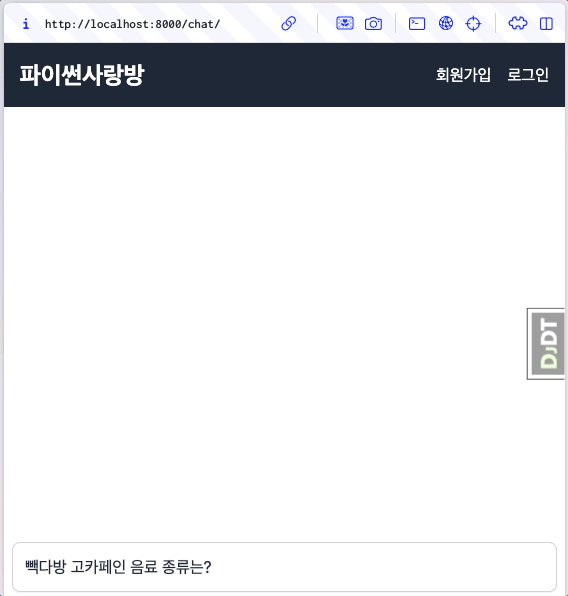
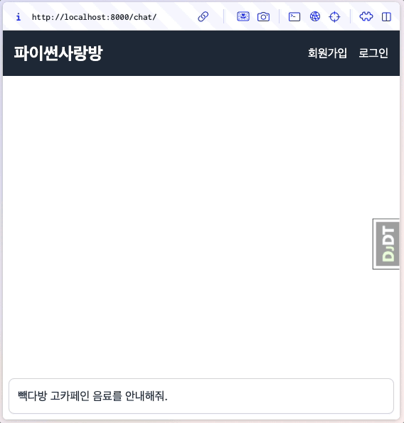

LLM 스트림 응답을 실시간으로 보여주기
==================================================

.. admonition:: `관련 커밋 <https://github.com/pyhub-kr/django-llm-chat-proj/commit/615b26b9c849e93ef97d946d4f7f3aabc95233cd>`_
   :class: dropdown

   * 변경 파일을 한 번에 덮어쓰기 하실려면, :doc:`/utils/pyhub-git-commit-apply` 설치하신 후에, 현재 프로젝트 루트 경로에서 명령어 실행

   .. code-block:: bash

      uv run pyhub-git-commit-apply https://github.com/pyhub-kr/django-llm-chat-proj/commit/615b26b9c849e93ef97d946d4f7f3aabc95233cd

미리보기
------------------

자바스크립트 코드를 최소화하고, 장고/HTMX 기반으로 스트리밍 응답 처리를 완료했습니다. 🎉

스트리밍 응답 지원
--------------------------

현재 ``reply`` 뷰에서는 ``.astream`` 메서드 호출을 통해 나눠진(Chunk) AI 응답을 받지만 콘솔에 출력만 할 뿐, 뷰 응답은 전체 응답을 한 번에 출력하고 있습니다.

.. code-block:: python
    :linenos:
    :emphasize-lines: 5,9,18

    async def reply(request):
        if request.method == "POST":
            human_message = request.POST.get("message", "")

            ai_message = ""
            ai_message_chunk: str
            async for ai_message_chunk in ask_paikdabang.astream(human_message):
                # None 일 경우, 빈 문자열로 변환해야만 문자열을 추가할 수 있습니다.
                ai_message += ai_message_chunk or ""
                print(ai_message_chunk, end="", flush=True)
            print()

            yield render(
                request,
                "chat/_chat_message.html",
                {
                    "human_message": human_message,
                    "ai_message": ai_message,
                },
            )
        else:
            return HttpResponse("
허용하지 않는 메서드
")

장고 뷰에서는 스트리밍 응답을 위해서 `StreamingHttpResponse <https://docs.djangoproject.com/en/dev/ref/request-response/#streaminghttpresponse-objects>`_\를 사용합니다.
첫번째 인자로 Generator를 지정하면 Generator에서 생산되는 값을 그때그때 클라이언트에게 스트리밍 전송할 수 있습니다.
``StreamingHttpResponse``\는 동기/비동기 Generator를 모두 지원합니다.
그리고 서버 응답 포맷으로 디폴트 ``text/html``\인데요. 스트리밍 응답이므로 ``text/event-stream``\ 타입을 사용하겠습니다.

.. code-block:: python

    def sse_view(request):
        async def make_chunk_response():
            yield "hello"
            yield "world"
            # OpenAI API 나눠진 응답을 생산(yield)하는 코드를 추가하겠습니다.

        return StreamingHttpResponse(
            make_chunk_response(),
            content_type="text/event-stream",
        )

``reply`` 뷰 함수에 적용하면 다음과 같습니다.
``make_chunk_response`` 함수에는 스트리밍으로 전송할 응답 문자열만 생산/반환의 책임이 있기에,
``HttpResponse`` 객체를 반환하는 ``render`` 함수를 사용하지 않고
``str`` 문자열을 반환하는 ``render_to_string`` 함수를 사용합니다.

.. code-block:: python
    :emphasize-lines: 1,3,12-13,23-24,32-35
    :linenos:

    from django.http import HttpResponse, StreamingHttpResponse
    from django.shortcuts import render
    from django.template.loader import render_to_string

    from chat.ai import ask_paikdabang

    async def reply(request):
        if request.method == "POST":
            human_message = request.POST.get("message", "")

            # 스트리밍 응답을 생성하는 함수
            async def make_chunk_response():
                # astream 메서드는 AsyncGenerator를 반환합니다.
                ai_message = ""
                ai_message_chunk: str
                async for ai_message_chunk in ask_paikdabang.astream(human_message):
                    # None 일 경우, 빈 문자열로 변환해야만 문자열을 추가할 수 있습니다.
                    ai_message += ai_message_chunk or ""
                    print(ai_message_chunk, end="", flush=True)
                print()

                # 응답 텍스트만 생성해야 하기에, render가 아닌 render_to_string을 사용합니다.
                yield render_to_string(
                    "chat/_chat_message.html",
                    {
                        "human_message": human_message,
                        "ai_message": ai_message,
                    },
                )

            return StreamingHttpResponse(
                make_chunk_response(),
                content_type="text/event-stream",
            )
        else:
            return HttpResponse("
허용하지 않는 메서드
")

동작을 확인해보면 ``reply`` 뷰는 스트리밍 방식으로 동작하지만 "단일 HTML 응답"과 동일하게 화면에 출력됩니다.

#. 17번째 줄에서 응답 텍스트를 1회만 생성하여 응답합니다.
#. 응답을 받는 클라이언트 측에서는 별도로 스트리밍 처리를 하지 않았습니다.

추가로 다음 두 가지를 구현하겠습니다.

#. ``make_chunk_response`` 함수에서 매 청크마다 렌더링한 HTML을 반환토록 구현하겠습니다.
#. 응답을 받는 클라이언트 측에서도 스트리밍 처리를 구현하겠습니다.

각 청크마다 렌더링한 HTML을 생산/반환
---------------------------------------

API 응답을 모아서 응답하는 코드를 제거하고, 매 청크마다 렌더링한 HTML을 생산/반환하는 코드를 추가합니다.

.. code-block:: python
    :linenos:
    :emphasize-lines: 7-14

    async def make_chunk_response():
        ai_message = ""
        ai_message_chunk: str
        async for ai_message_chunk in ask_paikdabang.astream(human_message):
            ai_message += ai_message_chunk or ""

            # 매 chunk를 덧붙인 ai_message로 렌더링한 HTML을 생산합니다.
            yield render_to_string(
                "chat/_chat_message.html",
                {
                    "human_message": human_message,
                    "ai_message": ai_message,
                },
            )

    # API 응답을 모아서 응답하는 코드 제거
    #       print(ai_message_chunk, end="", flush=True)
    #   print()

    #   # 응답 텍스트만 생성해야 하기에, render가 아닌 render_to_string을 사용합니다.
    #   yield render_to_string(
    #       "chat/_chat_message.html",
    #       {
    #          "human_message": human_message,
    #          "ai_message": ai_message,
    #      },
    #   )

동작을 확인해보면, 매 청크마다 human/ai 메시지가 렌더링되어 출력되는 것을 확인할 수 있습니다.
같은 메세지로 보이지만 ai 메시지를 잘 보시면 글자가 몇 글자씩 추가되는 것을 확인할 수 있습니다.

각 청크 응답이 추가되지 않고, 덮어쓰게 할려면?
----------------------------------------------------------

현재 각 청크 응답이 반복되며 추가되고 있습니다.
프론트엔드 단에서는 같은 그룹의 메시지는 덮어쓰도록 구현하려 합니다.
그럴려면 같은 그룹 임을 알 수 있는 방법이 필요합니다.

OpenAI API 응답 객체에서도 ``.id`` 속성을 통해 메시지 식별자를 반환하는 데요.
우리 ``PaikdabangAI`` 구현에서는 문자열 응답 만을 반환하니까 사용하지 않겠습니다.
그래서 매 응답마다 ``uuid.uuid4().hex`` 호출을 통해 32글자 랜덤 문자열을 생성하여 메시지 식별자로 사용하겠습니다.
uuid가 아닌 숫자라도 웹페이지 내에서 각 메시지 간에 겹치지 않는 값이라면 사용하실 수 있습니다.
그런데 이 값을 웹페이지에서 ``id`` 속성으로 사용할텐데요. ``id`` 속성은 숫자 문자열로 시작되어서는 안 됩니다.
그래서 ``"ai_"`` 문자열을 붙여서 사용하겠습니다.

.. code-block:: python

    import uuid

    message_pair_id = "ai_" + uuid.uuid4().hex

그리고 웹페이지 내에서, 새로운 그룹의 메시지로서 웹페이지에 추가할 것인지, 기존 그룹의 메시지로서 덮어쓸 것인지를 구분하기 위해서 ``chunk_index`` 변수를 사용하겠습니다.
값은 ``0``\부터 시작하며, 각 청크마다 1씩 증가합니다. 값이 ``0``\일 경우 새로운 그룹의 메시지로서 웹페이지에 추가토록 구현하겠습니다.

파이썬에서 값을 순회돌 때 ``enumerate`` 함수를 사용하면 편리한데요.

.. code-block:: python

    for idx, value in enumerate(['a', 'b', 'c', 'd', 'e']):
        print(f"{idx}: {value}")

실행 결과:

.. code-block:: text

    0: a
    1: b
    2: c
    3: d
    4: e

``enumerate`` 함수는 비동기를 지원하지 않고,
``ask_paikdabang.astream(human_message)`` 메서드는 ``AsyncGenerator``\를 반환하므로
``enumerate`` 함수를 사용할 수 없습니다.

그래서 :doc:`/python/async` 문서를 참고하여 비동기 ``enumerate`` 함수를 직접 구현하여 사용하겠습니다.

.. code-block:: python

    async for chunk_index, ai_message_chunk in aenumerate(
        ask_paikdabang.astream(human_message)
    ):
        # ...

아래와 같이 ``reply`` 뷰 함수에 적용하실 수 있습니다.

.. code-block:: python
    :linenos:
    :emphasize-lines: 1,5-11,21-24,31-32

    import uuid

    # ...

    # enumerate 함수의 비동기 버전
    async def aenumerate(iterable, start=0):
        """Async version of enumerate function."""
        i = start
        async for x in iterable:
            yield i, x
            i += 1

    async def reply(request):
        if request.method == "POST":
            human_message = request.POST.get("message", "")

            async def make_chunk_response():
                # astream 메서드는 AsyncGenerator를 반환합니다.
                ai_message = ""
                ai_message_chunk: str
                message_pair_id = "ai_" + uuid.uuid4().hex
                async for chunk_index, ai_message_chunk in aenumerate(
                    ask_paikdabang.astream(human_message)
                ):
                    # None 일 경우, 빈 문자열로 변환해야만 문자열을 추가할 수 있습니다.
                    ai_message += ai_message_chunk or ""

                    yield render_to_string(
                        "chat/_chat_message.html",
                        {
                            "message_pair_id": message_pair_id,
                            "chunk_index": chunk_index,
                            "human_message": human_message,
                            "ai_message": ai_message,
                        },
                    )

클라이언트 단에서의 스트리밍 응답 지원
------------------------------------------------------

``HTMX``\에서는 `확장(extensions) <https://htmx.org/extensions/>`_ 기능을 통해 웹소켓이나 SSE (Server-Sent Events) 등을 지원하며,
HTMX에 다양한 기능을 부여하여 우리가 직접 자바스크립트 코드를 거의 작성하지 않아도 다양한 상호작용을 구현할 수 있습니다.

지금 구현에서는 제가 직접 개발한 `streaming-html <https://github.com/pyhub-kr/django-llm-chat-proj/blob/main/static/streaming-html.js>`_ 확장을 사용하겠습니다.
이 확장은 :doc:`/rag-01/django/00-setup` 단계에서 ``프로젝트_루트/static/streaming-html.js`` 경로에 미리 복사해두었습니다. 😉

.. note::

    2025년 1월 23일에 해당 라이브러리에 ``afterRequest`` 이벤트 지원을 추가했습니다.
    1월 23일 이전에 프로젝트를 생성하신 분은 `streaming-html <https://github.com/pyhub-kr/django-llm-chat-proj/blob/main/static/streaming-html.js>`_ 파일을 다운받아
    ``프로젝트 루트/static/streaming-html.js`` 경로에 덮어쓰기해주세요.
    
최상위 부모 템플릿에서 확장을 포함하는 스크립트를 추가합니다.

.. code-block:: html+django
    :caption: templates/base.html
    :emphasize-lines: 2

    
    

채팅 화면 템플릿에서 HTMX POST 요청을 보내는 요소에서 ``hx-ext="streaming-html"`` 속성을 적용하여 ``streaming-html`` 확장을 적용합니다.
확장 적용 방법이 아주 직관적입니다. 이 요소의 htmx 요청은 ``streaming-html`` 확장을 통해 처리되구요.
나머지 ``hx-`` 속성들도 대부분 ``streaming-html`` 확장을 통해 동일하게 지원되도록 구현되어있습니다.

``streaming-html`` 확장을 적용했으니, ``id="form"`` 요소로부터 시작된 htmx 요청은 서버 응답은 ``id="messages"`` 요소에 각 Chunk가 계속 추가됩니다.
그럼 매 Chunk가 업데이트될 때마다 ``after-settle`` 이벤트 핸들러가 호출되고, 스크롤이 매번 자동으로 맨 아래로 이동하게 됩니다.

그런데 불필요하게 **매번 enable 이벤트를 발생(trigger)시킬 필요는 없을 듯 합니다**. 초기 요청 시에만 ``enable`` 이벤트를 발생시키겠구요.
``after-settle`` 이벤트 핸들러에서 ``enable`` 이벤트를 발생시키는 코드를 제거하겠습니다.

``streaming-html`` 확장에서는 ``chunk`` 이벤트를 추가로 지원합니다. 매 chunk 응답을 받을 때마다 이 이벤트가 발생하구요.
이벤트 인자로 chunk 인덱스를 ``event.detail.count`` 속성으로 참조하실 수 있습니다. 이 값은 0부터 1씩 증가합니다.
``id="form"`` 요소에서 ``chunk`` 이벤트 핸들러를 추가하여, 첫번째 chunk 응답을 받을 때 (즉 ``count`` 값이 ``0``\일 때)
폼도 리셋하고 ``enable`` 이벤트를 발생시키도록 구현하겠습니다.

.. code-block:: html+django
    :caption: chat/templates/chat/index.html
    :emphasize-lines: 5,10,15-16
    :linenos:

    

    

    <form id="form"
          hx-ext="streaming-html"
          hx-post=""
          hx-target="#messages"
          hx-swap="beforeend"
          hx-on::before-request="htmx.trigger(this, 'disable');"
          {# hx-on::after-request="this.reset();" #}
          hx-on:chunk="if (event.detail.count === 0) { this.reset(); htmx.trigger(this, 'enable'); }"
    >

이제 서버로부터의 스트리밍 Chunk 응답이 화면에 즉각 반영되고, 화면 스크롤도 자동으로 맨 아래로 이동하는 것을 확인하실 수 있습니다.

같은 그룹의 메시지는 덮어쓰기
-------------------------------------------

그런데, 아직 같은 그룹의 메시지는 덮어쓰기를 구현하지 않았죠.

``reply`` 뷰에서 다음 2개 context data를 추가로 전달하고 있습니다.

* ``message_pair_id`` : 메시지 그룹 식별자 (예: ``"ai_0caf8195adc54406a1e6b4e365bbc550"``)
* ``chunk_index`` : 메시지 그룹 내 Chunk 인덱스 (예: ``0``, ``1``, ``2``, ...)

``message_pair_id`` 값을 ``id`` 속성을 지정하구요. HTMX의 ``hx-swap-oob="true"`` 속성을 활용합니다.

``chunk_index`` 값이

* ``0``\일 때에는 ``hx-swap-oob="true"`` 속성을 지정하지 않습니다. 그러면 종전대로 추가되구요.
* ``0``\ 이상일때에는 ``hx-swap-oob="true"`` 속성을 지정합니다. 그러면 해당 ``id`` 요소를 덮어쓰기합니다.

.. code-block:: html+django
    :caption: chat/templates/chat/_chat_message.html
    :emphasize-lines: 1-2

    
 0 %}hx-swap-oob="true"
        x-data="{
            convert() {
                const markdownText = this.$el.querySelector('.markdown')?.textContent;
                const aiEl = this.$el.querySelector('.ai');
                aiEl.innerHTML = window.markdownToHtml(markdownText);
            }
        }"
        x-init="convert();">

        

            
{{ human_message }}

        

        
{{ ai_message }}

        

            

        

    

자바스크립트 코드를 최소화하고, 장고/HTMX 기반으로 스트리밍 응답 처리를 완료했습니다. 🎉

.. note::

    React나 다른 프레임워크로 이 튜토리얼 코드를 구현해보고, 장고/HTMX 기반으로 구현한 코드와 비교해보세요.
    이를 통해 장고/HTMX가 얼마나 간결하고 직관적인지 확인할 수 있을 것입니다.

    기술 선택에서는 효율성이 중요합니다. 복잡한 도구를 사용하는 대신, 간단하게 구현할 수 있는 방법이 있다면 이를 적극 활용하세요.
    이렇게 하면 개발 비용과 시간을 극적으로 절약할 수 있으며, 프로젝트의 생산성을 크게 높일 수 있습니다.
