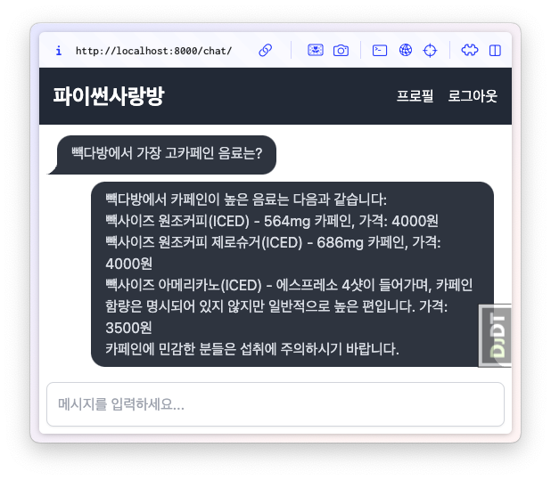

장고로 RAG 웹 채팅 만들기 (장고 초보)
==========================================

.. raw:: html

    

        <iframe
            src="https://www.youtube.com/embed/9ayknWI-VcI?start=4793"
            frameborder="0"
            allowfullscreen>
        </iframe>
    

    <small>본 페이지는 1:19:53 지점부터 1:24:58 지점까지 보시면 됩니다.</small>

----

오늘날 대화형 AI는 LLM(Large Language Model) 애플리케이션의 핵심 인터페이스로 자리 잡았습니다.
특히 채팅 UI는 사용자가 자연스럽게 질문하고 답변을 받을 수 있는 직관적인 인터페이스로, 대부분의 LLM 기반 프로젝트에서 필수적인 구성 요소입니다.

채팅 UI를 구현하려면 일반적으로 HTTP와 웹소켓이라는 두 가지 주요 프로토콜을 사용하게 됩니다.
다행히도, **장고**\는 두 프로토콜을 안정적이고 효과적으로 지원하며, 이를 활용해 강력한 실시간 채팅 애플리케이션을 만들 수 있도록 도와줍니다.

많은 개발자는 채팅 UI를 구현할 때 자연스럽게 **리액트(React)**\와 같은 SPA(Single Page Application) 프레임워크를 떠올립니다.
하지만 리액트는 단순히 UI 라이브러리일 뿐이며, 반드시 리액트여야 하는 것은 아닙니다.
간결하고 효율적으로 채팅 UI를 구현하는 다양한 방법이 있습니다. 이 튜토리얼에서는 ``htmx``\와 ``alpine.js``\를 사용해
채팅 UI를 빠르고 간결하게 구현해보겠습니다.

일반적으로 웹소켓은 고급 채팅 기능(예: 실시간 음성 대화 AI 에이전트) 개발에 필수적이지만, HTTP 방식으로도 대다수의 기능을 구현할 수 있습니다.
HTTP 방식은 서버 아키텍처가 훨씬 단순해지며, 개발 및 운영 비용이 낮아지는 장점이 있습니다.
이러한 이유로, 이 튜토리얼에서는 HTTP 기반으로 채팅 UI를 구현할 예정입니다.
이 방식은 웹 개발 초보자도 쉽게 따라 할 수 있을 뿐 아니라, 효율적이고 간소화된 웹 애플리케이션 개발의 장점을 체감할 수 있게 해줄 것입니다.

   최종 화면

.. toctree::
   :maxdepth: 2

   00-setup
   01-test
   02-html-form
   03-vanilla-js
   04-htmx
   05-ai
   06-tailwindcss
   07-alpinejs
   08-rag
   09-colorlog
   10-markdown
   11-async
   12-async-stream
