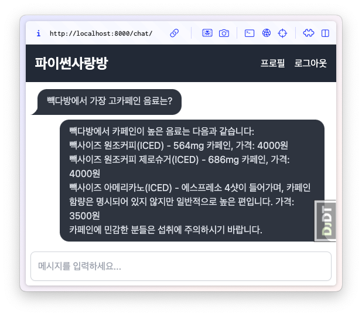

# 프리퀄 #01. RAG 밑바닥부터 웹 채팅까지 (작성 중) 🏃‍♀️

```{admonition} 프리퀄 튜토리얼을 작성하는 이유
:class: important

처음 AI 모델과 LLM 에이전트, 그리고 RAG를 접하는 독자들도 기본 개념부터 차근차근 이해하고 응용하실 수 있도록 도와드리기 위함입니다.
```

LLM을 지식 엔진으로 본다면 모델이 제공하는 정보를 곧 "정답"이라 가정하기 때문에 사실과 다를 경우 이를 버그로 여기게 됩니다. 창의성 측면에서 LLM 환각은 모델이 기존 패턴에서 벗어난 새로운 아이디어나 시나리오를 제시해, 사용자가 이를 토대로 독창적인 관점과 혁신적인 해결책을 모색하는 데 도움을 줄 수 있습니다.

+ 소설 아이디어 착안 : 역사적 사건에 상상 속의 인물을 덧붙여 새로운 판타지 소설 아이디어
+ 창의적 문제 해결 : LLM이 존재하지 않는 기능이나 구조를 제안했을 때, "이런 방향성도 가능하겠구나." 관점에서 다시 검토함으로서 기존 제품의 한계를 극복할 수 있습니다.

LLM은 어떤 질문이든 답변을 할려고 노력합니다. 사람도 지식이 부족한 분야에 대해서는 틀린 답변을 합니다. LLM도 지식이 부족한 질문에는 환각 (Hallucination)이 발생할 수 밖에 없습니다.

LLM이 이 세상 모든 지식을 다 알 수는 없습니다. 부족한 지식을 보충하는 방법으로서 LLM에게 관련 지식과 함께 질문을 같이 하는 방법을 생각해볼 수 있습니다. 이를 검색 증강 생성 (RAG, Retrieval-Augmented Generation)이라 합니다.

```{admonition} 이 튜토리얼에서 만든 최종 결과물
:class: attention

"빽다방에서 가장 고카페인 음료는?" 검색어로 먼저 빽다방 관련 정보를 찾은 다음에 이 정보와 질문을 LLM에게 같이 제공하니까, 정확한 메뉴와 가격을 안내해줍니다.



관련 지식을 제공하지 않는다면 "빽다방에서 가장 고카페인 음료는 일반적으로 **'에스프레소' 또는 '아메리카노'**와 같은 커피 베이스 음료입니다. 특히 에스프레소는 다른 음료에 비해 카페인 함량이 높습니다. 빽다방의 메뉴는 지역이나 시즌에 따라 다를 수 있으니, 최신 메뉴를 확인하는 것이 좋습니다. 추가적으로, 특정 시즌 한정 음료나 특별히 카페인 함량이 높은 메뉴가 있을 수 있으니 참고하세요!" 처럼 모호한 답변을 받게 됩니다.
```

```{toctree}
:maxdepth: 2

overview
glance
typical
django-llm-chat/index
```
