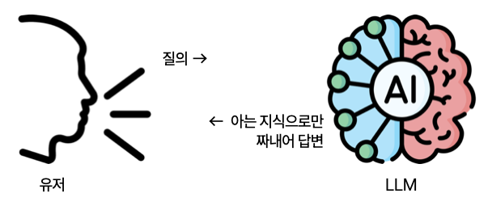

RAG #01. RAG 밑바닥부터 웹 채팅까지
===========================================

.. admonition:: 본 튜토리얼이 RAG와 웹서비스 개발에 관심 있는 분들께 도움이 되셨으면 합니다. 😉
   :class: important

   본 튜토리얼을 수월하게 진행하시기 위해, 다음 선수 지식이 필요합니다.

   #. 파이썬의 문자열/리스트, 함수, 클래스, Type Hint 문법
   #. OpenAI LLM API를 파이썬 코드로 직접 호출해본 경험

LLM(Large Language Model)은 대규모 텍스트 데이터로 학습된 인공지능 모델입니다. 자연어를 이해하고 생성할 수 있는 능력을 가지고 있어, 질문에 대한 답변, 텍스트 요약, 번역, 코드 작성 등 다양한 작업을 수행할 수 있습니다.

LLM을 지식 엔진으로 본다면 모델이 제공하는 정보를 곧 "정답"이라 가정하기 때문에 사실과 다를 경우 이를 버그로 여기게 됩니다.
하지만 창의성 측면에서 본다면 LLM 환각은 모델이 기존 패턴에서 벗어난 새로운 아이디어나 시나리오를 제시해, 사용자가 이를 토대로 독창적인 관점과 혁신적인 해결책을 모색하는 데 도움을 줄 수 있습니다.

* 소설 아이디어 착안 : 역사적 사건에 상상 속의 인물을 덧붙여 새로운 판타지 소설 아이디어
* 창의적 문제 해결 : LLM이 존재하지 않는 기능이나 구조를 제안했을 때, "이런 방향성도 가능하겠구나." 관점에서 다시 검토함으로서 기존 제품의 한계를 극복할 수 있습니다.

LLM은 자신이 가진 지식 범위 내에서 어떤 질문이든 최선을 다해 답변하려고 합니다.
사람도 지식이 부족한 분야에 대해서는 틀린 답변을 합니다. LLM도 지식이 부족한 질문에는 환각 (Hallucination)이 발생할 수 밖에 없습니다.

   LLM은 검색엔진이 아닙니다.

LLM이 이 세상 모든 지식을 다 알 수는 없습니다. 부족한 지식을 보충하는 방법으로서 LLM에게 관련 지식과 함께 질문을 같이 하는 방법을 생각해볼 수 있습니다. 이를 검색 증강 생성 (RAG, Retrieval-Augmented Generation)이라 합니다.
지식 데이터베이스 소스는 PDF, 파일, 웹페이지, 데이터베이스 등 무엇이든 가능하구요. 이러한 지식들을 텍스트로 변환/정리해서 검색 가능한 형태로 제공하는 프로그램/서버/서비스를 Vector Store라고 부릅니다.

.. figure:: ./assets/llm-rag.png
   :name: llm-rag

   관련 지식과 함께 질문하면, LLM이 모르는 지식(회사 정보 등)을 보충해서 정확한 답변을 할 수 있습니다.

.. admonition:: 빽다방.txt
   :class: dropdown

   .. code-block:: text

      1. 아이스티샷추가(아.샷.추)
        - SNS에서 더 유명한 꿀팁 조합 음료 :) 상콤달콤한 복숭아맛 아이스티에 진한 에스프레소 샷이 어우러져 환상조합
        - 가격: 3800원

      2. 바닐라라떼(ICED)
        - 부드러운 우유와 달콤하고 은은한 바닐라가 조화를 이루는 음료
        - 가격: 4200원

      3. 사라다빵
        - 빽다방의 대표메뉴 :) 추억의 감자 사라다빵
        - 가격: 3900원

      4. 빽사이즈 아메리카노(ICED)
        - 에스프레소 4샷이 들어가 깊고 진한 맛의 아메리카노
        - 가격: 3500원

      5. 빽사이즈 원조커피(ICED)
        - 빽다방의 BEST메뉴를 더 크게 즐겨보세요 :) [주의. 564mg 고카페인으로 카페인에 민감한 어린이, 임산부는 섭취에 주의바랍니다]
        - 가격: 4000원

      6. 빽사이즈 원조커피 제로슈거(ICED)
        - 빽다방의 BEST메뉴를 더 크게, 제로슈거로 즐겨보세요 :) [주의. 686mg 고카페인으로 카페인에 민감한 어린이, 임산부는 섭취에 주의바랍니다]
        - 가격: 4000원

      7. 빽사이즈 달콤아이스티(ICED)
        - 빽다방의 BEST메뉴를 더 크게 즐겨보세요 :) 시원한 복숭아맛 아이스티
        - 가격: 4300원

      8. 빽사이즈 아이스티샷추가(ICED)
        - SNS에서 더 유명한 꿀팁 조합 음료 :) 상콤달콤한 복숭아맛 아이스티에 진한 에스프레소 2샷이 어우러져 환상조합
        - 가격: 4800원

      9. 빽사이즈 아이스티 망고추가+노란빨대
        - SNS핫메뉴 아이스티에 망고를 한가득:)
        - 가격: 6300원

      10. 빽사이즈 초코라떼(ICED)
        - 빽다방의 BEST메뉴를 더 크게 즐겨보세요 :) 진짜~완~전 진한 초코라떼
        - 가격 : 5500원

본 :doc:`./index` 튜토리얼에서는 빽다방 메뉴 정보를 `빽다방.txt <https://gist.github.com/allieus/58d7eb0039972540eb98792a67d52664>`_ 파일로 준비해서,
파이썬 리스트로 직접 구현한 벡터 스토어에 저장하고,
"빽다방에서 가장 고카페인 음료는?" 과 같은 질문을 받으면 벡터 스토어에서 관련 지식을 검색하고,
관련 지식을 질문과 함께 LLM에게 넘겨 답변을 받아보겠습니다.

.. admonition:: 이 튜토리얼의 최종 결과물
   :class: attention

   관련 지식을 제공하지 않고 **"빽다방에서 가장 고카페인 음료는?"** 질문만 한다면, 아래와 같은 모호한 답변을 받게 됩니다.
   
     빽다방에서 가장 고카페인 음료는
     일반적으로 '에스프레소' 또는 '아메리카노'와 같은 커피 베이스 음료입니다.
     특히 에스프레소는 다른 음료에 비해 카페인 함량이 높습니다. 빽다방의 메뉴는 지역이나 시즌에 따라 다를 수 있으니,
     최신 메뉴를 확인하는 것이 좋습니다. 추가적으로, 특정 시즌 한정 음료나 특별히 카페인 함량이 높은 메뉴가 있을 수 있으니 참고하세요!

   이번에는 "빽다방에서 가장 고카페인 음료는?" 질문을 했을 때
   
   #. 먼저 빽다방 관련 정보를 찾고
   #. 이 정보와 질문을 LLM에게 **같이** 제공하면

   LLM은 정확한 메뉴와 가격으로 답변을 합니다.

   .. image:: ./django/assets/10-markdown.png

.. toctree::
   :maxdepth: 2

   overview
   api-key
   prices
   glance
   typical/index
   django/index
   closing
