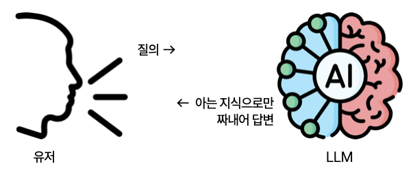
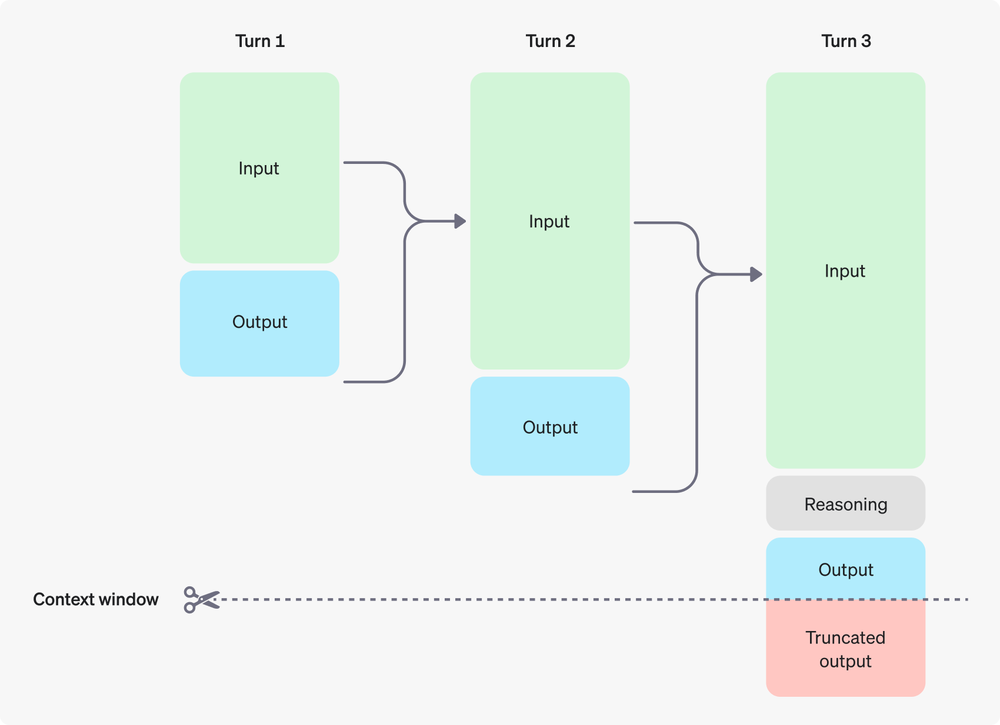

LLM은 어떤 질문이든 답변을 할려고 노력합니다.
==============================================

LLM은 가지고 있는 지식으로만, 어떻게든 답변을 합니다.

LLM은 몰라도 어떻게든 짜내어 답변
------------------------------------------

LLM은 검색엔진이 아닙니다. 전 세계 모든 지식을 알고 있지 못합니다. 알고 있는 지식 범위내에서 어떻게든 짜내어 답변을 합니다.
사실과 의견을 구분해달라고 요청하거나 모르는 건 모른다고 대답하라고 요청하지 않는다면,
지식이 부족한 질문에는 환각 (Hallucination)이나 틀린 정보 혹은 모호한 답변을 할 수 밖에 없습니다. 사람도 마찬가지입니다.

LLM은 빽다방 메뉴 정보를 모르기 때문에 모호한 답변을 하고 있습니다.
빽다방 챗봇이 있다면 이렇게 답변을 해서는 안 되겠죠.

.. tab-set::

   .. tab-item:: 질문 프롬프트

      빽다방 카페인이 높은 음료와 가격은?

   .. tab-item:: LLM 답변 😢

      빽다방의 카페인 함량이 높은 음료는 일반적으로 아메리카노, 카페라떼, 그리고 에스프레소와 같은 커피 기반 음료입니다. 가격은 지역이나 매장에 따라 다를 수 있지만, 대체로 아메리카노는 3,000원에서 4,000원 사이, 카페라떼는 4,000원에서 5,000원 사이, 에스프레소는 2,500원에서 3,500원 사이로 판매됩니다. 정확한 가격과 카페인 함량은 빽다방 공식 웹사이트나 매장에서 확인하는 것이 가장 좋습니다.

LLM에게 빽다방 메뉴 정보를 제공하면 더 정확한 답변을 얻을 수 있습니다.
LLM에게 부족한 지식을 보충하는 방법은 두 가지가 있습니다.

* 파인 튜닝

  - LLM에게 빽다방 메뉴에 미리 **공부**\를 시킵니다.
  - 공부를 하고 나면 빽다방 메뉴를 알고 있으니, 물어보면 정확한 답변을 합니다.

* 프롬프트에 관련 지식을 보강 (RAG)

  - 공부는 따로 시키지 않고, 질문할 때 질문과 관련된 빽다방 메뉴 정보를 같이 알려줍니다.
  - 오픈북 시험과 같습니다.

📚 파인 튜닝
----------------------

`Fine-tuning <https://platform.openai.com/docs/guides/fine-tuning>`_\은 기존 LLM 모델에 새로운 지식을 학습시켜 새로운 모델을 만드는 방법입니다.
즉 **공부**\를 시키는 거죠.
기존 모델에 추가 데이터셋으로 재학습을 수행하여 특정 도메인이나 작업에 특화된 모델을 만들 수 있습니다.

* 학습을 시킨다고 해서 반드시 모델 성능이 향상되는 것은 아닙니다. (복불복? 🥲)

  - 과한 학습이 오히려 성능 저하를 일으킬 수 있습니다.

* 특정 도메인에 대한 지식을 추가할 수 있지만 지식이 변경되면 재학습이 필요합니다.
* 파인튜닝된 모델은 `API 호출 가격 <https://openai.com/api/pricing/>`_\이 1.5배 비쌉니다.

.. list-table::
   :header-rows: 1

   * - 모델
     - 입력 가격 (100만 토큰)
     - 출력 가격 (100만 토큰)
   * - OpenAI gpt-4o (파인튜닝 X)
     - $2.5
     - $10
   * - OpenAI gpt-4o-2024-08-06 (파인튜닝)
     - $3.75
     - $15

본 튜토리얼에서는 파인튜닝을 다루지 않습니다.

🔎 프롬프트에 관련 지식을 보강
--------------------------------------

Perplexity에서는 검색을 통해 충분한 지식을 확보한 후에 답변을 생성합니다.
최근 ChatGPT 서비스에서도 최근 검색 기능이 추가되어, 답변 전에 검색을 통해 지식을 보강할 수 있습니다.

LLM에게 "빽다방 카페인이 높은 음료와 가격은?" 질문과 관련된 빽다방 메뉴 지식을 같이 제공하면, 아래와 같이 제공된 지식을 바탕으로 답변을 생성합니다.

.. tab-set::

   .. tab-item:: 질문 프롬프트

      아래는 통 문자열로서 LLM API 호출 시에 프롬프트로 전달합니다.

      .. code-block:: text

         Context:
         [Document(metadata={'source': './빽다방.txt'}, page_content='5. 빽사이즈 원조커피(ICED)\n  - 빽다방의 BEST메뉴를 더 크게 즐겨보세요 :) [주의. 564mg 고카페인으로 카페인에 민감한 어린이, 임산부는 섭취에 주의바랍니다]\n  - 가격: 4000원'),
          Document(metadata={'source': './빽다방.txt'}, page_content='2. 바닐라라떼(ICED)\n  - 부드러운 우유와 달콤하고 은은한 바닐라가 조화를 이루는 음료\n  - 가격: 4200원\n\n3. 사라다빵\n  - 빽다방의 대표메뉴 :) 추억의 감자 사라다빵\n  - 가격: 3900원'),
          Document(metadata={'source': './빽다방.txt'}, page_content='6. 빽사이즈 원조커피 제로슈거(ICED)\n  - 빽다방의 BEST메뉴를 더 크게, 제로슈거로 즐겨보세요 :) [주의. 686mg 고카페인으로 카페인에 민감한 어린이, 임산부는 섭취에 주의바랍니다]\n  - 가격: 4000원'),
          Document(metadata={'source': './빽다방.txt'}, page_content='4. 빽사이즈 아메리카노(ICED)\n  - 에스프레소 4샷이 들어가 깊고 진한 맛의 아메리카노\n  - 가격: 3500원')]

         Question: 빽다방 카페인이 높은 음료와 가격은?

   .. tab-item:: LLM 답변 😊

      .. code-block:: text

         빽다방에서 카페인이 높은 음료와 가격은 다음과 같습니다:

         1. 빽사이즈 원조커피(ICED)
            - 카페인: 564mg
            - 가격: 4000원

         2. 빽사이즈 원조커피 제로슈거(ICED)
            - 카페인: 686mg
            - 가격: 4000원

         이 음료는 카페인에 민감한 어린이와 임산부가 섭취할 때 주의가 필요합니다.

방법 #1. 대화 시작 시에 한 번에 모든 지식을 제공하기
~~~~~~~~~~~~~~~~~~~~~~~~~~~~~~~~~~~~~~~~~~~~~~~~~~~~~~~~~~~~~~~~~~~~~~~~~~~~

대화 시작 시에 대화에 필요한 모든 지식을 제공하면 더 포괄적이고 일관된 답변이 가능하며 추가 검색이 필요하지 않습니다.
하지만 불필요한 정보까지 포함될 수 있어 토큰 낭비 가능성이 있습니다.

사람이 한 번에 기억하고 처리할 수 있는 정보의 양이 제한되어 있는 것처럼, LLM도 한 순간에 참고하고 처리할 수 있는 텍스트의 양이 정해져 있습니다.
그래서 이 방법은 **제공할 수 있는 지식의 크기가 제한적**\입니다.
이러한 단기 기억을 `Context Window <https://platform.openai.com/docs/models#context-window>`_\라고 합니다.
OpenAI의 GPT-4o는 최대 128k 토큰까지 처리할 수 있습니다.
Context Window 제약으로 인해 LLM에 한 번에 제공할 수 있는 지식의 크기가 제한되며, Context Window를 넘어선 채팅은 중단됩니다.

   출처: `[OpenAI Platform] Models - Context Window <https://platform.openai.com/docs/models#context-window>`_

.. tip::
   **참고: 토큰 != 글자**

   12.8만 토큰은 12.8만 글자가 아닙니다. LLM에서는 문자열을 토큰이라는 숫자로 변환하여 처리합니다. `OpenAI Tokenizer <https://platform.openai.com/tokenizer>`_\에 의하면 "안녕 세상아" 문자열은 ``[14307, 98931, 28126, 8612, 7653]`` 로서 5개의 토큰으로 변환되며, "hello world" 문자열은 ``[24912, 2375]``\로서 2개의 토큰으로 변환됩니다.

   동일한 길이의 문장을 영어와 한글로 비교하면 한글이 더 많은 토큰을 가지게 되는 데요. 영어는 알파벳 26글자로 이루어져있고 단어 조합이 비교적 단순하기 때문에 일반적인 단어는 하나의 토큰으로 저장될 가능성이 큽니다. 반면 한글은 초성, 중성, 종성이 결합되어 한 글자마다 다른 의미를 가지므로 더 세밀하게 분할됩니다. 영어 중심으로 최적화된 측면도 있습니다.

방법 #2. 매 질문마다 질문 맥락에 맞는 지식을 찾아서 제공하기 (RAG)
~~~~~~~~~~~~~~~~~~~~~~~~~~~~~~~~~~~~~~~~~~~~~~~~~~~~~~~~~~~~~~~~~~~~~~~~~~~~~~~~~~~~

지식의 양이 방대할 경우, 매 질문마다 질문에 맞는 지식을 찾아서 제공하는 방법이 효율적일 수 있습니다.
RAG에서는 지식 변환, 정리, 저장, 검색의 과정과 LLM API 호출을 거쳐 질문에 맞는 지식을 제공합니다.

RAG에서는 지식을 저장하고 질문과 유사한 지식을 찾아주는 데이터베이스가 필요한데요. 이 역할을 하는 프로그램/서버/서비스를 **Vector Store** 라고 부릅니다.
`pgvector <https://github.com/pgvector/pgvector>`_, `sqlite-vec <https://github.com/asg017/sqlite-vec>`_, `faiss <https://python.langchain.com/docs/integrations/vectorstores/faiss/>`_, chroma, pinecone, weaviate, milvus 등이 있습니다.

지식은 PDF, 워드, 엑셀, 이미지, 웹문서 등 다양한 형태로 존재할텐데요.
Vector Store에 저장하기 위해서는 이를 텍스트로 전처리하는 과정이 필요합니다.
랭체인에서 지원하는 다양한 변환 기능을 활용하실 수도 있고, 직접 파이썬 코드로 변환 로직을 작성하실 수도 있습니다.

파일에 따라 텍스트로 변환하는 과정이 녹록치 않을 수 있습니다.
(Case by case가 많고 비용도 많이 들고 기술력이 많이 필요합니다.)

랭체인을 활용한 RAG 구현
-----------------------------------------

`랭체인 <https://www.langchain.com/>`_, `라마인덱스 <https://www.llamaindex.ai>`_ 등의 라이브러리를 활용하면 RAG를 보다 짧은 코드로 구현할 수 있고, 라이브러리가 제공해주는 인터페이스가 편리하지만, 그 인터페이스를 벗어난 케이스에 대해서는 대응하기 어렵습니다. 그래서 학습할 때에는 랭체인을 쓰다가, 실서비스에서는 랭체인을 쓰지 않고 직접 구현하는 경우도 많습니다.

RAG도 결국 프롬프트 문자열을 구성하는 과정이기 때문에 파이썬 코드 만으로도 충분히 구현할 수 있습니다. RAG 과정을 바닥부터 구현하여 데이터 변환, 임베딩, 검색 등의 과정들이 어떻게 연결되는 지 직접 경험해봅시다. 이는 추후 최적화나 커스텀 기능을 구현할 때 도움이 될 것입니다.

:doc:`./typical/langchain` 페이지에서 :doc:`./typical/index` 실습 코드의 랭체인 버전을 확인하실 수 있습니다.

본 튜토리얼에서는 파이썬 리스트를 기반으로 Vector Store를 구현하고 전형적인 RAG를 파이썬 코드로 직접 구현하며 RAG 과정에 대한 이해도를 높여보겠습니다.
