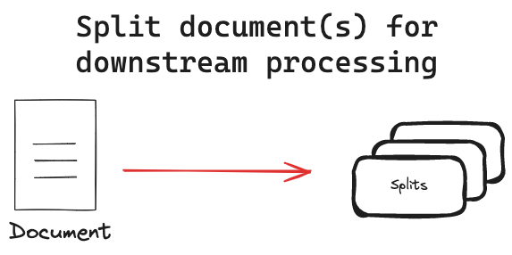

2단계. 지식을 쪼개기 (Split)
============================

  문서를 적절한 크기로 분할하여, 각 조각이 독립적인 의미를 가지도록 조정하는 과정

:doc:`01-load` 단계에서 생성된 문서를 문서의 포맷은 유지하면서 쪼개고 정리해서 **적절한 크기의 문서**\들로 재구성하는 단계입니다.

   출처 : `랭체인 공식 튜토리얼: Text Splitters <https://python.langchain.com/docs/concepts/text_splitters/>`_

필요성
---------

:doc:`03-embed` 단계에서는 문서 단위로 문자열을 벡터화합니다. 하지만 하나의 문서에 여러 주제가 혼합되어있을 경우 벡터도 여러 주제를 반영하게 됩니다.
그러면 특정 주제에 대한 정확도가 떨어질 수 있으며, 원하는 정보와 무관한 내용까지 (환각) 포함될 가능성이 높아집니다.

길이가 짧으면 전체 맥락을 유실하게 되고 해당 텍스트의 의미가 왜곡되거나 누락될 수 있습니다.

이를 방지할려면 텍스트를 적절한 크기로 분할(Split)하여 최대한 각 문서가 독립적인 의미를 가지도록 만드는 것이 중요합니다.
그러면 벡터가 보다 명확한 의미를 가지게 되고, 유사도 검색 품질이 최적화되어 보다 효율적인 RAG 시스템을 구축할 수 있습니다.

* 주제의 일관성을 유지하는 최대한의 문장 집합
* 큰 문서를 의미상으로 균일한 단위로 분할하는 작업

.. tab-set::

   .. tab-item:: 1단계를 거친 문서가 2개라면

      첫번째 문서 ``[0]`` 의 ``.page_content``

      .. code-block:: text

         1. 아이스티샷추가(아.샷.추)
           - SNS에서 더 유명한 꿀팁 조합 음료 :) 상콤달콤한 복숭아맛 아이스티에 진한 에스프레소 샷이 어우러져 환상조합
           - 가격: 3800원

         2. 바닐라라떼(ICED)
           - 부드러운 우유와 달콤하고 은은한 바닐라가 조화를 이루는 음료
           - 가격: 4200원

         3. 사라다빵
           - 빽다방의 대표메뉴 :) 추억의 감자 사라다빵
           - 가격: 3900원

      두번째 문서 ``[1]`` 의 ``.page_content``

      .. code-block:: text

         4. 빽사이즈 아메리카노(ICED)
           - 에스프레소 4샷이 들어가 깊고 진한 맛의 아메리카노
           - 가격: 3500원

         5. 빽사이즈 원조커피(ICED)
           - 빽다방의 BEST메뉴를 더 크게 즐겨보세요 :) [주의. 564mg 고카페인으로 카페인에 민감한 어린이, 임산부는 섭취에 주의바랍니다]
           - 가격: 4000원

   .. tab-item:: 2단계를 거친 문서가 5개가 될 수 있습니다.

      나눠진 문서 ``[0]`` 의 ``.page_content``

      .. code-block:: text

         1. 아이스티샷추가(아.샷.추)
           - SNS에서 더 유명한 꿀팁 조합 음료 :) 상콤달콤한 복숭아맛 아이스티에 진한 에스프레소 샷이 어우러져 환상조합
           - 가격: 3800원

      나눠진 문서 ``[1]`` 의 ``.page_content``

      .. code-block:: text

         2. 바닐라라떼(ICED)
           - 부드러운 우유와 달콤하고 은은한 바닐라가 조화를 이루는 음료
           - 가격: 4200원

      나눠진 문서 ``[2]`` 의 ``.page_content``

      .. code-block:: text

         3. 사라다빵
           - 빽다방의 대표메뉴 :) 추억의 감자 사라다빵
           - 가격: 3900원

      나눠진 문서 ``[3]`` 의 ``.page_content``

      .. code-block:: text

         4. 빽사이즈 아메리카노(ICED)
           - 에스프레소 4샷이 들어가 깊고 진한 맛의 아메리카노
           - 가격: 3500원

      나눠진 문서 ``[4]`` 의 ``.page_content``

      .. code-block:: text

         5. 빽사이즈 원조커피(ICED)
           - 빽다방의 BEST메뉴를 더 크게 즐겨보세요 :) [주의. 564mg 고카페인으로 카페인에 민감한 어린이, 임산부는 섭취에 주의바랍니다]
           - 가격: 4000원

4가지 전략
----------------

문서의 양이 작다면 사람이 일일이 쪼갤 수도 있겠지만, 대개 문서의 양이 많기 때문에 일괄적인 룰을 적용해서 쪼개는 경우가 많습니다.
`랭체인 공식 튜토리얼 <https://python.langchain.com/docs/concepts/text_splitters/#approaches>`_\ 에서는 다음 4가지 전략을 언급하고 있습니다.

1. **길이**\ 에 기반한 쪼개기

   - 직관적이고 구현이 간단하지만, 텍스트 구조나 의미를 고려하지 않으므로 문맥 단절 가능성이 큽니다.
   - 위 데이터처럼 각 메뉴마다 구분자가 ``"\n\n"``\ 처럼 일관되게 잘 지정되어있으면, 좋은 결과를 얻을 수 있습니다.
   - 랭체인 : `CharacterTextSplitter <https://python.langchain.com/api_reference/text_splitters/character/langchain_text_splitters.character.CharacterTextSplitter.html>`_, `RecursiveCharacterTextSplitter <https://python.langchain.com/api_reference/text_splitters/character/langchain_text_splitters.character.RecursiveCharacterTextSplitter.html>`_

2. **텍스트 구조**\ 에 기반한 쪼개기

   - **문단**, 헤더, 목록 등의 텍스트 구조를 고려해서 쪼갭니다.

     - 문단 : 글을 작성한 사람이 의미에 맞게 구분한 것. (작성자 생각의 구조)

   - 하지만 문서마다 텍스트 구조가 다를 수 밖에 없으므로 적용이 제한적입니다.

   - 랭체인 : `NltkTextSplitter <https://python.langchain.com/api_reference/text_splitters/nltk/langchain_text_splitters.nltk.NLTKTextSplitter.html>`_, `SpacyTextSplitter <https://python.langchain.com/api_reference/text_splitters/spacy/langchain_text_splitters.spacy.SpacyTextSplitter.html>`_ 등

3. **문서 구조**\ 에 기반한 쪼개기

   - 특정 문서 포맷 (HTML, Markdown 등)의 계층적 구조 (섹션, 하위 섹션 등)를 고려해서 쪼갭니다.
   - 구조가 복잡한 문서일수록 분할 로직이 복잡해지고, 일부 영역은 누락될 수 있습니다.
   - 랭체인
     - `HTMLHeaderTextSplitter <https://python.langchain.com/api_reference/text_splitters/html/langchain_text_splitters.html.HTMLHeaderTextSplitter.html>`_, `HTMLSectionSplitter <https://python.langchain.com/api_reference/text_splitters/html/langchain_text_splitters.html.HTMLSectionSplitter.html>`_
     - `MarkdownTextSplitter <https://python.langchain.com/api_reference/text_splitters/markdown/langchain_text_splitters.markdown.MarkdownTextSplitter.html>`_, `MarkdownHeaderTextSplitter <https://python.langchain.com/api_reference/text_splitters/markdown/langchain_text_splitters.markdown.MarkdownHeaderTextSplitter.html>`_, `ExperimentalMarkdownSyntaxTextSplitter <https://python.langchain.com/api_reference/text_splitters/markdown/langchain_text_splitters.markdown.ExperimentalMarkdownSyntaxTextSplitter.html>`_ 등

4. **의미** (Semantic meaning)\ 에 기반한 쪼개기

   - 의미적으로 연관된 단락을 하나로 묶어 문맥을 가장 잘 유지하며, 중요 문단만 효율적으로 추려낼 수 있습니다.
   - 의미 분석을 위한 별도의 프로세스가 필요합니다.
   - 분석 결과가 부정확할 경우, 의도와 다르게 분할되거나 누락될 수도 있습니다.
   - 랭체인
     - `HTMLSemanticPreservingSplitter <https://python.langchain.com/api_reference/text_splitters/html/langchain_text_splitters.html.HTMLSemanticPreservingSplitter.html>`_ 등

파이썬 구현
---------------

``빽다방.txt`` 데이터는 각 메뉴가 구분자로 ``"\n\n"``\ 로 구분되어 있습니다. 그러니 아래와 같이 문자열의 ``.split("\n\n")`` 메서드를 사용해서 문서 내용을 쪼갤 수 있습니다. 쪼개어진 문서는 원본 문서의 메타 데이터를 그대로 가져갑니다.

.. tab-set::

   .. tab-item:: 직접 구현 버전

      .. code-block:: python
         :linenos:
         :emphasize-lines: 1-11,15-16

         def split(src_doc_list: List[Document]) -> List[Document]:
             new_doc_list = []
             for doc in src_doc_list:
                 for new_page_content in doc.page_content.split("\n\n"):
                     new_doc_list.append(
                         Document(
                             metadata=doc.metadata.copy(),
                             page_content=new_page_content,
                         )
                     )
             return new_doc_list

         doc_list = load()
         print(f"loaded {len(doc_list)} documents")
         doc_list = split(doc_list)
         print(f"split into {len(doc_list)} documents")
         pprint(doc_list)

      아래와 같이 10개의 문서로 나눠졌습니다.

      .. code-block:: text

         loaded 1 documents
         split into 10 documents
         [Document(metadata={'source': '빽다방.txt'}, page_content='1. 아이스티샷추가(아.샷.추)\n  - SNS에서 더 유명한 꿀팁 조합 음료 :) 상콤달콤한 복숭아맛 아이스티에 진한 에스프레소 샷이 어우러져 환상조합\n  - 가격: 3800원'),
          Document(metadata={'source': '빽다방.txt'}, page_content='2. 바닐라라떼(ICED)\n  - 부드러운 우유와 달콤하고 은은한 바닐라가 조화를 이루는 음료\n  - 가격: 4200원'),
          Document(metadata={'source': '빽다방.txt'}, page_content='3. 사라다빵\n  - 빽다방의 대표메뉴 :) 추억의 감자 사라다빵\n  - 가격: 3900원'),
          Document(metadata={'source': '빽다방.txt'}, page_content='4. 빽사이즈 아메리카노(ICED)\n  - 에스프레소 4샷이 들어가 깊고 진한 맛의 아메리카노\n  - 가격: 3500원'),
          Document(metadata={'source': '빽다방.txt'}, page_content='5. 빽사이즈 원조커피(ICED)\n  - 빽다방의 BEST메뉴를 더 크게 즐겨보세요 :) [주의. 564mg 고카페인으로 카페인에 민감한 어린이, 임산부는 섭취에 주의바랍니다]\n  - 가격: 4000원'),
          Document(metadata={'source': '빽다방.txt'}, page_content='6. 빽사이즈 원조커피 제로슈거(ICED)\n  - 빽다방의 BEST메뉴를 더 크게, 제로슈거로 즐겨보세요 :) [주의. 686mg 고카페인으로 카페인에 민감한 어린이, 임산부는 섭취에 주의바랍니다]\n  - 가격: 4000원'),
          Document(metadata={'source': '빽다방.txt'}, page_content='7. 빽사이즈 달콤아이스티(ICED)\n  - 빽다방의 BEST메뉴를 더 크게 즐겨보세요 :) 시원한 복숭아맛 아이스티\n  - 가격: 4300원'),
          Document(metadata={'source': '빽다방.txt'}, page_content='8. 빽사이즈 아이스티샷추가(ICED)\n  - SNS에서 더 유명한 꿀팁 조합 음료 :) 상콤달콤한 복숭아맛 아이스티에 진한 에스프레소 2샷이 어우러져 환상조합\n  - 가격: 4800원'),
          Document(metadata={'source': '빽다방.txt'}, page_content='9. 빽사이즈 아이스티 망고추가+노란빨대\n  - SNS핫메뉴 아이스티에 망고를 한가득:)\n  - 가격: 6300원'),
          Document(metadata={'source': '빽다방.txt'}, page_content='10. 빽사이즈 초코라떼(ICED)\n  - 빽다방의 BEST메뉴를 더 크게 즐겨보세요 :) 진짜~완~전 진한 초코라떼\n  - 가격 : 5500원\n')]

   .. tab-item:: 랭체인 버전

      .. code-block:: python
         :linenos:
         :emphasize-lines: 1,3-9,13

         from langchain_text_splitters import RecursiveCharacterTextSplitter

         def split(src_doc_list: List[Document]) -> List[Document]:  
             text_splitter = RecursiveCharacterTextSplitter(
                 chunk_size=140,  # 문서를 나눌 최소 글자 수 (디폴트: 4000)
                 chunk_overlap=0,  # 문서를 나눌 때 겹치는 글자 수 (디폴트: 200)
             )
             new_doc_list = text_splitter.split_documents(src_doc_list)
             return new_doc_list

         doc_list = load()
         print(f"loaded {len(doc_list)} documents")
         doc_list = split(doc_list)
         print(f"split into {len(doc_list)} documents")
         pprint(doc_list)

      .. code-block:: text

         loaded 1 documents
         split into 9 documents
         [Document(metadata={'source': './빽다방.txt'}, page_content='1. 아이스티샷추가(아.샷.추)\n  - SNS에서 더 유명한 꿀팁 조합 음료 :) 상콤달콤한 복숭아맛 아이스티에 진한 에스프레소 샷이 어우러져 환상조합\n  - 가격: 3800원'),
          Document(metadata={'source': './빽다방.txt'}, page_content='2. 바닐라라떼(ICED)\n  - 부드러운 우유와 달콤하고 은은한 바닐라가 조화를 이루는 음료\n  - 가격: 4200원\n\n3. 사라다빵\n  - 빽다방의 대표메뉴 :) 추억의 감자 사라다빵\n  - 가격: 3900원'),
          Document(metadata={'source': './빽다방.txt'}, page_content='4. 빽사이즈 아메리카노(ICED)\n  - 에스프레소 4샷이 들어가 깊고 진한 맛의 아메리카노\n  - 가격: 3500원'),
          Document(metadata={'source': './빽다방.txt'}, page_content='5. 빽사이즈 원조커피(ICED)\n  - 빽다방의 BEST메뉴를 더 크게 즐겨보세요 :) [주의. 564mg 고카페인으로 카페인에 민감한 어린이, 임산부는 섭취에 주의바랍니다]\n  - 가격: 4000원'),
          Document(metadata={'source': './빽다방.txt'}, page_content='6. 빽사이즈 원조커피 제로슈거(ICED)\n  - 빽다방의 BEST메뉴를 더 크게, 제로슈거로 즐겨보세요 :) [주의. 686mg 고카페인으로 카페인에 민감한 어린이, 임산부는 섭취에 주의바랍니다]\n  - 가격: 4000원'),
          Document(metadata={'source': './빽다방.txt'}, page_content='7. 빽사이즈 달콤아이스티(ICED)\n  - 빽다방의 BEST메뉴를 더 크게 즐겨보세요 :) 시원한 복숭아맛 아이스티\n  - 가격: 4300원'),
          Document(metadata={'source': './빽다방.txt'}, page_content='8. 빽사이즈 아이스티샷추가(ICED)\n  - SNS에서 더 유명한 꿀팁 조합 음료 :) 상콤달콤한 복숭아맛 아이스티에 진한 에스프레소 2샷이 어우러져 환상조합\n  - 가격: 4800원'),
          Document(metadata={'source': './빽다방.txt'}, page_content='9. 빽사이즈 아이스티 망고추가+노란빨대\n  - SNS핫메뉴 아이스티에 망고를 한가득:)\n  - 가격: 6300원'),
          Document(metadata={'source': './빽다방.txt'}, page_content='10. 빽사이즈 초코라떼(ICED)\n  - 빽다방의 BEST메뉴를 더 크게 즐겨보세요 :) 진짜~완~전 진한 초코라떼\n  - 가격 : 5500원')]

.. important::
   원본 데이터 변환이 가장 어렵고 중요합니다.

   :doc:`01-load` 단계에서 원본 지식을 명확히 이해하고 그에 맞게 변환을 해야만,
   이후 :doc:`02-split` 과정을 손쉽게 진행할 수 있으며 정보 누락이나 문맥 단절도 최소화할 수 있습니다.
   첫 단추부터 잘 끼워넣어야 합니다.
