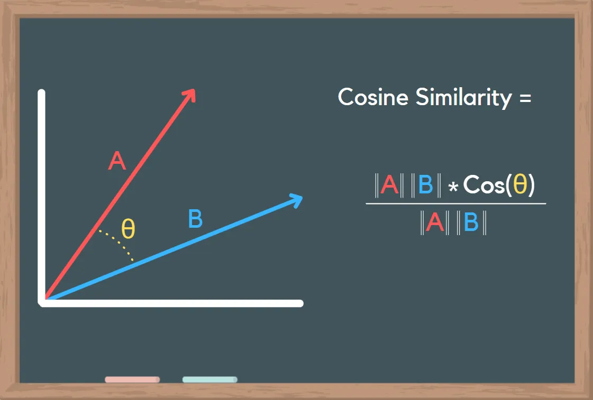

3단계. 지식 표현 (Embed)
=======================================

본 페이지는 22:58 지점부터 45:42 지점까지 보시면 됩니다.

.. raw:: html

  

    <iframe
        src="https://www.youtube.com/embed/9ayknWI-VcI?start=1378"
        frameborder="0"
        allowfullscreen>
    </iframe>
  

----

  분할된 텍스트를 벡터로 변환하여 의미적 유사도를 측정할 수 있도록 준비하는 과정

필요성
----------

컴퓨터는 문자열 그 자체로 의미를 파악할 수는 없습니다. 컴퓨터는 계산기이기 때문에 문자열을 숫자로 변환을 해야 합니다. 이러한 숫자를 벡터(Vector)라고 부르며, 벡터로의 변환 과정을 벡터화 혹은 **임베딩(Embedding)** 이라고 합니다. "brother"와 "sister"는 문자열 자체로는 관계가 없지만, 벡터로 변환되면 관계를 파악할 수 있습니다.

.. admonition:: 참고: 다양한 임베딩 모델
   :class: note

   데이터와 사용하는 임베딩 모델에 따라 문맥 이해 능력, 다국어 처리 능력 등의 성능이 달라집니다.

   * `word2vec <https://p.migdal.pl/blog/2017/01/king-man-woman-queen-why>`_
   * `FastText <https://fasttext.cc/>`_
   * `GloVe <https://nlp.stanford.edu/projects/glove/>`_
   * `BERT <https://github.com/google-research/bert>`_, `KoBERT <https://github.com/SKTBrain/KoBERT>`_
   * `OpenAI <https://platform.openai.com/docs/guides/embeddings>`_, `Google <https://cloud.google.com/vertex-ai/docs/generative-ai/embeddings>`_, `Hugging Face <https://huggingface.co/docs/text-embeddings-inference/en/index>`_ 의 임베딩 모델 등

본 튜토리얼에서는 벡터 변환은 OpenAI의 ``text-embedding-3-small`` 임베딩 모델을 사용하겠습니다.
이 모델은 1536 차원의 고정 크기의 벡터를 반환하구요. ``text-embedding-3-large`` 모델은 2배인 3072 차원의 벡터를 반환합니다.

``["오렌지", "설탕 커피", "카푸치노", "coffee"]`` 문자열 리스트에서 각각의 문자열을 벡터 데이터로 변환하는 예시는 다음과 같습니다.

.. code-block:: python
    :caption: OpenAI API를 활용한 벡터 데이터 생성 예시

    from typing import List, Dict
    import openai
    from environ import Env

    env = Env()
    env.read_env(overwrite=True)  # .env 파일을 환경변수로 로딩합니다.

    def embed_text(text: str) -> List[float]:
        client = openai.Client()
        res = client.embeddings.create(
            model="text-embedding-3-small",  # 1536 차원
            input=text)

        return res.data[0].embedding

    text_list = ["오렌지", "설탕 커피", "카푸치노", "coffee"]
    vector_list =[embed_text(text) for text in text_list]
    
    for text, vector in zip(text_list, vector_list):
        print(f"{text} => {len(vector)} 차원 : {vector[:2]}")

실행해보면, 각 문자열은 1536차원 (1536개의 실수 배열)의 벡터 데이터로 변환되었음을 확인할 수 있습니다.

.. code-block:: text

   오렌지 => 1536 차원 : [0.012019923888146877, -0.05075591802597046]
   설탕 커피 => 1536 차원 : [-0.0008126725442707539, -0.03418251499533653]
   카푸치노 => 1536 차원 : [-0.02143724076449871, 0.0011578402481973171]
   coffee => 1536 차원 : [-0.01013763528317213, 0.0037400354631245136]

각 벡터 데이터를 가지고, 유사 문서를 찾아내는 방법은 **코사인 유사도**, 유클리드 거리, 맨해튼 거리, 점수 기반 유사도, 자카드 유사도, **BM25** 등이 있습니다.
이 중에 가장 대중적인 방법은 **코사인 유사도**\이며 **두 벡터 간의 각도의 코사인 값**\을 이용하여 벡터 간의 유사도를 측정합니다.
코사인 유사도 값의 범위는 코사인 값 범위인 ``-1 ≤ cos(θ) ≤ 1`` 입니다. 같은 방향이면 각도가 0이니 ``cos(0) = 1`` 로 계산됩니다.

+ ``1.0`` → 완전히 동일한 벡터 (매우 유사함)
+ ``0.5`` → 어느 정도 관련 있음
+ ``0.0`` → 완전히 독립적인 의미 (연관 없음)
+ ``-1.0`` → 완전히 반대되는 방향 (극단적으로 다름)

   출처 : `What is Cosine Similarity? How to Compare Text and Images in Python <https://towardsdatascience.com/what-is-cosine-similarity-how-to-compare-text-and-images-in-python-d2bb6e411ef0>`_

이 중에 ``"커피"`` 문자열과 유사한 단어를 찾아보겠습니다. ``"커피"`` 문자열의 벡터 값은 ``[-0.03488345816731453, -0.0074335746467113495, ...]`` 입니다.

.. code-block:: python

   question = "커피"
   question_vector = embed_text(question)
   print(f"{question} => {len(question_vector)} 차원 : {question_vector[:2]}")
   # 커피 => 1536 차원 : [-0.03488345816731453, -0.0074335746467113495]

"오렌지", "설탕 커피", "카푸치노", "coffee" 문자열 과의 코사인 유사도를 계산해보면 다음과 같습니다.
(파이썬 머신러닝 라이브러리인 `scikit-learn <https://scikit-learn.org/stable>`_\에서
코사인 유사도 계산을 위한 `cosine_similarity <https://scikit-learn.org/dev/modules/generated/sklearn.metrics.pairwise.cosine_similarity.html>`_ 함수를 지원해줍니다.)

+ 의존 라이브러리 : ``pip install -U scikit-learn``

.. code-block:: python
   :linenos:

   >>> from sklearn.metrics.pairwise import cosine_similarity
   >>> similarity_list = cosine_similarity([question_vector], vector_list)[0]
   >>> similarity_list  # numpy 배열 타입
   array([0.24937937, 0.49054034, 0.24732958, 0.44292969])

   >>> for text, similarity in zip(text_list, similarity_list):
   ...     print(text, similarity)

   오렌지 0.24937936632106864
   설탕 커피 0.49054033782539064
   카푸치노 0.2473295791302273
   coffee 0.4429296921609209

1. 가장 유사한 문자열은 ``"설탕 커피"`` (유사도: 0.49054033782539064)
2. 두번째로 유사한 문자열은 ``"coffee"`` (유사도: 0.4429296921609209)
3. 세번째로 유사한 문자열은 ``"오렌지"`` (유사도: 0.24937936632106864)
4. 네번째로 유사한 문자열은 ``"카푸치노"`` (유사도: 0.2473295791302273)

OpenAI의 ``text-embedding-3-small`` 임베딩 모델을 활용한 벡터 데이터와 코사인 유사도를 통한 유사도 계산에서는
"카푸치노" 보다 "오렌지"가 더 유사하다고 계산되었습니다.
"카푸치노" 는 커피 종류이지만 문자 구조 자체는 "커피"와 비교적 거리가 멀 수 있습니다.
어떤 임베딩 모델을 사용했는 지와 계산 방법에 따라 유사도 측정 결과가 달라질 수 있습니다. 😅

.. admonition:: 참고: 코사인 유사도를 신중하게 사용해주세요.
   :class: note

   `GN⁺: 코사인 유사도(Cosine Similarity)를 함부로 사용하지 말 것 <https://news.hada.io/topic?id=18747>`_

각 문서를 벡터 데이터로 변환
-----------------------------------------------

앞서 생성했던 빽다방 메뉴 데이터를 벡터 데이터로 변환하겠습니다. ``embed`` 함수에서는 문서 리스트를 받고, 각 문서의 내용(``.page_content``)을 임베딩 모델을 통해 벡터 데이터로 변환합니다. 각 원본 문자열과 벡터 데이터는 리스트에 담아서 반환합니다. 이렇게 생성된 벡터 데이터를 저장하고 관리하는 주체를 ``Vector Store`` 라고 부릅니다.

.. code-block:: python
   :linenos:
   :emphasize-lines: 1-16,24-33

   def embed(doc_list: List[Document]) -> List[Dict]:
       vector_store = []

       for doc in doc_list:
           response = client.embeddings.create(
               model="text-embedding-3-small",
               input=doc.page_content,
           )
           vector_store.append(
               {
                   "document": doc.model_copy(),
                   "embedding": response.data[0].embedding,
               }
           )

       return vector_store

   doc_list = load()
   print(f"loaded {len(doc_list)} documents")
   doc_list = split(doc_list)
   print(f"split into {len(doc_list)} documents")
   # pprint(doc_list)

   vector_store = embed(doc_list)
   print(f"created {len(vector_store)} items in vector store")
   for row in vector_store:
       print(
           "{}... => {} 차원, {} ...".format(
               row["document"].page_content[:10],
               len(row["embedding"]),
               row["embedding"][:2],
           )
       )

아래와 같이 각 메뉴들이 개별 문서로 나눠졌고, 각 문서가 1536차원의 벡터 배열로 변환되었음을 확인하실 수 있습니다.

.. code-block:: text

   loaded 1 documents
   split into 10 documents
   created 10 items in vector store
   1. 아이스티샷추가... => 1536 차원, [-0.02693873643875122, -0.043540798127651215] ...
   2. 바닐라라떼(I... => 1536 차원, [0.02490091510117054, -0.04808296635746956] ...
   3. 사라다빵  ... => 1536 차원, [0.027449999004602432, -0.04239306598901749] ...
   4. 빽사이즈 아메... => 1536 차원, [-0.009449880570173264, -0.03460339829325676] ...
   5. 빽사이즈 원조... => 1536 차원, [0.03321684151887894, 0.035661567002534866] ...
   6. 빽사이즈 원조... => 1536 차원, [0.04160701856017113, -0.0009915598202496767] ...
   7. 빽사이즈 달콤... => 1536 차원, [0.014812068082392216, -0.01777448132634163] ...
   8. 빽사이즈 아이... => 1536 차원, [-0.011549889110028744, -0.02412295714020729] ...
   9. 빽사이즈 아이... => 1536 차원, [0.009231451898813248, 0.050084274262189865] ...
   10. 빽사이즈 초... => 1536 차원, [0.0744316577911377, 0.013424741104245186] ...
