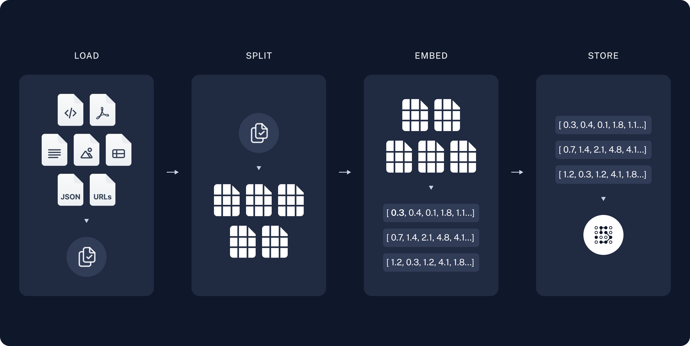

전형적인 RAG
===============

전형적인 RAG 프로세스는 크게 준비 단계와 활용 단계로 나눌 수 있습니다.

* 준비 단계

  1. 지식 변환 (Load)
  2. 지식을 쪼개기 (Split) 
  3. 지식 표현 (Embed)
  4. 지식 저장 (Store)

* 활용 단계

  5. 지식 검색 (Search) 및 LLM 요청/응답

----

   출처 : `랭체인 공식 튜토리얼: RAG 애플리케이션 구축하기 <https://python.langchain.com/docs/tutorials/rag/>`_

* :doc:`01-load`

  - 각 지식들을 LLM이 이해할 수 있도록 각 지식 파일 (PDF, HWP, 데이터베이스 등) 들을 텍스트 문서(Document) 객체로 변환합니다.
  - 랭체인에서 `문서(Document) <https://python.langchain.com/api_reference/core/documents/langchain_core.documents.base.Document.html>`_\ 는 단순히 메타데이터를 저장하는 ``.metadata`` 사전 속성과 내용을 저장하는 ``.page_content`` 문자열 속성을 가진 파이썬 객체입니다.

    .. tab-set::

      .. tab-item:: Document 객체 직접 생성

        .. code-block:: python

          from langchain_core.documents import Document

          doc_list = [
              Document(
                  metadata={"source": "https://example.com"},
                  page_content="Hello, world!",
              ),
          ]

      .. tab-item:: 빽다방.txt

        .. code-block:: text

          1. 아이스티샷추가(아.샷.추)
            - SNS에서 더 유명한 꿀팁 조합 음료 :) 상콤달콤한 복숭아맛 아이스티에 진한 에스프레소 샷이 어우러져 환상조합
            - 가격: 3800원

          2. 바닐라라떼(ICED)
            - 부드러운 우유와 달콤하고 은은한 바닐라가 조화를 이루는 음료
            - 가격: 4200원

          3. 사라다빵
            - 빽다방의 대표메뉴 :) 추억의 감자 사라다빵
            - 가격: 3900원

          4. 빽사이즈 아메리카노(ICED)
            - 에스프레소 4샷이 들어가 깊고 진한 맛의 아메리카노
            - 가격: 3500원

          5. 빽사이즈 원조커피(ICED)
            - 빽다방의 BEST메뉴를 더 크게 즐겨보세요 :) [주의. 564mg 고카페인으로 카페인에 민감한 어린이, 임산부는 섭취에 주의바랍니다]
            - 가격: 4000원

          6. 빽사이즈 원조커피 제로슈거(ICED)
            - 빽다방의 BEST메뉴를 더 크게, 제로슈거로 즐겨보세요 :) [주의. 686mg 고카페인으로 카페인에 민감한 어린이, 임산부는 섭취에 주의바랍니다]
            - 가격: 4000원

          7. 빽사이즈 달콤아이스티(ICED)
            - 빽다방의 BEST메뉴를 더 크게 즐겨보세요 :) 시원한 복숭아맛 아이스티
            - 가격: 4300원

          8. 빽사이즈 아이스티샷추가(ICED)
            - SNS에서 더 유명한 꿀팁 조합 음료 :) 상콤달콤한 복숭아맛 아이스티에 진한 에스프레소 2샷이 어우러져 환상조합
            - 가격: 4800원

          9. 빽사이즈 아이스티 망고추가+노란빨대
            - SNS핫메뉴 아이스티에 망고를 한가득:)
            - 가격: 6300원

          10. 빽사이즈 초코라떼(ICED)
            - 빽다방의 BEST메뉴를 더 크게 즐겨보세요 :) 진짜~완~전 진한 초코라떼
            - 가격 : 5500원

      .. tab-item:: 랭체인 활용

        지식 파일을 읽어서 문서 목록을 생성합니다.

        .. code-block:: python

          from langchain_community.document_loaders import TextLoader

          doc_list = TextLoader(file_path="./빽다방.txt").load()
          print(doc_list)

        .. code-block:: text

          [Document(metadata={'source': './빽다방.txt'}, page_content='1. 아이스티샷추가(아.샷.추)\n  - SNS에서 더 유명한 꿀팁 조합 음료 :) 상콤달콤한 복숭아맛 아이스티에 진한 에스프레소 샷이 어우러져 환상조합\n  - 가격: 3800원'),
           Document(metadata={'source': './빽다방.txt'}, page_content='2. 바닐라라떼(ICED)\n  - 부드러운 우유와 달콤하고 은은한 바닐라가 조화를 이루는 음료\n  - 가격: 4200원\n\n3. 사라다빵\n  - 빽다방의 대표메뉴 :) 추억의 감자 사라다빵\n  - 가격: 3900원'),
           Document(metadata={'source': './빽다방.txt'}, page_content='4. 빽사이즈 아메리카노(ICED)\n  - 에스프레소 4샷이 들어가 깊고 진한 맛의 아메리카노\n  - 가격: 3500원'),
           Document(metadata={'source': './빽다방.txt'}, page_content='5. 빽사이즈 원조커피(ICED)\n  - 빽다방의 BEST메뉴를 더 크게 즐겨보세요 :) [주의. 564mg 고카페인으로 카페인에 민감한 어린이, 임산부는 섭취에 주의바랍니다]\n  - 가격: 4000원'),
           Document(metadata={'source': './빽다방.txt'}, page_content='6. 빽사이즈 원조커피 제로슈거(ICED)\n  - 빽다방의 BEST메뉴를 더 크게, 제로슈거로 즐겨보세요 :) [주의. 686mg 고카페인으로 카페인에 민감한 어린이, 임산부는 섭취에 주의바랍니다]\n  - 가격: 4000원'),
           Document(metadata={'source': './빽다방.txt'}, page_content='7. 빽사이즈 달콤아이스티(ICED)\n  - 빽다방의 BEST메뉴를 더 크게 즐겨보세요 :) 시원한 복숭아맛 아이스티\n  - 가격: 4300원'),
           Document(metadata={'source': './빽다방.txt'}, page_content='8. 빽사이즈 아이스티샷추가(ICED)\n  - SNS에서 더 유명한 꿀팁 조합 음료 :) 상콤달콤한 복숭아맛 아이스티에 진한 에스프레소 2샷이 어우러져 환상조합\n  - 가격: 4800원'),
           Document(metadata={'source': './빽다방.txt'}, page_content='9. 빽사이즈 아이스티 망고추가+노란빨대\n  - SNS핫메뉴 아이스티에 망고를 한가득:)\n  - 가격: 6300원'),
           Document(metadata={'source': './빽다방.txt'}, page_content='10. 빽사이즈 초코라떼(ICED)\n  - 빽다방의 BEST메뉴를 더 크게 즐겨보세요 :) 진짜~완~전 진한 초코라떼\n  - 가격 : 5500원')]

* :doc:`02-split`

  - 변환된 텍스트들의 크기가 너무 작거나 크면, 지식을 찾을 때 정확도가 떨어질 수 있습니다.
    각 문서(Document)의 텍스트(``.page_content`` 속성)를 적절한 크기로 쪼개어 조정한 문서로 변환합니다.

    .. code-block:: python

      # 조정된 문서 목록
      doc_list = [
          Document(page_content="Hello", metadata={"source": "https://example.com"}),
          Document(page_content="world!", metadata={"source": "https://example.com"}),
      ]

* :doc:`03-embed`

  - 저장된 각 지식 문서 문자열을 벡터 데이터로 변환합니다.
  - 검색에서는 질문과 유사한 문서를 찾습니다. 유사한 문서를 찾는 방법으로서 벡터 데이터를 활용하는 데요.
    각 문서들을 미리 벡터 데이터로 변환(Embed 과정)해두고, 검색 시에는 임베딩된 벡터 데이터를 유사도 계산에 활용합니다.

    .. code-block:: python
      :emphasize-lines: 5,9

      # 조정된 문서 목록
      doc_list = [
          {
              "document": Document(page_content="Hello", metadata={"source": "https://example.com"}),
              "embedding": [-0.155420375930164598, -0.424982480319389604, ...],  # 생략
          },
          {
              "document": Document(page_content="world!", metadata={"source": "https://example.com"}),
              "embedding": [-0.794020539573502695, -0.076002917234101238, ...],  # 생략
          },
      ]

* :doc:`04-store`

  - 각 문서와 문서의 벡터 데이터를 디스크에 저장하여, 검색에서 활용할 수 있도록 준비합니다.
  - 문서 내용이 바뀌면, 관련 벡터 데이터도 매번 재생성해야 합니다.

    .. code-block:: python

      # 디스크에 저장된 문서 목록
      import pickle
      with open("doc_list.pkl", "wb") as f:
          pickle.dump(doc_list, f)

* :doc:`05-search`

  - 질문과 유사한 내용의 지식을 찾아, 지식과 함께 LLM에게 답변을 요청합니다.
  - :doc:`../glance`\에서 소개한 코드를 참고해서 작성해보세요.

    .. code-block:: python

      question = "빽다방 카페인이 높은 음료와 가격은?"

      # doc_list 에서 질문과 유사한 내용의 지식을 찾습니다.
      search_results: List[Document] = ...
      # [Document(metadata={'source': './빽다방.txt'}, page_content='5. 빽사이즈 원조커피(ICED)\n  - 빽다방의 BEST메뉴를 더 크게 즐겨보세요 :) [주의. 564mg 고카페인으로 카페인에 민감한 어린이, 임산부는 섭취에 주의바랍니다]\n  - 가격: 4000원'),
      #  Document(metadata={'source': './빽다방.txt'}, page_content='6. 빽사이즈 원조커피 제로슈거(ICED)\n  - 빽다방의 BEST메뉴를 더 크게, 제로슈거로 즐겨보세요 :) [주의. 686mg 고카페인으로 카페인에 민감한 어린이, 임산부는 섭취에 주의바랍니다]\n  - 가격: 4000원')]

      prompt = f"""
      지식: {search_results}
      질문: {question}
      답변:"""

      # LLM 요청

    실행해보면, 제공된 지식에 기반해서 정확한 답변이 생성됩니다.

    .. code-block:: text

      빽다방에서 카페인이 높은 음료는 다음과 같습니다:

      1. 빽사이즈 원조커피(ICED) - 564mg 고카페인, 가격: 4000원
      2. 빽사이즈 원조커피 제로슈거(ICED) - 686mg 고카페인, 가격: 4000원

      이 두 음료가 카페인이 가장 높습니다.

----

각 단계에 대해서 좀 더 자세히 살펴봅시다. 😉

.. toctree::
   :maxdepth: 2

   01-load
   02-split
   03-embed
   04-store
   05-search
   langchain
