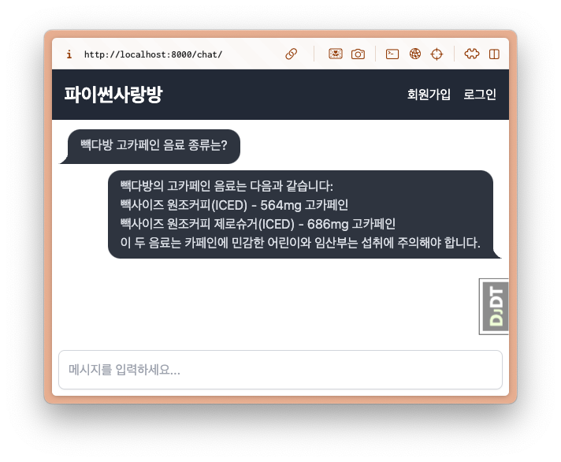

=================================
빽다방. 유사도 검색
=================================

.. admonition:: `관련 커밋 <https://github.com/pyhub-kr/django-llm-chat-proj/commit/aa58822da6740ade3dc50f3c26d07b12488fa764>`_
   :class: dropdown

   * 변경 파일을 한 번에 덮어쓰기 하실려면, :doc:`/utils/pyhub-git-commit-apply` 설치하신 후에, rag-02 폴더 상위 경로에서 아래 명령어 실행

   .. code-block:: bash

      uv run pyhub-git-commit-apply https://github.com/pyhub-kr/django-llm-chat-proj/commit/aa58822da6740ade3dc50f3c26d07b12488fa764

유사도 검색 쿼리셋
=================================

RAG 첫번째 튜토리얼의 :doc:`/rag-01/typical/05-search` 페이지에서 구현한 유사도 검색 코드를 참고해서,
장고 쿼리셋을 통한 유사도 검색을 구현해보겠습니다.

.. admonition:: 참고: VectorStore 클래스의 search 메서드
    :class: dropdown

    .. code-block:: python
        :caption: ``chat/rag.py``

        class VectorStore(list):
            embedding_model = settings.RAG_EMBEDDING_MODEL

            # 생략

            def search(self, question: str, top_k: int = 4) -> List[Document]:
                # pip install -U scikit-learn

                response = client.embeddings.create(model=self.embedding_model, input=question)
                question_embedding = response.data[0].embedding
                embedding_list = [row["embedding"] for row in self]

                # 모든 데이터와 코사인 유사도 계산
                similarities = cosine_similarity([question_embedding], embedding_list)[0]
                # 유사도가 높은 순으로 정렬하여 top_k 개 선택
                top_indices = np.argsort(similarities)[::-1][:top_k]

                return [
                    Document(
                        metadata={"similarity": similarities[idx]},
                        page_content=self[idx]["text"],
                    )
                    for idx in top_indices
                ]

``pgvector.django.CosineDistance`` 클래스를 통해 ``pgvector``\의 코사인 거리 데이터베이스 함수인 ``<=>`` 를 사용할 수 있습니다.

.. code-block:: python

    >>> from pgvector.django import CosineDistance

    >>> CosineDistance("embedding", [1, 2, 3])
    CosineDistance(F(embedding) <=> Value('[1.0,2.0,3.0]'))

쿼리셋의 ``.annotate()`` 메서드를 사용하여, 아래와 같이 임베딩 벡터와 질문 벡터(``question_embedding``) 간 코사인 거리를 계산하고 정렬할 수 있습니다.

.. code-block:: python

    # 질문 벡터 생성
    >>> question_embedding = PaikdabangMenuDocument.embed("빽다방 고카페인 음료 종류는?")
    >>> len(question_embedding), question_embedding[:2]
    (1536, [-0.05759706348180771, 0.011250046081840992])

    # 코사인 거리 계산 쿼리 추가
    >>> qs = PaikdabangMenuDocument.objects.annotate(
    ...     cosine_distance=CosineDistance("embedding", question_embedding)
    ... )
    # 코사인 거리. 오름차순 정렬하고 첫 top_k 개 선택
    >>> top_k = 4
    >>> qs = qs.order_by("cosine_distance")[:top_k]
    >>> for doc in qs:
    ...     print(doc.pk, doc.cosine_distance)
    ...     print(doc.page_content)
    ...     print()

위 코드를 수행하면, 아래와 같이 코사인 거리를 계산하여 유사한 문서 4개를 출력합니다.

.. code-block:: text

    SELECT "chat_paikdabangmenudocument"."id",
       "chat_paikdabangmenudocument"."page_content",
       "chat_paikdabangmenudocument"."metadata",
       "chat_paikdabangmenudocument"."embedding",
       "chat_paikdabangmenudocument"."created_at",
       "chat_paikdabangmenudocument"."updated_at", ("chat_paikdabangmenudocument"."embedding" <=> '[-0.05759706348180771,
       0.011250046081840992,
       -0.021529577672481537,

    Execution time: 0.030540s [Database: default]

    6 0.4760702252388
    5. 빽사이즈 원조커피(ICED)
    - 빽다방의 BEST메뉴를 더 크게 즐겨보세요 :) [주의. 564mg 고카페인으로 카페인에 민감한 어린이, 임산부는 섭취에 주의바랍니다]
    - 가격: 4000원

    7 0.533601880073547
    6. 빽사이즈 원조커피 제로슈거(ICED)
    - 빽다방의 BEST메뉴를 더 크게, 제로슈거로 즐겨보세요 :) [주의. 686mg 고카페인으로 카페인에 민감한 어린이, 임산부는 섭취에 주의바랍니다]
    - 가격: 4000원

    3 0.641409692890317
    2. 바닐라라떼(ICED)
    - 부드러운 우유와 달콤하고 은은한 바닐라가 조화를 이루는 음료
    - 가격: 4200원

    5 0.676358223827917
    4. 빽사이즈 아메리카노(ICED)
    - 에스프레소 4샷이 들어가 깊고 진한 맛의 아메리카노
    - 가격: 3500원

커스텀 모델 매니저
=================================

모든 장고 모델은 ``.objects`` 속성을 통해 모델 매니저를 지원하며,
데이터베이스 쿼리를 수행하는 ``.all()``, ``.filter()``, ``.exclude()`` 등의 메서드를 제공합니다.
기본 제공되는 메서드 외에 추가 메서드를 정의할 수 있는 데요.
이를 위해서는 커스텀 모델 매니저 구현이 필요합니다.

``models.Manager`` 클래스를 상속받아 구현하는 방법은 쿼리셋 체이닝(Chaining)이 불가능하며,
``models.QuerySet`` 클래스를 상속받아 구현하는 방법은 쿼리셋 체이닝이 가능하기에 확장성이 좋습니다.

커스텀 모델 매니저 구현을 위해서 ``models.QuerySet`` 클래스를 상속받습니다.
``models.QuerySet`` 클래스는 모델 매니저를 생성하는 ``.as_manager()`` 클래스 함수를 제공합니다.
모델 매니저를 적용할 모델 클래스에 ``objects`` 클래스 속성으로 새로운 모델 매니저를 지정하여 디폴트 모델 매니저를 교체합니다.

.. code-block:: python
    :caption: ``chat/models.py``
    :linenos:

    from django.db import models

    class PaikdabangMenuDocumentQuerySet(models.QuerySet):
        pass

    class PaikdabangMenuDocument(LifecycleModelMixin, models.Model):
        # 생략

        # .as_manager() 메서드를 통해 모델 매니저를 생성하여
        # 디폴트 모델 매니저를 커스텀 쿼리셋으로 교체합니다.
        objects = PaikdabangMenuDocumentQuerySet.as_manager()

``PaikdabangMenuDocumentQuerySet`` 클래스에는 유사도 검색을 위한 ``search`` 메서드를 추가합니다.
그럼 ``PaikdabangMenuDocument.objects.search(...)`` 메서드로 유사도 검색을 수행할 수 있고,
``PaikdabangMenuDocument.objects.filter(id__lte=5).search(...)`` 처럼 쿼리셋 체이닝도 가능합니다.

유사도 검색은 비동기 함수에서 호출할 것이기에 비동기 함수로 구현합니다.
이때 주의하실 부분은 쿼리셋 객체에 대한 평가는 동기 방식으로만 동작하므로,
비동기 메서드에서는 쿼리셋을 리스트로 변환하여 반환토록 합니다.

.. code-block:: python
    :caption: ``chat/models.py``
    :linenos:
    :emphasize-lines: 1-2,4-5,8-17,23-25

    from typing import List
    from asgiref.sync import sync_to_async

    import openai
    from pgvector.django import VectorField, HnswIndex, CosineDistance

    class PaikdabangMenuDocumentQuerySet(models.QuerySet):
        async def search(self, question: str, k: int = 4) -> List["PaikdabangMenuDocument"]:
            # 모델 클래스의 비동기 aembed 클래스 함수를 호출하여 질문 벡터를 생성합니다.
            question_embedding: List[float] = await self.model.aembed(question)

            qs = self.annotate(
                cosine_distance=CosineDistance("embedding", question_embedding)
            )
            qs = qs.order_by("cosine_distance")[:k]
            return await sync_to_async(list)(qs)

    class PaikdabangMenuDocument(LifecycleModelMixin, models.Model):
        # 생략

        # .as_manager() 메서드를 통해 모델 매니저를 생성하여
        # 디폴트 모델 매니저를 커스텀 쿼리셋으로 교체합니다.
        objects = PaikdabangMenuDocumentQuerySet.as_manager()

.. tip::

    QuerySet에서는 ``self.model`` 속성을 통해 관련 모델 클래스를 참조할 수 있습니다.

장고 쉘에서 동작을 테스트해봅니다.

.. code-block:: text
    :linenos:
    :emphasize-lines: 1,3-4,17-20

    $ uv run python manage.py shell_plus --print-sql

    # search 메서드 내부에서 리스트 변환이 이뤄지므로, 즉시 데이터베이스 조회가 발생합니다.
    >>> doc_list = await PaikdabangMenuDocument.objects.search("빽다방 고카페인 음료 종류는?")

    SELECT "chat_paikdabangmenudocument"."id",
        "chat_paikdabangmenudocument"."page_content",
        "chat_paikdabangmenudocument"."metadata",
        "chat_paikdabangmenudocument"."embedding",
        "chat_paikdabangmenudocument"."created_at",
        "chat_paikdabangmenudocument"."updated_at", ("chat_paikdabangmenudocument"."embedding" <=> '[-0.057591553777456284,
       0.011229164898395538,
       -0.021586930379271507

    Execution time: 0.042051s [Database: default]

    # 이미 조회된 리스트를 순회하므로 데이터베이스 조회가 발생하지 않습니다.
    >>> for doc in doc_list:
    ...     print(doc.page_content, "\n", doc.cosine_distance)
    ...     print()
    ... 

    5. 빽사이즈 원조커피(ICED)
    - 빽다방의 BEST메뉴를 더 크게 즐겨보세요 :) [주의. 564mg 고카페인으로 카페인에 민감한 어린이, 임산부는 섭취에 주의바랍니다]
    - 가격: 4000원 
    0.476184546947479

    6. 빽사이즈 원조커피 제로슈거(ICED)
    - 빽다방의 BEST메뉴를 더 크게, 제로슈거로 즐겨보세요 :) [주의. 686mg 고카페인으로 카페인에 민감한 어린이, 임산부는 섭취에 주의바랍니다]
    - 가격: 4000원 
    0.533724308013916

    2. 바닐라라떼(ICED)
    - 부드러운 우유와 달콤하고 은은한 바닐라가 조화를 이루는 음료
    - 가격: 4200원 
    0.641531793016056

    4. 빽사이즈 아메리카노(ICED)
    - 에스프레소 4샷이 들어가 깊고 진한 맛의 아메리카노
    - 가격: 3500원 
    0.676372201118367

채팅 View 응답에 반영하기
=================================

VectorStore 서버는 Postgres 데이터베이스에서 구동 중이므로, 이제 장고 서버 구동 시에 벡터 데이터를 로딩할 필요가 없어졌습니다.
``PaikdabangAI`` 클래스에서 생성자에서 벡터 데이터를 로딩하는 코드를 제거하고,
``PaikdabangMenuDocument.objects.search`` 메서드를 통해 유사도 검색을 수행합니다.

``search`` 메서드는 비동기 메서드이기에 ``await`` 키워드를 통해 비동기 함수로 호출하고,
``PaikdabangMenuDocument`` 리스트를 반환합니다.
리스트를 순회돌며 ``.page_content`` 속성을 모두 합쳐 지식 문자열을 생성하고 프롬프트에 반영합니다.

.. code-block:: python
    :caption: ``chat/ai.py``
    :linenos:
    :emphasize-lines: 2-8,14-15,17-19

    class PaikdabangAI:
        # def __init__(self):
        #     try:
        #         self.vector_store = rag.VectorStore.load(settings.VECTOR_STORE_PATH)
        #         logger.debug("Loaded vector store %s items", len(self.vector_store))
        #     except FileNotFoundError as e:
        #         logger.error("Failed to load vector store: %s", e)
        #         self.vector_store = rag.VectorStore()

        async def get_response(self, question: str, stream: bool = False) -> Union[
            ChatCompletion,  # 동기 OpenAI API 호출 시
            AsyncStream[ChatCompletionChunk],  # 비동기 OpenAI API 호출 시
        ]:
            # search_doc_list = self.vector_store.search(question)
            # 지식 = "\n\n".join(doc.page_content for doc in search_doc_list)

            # 쿼리셋을 통한 유사도 검색
            doc_list = await PaikdabangMenuDocument.objects.search(question)
            지식 = "\n\n".join(doc.page_content for doc in doc_list)

            return await async_client.chat.completions.create(
                messages=[
                    {
                        "role": "system",
                        "content": f"넌 AI Assistant. 모르는 건 모른다고 대답.\n\n[[빽다방 메뉴 정보]]\n{지식}",
                    },
                    {
                        "role": "user",
                        "content": question,
                    },
                ],
                model="gpt-4o-mini",
                temperature=0,
                stream=stream,
            )

        # 생략: __call__, ainvoke, astream 메서드

:doc:`/rag-01/index` 튜토리얼과 동일한 응답으로 채팅 기능이 동작함을 확인할 수 있습니다.

