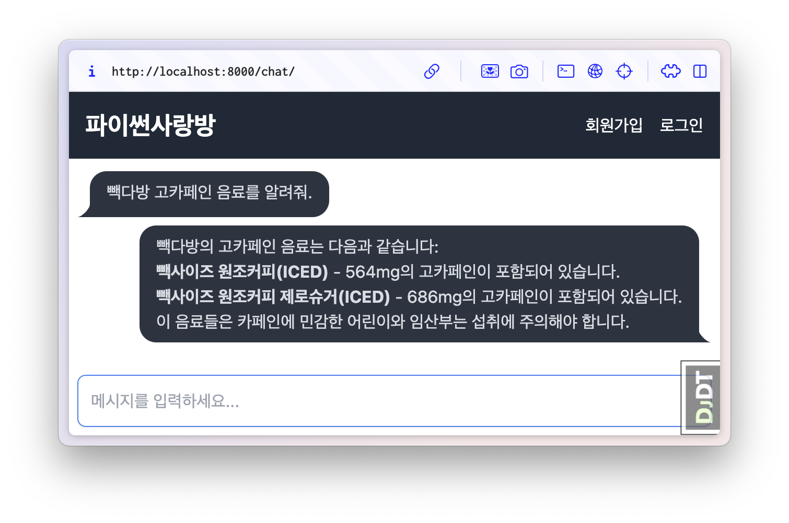

=============
실습 준비
=============

:doc:`/rag-01/index` 튜토리얼을 이어서 진행합니다.
이전 튜토리얼을 끝까지 실습하셨다면 **아래 과정없이** 이어서 진행하셔도 됩니다.

본 RAG #02 튜토리얼부터 진행하신다면?
========================================

:doc:`/rag-01/index` 튜토리얼 실습없이 본 RAG #02 튜토리얼부터 진행하신다면,
`링크의 저장소를 다운 <https://github.com/pyhub-kr/django-llm-chat-proj/archive/1a7bbae4fcae4e5c662578791187fd85d8947b29.zip>`_\받으신 후에
``rag-02`` 폴더만 복사해주세요.

OpenAI API Key 설정
-------------------------

``rag-02/.env`` 경로에 ``OPENAI_API_KEY`` 환경변수를 설정해주세요.

.. code-block:: text
    :caption: ``.env`` 파일 생성

    OPENAI_API_KEY=sk-...

.. tip::

    OpenAI API Key가 없으신 분은 :doc:`/quickstart/first-chat-bot` 튜토리얼의 “OpenAI API Key 얻기” 섹션을 참고해주세요.

라이브러리 설치
-------------------------

``rag-02`` 프로젝트 경로에서 ``uv`` 또는 ``venv`` 유틸리티를 활용해서 가상환경을 생성하고, 파이썬 패키지를 설치해주세요.

.. tab-set::

    .. tab-item:: uv 활용

        .. code-block:: bash

            # uv 유틸리티 설치
            python -m pip install --upgrade uv

            # 가상환경 생성
            uv venv

            # 팩키지 설치
            uv pip install -r requirements.txt

    .. tab-item:: venv 활용

        .. code-block:: bash

            # 파이썬3에서 제공하는 가상환경 기능을 활용해서 가상환경 생성
            python -m venv .venv

            # 운영체제에 맞춰서 가상환경 활성화
            .venv/Scripts/activate     # windows
            source .venv/bin/activate  # macOS/linux

            # 팩키지 설치
            pip install -r requirements.txt

.. tip::

    가상환경에 대해 자세히 알고 싶으신 분은 :doc:`/setup/venv` 튜토리얼을 참고해주세요.

장고 프로젝트 구동
-------------------------

아래 명령으로 데이터베이스 테이블을 생성하고, 관리자 계정을 생성해주세요.

.. tab-set::

    .. tab-item:: uv 활용

        .. code-block:: bash

            # 데이터베이스 테이블 생성
            uv run python manage.py migrate

            # 관리자 계정 생성
            uv run python manage.py createsuperuser

            # 개발서버 구동
            uv run python manage.py runserver 0.0.0.0:8000

    .. tab-item:: venv 활용

        .. code-block:: bash

            # 데이터베이스 테이블 생성
            python manage.py migrate

            # 관리자 계정 생성
            python manage.py createsuperuser

            # 개발서버 구동
            python manage.py runserver 0.0.0.0:8000

이어서 ``make_vector_store`` 명령으로 벡터 스토어를 구축해주세요.

.. tab-set::

    .. tab-item:: uv 활용

        .. code-block:: text
            :emphasize-lines: 1

            uv run python manage.py make_vector_store ./chat/assets/빽다방.txt

            [2025-02-03 08:12:33,379] Failed to load vector store: [Errno 2] No such file or directory: '/Users/allieus/Work/django-llm-chat-proj/rag-02/vector_store.pickle'
            loaded 1 documents
            split into 10 documents
            [2025-02-03 08:12:44,933] saved vector store to /Users/allieus/Work/django-llm-chat-proj/rag-02/vector_store.pickle

    .. tab-item:: venv 활용

        .. code-block:: text
            :emphasize-lines: 1

            python manage.py make_vector_store ./chat/assets/빽다방.txt

            [2025-02-03 08:12:33,379] Failed to load vector store: [Errno 2] No such file or directory: '/Users/allieus/Work/django-llm-chat-proj/rag-02/vector_store.pickle'
            loaded 1 documents
            split into 10 documents
            [2025-02-03 08:12:44,933] saved vector store to /Users/allieus/Work/django-llm-chat-proj/rag-02/vector_store.pickle

.. warning::

    만약, ``make_vector_store`` 명령을 수행하지 않아 벡터 스토어가 구축되지 않았거나,
    이후 검색에서 유사한 문서를 찾지 못한 경우, 아래 코사인 유사도 계산 함수에서 ``embedding_list`` 인자가
    빈 리스트가 전달이 되구요.

    .. code-block:: python
        :caption: ``chat/rag.py``

        similarities = cosine_similarity([question_embedding], embedding_list)[0]

    아래의 오류가 발생하게 됩니다.

    .. code-block:: text

        ValueError: Expected 2D array, got 1D array instead:

개발서버를 구동시켜주시고,

.. tab-set::

    .. tab-item:: uv 활용

        .. code-block:: bash

            # 개발서버 구동
            uv run python manage.py runserver 0.0.0.0:8000

    .. tab-item:: venv 활용

        .. code-block:: bash

            # 개발서버 구동
            python manage.py runserver 0.0.0.0:8000

브라우저로 http://localhost:8000/chat/ 에 접속해서 채팅 메시지로 "빽다방 고카페인 음료를 알려줘." 라고 입력해주세요.
그럼 아래와 같이 RAG 챗봇이 응답해줍니다.

