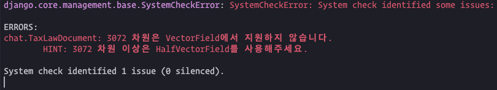
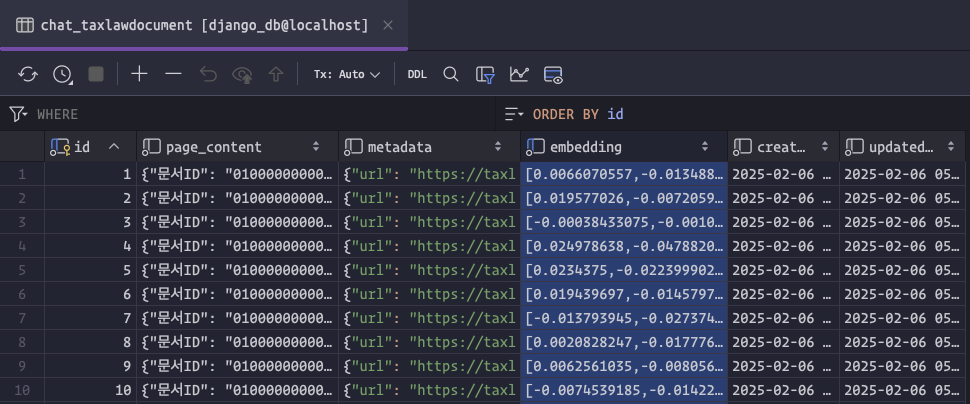

===================
세법해석례 RAG
===================

AI 세무사 서비스가 2025년 3월에 출시된다고 합니다.
`세무사회, "AI 세무사" 출시..."최신 법령, 예규·판례 등 실시간 검색" <https://www.tfmedia.co.kr/news/article.html?no=178052>`_ 기사에 따르면
LLM 기술과 RAG 기술을 결합하여 최신법령 및 예규․판례 등에 대한 세무서비스를 제공한다고 하는 데요.

`국세법령정보시스템 <https://taxlaw.nts.go.kr>`_\에는
`13만 건이 넘는 세법해석례 질답 데이터 <https://taxlaw.nts.go.kr/qt/USEQTJ001M.do>`_\가 있습니다.
세법 해석례 데이터와 ``Document`` 모델을 통해 세법해석례 질답 데이터를 저장 및 임베딩하고, 빠르게 문서 RAG를 구현해보겠습니다.

.. admonition:: `관련 커밋 <https://github.com/pyhub-kr/django-llm-chat-proj/commit/bade803ce4e8211dbba03de0458450e248df1bad>`_
   :class: dropdown

   * 변경 파일을 한 번에 덮어쓰기 하실려면, :doc:`/utils/pyhub-git-commit-apply` 설치하신 후에, rag-02 폴더 상위 경로에서 아래 명령어 실행

   .. code-block:: bash

      uv run pyhub-git-commit-apply https://github.com/pyhub-kr/django-llm-chat-proj/commit/bade803ce4e8211dbba03de0458450e248df1bad

데이터 다운로드
===================

RAG를 위해서는 먼저 텍스트 데이터로서 세법해석례 질답 데이터가 필요합니다.
국세법령정보시스템에서는 이 데이터에 대한 API는 제공하지 않기에 직접 데이터를 수집했습니다.
총 13만건의 데이터 중에 샘플로 1000건의 데이터를 `링크 <https://github.com/pyhub-kr/dump-data/tree/main/rag>`_\에서 다운받으실 수 있습니다.
이 중 `sample-taxlaw-1000.jsonl <https://github.com/pyhub-kr/dump-data/raw/refs/heads/main/rag/sample-taxlaw-1000.jsonl>`_ 파일 :sup:`(용량: 44MB)`\을 사용하겠습니다.
파일은 지금 받지 않으셔도 되구요. 아래에서 코드를 통해 자동 다운로드하겠습니다.

.. code-block:: json
    :linenos:

    {"page_content": "{\"문서ID\": \"010000000000001684\", \"제목\": \"건물의 신축・분양 등을 신탁회사에 위탁한 경우 취득가액의 계산 등\", \"문서번호\": \"법인46012-2799\", \"법령분류\": \"법인세\", \"요지\": \"건물의 신축・분양・임대・유지관리를 위탁하고 지급하는 비용의 취득가액, 손금구분 및 양도시 특별부가세 과세표준 계산\", \"회신\": \"부동산임대업 등을 영위하는 법인이 신탁업법에 의한 신탁회사에 건물의 신축․분양․임대․유지관리를 위탁하고 지급하는 신탁수수료 중 건물신축에 따른 신탁수수료는 당해 건물의 취득원가에 산입하고, 분양 등의 수익을 위해서 지출한 신탁수수료는 당해 법인의 각 사업연도 소득금액계산시 손금에 산입하는 것이며, 신탁회사에 위탁하여 신축한 건물을 양도하는 경우 특별부가세과세표준을 계산함에 있어 당해 건물의 취득원가에 산입하는 신탁수수료와 제세공과금(취득세, 등록세 등)은 양도가액에서 공제할 수있는 것이고, 위의 신탁과 관련하여 신탁회사가 위탁자를 대리하여 납부하는 제세공과금은 그 내용에 따라 취득원가(취득세,등록세 등)또는 손비(법인세법상 손금불산입하는 것은 제외)로 처리한다.\", \"파일내용\": \"[ 질 의 ] 1. 부동산신탁과 관련하여 신탁회사에 지급하는 각종 수수료가부동산임대업 등 사업을 영위하는 법인이나 개인사업자의손금이나 필요경비로 인정되는지. 인정되지 않는다면 그 근거는무엇인지 2. 부동산신탁과 관련하여 신탁회사에 지급하는 각종 수수료가양도소득세나 특별부가세 과세표준 계산시 양도가액에서공제받을 수 있는지 질의함\", \"공개여부\": \"공개\", \"문서분류\": \"질의\", \"생성일시\": \"1996-10-09 00:00:00\", \"수정일시\": \"2023-12-08 16:12:13\"}", "metadata": {"url": "https://taxlaw.nts.go.kr/qt/USEQTA002P.do?ntstDcmId=010000000000001684"}, "embedding": [0.0066079637, -0.013486774, -0.0068197795, 0.011653351, 0.027362457, 0.023723388, -0.027112443, 0.01650081, -0.022237204, 0.013722897, 0.011299167, -0.021445498, 0.018195339, -0.006625326, -0.005257203, -0.014750725, -0.039585277, 0.015695216, -0.0017865462, -0.019792639, 0.014625719, 0.013215927, 0.013792344, -0.020903805, -0.012396443, 0.016348027, -0.0064621232, 0.015320198, -0.025154015, 0.01751475, -0.0422243, 0.007173964, -0.013625669, -0.021348272, -0.0046252273, -0.0077295466, -0.0016242118, 0.05358597, -0.013056197, -0.00045661966, -0.023501156, 0.0042189574, -0.051585868, 0.016306357, -0.013299265, -0.011924197, 0.006882283, -0.0298348, -0.036557354, -0.0018264786, 0.0044203564, 0.007924001, 0.046641182, -0.008937939, 0.050141353, 0.03700182, 0.018528689, 0.057558384, -0.04247431, -0.0019445401, 0.0013177731, -0.0057676444, -0.034196123, -0.0011910307, 0.015861891, 0.031807117, 0.009090724, 0.029279217, 0.0036217058, 0.012736737, -0.012625621, -0.017098062, 0.026126284, -0.01426459, 0.018667584, 0.046280053, 0.026459634, -0.036029547, 0.023126137, 0.01847313, -0.028056934, 0.046780076, 0.01655637, -0.03150155, -0.06194749, 0.01409097, -0.030057034, -0.070559025, 0.019889867, 0.029473672, 0.0068857553, -0.047502335, -0.009764369, -0.011729743, 0.0097713135, 0.010715804, -0.04377993, -0.031668223, 0.021709401, -0.0051113623, -0.013681228, -0.003269258, -0.031668223, -0.031390432, 0.017125841, 0.039279707, -0.032446038, -0.035446186, 0.016459143, 0.04828015, -0.016056344, -0.023237253, 0.0044759144, 0.0075975955, -0.003448086, 0.026667977, -0.008694872, -0.06400315, 0.0041842335, -0.035946213, 0.00696562, -0.05350263, 0.004038393, -0.07955947, 0.018709254, 0.026042948, -0.007896221, -0.032112688, -0.0068718656, -0.042640984, -0.042613205, -0.026084615, -0.031834897, 0.011125547, -0.027084665, -0.0027362455, 0.035446186, 0.0072642458, 0.0031668223, -0.0038508838, -0.011764467, -0.0048752395, 0.025140125, 0.021501057, 0.024417866, 0.010465792, 0.041307587, 0.03430724, -0.018000884, -0.018875929, 0.011340835, -0.014403486, 0.034223903, 0.03272383, 0.0031355708, -0.027945818, -0.0017396689, 0.019639853, -0.013368713, 0.027584689, -0.032584935, -0.014188197, -0.0447522, -0.021028811, -0.016264688, 0.018528689, -0.005375264, 0.044141058, 0.01310481, 0.010583853, 0.004545362, -0.036446236, -0.016111903, -0.03144599, -0.02432064, -0.019584296, 0.025154015, 0.015584099, 0.039113034, -0.050724715, 0.015764663, 0.01880648, -0.017348075, -0.0015886198, -0.005930847, -0.012840909, 0.021639952, -0.06994788, 0.02689021, -0.009458798, -0.0034098898, 0.040613107, 0.010417178, 0.02272334, -0.005958626, -0.0070940987, 0.013729841, 0.0005950813, 0.0067364424, -0.05933625, 0.051280297, 0.0046564788, -0.016778603, 0.055197157, 0.02889031, -0.0064135096, -0.029890358, -0.019875977, -0.008805988, -0.021264935, -0.023612272, -0.009632418, 0.008174013, -0.006910062, -0.020667683, 0.03177934, 0.029306997, 0.0026963132, 0.005795424, -0.031334873, 0.016153572, -0.0368907, -0.006139191, 0.0032015461, 0.042752102, -0.006726025, 0.026334628, -0.0025296381, -0.0039620004, 0.031751562, 0.024931781, 0.019209277, -0.060114067, -0.023403928, -0.02465399, -0.024709549, -0.0016554634, -0.034501694, -0.016167462, -0.010431068, -0.03011259, 0.050085794, -0.03858523, 0.041390922, -0.014972958, 0.010472737, 0.03694626, 0.02950145, 0.015792442, -0.01410486, -0.005816258, -0.02594572, 0.021487167, 0.0072642458, 0.059502926, 0.0053440128, 0.03430724, 0.03366832, -0.0063232277, -0.027348567, 0.007951779, -0.0028560432, -0.019875977, -0.038390774, 0.031640444, 0.005531522, 0.03377944, -0.017473081, -0.0003331327, 0.020556565, 0.031390432, -0.007403142, -0.0021598283, 0.043529917, -0.047724567, 0.012702013, 0.03408501, -0.0056773624, 0.0074725896, 0.017584197, 0.0032414787, 0.0049099633, 0.005409988, 0.0016563315, -0.0036807365, -0.010931093, 0.028084714, -0.0043196566, -0.027515242, -0.028723635, -0.0025435279, -0.020125989, 0.009396295, 0.02301502, 0.035585083, -0.032168247, 0.01588967, -0.013597891, 0.023223363, -0.024862332, -0.06822558, 0.027140222, 0.019612076, 0.015695216, -0.01652859, 0.023487266, -0.032973845, 0.018584248, 0.009896319, -0.03275161, 0.043196566, -0.025029007, 0.009958823, 0.009062946, 0.0395575, 0.03694626, 0.046530064, -0.059114017, 0.0074448106, -0.012903412, 0.024931781, 0.057613943, -0.0049689943, -0.01680638, 0.016667485, -0.016042456, -0.0048578777, 0.026862431, -0.0025765155, -0.002316086, 0.0003615629, 0.0005868344, 0.003448086, 0.01883426, -0.0018733559, 0.028376395, 0.0032189083, -0.020903805, -0.050502483, 0.011583903, 0.02305669, -0.0052016447, -0.03691848, -0.0057502827, 0.018195339, -0.0104588475, 0.0037501843, -0.02691799, -0.02465399, 0.026529081, 0.00080125465, 0.002562626, -0.02466788, 0.0014367026, 0.022292763, -0.0041147857, -0.027654137, -0.022640001, 0.029751463, 0.012028369, 0.0039724177, -0.0115214, -0.023681719, 0.049474653, -0.005975988, 0.007889276, -0.001413264, 0.007646209, -0.019723192, 0.017667536, -0.03750184, 0.027445793, 0.047446776, 0.005628749, -0.0136117805, 0.029362554, 0.01913983, -0.004159927, 0.022931682, 0.018375903, 0.004489804, -0.029390333, 0.015472983, -0.011313056, 0.0032987732, 0.021014921, 0.01882037, 0.014153473, 0.016625818, 0.031279314, -0.032862727, 0.043085452, -0.024084518, -0.058502875, -0.04611338, 0.0030956382, 0.016459143, -0.01844535, 0.026140174, -0.025431806, 0.034529474, -0.009104614, 0.003172031, -0.0052190064, -0.04250209, -0.020903805, 0.044863317, 0.01882037, 0.029890358, 0.047196764, -0.004288405, -0.0069204792, -0.013167314, -0.002986258, 0.067614436, 0.0077017676, 0.0016398375, 0.008833768, 0.033584986, 0.015500762, 0.013215927, 0.003993252, -0.03044594, -0.0006836273, -0.018875929, 0.009861596, 0.039946407, 0.0422243, -0.00461481, 0.0230428, -0.04052977, 0.019625966, 0.035835095, -0.03372388, 0.018292565, 0.039335266, -0.0035487856, -0.009694921, 0.023570603, 0.029779242, 0.045863364, -0.016139682, -0.08978219, 0.028973646, 0.040974237, -0.023751168, -0.025556812, -0.012604786, -0.013063142, -0.017764762, -0.049780224, -0.019584296, -0.027362457, 0.022570554, 0.013271485, 0.021848297, -0.013111755, -0.0447522, 0.018639805, 0.001767448, -0.024237303, -0.0036008714, 0.027751364, -0.04077978, 0.0136117805, 0.053308174, -0.012604786, -0.0042050676, 0.0060697426, -0.005274565, 0.022876125, -0.0016936597, 0.024556763, 0.014639609, 0.0037987977, 0.009931044, 0.00039585278, -0.013799289, 0.010729694, 0.034168348, -0.023890063, -0.060780764, 0.004559252, 0.01117416, 0.008278185, -0.016750824, 0.035390627, 0.022084419, 0.02073713, 0.036085106, 0.028640296, 0.036224004, 0.045224447, -0.036001768, 0.004014086, -0.022598334, -0.0003242347, -0.013077032, 0.011354725, -0.008729596, -0.02266778, 0.011236663, -0.031946015, -0.06255863, -0.0069135344, -0.0059169573, 0.028265279, 0.036112886, 0.009271289, -0.01977875, 0.011528345, -0.014222921, 0.012049204, 0.022209425, -0.024931781, 0.0006918743, 0.025015118, -0.022542775, -0.01912594, -0.028918087, 0.015736885, -0.009292124, 0.018098112, -0.025181793, 0.008104565, 0.007639264, 0.010958872, -0.00010390051, 0.02815416, 0.014486823, 0.016028566, 0.00941713, 0.009521301, 0.03141821, 0.0073128594, 0.051113624, -0.02819583, 0.00696562, 0.012375608, -0.03750184, -0.017889768, 0.042752102, 0.0030539695, 0.0025869326, -0.004100896, 0.017417522, 0.01879259, 0.022570554, 0.038057428, 0.04344658, 0.013861792, -0.0085698655, -0.009868541, 0.0008863283, 0.016375804, -0.019348172, -0.0015808069, 0.0036980985, -0.01815367, -0.00840319, -0.022126088, 0.047363438, 0.0064378167, -0.0071184053, 0.010444958, -0.010194945, -0.04441885, 0.017570307, -0.011632516, 0.013458995, 0.021292713, -0.0011884265, 0.005666945, 0.0036008714, -0.003182448, 0.04636339, 0.0007721734, 0.021778848, -0.0012431167, -0.012271437, -0.02852918, 0.012715903, -0.025376247, 0.0037744911, 0.01880648, 0.013007584, -0.0010026535, 0.0115214, 0.034918383, 0.025154015, 0.0035505218, -0.012042259, 0.041974284, -0.015848001, 0.04441885, -0.01004216, -0.007354528, -0.016611928, 0.07017012, 0.0050002458, -0.01719529, -0.0050071906, -0.004402994, -0.034612812, 0.0011701965, -0.013632614, 0.042724323, -0.036140665, 0.016473033, -0.016084123, 0.037807412, 0.054085992, 0.0074448106, -0.027348567, 0.051002506, 0.012292271, -0.039363045, 0.018334234, 9.315779e-05, -0.0133270435, -0.01880648, -0.0285014, -0.0075212033, 0.0034585034, 0.008458749, 0.059558485, 0.0053856815, 0.034279462, -0.016417474, -0.0053856815, 0.009750479, 0.0027536075, 0.011396393, -0.016695265, 0.021251045, 0.025237352, 0.0010660246, 0.018570358, -0.008229571, -0.029584788, 0.002545264, -0.00016016413, -0.0074587, 0.09233787, -0.028126383, 0.004694675, 0.011750578, 0.018987045, 0.01655637, 0.011917252, -0.018681474, 0.0059864055, 0.007653154, 0.023223363, -0.02105659, -0.010076884, -0.009194897, 0.004010614, -0.0059516816, 0.017764762, 0.009806038, -0.02858474, -0.005666945, -0.014972958, 0.021459388, -0.010313007, -0.003022718, 0.023209475, 0.015486873, -0.013799289, -0.032890506, 0.025834603, -0.013493719, 0.017042505, 0.010326897, -0.009799093, -0.00574681, -0.016764713, 0.016598038, -0.04922464, 0.014834062, -0.010972762, -0.00013813614, 0.0006502056, 0.031723782, 0.012757571, -0.011736688, 0.014486823, -0.006795473, -0.016723044, 0.004045338, 0.0035939266, 0.024515094, -0.0051565035, 0.035835095, -0.013917351, 0.050835833, 0.025542922, -0.008250405, -0.02040378, -0.018112002, -0.002573043, 0.013646504, 0.0010174111, 0.017042505, 0.025417916, 0.013299265, -0.028293058, 0.017403632, 0.035140615, -0.016764713, -0.02980702, -0.013604836, -0.009583805, 0.017973106, 0.037085157, 0.00014920438, -0.031112641, -0.019028714, -0.02950145, 0.015653547, -0.0055419393, -0.027445793, -0.011965866, 0.017056394, -0.009153227, -0.030695952, 0.034168348, -0.035946213, -0.011410283, -0.014403486, -0.008319854, -0.015959118, 0.010528295, 0.019209277, -0.012833964, 0.0059620985, -0.010875534, -0.016709154, -0.03925193, 0.022195535, -0.00078345864, 0.022640001, -0.020639904, -0.004152982, 0.025779044, 0.016681375, 0.014945179, 0.0099449335, -0.008236516, 0.0014662179, -0.0006762485, 0.00048917334, -0.027070776, 0.0021372577, -0.003993252, -0.0057988963, 0.021570506, -0.012472835, -0.021862186, 0.0060697426, 0.0017214388, -0.00657324, -0.03052928, 0.019070381, -0.010111609, 0.008549031, 0.012229768, 0.017973106, 0.013375658, -0.018348124, 0.013903461, -0.026459634, -0.01490351, -0.0021806627, -0.007486479, 0.02044545, 0.0145840505, -0.0045210556, 0.012222823, -0.0031268897, -0.025473474, 0.018417573, 0.0012847853, 0.03344609, -0.010972762, 0.016042456, -0.013646504, 0.029640345, -0.0028925033, 0.022917794, 0.029001426, -0.019806528, -0.016959166, 0.0223761, 0.004066172, 0.009361572, -0.015514651, 0.011868639, 0.0032744666, 0.0150424065, 0.03700182, 0.017959217, -0.02072324, 0.00655935, 0.025154015, 0.0036286507, 0.015125743, 0.00017079833, 0.012833964, -0.0062885038, -0.01136167, 0.014459044, -0.014306258, 0.013861792, 0.0207788, 0.003552258, -0.023084467, 0.039029695, -0.00031946014, -0.0141256945, 0.01688972, 0.021931633, 0.032001574, -0.025542922, 0.011903363, 0.025376247, -0.008410135, 0.01655637, 0.012215878, -0.011194995, -0.0055488837, 0.031251535, 0.005975988, -0.030584836, -0.015931338, -0.017625866, 0.007715657, 0.015472983, 0.0343628, -0.006309338, -0.011840859, -0.019959314, -0.012125596, 0.008924049, 0.021973303, 0.007104516, -0.00861848, -0.022959461, 0.017473081, 0.0058718165, 0.0053613745, -0.020903805, 0.01134778, 0.013577056, -0.0060419636, 0.005795424, 0.031807117, -0.01884815, -0.0016650124, -0.008653203, 0.022459438, 0.0077295466, -0.029001426, 0.012424222, 0.0037536568, 0.014222921, -0.024431756, 0.012070037, -0.0305015, 0.004021031, -0.023126137, 0.0097713135, -0.027640248, -0.0068857553, -0.01682027, 0.032223806, 0.00095664425, -0.011924197, -0.026765205, -0.0040835342, 0.011799191, -0.013160369, -0.015903559, -0.009882431, 0.0050002458, -0.023778947, -0.0062537794, -0.020903805, 0.019042602, 0.016986946, 0.024126185, -0.023723388, -0.040307537, 0.020667683, 0.024570651, 0.009431019, -0.034585033, -0.012452001, 0.007389252, -0.0007539433, 0.023556713, 0.021237155, -0.022417769, 0.015722996, -0.017389745, 0.032862727, -0.0040696445, -0.024167854, 0.013417326, 0.012750627, 0.020820469, -0.022848345, 0.009458798, -0.036862925, -0.007403142, 0.04144648, 0.01426459, 0.0027553437, 0.011556123, -0.04050199, 0.0072156326, 0.0043439637, -0.004010614, -0.0019948897, -0.00046790493, -0.008472639, 0.03414057, 0.0042710435, 0.03305718, -0.016986946, -0.011875584, 0.022542775, -0.002111215, 0.00954908, 0.029418113, -0.007951779, 9.418866e-05, -0.009181007, -0.01217421, 0.014236811, 0.017306406, 0.005187755, -0.0103894, -0.009354627, -0.01750086, 0.02659853, -0.037418507, -0.00061721785, -0.0135562215, -0.018028663, -0.0072364667, -0.029362554, 0.023584493, 0.004010614, -0.011354725, -0.0060037673, -0.003666847, -0.035973992, -0.01429237, 0.0126950685, -0.02111215, -0.006618381, 0.001838632, -0.017473081, 0.018959265, 0.00429535, 0.036196224, 0.00013867869, -0.01884815, 0.008042062, 0.009799093, -0.017598087, 0.008861546, -0.0330294, -0.03344609, 0.035557304, -0.00055558287, -0.0095421355, 0.018737033, 0.01879259, 0.015375756, 0.014486823, 0.023917843, 0.018542578, -0.032029353, -0.011097767, -0.0065280986, -0.03430724, 0.013702062, 0.03333497, -0.037362948, -0.013757621, -0.0032380065, -0.0069621475, -0.008292074, -0.005100945, 0.018223118, -0.01754253, -0.009632418, -0.00164331, -0.033501647, 0.015181302, -0.001741405, 0.008389302, -0.017723093, -0.02108437, -0.00356962, 0.012556173, 0.019348172, 0.002685896, 0.01394513, -0.021945523, -0.002987994, -0.0049724667, 0.01875092, 0.024181744, 0.015570209, 0.0006606227, 0.0030036198, -0.031251535, 0.014959069, -0.016042456, 4.5439516e-05, 0.0071114604, -0.006389203, -0.013070087, 0.025820713, 0.025515143, -0.010243559, 0.015945228, 0.010014381, 0.008514307, -0.043724373, -0.028918087, -0.05705836, 0.0014002424, -0.027098555, -0.026112394, -0.010833866, 0.031612664, -0.010049105, -0.02138994, 0.02400118, 0.0015400063, -0.016139682, 0.01687583, 0.014556271, 0.011917252, -0.0031164726, 0.0029897303, -0.014431265, 0.026140174, -0.007132295, 0.022765009, 0.03047372, -0.013042307, 0.008840713, -0.0020730186, 0.0036980985, 0.02787637, -0.0007061979, 0.0059273746, -0.015334087, -0.0044932766, -0.014556271, 0.03411279, -0.013834014, 0.0021459388, -0.0030192456, 0.003420307, -0.010250504, -0.003154669, -0.019500958, 0.0056843073, -0.008326798, 0.019653743, 0.0014150001, -0.024070628, 0.003350859, -0.025251241, -0.0025990861, 0.010479682, 0.026112394, -0.0012309633, 0.003562675, 0.008354577, 0.004868295, -0.008521252, 0.00027692333, 0.0017813375, 0.008812933, -0.0043960493, -0.004159927, -0.015667437, 0.011597793, -0.024695659, 0.05772506, -0.004965522, 0.016445253, 0.01680638, -0.00033617104, -0.012153375, 0.0062364177, -0.006201694, 0.013590946, 0.0039099143, 0.03311274, 0.015153523, -0.009194897, 0.018737033, -0.0019636382, -0.010153277, 0.00063848624, 0.016903609, -0.016403584, 0.0007786841, 0.011889474, 0.0034897549, -0.026834652, -0.005823203, 0.005531522, -0.020612124, 0.013952075, 0.009424075, -0.0033369695, -0.004375215, -0.049113527, -0.00763232, -0.03311274, -0.0069482583, 0.018028663, -0.0028959757, 0.029584788, 0.017389745, -0.0067399144, -0.013424271, 0.0037606016, 0.043002114, 0.020000983, -0.026959658, -0.043585476, 0.019195387, 0.010417178, 0.021431608, -0.01120194, 0.007840663, -0.0028438899, 0.0067051905, -0.01168113, -0.0034567672, -0.012847854, -0.002579988, -0.013528443, -0.009111559, -0.033501647, 0.013077032, -0.029473672, -0.001316905, 0.014695167, -0.009618528, 0.014611829, 0.0067051905, 0.0049689943, 0.018653695, -0.023723388, 0.0022570554, 0.014889621, 0.028973646, -0.0021997609, 0.0036390678, 0.0027918038, 0.027168002, -0.0120075345, -0.020639904, 0.0027015216, 0.019389842, -0.013695118, 0.012368663, 0.00096098473, 0.020348223, -0.009132394, 0.01752864, -0.008042062, -0.0068267244, 0.050419144, 0.018334234, -0.010951927, -0.0066044913, -0.017778652, -0.028668076, -0.0035453131, -0.011042209, 0.043418802, 0.013660394, -0.017306406, -0.017598087, -0.0019827364, 0.0085698655, 0.026765205, 0.02141772, 0.0262374, 0.0008798175, -0.0022657365, -0.008361522, 0.023834504, 0.010479682, 0.008611535, -0.010451903, 0.025487363, -0.013396492, -0.008458749, 0.031195978, -0.015153523, -0.021139927, -0.0029098652, 0.015209081, -0.0047571785, -0.00096185284, -0.008479583, -0.014375706, 0.022792786, 0.023417817, 0.023681719, 0.014722946, 0.0020626013, 0.024931781, -0.0019757915, 0.003119945, -0.022834456, 0.010736639, -0.0020921167, -0.014542381, 0.00028234895, 0.003500172, -0.0047780126, -0.032334924, 0.0014427792, 0.033807218, 0.007403142, 0.022112198, -0.00125527, -0.0007669648, 0.0067920005, -0.0063128104, 0.011695019, 0.006229473, -0.030334825, 0.010938037, 0.014792394, 0.011250553, -0.010292172, -0.0010026535, -0.019056492, 0.0142507, -0.0030279267, -0.04514111, 0.02498734, 0.0022709449, -0.0014184725, -0.016417474, 0.027293008, 0.0036564297, -0.009014332, -0.060169626, 0.019306505, 0.01684805, -0.0075350925, -0.001272632, -0.016639708, 0.0054134605, 0.0060350187, 0.0009774786, 0.009792148, 0.011486676, 0.001325586, -0.02336226, -0.0126950685, 0.009826872, 0.02238999, 0.011139437, 0.011285277, 0.016070234, -0.004201595, 0.0040522823, 0.011646406, -0.011451952, 0.007819829, 0.0207788, -0.008000393, 0.00079387584, -0.004573141, 0.011542234, 0.009986602, 0.01490351, -0.0073128594, 0.0019810002, 0.015764663, -0.016931389, 0.021556616, 0.0034446137, -0.0049273255, -0.04569669, -0.005284982, 0.006142663, 0.013702062, -0.015848001, 0.010792197, -0.023278922, -0.017639756, -0.0145284915, 0.02625129, 0.00054125924, -0.010889424, -0.015736885, -0.023237253, 0.03080707, -0.013063142, -0.010965817, -0.010146332, -0.0059065404, -0.008743485, -0.013097866, 0.005232896, 0.019334285, -0.00041061046, 0.021459388, 0.015278528, -0.0035661475, 0.008528197, 0.0194454, -0.00827124, -0.0077851047, 0.0253068, 0.02108437, -0.016917499, 0.011813081, 0.0065767122, 0.041696493, -0.014049302, 0.0031737671, 0.012083927, -0.00017730906, 0.015125743, 0.01249367, 0.009444908, -0.0040974235, -0.016084123, -0.0008785154, -0.0029220185, -0.023445597, 0.004107841, -0.013035363, 0.0019480124, 0.008285129, 0.017556418, -0.05289149, 0.011736688, 0.0072434116, 0.011125547, 0.022001082, -0.0041772886, 0.031390432, 0.0068267244, 0.0053509576, -0.026348518, 0.0030418162, 0.0031668223, -0.0067225527, 0.00014074042, -0.0029932028, -0.013507608, 0.012208933, 0.022903904, -0.009444908, -0.0065628225, 0.0017769971, 0.028070824, 0.073392496, -0.01263951, -0.013854847, -0.020000983, 0.012445056, 0.018528689, 0.0029550064, -0.030668175, 0.0057850066, -0.0073128594, 0.020528788, 0.014403486, -0.0061739148, -0.0021025338, 0.013875682, -0.026723536, 0.00841708, -0.022834456, 0.0032762026, -0.0037571292, -0.004795375, 0.034557253, 0.008055951, 0.026001278, 0.01233394, -0.006215583, 0.028945867, 0.01947318, 0.029751463, 0.030251486, 0.010153277, -0.02107048, -0.004604393, -0.0032501598, -0.018875929, -0.023584493, -0.006344062, -0.011097767, -0.010333842, -0.01052135, -0.0028994482, -0.04055755, 0.0017361965, 0.012153375, -0.0067711663, -0.003215436, -0.020556565, -0.01913983, -0.017806431, 0.0091393385, 0.01875092, -0.01720918, -0.036057327, -0.023376148, 0.00351927, -0.0085698655, -0.020250995, -0.0165147, 0.006125301, -0.0126534, 0.008555976, -0.024431756, -0.012229768, 0.0020452393, 0.0093129575, -0.0046564788, -0.017431412, -0.0006910062, 0.0105769085, 0.0039029696, 0.013493719, -0.013847903, 0.011236663, 0.0073128594, 0.017931437, 0.02041767, 0.029612567, -0.021181596, 0.015973007, -0.021737179, 0.006955203, 0.012993694, 0.023890063, -0.015709106, -0.0019028713, 0.01233394, -0.0005499402, -0.01327843, -0.017945327, 0.0028508345, 0.009069891, 0.0066704666, 0.011854749, 0.0018733559, -0.006309338, -0.023515046, 0.011292222, -0.012375608, -0.007660099, -0.03730739, -0.00381616, -0.013021474, 0.02883475, -0.0052919267, -0.008194847, -0.00058119174, -0.0021858714, 0.022237204, -0.011695019, -0.015875781, 0.014160418, 0.0047259266, -0.009646308, -0.0113200005, 0.0072573014, -0.012445056, -0.004489804, 0.014847952, -0.0018334235, -0.008542087, 0.006302393, -0.018514799, 0.011618626, -0.03011259, 0.028029155, 0.0061739148, -0.016403584, 0.026334628, -0.0020382947, 0.040113084, 0.0122367125, -0.032223806, 0.062114164, -0.0030279267, -0.01150751, -0.007486479, -0.008014283, -0.0051044174, 0.02138994, -0.009187952, -0.021487167, -0.010271338, -0.0035296874, -0.0021285769, -0.010681081, -0.03408501, -0.0021858714, 0.02172329, 0.04108535, -0.010924148, 0.013799289, 0.016986946, 0.02816805, -0.008847657, 0.021028811, 0.014417375, -0.030362604, -0.0305015, 0.00535443, -0.0020521842, -0.005462074, -0.017556418, 0.0026147119, 0.011208884, -0.01876481, 0.010951927, 0.0032727304, 0.028112493, 0.002739718, 0.00973659, 0.008243461, -0.0049481597, -0.002934172, -0.00022505446, 0.024778996, 0.0048474604, -0.0090837795, -0.0039029696, -0.004951632, 0.015639657, -0.009833816, 0.0058995956, -0.011938087, 0.005232896, 0.0124658905, 0.00013292754, -0.008625424, -0.017945327, -0.0018924541, 0.021237155, -0.0043682703, 0.0029306996, -0.028431954, 0.014667388, -0.027529132, 0.015500762, -0.009132394, 0.011820026, 0.002908129, 0.0006710399, 0.00413562, -0.00037393332, -0.0016762976, -0.00096098473, 0.0023959512, -2.3113114e-05, -0.009604638, -0.0043856325, -0.009319902, 0.0013837486, -0.000397589, -0.017278627, -0.0004622623, 0.019667633, 0.012896467, 0.0028143744, 0.027293008, 0.003031399, -0.02622351, -0.015278528, 0.009785203, -0.014736836, 0.0066843564, 0.0067503317, 0.010319952, 0.005257203, -0.035751756, -0.0069274236, -0.020014873, -0.01133389, -0.01876481, 0.012715903, 0.0068440866, 0.01056302, -0.00026759127, 0.0083962465, -0.0011866903, 0.007930946, 0.01723696, 0.0054933256, 0.009292124, 0.0048266263, -0.012667289, 0.020681571, 0.010778308, 0.0073753623, -0.014431265, -0.011229719, -0.007861498, 0.0069933995, -0.0066357427, -0.0015339296, -0.015431314, 0.02852918, -0.00089587737, -0.011271387, 0.009611583, 0.014778504, 0.021431608, -0.0043266015, 0.0048127365, -0.0068857553, 0.0005208589, 0.012222823, -0.02112604, -0.012153375, -0.01426459, 0.018306455, 0.022973351, 0.026723536, -0.00937546, 0.0025765155, 0.03447392, 0.0027848592, 0.0019115523, 0.008903216, 0.032362703, 0.014889621, -0.021292713, 0.0067781108, 0.0010182792, 0.0223761, 0.004100896, -0.0055488837, 0.025723487, 0.0065975464, 0.01850091, 0.008132344, 0.0079378905, 0.011653351, 0.015111854, -0.011340835, 0.0031841842, 0.0026720064, 0.018584248, -0.023292812, 0.00044034282, -0.031584885, 0.04375215, 0.03364054, -0.015764663, 0.0038821353, 0.010090774, 0.0019237057, -0.010243559, 0.025251241, 0.0014870523, 0.011736688, -0.008160124, -0.00042710433, -0.0030643868, -0.0012101289, 0.012604786, -0.011792246, -0.007868443, -0.020862136, -0.01166724, -0.011215829, -0.0048405156, 0.016181352, -0.0116047375, -0.010090774, 0.010181056, -0.0042814603, 0.0038856077, -0.015181302, -0.0058995956, -0.008993498, -0.015973007, 0.019306505, 0.005736393, 0.006760749, -0.02787637, 0.011326945, 0.019014824, -0.013007584, 0.015556321, -0.017098062, -0.013695118, -0.019570407, -0.00825735, -0.005868344, 0.025140125, -0.004045338, 0.0038578284, -0.01345205, -0.01036162, -0.0053162337, 0.027501352, -0.018584248, -0.00036698853, -0.010076884, -0.0066843564, 0.0010920676, -0.0029984112, 0.0041043684, -0.007875388, 0.01345205, 0.00761843, -0.032390483, -0.01652859, -0.02426508, -0.0003420307, -0.0052259513, 0.00861848, 0.023126137, 0.020834357, 0.021542726, 0.005250258, -0.031557105, -0.003826577, 0.0065558776, -0.0077295466, 0.013313155, -0.004823154, -0.016167462, -0.010701915, 0.02301502, -0.007361473, 0.0083962465, 0.025529033, -0.019348172, 0.023320591, 0.015111854, -0.002279626, 0.005371792, 0.012938136, 0.0066774115, -0.022306653, 0.0023126137, -0.0061982214, 0.014806284, 0.002687632, 0.0041842335, 0.0032102272, -0.009951878, -0.0034793378, -0.020250995, 0.004031448, 0.0063267, -0.0050870557, 0.0018716197, -0.0035904543, 0.0062329452, 0.028015265, -0.014750725, -0.0006662654, -0.017736983, 0.0027900678, -0.00090455834, -0.0005790215, -0.016917499, -0.013854847, -0.009653253, -0.055252716, -0.0011814816, 0.009160172, 0.008944884, 0.003944638, -0.003366485, 0.014084025, 0.006687829, -0.025709597, -0.001316905, -0.019987093, 0.010167167, -0.005937792, -0.019959314, -0.0062885038, -0.032251585, 0.0005946473, 0.0015070186, 0.02140383, 0.03047372, 0.0140701365, -0.009917154, 0.004680786, 0.002040031, 0.018237008, 0.005423878, 0.007653154, -0.0058127856, -0.007833718, 0.0036807365, -0.034223903, 0.019750971, -0.009167117, -0.015028517, 0.0013750676, -0.031696003, 0.0026025586, -0.0012240185, 0.018709254, -2.2516298e-05, -0.00081861665, 0.0040626996, -0.009861596, 0.005416933, 0.008180957, 0.020959364, 0.00054429757, 0.0062503074, 0.0082226265, -0.02109826, 0.011674185, -0.015931338, 0.012153375, 0.0032414787, 0.0075142584, -0.0035453131, -0.012076982, -0.02043156, 0.015472983, 0.016070234, 0.00033703915, 0.0072086877, -0.0052537303, -0.009160172, 0.0068614483, 0.017681425, 0.009903264, 0.0052467855, -0.01883426, 0.0133270435, 0.01233394, 0.006229473, 0.004118258, 0.0059864055, 0.003923804, -0.0058926507, 0.016389694, 0.005250258, -0.005989878, 0.012083927, -0.00876432, 0.009757424, -0.010604688, -0.0072364667, 0.02459843, -0.0040279757, -0.017695313, -0.02497345, -0.0042988225, -0.0091393385, 0.004267571, -0.0051738652, 0.016750824, 0.021028811, -0.007868443, 0.005875289, -0.010146332, -0.0149312895, -0.022473326, -0.003809215, 0.017014725, 0.015625767, 0.0014514602, 0.026834652, -0.0073406384, -0.011965866, -0.0015634449, -0.02109826, 0.014056247, -0.011486676, -0.0044134115, -0.0113755595, 0.005896123, -0.015139633, 0.017306406, 0.014861842, 0.0072989697, -0.016973056, -0.017070284, -0.037140716, 0.029973695, 0.008090676, 0.013514553, 0.0059204297, -0.017125841, 0.015097965, -0.0116047375, -0.009306013, 0.0013516289, -0.009424075, 0.0057607, 0.00251054, -0.012097817, -0.01522297, -0.022848345, -0.01523686, -0.01020189, -0.003677264, 0.0018056444, -0.0077017676, 0.0018872456, -0.0059273746, 0.03341831, 0.0009644571, 0.018320344, -0.0038474114, -0.031390432, -0.006087105, 0.0003164218, 0.00026824235, -0.0070072887, 0.0015044142, 0.011708909, 0.010896369, -0.011479731, -0.0058058407, -0.020987142, 0.012410332, 0.009986602, 0.0042050676, -0.0017865462, -0.0037258775, -0.012903412, -0.006229473, -0.0019810002, 0.013389547, -0.00623989, 0.017639756, 0.0053926264, -0.020250995, 0.014306258, 0.024528984, -0.020514898, -0.00012229334, -0.042724323, 0.018070333, -0.008305964, -0.008049007, 0.0027327733, -0.008660148, -0.0005911749, 0.03311274, 0.006625326, 0.022001082, -0.0051981723, -0.002526166, -0.018862039, -0.008493473, 0.023848394, 0.0047571785, 0.0008598513, 0.016139682, -0.025140125, 0.011583903, -0.008542087, 0.0034498223, -0.002050448, -0.0053162337, 0.026848542, 0.0048648226, -0.0043613254, 0.011431118, -0.013236762, -0.010090774, 0.011104712, 0.0024740798, -0.0210427, 0.0113200005, 0.0008733068, -0.0133270435, -0.017125841, 0.0040279757, 0.0101185525, -0.00840319, 0.01715362, 0.0062641967, 0.0034237795, -0.0017830738, 0.017139731, 0.004621755, 0.0069586756, -0.014445155, -0.0072711906, 0.011208884, 0.0046113376, 0.015334087, 0.025501253, 0.027779143, 0.013792344, -0.008722651, -0.0135562215, 0.007031596, 0.0037154604, -0.012452001, 0.018098112, -0.010507461, -0.0037501843, -0.00860459, -0.00857681, 0.018639805, -0.0058058407, 0.012729792, -0.0019011351, -0.014847952, -0.0047328714, -0.0019983621, -0.0014879204, -0.001927178, -0.0024515095, -0.0019844726, 0.0037710187, -0.0040488103, 0.012195044, 0.0015078866, 0.0017275155, -0.011646406, -0.022542775, 0.014389596, -0.0064412886, -0.008083731, -0.00215462, -0.011563068, -0.0043335464, 0.008472639, -0.008375412, 0.024584541, -0.00078432675, -0.00069881906, -0.0012040522, 0.000494816, 0.019931536, 0.006201694, 0.010799142, -0.013368713, -0.007080209, 0.0017483499, 0.0064378167, 0.017639756, -0.016445253, 0.017931437, 0.0138965165, 0.0035939266, 0.008236516, 0.022765009, -0.01117416, -0.025598481, -0.002873405, -0.022640001, 0.0005312761, -0.0016485185, -0.015736885, -0.015848001, 0.0005165184, 0.0029532702, -0.016473033, -0.012938136, -0.0013941658, -0.012764516, -0.005309289, 0.005604442, 0.0033960002, 0.00954908, 0.012417277, -0.004746761, -0.021334382, 0.025362357, -0.0019132885, -0.0072642458, -0.019292615, 0.012611731, 0.004444663, -0.02498734, 0.017000835, -0.0041564545, -0.012326995, -0.009264344, -0.012153375, -0.013160369, 0.006538516, 0.015139633, -0.01845924, 0.017667536, -0.0074795345, 0.0006745123, 0.008236516, -0.0047849575, 3.3530294e-05, -0.013417326, -0.016306357, -0.013729841, -0.008333743, -0.009201841, 0.013181203, -0.0030418162, -0.010993596, -0.014028467, 0.009021277, 0.0194454, 0.010104664, -0.00860459, -0.025320688, 0.009361572, -0.0042189574, -0.01214643, 0.01850091, 0.008278185, -0.00017155791, -0.005479436, 0.006882283, -0.00429535, -0.00045271323, 0.0052988715, 0.008521252, 0.018306455, -0.01876481, -0.009972712, -0.004250209, -0.0066496325, -0.01118805, -0.007903166, 0.009014332, -0.00014963844, 0.0053127613, -0.009618528, 0.010500516, -0.015361866, 0.007410086, -0.009535191, 0.010965817, 0.0028664602, -0.0103894, -0.013417326, 0.019695412, -0.015070185, 0.014597939, 0.010625523, 0.012382553, 0.004632172, -0.00075611356, -1.721276e-05, 0.022542775, 0.0079378905, 0.014653498, -0.024403978, -0.018042553, 0.0035331598, -0.0055558286, 0.014375706, 0.0014393069, 0.009090724, 0.0072434116, 0.020153768, 0.02627907, 0.006875338, -0.0171814, 0.016195241, 0.035279512, 0.0047432887, -0.0061843316, -0.0018872456, -0.0038821353, 0.022195535, 0.021209376, 0.0061183563, -0.02527902, 0.0072920253, -0.00876432, 0.012938136, 0.04177983, -0.010882479, -0.0187787, -0.012764516, 0.016181352, -0.009500467, 0.004837043, 0.022320542, 0.017861988, 0.007680933, 0.0041217306, 0.018542578, 0.016098013, 0.017792542, -0.01848702, 0.001316905, -0.018278677, -0.0055349944, -0.0138409585, -0.0039272765, -0.010160222, -0.0052467855, -0.006687829, -0.020209327, 0.0072850804, -0.025237352, -0.004187706, 0.003251896, 0.008625424, -0.0040175584, -0.0086809825, 0.005479436, 0.008583755, 0.006788528, -0.032307144, 0.0010017854, 0.013757621, 0.001599037, -0.015361866, 0.030640395, 0.00029515338, -0.01426459, -0.033223856, 0.0070906263, -0.023417817, 0.022264984, 0.01313259, -0.019681523, 0.009306013, -0.0070350682, 0.008625424, -0.026098505, -0.016084123, -0.011972811, -0.012181154, 0.0007804203, 0.004357853, -0.0027136751, 0.012229768, -0.016334137, 0.0045418898, -0.0024133131, 0.0018733559, 0.007986504, -0.0053613745, -0.028320836, -5.84949e-06, -0.03800187, -0.019487068, -0.010014381, 0.010021326, 0.005090528, 0.008882381, -0.006611436, 0.0041911784, 0.0014462516, -0.01429237, 0.0014740308, -0.010556075, 0.011625571, 0.0028508345, -0.0021615645, 0.008868491, 0.008875436, 0.016945278, -0.0027588161, -0.021903854, -0.02689021, -0.016945278, 0.003951583, -0.013965964, -0.0013681228, -0.011597793, -0.032779388, -0.015861891, -0.024904002, 0.015278528, 0.0055627734, -0.0049446877, -0.015181302, -0.010924148, -0.0048474604, -0.00413562, -0.013389547, -0.019723192, -0.010382455, -0.018223118, 0.024126185, 0.0014063191, -0.0014627455, -0.0008008206, -0.0047919024, -0.011813081, 0.0054030432, -0.0051842825, -0.012813129, 0.02301502, -0.008201792, 0.009042111, -0.012070037, -0.014306258, -0.020014873, 0.002536583, -0.0026633253, 0.013083977, -0.012042259, -0.0051287245, -0.009583805, -0.0038508838, 0.008549031, -0.010743584, -0.018862039, -0.00023438652, 0.008611535, -0.011063044, 0.010854701, -0.0045905034, -0.017709203, -0.010681081, 0.022778897, 0.014486823, 0.0030105647, 0.027223561, -0.0078059393, 0.001440175, 0.020876026, 0.011118602, 0.0047849575, -0.0060280743, -0.0020365585, -0.0154452035, 0.015542431, 0.021764958, 0.011236663, 0.02040378, 0.018028663, -0.0085907, 0.012590896, 0.005701669, -0.010625523, -0.0153896455, 0.0044550803, 0.0007413559, 0.0531415, -0.0014835799, -0.006583657, 0.0077364915, -0.013215927, -0.0015695216, 0.0066947737, -0.0025643623, -0.007917056, 0.0075142584, -0.007896221, -0.017931437, -0.0065628225, 0.0046356446, -0.010444958, 0.0039133867, -0.0035279512, -0.006781583, 0.0009288651, 0.018667584, 0.023209475, 0.009535191, 0.005868344, -0.00016873659, 0.009187952, 0.010813031, -0.00053084205, -0.0015061505, 0.009660197, -0.016486922, 0.015736885, 0.022959461, 0.0034689205, 0.0001493129, 0.029251438, -0.017334186, -0.014361817, -0.02205664, 0.008146234, -0.0038960248, -0.014792394, -0.0012622148, 0.010486627, -0.0027501353, 0.018612025, 0.015542431, 0.016139682, -0.008035117, -0.0020313498, -0.0065419883, -0.020501008, 0.009972712, -0.021542726, -0.022945572, 0.004416884, -0.015375756, -0.006330172, -0.0072711906, -0.005472491, 0.025056787, 0.005215534, 0.0024966504, 0.0034602396, 0.010826921, 0.014639609, -0.0068267244, -0.013986799, 0.020973254, 0.0007582838, -0.017125841, -0.0023803252, 0.016598038, 0.00026759127, 0.019889867, 0.0075628716, -0.017417522, -0.014792394, -0.0035366323, 0.021514947, -0.020806579, -0.0038404665, 0.0031963377, 0.014417375, -0.00825735, -0.005715559, 0.00040540186, -0.008236516, -0.0149312895, -0.0023959512, 0.016348027, 0.023084467, -0.010417178, 0.0022657365, 0.007031596, -0.00011567409, -0.005552356, 0.0058891783, 0.0048196814, -0.0035557302, -0.012965915, 0.016459143, -0.014972958, -0.013056197, 0.054919366, 0.012965915, 0.0011884265, 0.003031399, -0.0075628716, -0.010222725, 0.018612025, -0.013681228, 0.0022049695, 0.0067920005, 0.009931044, -0.020237105, 0.0021876076, 0.010326897, 0.008583755, -0.029723683, -0.009882431, -0.011750578, -0.0022587916, 0.025459584, 0.0009757424, -0.0035835095, -0.009833816, -0.005153031, -0.0050766384, -0.00713924, -0.029473672, -7.736925e-05, 0.007389252, -0.0050696936, 0.005656528, -0.0015313253, -0.000715747, 0.007410086, 0.034529474, -0.023723388, 0.022070529, 0.016125793, 0.0022292763, 0.008507363, 0.0006107071, 0.0055176322, -0.005958626, 0.0046842583, 0.0003878229, 0.010833866, 0.00054125924, -0.0016337609, 0.024917891, -0.008805988, 0.0020730186, 0.007045485, -0.013979854, 0.009757424, 0.0067850556, 0.015695216, -0.01588967, 0.012833964, 0.008972663, -0.035112835, 0.004680786, -0.01346594, -0.005965571, 0.00035939267, 0.004837043, 0.0070489575, -0.0069517307, -0.005486381, 0.0011537025, 0.0011719326, 0.005364847, 0.013458995, 0.02625129, 0.005524577, -0.003906442, -0.00875043, -0.029168101, -0.009667142, 0.012396443, -0.0074587, 0.025542922, 0.011965866, -0.0032571044, -0.027084665, -0.017389745, -0.026001278, -0.0048300987, 0.023820614, -0.007917056, 0.014792394, -0.015986897, -0.006545461, -0.011069989, 0.0022327485, -0.006354479, -0.0045349454, 0.012049204, -0.019973204, 0.01588967, -0.0140701365, 0.0047398163, -0.0033213438, 0.0065176813, -0.010417178, 0.010868589, 0.037168495, 0.0077851047, -0.002130313, -0.008299019, -0.014972958, -0.014597939, 0.006295448, 0.0013498927, 0.0075003686, -0.019875977, -0.01751475, 0.0019497486, 0.011653351, -0.0074725896, -0.02432064, 0.023834504, 0.0020452393, 0.0031772396, -0.005274565, -0.022278873, 0.018292565, 0.009319902, -0.007430921, -0.007403142, 0.015931338, 0.0043682703, -0.0023265032, 0.021848297, -0.0043613254, -0.0110352645, 0.023890063, -0.010271338, -0.0019167609, -0.010299117, -0.0041217306, -0.028473621, -0.023487266, -0.0034255155, -0.008104565, -0.0064412886, 0.0015920921, 0.0069517307, -0.011563068, -0.009424075, -0.014639609, -0.0002810468, -0.01522297, 0.011229719, 0.009854651, 0.0011172424, 0.007673988, 0.021459388, -0.03766852, 0.031529326, -0.01909816, 0.0023994234, -0.006618381, -0.018542578, 0.002262264, 0.004375215, -0.016111903, -0.011160271, -0.0024549817, -0.0091393385, -0.016445253, 0.015195191, -0.012785351, 0.008868491, -0.019237056, -0.009111559, 0.0076670437, 0.014389596, 0.02689021, 0.014500713, -0.006566295, -0.0017188345, 0.0006107071, -0.024737326, 0.013215927, 0.0023733806, -0.006896172, 0.013493719, 0.043641035, -0.0094865775, 0.017695313, -0.015084075, 0.009062946, -0.014889621, 0.017736983, -0.012806185, -0.0047675953, 0.0036251782, -0.004152982, -0.016000787, -0.017861988, -0.004889129, -0.014007633, 0.015070185, -0.022431659, 0.011806136, -0.0035314236, 0.00031490263, -0.0009236565, -0.0012778406, -0.011743633, -0.021542726, 0.009583805, -0.02459843, 0.003394264, -0.0135562215, -0.0043786876, 0.021278823, 0.015625767, -0.011820026, 0.0023386567, 0.0038821353, 0.0014714265, -0.024167854, 0.019931536, 0.008479583, 0.006496847, 0.00025153146, -0.0060697426, 0.016236909, -0.010146332, 0.0032918286, 0.007153129, -0.017639756, 0.024862332, -0.013035363, 0.0066496325, -0.02040378, 0.00031837504, 0.01650081, -0.015848001, 0.020501008, -0.011757523, 0.014792394, 0.0066322703, -0.017806431, 0.015459093, -0.0024463008, -0.022070529, 0.007750381, 0.017056394, 0.0029723684, 0.011861694, 0.032946065, -0.0064135096, 0.009833816, -0.010181056, 0.009972712, -0.0149868475, -0.011299167, 0.01118805, -0.0007817224, -0.021139927, 0.012111707, 0.0074587, 0.012201989, -0.009299068, 0.0025157486, 0.025362357, 0.018292565, 0.005958626, -0.012556173, -0.012868688, 0.009847706, 0.0027970125, 0.008667093, -0.011076934, 0.008812933, 0.007410086, -0.008097621, 0.0008333743, -0.006469068, -0.00081471016, 0.0020087792, -0.0027605523, 0.016042456, 0.012570063, -0.015125743, -0.0029827855, 0.016570259, -0.0036876812, -0.02529291, -0.013000639, -0.0075767613, 0.004312712, -0.025056787, -0.02105659, -0.0060141846, 0.008660148, -0.008778209, -0.0122367125, -0.012861744, -0.016681375, -0.011132492, -0.007201743, -0.026973547, -0.017584197, -0.0140145775, -0.0028404174, -0.0045141107, -0.012688124, 0.011653351, 0.012229768, -0.010181056, -0.006479485, -0.010278283, -0.006000295, -0.016778603, 0.010194945, -0.0002537017, 0.009208786, -0.013743731, -0.00372935, 0.010396345, 0.0021146873, -0.016625818, -0.01522297, 0.002571307, 0.0075142584, -0.025417916, -0.02172329, 0.0060489085, -0.019403731, -0.004823154, -0.012646455, 5.395773e-05, -0.002138994, 0.009535191, -0.002059129, 0.020209327, 0.0024844971, -0.0033196076, -0.004573141, -0.009382405, 0.006024602, 0.0031494603, -0.01875092, -0.008187902, -0.010674136, 0.0034272517, -0.007194798, 0.010604688, -0.0063787857, -0.0137853995, 0.00010704736, -0.0044203564, 0.023765057, 0.0027084665, 0.0057988963, 0.005232896, 0.006479485, -0.029029205, 0.0066565773, 0.007229522, -0.017653646, -0.029306997, 0.015514651, 0.0034255155, 0.001528721, -0.0072225775, 0.006937841, -0.015695216, 0.0019844726, -0.02008432, 0.0026442271, -0.00084162125, 0.004128675, 0.01426459, 0.008125399, -0.023778947, 0.01490351, -0.009569915, -0.0033352333, -0.009201841, 0.0003808781, 0.0008767792, 0.013570111, -0.0030452886, 0.0022640002, -0.006937841, -0.003472393, -0.013431216, -0.016973056, -0.012667289, -0.0058926507, 0.006989927, 0.0020244052, 0.0028126382, -0.0022553192, -0.009674086, -0.011139437, -0.00940324, -0.016459143, 0.037474066, -0.009431019, 0.013028418, -0.01750086, 0.0030695954, 0.0025938775, -0.0028872946, -0.026029058, -0.00840319, 0.010333842, -0.011250553, 0.016042456, 0.01684805, -0.021306602, 0.009167117, -0.007555927, 0.006625326, 0.0019566934, 0.021320492, 0.0044550803, 0.0035765646, -0.012500615, -0.009160172, 0.002722356, -0.015014627, 0.0011554387, 0.005080111, -0.009646308, 0.009208786, 0.0039411657, 0.04858572, -0.022431659, -0.004479387, -0.0055419393, -0.010097719, -0.01233394, -0.0138409585, 0.0036008714, -0.0028560432, -0.02298724, -0.021695511, -0.018264787, 0.005073166, 0.019195387, -0.011618626, -0.002694577, -0.004632172, -0.016625818, 0.026987437, 0.029056983, 0.015181302, 0.004201595, -0.0056634727, 0.0075628716, 0.0016111903, 0.005531522, 0.013410381, -0.0052120616, -0.016473033, -0.0026390187, 0.0026095032, -0.004896074, -0.018570358, 0.0011337363, -0.01120194, -0.0027727056, -0.006062798, -0.0013959019, -0.024556763, 0.014320148, 0.026459634, -0.0007912715, 0.0058370926, -0.0207788, -0.011181105, 0.0063405894, 0.020125989, -0.012139485, 0.00860459, 0.0026633253, -0.0041321474, -0.0093685165, -0.001193635, -0.008437915, 0.025806824, 0.0194454, 0.010125497, 0.008292074, 0.0038821353, -0.021362161, 0.012354774, -0.0011302639, -0.012201989, -0.019862087, -0.00606627, -0.01715362, 0.0030001474, -0.0073406384, 0.0065697674, 0.014695167, 0.00063197553, -0.015820222, -0.012590896, 0.0068649207, 0.018528689, -0.0020712824, -0.0011814816, 0.0144729335, -0.012354774, 0.014736836, -0.012542283, 0.0033682212, -0.0023386567, -0.0021615645, -0.000680589, -0.0075350925, 0.006972565, 0.006601019, 0.0061287736, 0.021570506, -0.015667437, 0.015973007, -0.0041564545, 0.02529291, -0.01526464, 0.00015940453, 0.0006471672, 0.024792885, -0.0073059145, -0.0090837795, -0.0025209573, 0.0055627734, 0.011500565, 0.026181843, 0.016459143, 0.015820222, 0.0023855339, 0.009167117, 0.025098456, 0.011938087, -0.006024602, 0.015306308, -0.015334087, -0.00047875618, -0.007187853, -0.008847657, 0.0077712154, 0.016598038, -0.011535289, 0.018306455, 0.0076670437, -0.0011198467, -0.028779192, -0.0015148314, 0.004809264, 0.0048648226, 0.0075767613, 0.020862136, 0.008215682, 0.005357902, 0.020070432, 0.0037362948, 0.021153817, 0.012076982, 0.018417573, -0.0024966504, 0.01407708, -0.021584393, -0.008965719, 0.013070087, -0.026181843, 0.009361572, 0.016181352, -0.0025990861, 0.016584149, -0.009618528, 0.010035216, 0.002942853, 0.0032536322, 0.00518081, 0.0054586018, 0.0030557057, -0.0053683193, 0.0024272026, 0.029223658, 0.0017509541, -0.0038578284, -0.004437718, 0.016431363, 0.0030557057, 0.013493719, -0.008562921, 0.014347928, 0.0061044665, 0.008833768, -0.00010368348, -0.00251054, 0.0013915615, -0.020945475, -0.029945916, 0.010125497, -0.0068649207, -0.007160074, 0.0027727056]}
    {"page_content": "{\"문서ID\": \"010000000000025990\", \"제목\": \"성실신고 사업자에 대한 소득세 과세특례 적용 여부\", \"문서번호\": \"서면인터넷방문상담1팀-808\", \"법령분류\": \"종합소득세\", \"요지\": \"개인사업자가 당해 과세연도의 개시일부터 소급하여 1년 이내에 세금계산서 또는 계산서의 미교부 등 사유로 인하여 부가가치세, 소득세를 수정 신고하는 경우에는 성실신고사업장의 소득세 과세특례를 적용받을 수 없는 것임\", \"회신\": \"개인사업자가 당해 과세연도의 개시일부터 소급하여 1년 이내에 세금계산서 또는 계산서의 미교부 등 사유로 인하여 부가가치세․소득세를 수정 신고하는 경우에는 「조세특례제한법」 제122조의 2의 규정에 의한 소득세 과세특례를 적용받을 수 없는 것입니다.\", \"파일내용\": \"\", \"공개여부\": \"공개\", \"문서분류\": \"질의\", \"생성일시\": \"2006-06-19 00:00:00\", \"수정일시\": \"2023-12-08 16:12:13\"}", "metadata": {"url": "https://taxlaw.nts.go.kr/qt/USEQTA002P.do?ntstDcmId=010000000000025990"}, "embedding": [0.019581519, -0.007206708, -0.0100975735, -0.0022516702, 0.06572627, 0.040799376, -0.0112907365, 0.00029722558, 0.021108769, 0.013308887, 0.043362975, -0.021545125, -0.0029573413, -0.01734519, 0.0059828633, -0.023454187, -0.025881423, 0.009245314, 0.016267933, 0.006316949, 6.802098e-05, 0.03267223, -0.029399551, 0.016008846, -0.005365827, 0.03209951, -0.009443037, 0.02213148, -0.018640624, 0.011529369, 0.023836, 0.018190632, 0.0074521587, -0.04505386, -0.013117981, -0.02695868, -0.0041113007, 0.03823578, -0.009258949, -0.006214678, 0.0024033724, -0.016690655, -0.013942969, 0.019213343, -0.0001512761, -0.00338688, -0.002599392, 0.0060101356, -0.05323555, 0.015913393, 0.0068589863, 0.02724504, 0.026345052, 0.010063482, 0.0719989, -0.0008710094, 0.040144842, -0.019867878, -0.028363204, -0.03422675, -0.007813517, 0.0044044782, -0.029345006, 0.024926892, 0.009156679, 0.007261253, -0.0051135584, 0.050617408, -0.0052056024, 0.011652095, -0.04011757, -0.024272356, 0.04780836, 0.016977014, 0.022922378, 0.022622382, -0.002628369, -0.028226841, 0.019908788, -0.028526837, -0.0006149054, 0.01103165, 0.04838108, -0.02809048, -0.074726135, 0.037990328, -0.046826556, -0.06561718, 0.022649653, 0.007990787, 0.031935874, -0.064035386, -0.004840835, -0.02337237, 0.017317917, 0.017986089, -0.022458749, -0.014454325, -0.019636063, -0.004285162, -0.0042408444, -0.004677201, 0.0075885206, -0.015136133, 0.015763396, 0.062944494, -0.019990604, -0.0028363203, -0.0037124434, 0.046035662, -0.033408582, 0.01570885, -0.010458931, -0.01142028, 0.010615747, 0.009061226, -0.01705883, -0.040772106, 0.053044643, -0.002290874, -0.049362883, -0.04120846, 0.013227071, -0.036190357, 0.00035006567, -0.011590732, -0.011549824, 0.0034704015, -0.018913347, -0.040172115, -0.021817848, -0.019090617, -0.017890636, -0.034663107, 0.008658959, -0.0075953384, 0.014113421, -0.031826787, 0.013199799, -0.0058396836, 0.0073294337, 0.005880592, 0.049171977, 0.0019056527, 0.04189027, -0.002904501, 0.045517486, 0.009306676, -0.020072421, -0.0018630397, -0.0021613305, -0.00039949673, -0.0017190079, 0.012388447, 0.010581656, -0.036735803, 0.007424887, 0.0019329251, 0.021804212, 0.011931636, -0.041181188, -0.010779381, -0.02649505, -0.012102088, -0.016690655, 0.038999405, -0.0005727185, -0.0048544714, -0.027776849, 0.016486112, -0.032235872, -0.03343585, -0.007963515, -0.027858665, 0.017140647, 0.02202239, 0.025745062, 0.026808681, 0.017440643, -0.0380176, -0.017004285, 0.024272356, -0.037717607, -0.021026952, 0.021899665, 8.980687e-05, 0.029781364, -0.045844756, 0.017577004, 0.018340629, -0.006582854, 0.024326902, -0.007970333, -0.0071589816, -0.0076976097, 0.009347584, -0.007145345, 0.026045056, -0.011297555, -0.018040633, 0.06605354, 0.006753306, -0.010936197, 0.04404478, 0.029399551, -0.034717653, 0.009872576, -0.005277192, -0.02060423, -0.007383978, 0.0057817297, -0.006518082, 0.048108358, -0.007806699, -0.012388447, 0.030872256, 0.009968029, -0.008665777, 0.0019329251, -0.019322433, -0.018572444, -0.04164482, -0.0021442855, 0.0029982496, 0.030654076, 0.031226795, -0.009156679, 0.0006877736, 0.019636063, 0.036463078, 0.012402084, 0.0061839963, -0.04164482, -0.018967893, -0.057871845, 0.03613581, -0.014604323, -0.029781364, -0.012654352, -0.020263327, -0.035508547, 0.03359949, -0.046662923, 0.035099465, -0.0030476807, 0.0012391856, 0.027326856, 0.031799514, 0.024708714, 0.018286085, -0.022636019, -0.018995164, -0.01386797, -0.008699867, 0.0017224168, 0.013117981, 0.042108446, -1.6339416e-05, -0.013602065, 0.013104346, 0.0190088, -0.0126407165, -0.034199476, -0.037717607, 0.006480583, 0.020222418, 0.05029014, -0.012790713, -0.0023488277, -0.015245222, 0.06496265, -0.016963378, -0.011686185, 0.048462898, -0.023276918, -0.00018440769, 0.033326764, -0.0070089838, -0.011890727, 0.032263145, 0.013711154, 0.026358688, 0.040144842, -0.01748155, -0.0063578575, 0.0034107433, 0.025199614, 0.0050419685, -0.050699227, 0.0061158156, -0.03518128, -0.04614475, -0.02237693, 0.033844937, 0.016704291, -0.015695214, 0.0071589816, 0.0043567517, 0.035672184, -0.029781364, -0.06479901, -0.013383887, 0.008420326, 0.035344914, -0.007977151, 0.02365873, -0.019526975, -0.0050453776, 0.022786016, -0.034063116, -0.011706639, 0.0047999267, 0.036899436, 0.018817894, 0.029590458, 0.034199476, 0.03706307, -0.028826833, 0.029017739, -0.040690288, 0.028826833, 0.037444882, 0.022636019, -0.035426732, 0.009429402, -0.009940757, 0.021095132, 0.017754273, -0.015408856, -0.001581794, -0.014658867, 0.010233935, 0.019799698, 0.050917406, 0.0037363067, 0.044153873, 1.9641923e-06, -0.017440643, -0.0045953845, 0.005590824, 0.037363067, 0.0042749345, -0.022622382, -0.0022976922, -0.004551067, -0.013663428, -0.016922468, -0.02099968, -0.027176857, 0.007833972, 0.0007802438, 0.010820289, 0.021013316, -0.0059317276, -0.002057355, 0.0022329204, -0.0352631, -0.012156633, 0.04191754, 0.011577096, 0.010568021, 0.0043567517, -0.028363204, 0.03343585, 0.027149586, 0.012327084, 0.01606339, 0.030490443, -0.024735985, 0.010820289, -0.010227117, 0.011018014, 0.00790897, -0.026822317, -0.03057226, 0.10232571, -0.008843047, 0.0045408397, 0.022090571, 0.005171512, 0.016322479, -0.044290233, -0.015763396, -0.018626988, 0.0014923067, -0.0008275442, -0.011215738, 0.005444235, 0.010786199, 0.042653896, -0.018067906, 0.04671747, -0.009347584, -0.050835587, -0.040963013, 0.02869047, 0.012477082, 0.011604369, 0.035972178, -0.009088498, 0.04925379, 0.0010610634, 0.011727094, -0.03531764, -0.059017282, -0.014958862, -0.013629338, 0.005089695, 0.029944997, 0.027326856, 0.019376976, -0.0061874054, 0.009729397, 0.04213572, 0.04330843, -0.008168058, -0.020481506, 0.012067998, 0.013431613, 0.03719943, 0.03373585, -0.006071498, 0.00982485, 0.01907698, -0.011140739, 0.0017709957, 0.03932667, 0.04060847, 0.01645884, -0.0065623997, -0.049608335, 0.04025393, 0.0070430744, -0.031799514, 0.04472659, 0.05380827, -0.04565385, 0.022145117, 0.029726818, 0.04129028, 0.009149861, -0.0035215372, -0.051026493, -0.009163496, 0.020863317, -0.0052090115, -0.019567883, 0.0018630397, 0.018313358, -0.006937394, -0.043281157, -0.0314177, -0.00036732393, 0.03518128, 0.009654398, 0.025935968, 0.009968029, -0.04281753, 0.054844618, 0.00563855, 0.015136133, -0.017222464, 0.010731654, -0.027149586, -0.0056624133, 0.055335518, -0.028145025, 0.000548003, 0.017495187, -0.041590273, 0.0054135537, 0.010915742, 0.0053999177, 0.018667897, 0.024476899, 0.01457705, -0.005324919, -0.010172572, -0.01021348, 0.030408626, -0.023236008, -0.043499336, 0.0061124065, 0.024995074, 0.0067669423, 0.0010090756, 0.024217812, -0.0029658638, 0.029781364, -0.0110452855, 0.009783941, 0.049990147, 0.011120285, -0.014699776, -0.0020164466, -0.004390842, 0.01504068, -0.037717607, 0.04933561, -0.021967847, 0.000790897, 0.011549824, -0.04709928, -0.07003529, -0.003947667, 0.006057862, -0.0077726087, 0.05585369, 0.0075885206, -0.020686047, 0.010902106, -0.023467824, -0.018176995, 0.022499656, 0.024926892, 0.002819275, -0.0010141891, -0.028881377, 0.03387221, -0.00021924381, 0.011863455, 0.0012715715, 0.00059828634, -0.0061874054, 0.01606339, -0.026276872, 0.008604414, -0.019254252, 0.006736261, -0.00024012418, 0.005788548, 0.025308704, 0.008147603, 0.007936242, 0.014958862, 0.007465795, -0.020686047, 9.049933e-05, 0.014904317, -0.03774488, -0.02230875, 0.015299766, -0.0034141524, -0.0067089885, -0.017440643, 0.008249874, -0.0011139035, -0.0007137675, 0.033135857, 0.026999587, -0.0041794814, 0.0015084997, 0.021545125, 0.0076771555, -0.015695214, 0.021217858, -0.008918046, -0.0128248045, -0.030163176, -0.0017147466, -0.0094225835, 0.03259041, 0.030354083, -0.010363478, -0.0035794908, -0.006108998, -0.050181054, -0.007915788, -0.0100362105, 0.012954348, -0.0009519741, -0.011863455, -0.0018204268, -0.024681441, 0.0042647077, 0.03177224, -0.0064874007, 0.028963193, 0.015777031, -0.0023965542, -0.03531764, 0.009320312, -0.0060237716, 0.02720413, -0.007261253, 0.0005739969, 0.0031550655, 0.021354219, 0.010506658, 0.02213148, 0.004728337, 0.015149768, 0.0001372138, -0.0019994013, 0.040772106, 0.0010295297, -0.032508593, 0.006749897, 0.044590227, 0.0066237627, 0.0010516885, -0.0047249277, 0.02986318, -0.01705883, 0.042926617, -0.009927121, 0.04071756, -0.019499702, 0.028745016, 0.029535912, 0.039517578, 0.016731562, -0.016404295, -0.041753907, 0.02436781, 0.005877183, -0.013827061, 0.021722395, -0.0028840469, -0.0058737737, -0.0005211568, -0.008883955, 0.0044215233, -0.01109983, 0.011495279, 0.028035935, 0.0064464924, 0.017781546, -0.0066033085, -0.00571014, 0.004268117, 0.015804304, 0.040063024, -0.011495279, 0.007288525, 0.016186116, 0.0011522551, -0.027749576, -0.0021084906, -0.023413278, 0.0015749759, -0.023508731, 0.02000424, 0.07658065, -0.039708484, 0.0024289403, 0.021667851, 0.014249782, 0.004213572, 0.0055771875, -0.01510886, 0.012920258, 0.014590686, 0.021736031, -0.013172526, -0.0012621967, -0.0006881997, 0.01574976, -0.008754412, 0.0017727002, 0.024708714, -0.031608608, -0.007274889, -0.0068214866, -0.00702262, 0.018286085, 0.012817986, 0.0071658, 0.024981437, 0.0013866265, -0.023113284, -0.009783941, -0.02266329, 0.005157876, -0.009033953, -0.008140785, -0.009108952, -0.014127057, 0.028963193, -0.04202663, 0.017795183, -0.009974848, 0.0035215372, -0.010643019, 0.010983923, 0.01776791, -0.03032681, 0.01734519, -0.013458885, -0.018272448, 0.025745062, 0.0049840147, 0.054844618, -0.0047794725, 0.043035705, -0.02614051, 0.002710186, -0.008277146, -0.03455402, -0.001512761, -0.04606293, 0.011911182, 0.008986226, -0.005972636, -0.020617867, -0.010118027, 0.004155618, -0.026617775, 0.0057271854, -0.00029573412, 0.014208874, -0.04377206, -0.008297601, -0.0077589722, 0.005699913, -0.0019516747, -0.009511218, 0.01922698, -0.017822456, -0.019567883, -0.0016925877, 0.0055976417, -0.022513293, -0.006415811, -0.01024757, -0.0057612755, -0.008038513, 0.038535774, -0.011604369, 0.0070703467, -0.011761184, -0.0010210072, -0.029999541, -0.0087475935, 0.015081588, 0.005174921, 0.034990374, 0.0006025476, -0.029072283, -0.008590778, -0.0045169764, -0.00500106, -0.008256692, -0.007643065, -0.022745106, -0.02521325, 0.015313403, -0.0004555328, -0.030763166, 0.00805215, -0.023999633, -0.006777169, -0.028226841, -0.0078885155, -0.019799698, -0.011072558, -0.017836092, 0.03518128, 0.0018067906, 0.02855411, -0.015027043, -0.007854425, -0.0065998994, -0.05356282, 0.0094839465, -0.0031789287, -0.0048953798, 0.011454371, 0.012204359, 0.015681578, -0.04756291, -0.014713412, -0.025990512, 0.0037328976, -0.024735985, -0.00376017, 0.01521795, -0.010724836, -0.0117816385, -0.010779381, -0.05203557, -0.017154284, -0.005941955, -0.021995118, 0.016267933, -0.02819957, 0.036981255, -0.015504309, 0.0314177, -0.024135996, -0.009068043, -0.018708805, -0.024858711, -0.029563185, 0.0012979915, 0.0025312114, -0.010847562, 0.021831485, 0.020017875, -0.0057817297, 0.020236054, 0.027722305, 0.025690516, -0.009961211, 0.015422491, 0.013499794, -0.027763212, -0.003426084, -0.02833593, 0.008495325, -0.0018238358, -0.024204176, 0.01103165, -0.042081177, 0.02425872, 0.014372508, 0.01404524, -0.015967937, 0.004510158, 0.021354219, 0.024708714, -0.0035317643, 0.0004891971, -0.013615701, 0.002969273, -0.0017761092, -0.0035624455, 0.0058294563, 0.007895334, -0.012367993, -0.017017921, -0.00023586287, 0.027899574, 0.02365873, 0.019104254, -0.0030902936, -0.012470264, -0.0021715579, 0.034717653, 0.026045056, 0.022186024, 0.013356614, -0.0055055977, 0.007274889, 0.010172572, 0.0007721473, 0.0020846273, -0.009374857, 0.015558854, -0.00016661678, 0.00016853436, -0.002710186, -0.005191966, -0.0044317506, 0.02454508, -0.0019209934, 0.018926984, 0.028963193, -0.025881423, -0.013267979, 0.005123785, -0.013356614, 0.0075953384, -0.020331508, 0.009408947, -0.014031604, -0.019908788, -0.05050832, -0.013165708, -0.025976876, -0.029426824, -0.012681625, 0.009368039, -0.023358734, -0.0065351273, -0.02365873, 0.026126875, -0.02489962, -0.015763396, -0.018231539, -0.010268025, -0.002595983, -0.02277238, -0.017849727, 0.04093574, -0.01688156, -0.020386053, 0.009620308, 0.0012255495, 0.016813379, 0.0027476854, 0.021095132, -0.027654123, -0.009143042, 0.038181234, 0.04164482, -0.013990696, -0.032781318, 0.00070780166, -0.022513293, -0.016499748, 0.026004149, 0.019458793, -0.01354752, 0.014590686, -0.0067294426, 0.032481324, -0.009074861, -0.010077119, -0.010049847, 0.0068248957, 0.0047999267, 0.004176073, 0.013533885, -0.013131618, -0.009047589, 0.02372691, 0.022267843, -0.01588612, 0.010772563, -0.021722395, 0.008488507, -0.007124891, 0.031663153, -0.019513339, -0.017222464, 0.013663428, 0.0035488096, -0.014454325, -0.011849819, -0.021463308, -0.0041590272, 0.01716792, -0.00055482105, 0.0140179675, 0.01603612, 0.0046294746, 0.026454141, 0.009163496, 0.007404432, 0.008338509, 0.027531398, -0.008277146, -0.024995074, -0.015504309, -0.013281615, 0.028363204, -0.03741761, -0.0007832267, -0.010049847, -0.04437205, 0.01259299, -0.017372463, -0.019063346, 0.0010457226, -0.04437205, -0.019376976, 0.0070635285, -0.007861244, 0.021163313, -0.023467824, -0.057762753, 0.021354219, -0.0059215003, -0.015490673, 0.016977014, -0.011768002, 0.024463262, 0.03539946, -0.021122405, 0.02252693, 0.0069885296, -0.008079422, 0.009136224, -0.029263189, -0.03714489, 0.011638459, -0.016404295, -0.01769973, 0.0035385822, 6.770138e-05, 0.011665731, -0.007643065, 0.0065453546, 0.018326992, -0.041372094, 0.021926938, 0.018708805, -0.03174497, -0.0018101996, 0.0041692546, -0.0109225605, -0.016922468, 0.005877183, 0.019554246, 0.02536325, 0.019690609, 0.011168011, -0.023917817, 0.0013244116, 0.0017505415, -0.012013453, -0.0060408167, -0.03308131, -0.017781546, -0.019595155, -0.02819957, 0.01907698, 0.019976968, -0.015627034, -0.009913485, 0.029235918, -0.035699453, -0.008529415, -0.0091157695, 0.03422675, 0.021217858, 0.029645002, -0.018081542, 0.005362418, -0.015763396, 0.016677018, -0.052008297, 0.0034022208, 0.00023799353, -0.010806653, -0.012020271, 0.020699684, 0.018504262, -0.02266329, 0.0016286683, 0.021476945, 0.010915742, -0.026058692, 0.002365873, -0.03848123, -0.0016959968, -0.031554062, -0.01727701, 0.01730428, 0.039026678, -0.025731426, -0.017563367, 0.01354752, 0.020917863, -0.012231631, 0.0050419685, -0.01570885, -0.002415304, 0.00045851571, 0.009545309, -0.0035863088, 0.011086195, -0.0012596399, 0.029208645, 0.0145088695, 0.0066885343, -0.019022437, -0.023099648, -0.009552127, 0.024135996, 0.0046124295, -0.022213297, -0.013663428, -0.017427007, -0.0038215325, 0.00865214, 0.0038078965, -0.022363296, -0.011543006, -0.018490627, 0.0016363387, 0.0077862446, -0.011624822, -0.01617248, 0.0010832221, -0.01716792, -0.02394509, 0.0075612483, 0.019240616, 0.0026880272, -0.0032624502, 0.03174497, 0.022295114, 0.007533976, -3.94503e-06, -0.0010158935, 0.0048646983, -0.0050487868, -0.0069646663, 0.0030425673, -0.00755443, -0.004210163, -0.018804258, -0.0032811998, -0.0013031051, 0.0060271807, 0.01621339, -0.008556687, 0.02724504, 0.0018425855, 0.009136224, -0.023645094, 0.010493021, 0.0076703373, 0.019131526, 0.026358688, 0.042108446, 0.008093058, -0.016608838, 0.025690516, 0.008870319, 0.0041862996, -0.011393008, -0.0056862766, -0.0063612666, -0.0011931636, -0.010111209, -0.0153679475, -0.010963469, 0.0081339665, 0.01765882, -0.0044044782, 0.0047215186, 0.013724791, 0.009695306, 0.016608838, -0.03894486, -0.022922378, -0.0047760634, -0.013138436, -0.010138482, 0.022540566, 0.008004423, 0.029726818, -0.013383887, -0.020904226, -0.004568112, 0.022608746, 0.020263327, -0.008358963, -0.032726772, 0.0068828496, -0.011249828, 0.003678353, -0.0147543205, 0.0046158386, 0.000626837, -0.018245175, -0.027122313, 0.0060612713, -0.022254206, -0.006368085, -0.01117483, -0.012306631, -0.027749576, 0.0053385547, -0.028717743, -0.012374811, -0.010315752, -0.0061874054, -0.0023624639, 0.009872576, 0.0010653246, 0.02217239, -0.040063024, 0.00041121533, 0.021517852, 0.0020351962, -0.014372508, 0.014849774, 0.008433962, 0.018667897, -0.017645186, -0.009743033, -0.008140785, 0.029781364, -0.0052294657, 0.014386144, -0.010118027, 0.013977059, 0.003916986, 0.029126829, -0.02401327, -0.0029999542, 0.052144658, -0.005451053, -0.024667805, 0.008338509, -0.013888424, -0.036053997, 0.006296495, -0.026058692, 0.02089059, 0.0126407165, -0.0081339665, -0.004554476, 0.0036578986, -0.006927167, 0.014236147, 0.018122451, 0.051326487, 0.011638459, -0.018776987, 0.00085098133, 0.007868062, 0.011502097, 0.013827061, 0.008897591, 0.01504068, -0.0042783436, -0.020126965, 0.023386007, -0.014795229, -0.015340675, 0.009763488, 0.009797578, 0.0027715487, 0.015081588, 0.0036885801, -0.013745245, -0.0051306034, 0.017986089, -0.0030971118, 0.009027135, 0.00046022024, -0.005716958, -0.0151224965, 0.009245314, -0.023222372, -0.0058601378, -0.004847653, 0.03730852, 0.012306631, 0.0196497, -0.0041624364, -0.0225542, 0.007902152, 0.017645186, 0.0007363524, 0.01365661, -0.02099968, -0.0017283827, -0.010029392, -0.026645048, 0.0034806286, 0.012320266, -0.019063346, 0.00755443, -0.0076907915, 0.017836092, 0.0072476165, -0.00023863273, -0.03837214, 0.002982909, -0.017427007, -0.012415719, 0.0040942556, -0.0063374033, 0.015872484, -0.007793063, 0.0074112504, 0.0027425718, -0.012531627, -0.022226933, 0.011843001, 0.01982697, -0.021367855, 0.015627034, -0.015163405, 0.009558945, 0.004489704, 0.02099968, 0.0054817344, 0.01259299, 0.008038513, -0.008127148, -0.0024374628, 0.004551067, 0.009695306, -0.012490719, -0.008495325, 0.016867924, -0.002795412, 0.0032505186, 0.016472476, -0.025267797, 0.013240707, 0.0068998947, 0.00084672, 0.013915696, 0.011577096, 0.009661216, -0.012463446, 0.02709504, -0.0068214866, 0.00041121533, 0.012047543, -0.014781592, 0.024395082, -0.014427053, -0.014467961, -0.011979363, -0.0004367831, -0.0076907915, 0.0025124617, -0.0035317643, -0.003291427, -0.0110452855, -0.016404295, 0.0039033494, -0.015190677, 0.031363156, -0.005451053, -0.0073226155, -0.012231631, 0.013008893, -0.008699867, -0.016840652, -0.00320961, -0.035344914, 0.006071498, -0.009102134, -0.014781592, 0.026522322, 0.02698595, 0.033681303, -0.0032351778, -0.013179344, -0.008590778, 0.0032794953, -0.012006635, 0.04317207, 0.005362418, 0.020508777, -0.03280859, 0.013608883, -0.028172297, 0.030872256, -0.0066408077, 0.0051306034, 0.010206662, -0.00010770432, 0.0137725165, -0.0019226979, 0.014099785, 0.016908832, -0.011897545, 0.006408993, 0.008215784, -0.018395174, 0.004571521, -0.024422355, 0.0008479984, 0.008890773, 0.026085965, -0.010799835, 0.01315889, 0.0022874651, 0.02454508, -0.0017232691, 0.0007355001, 0.014208874, 0.0037192614, 0.010520294, -0.008461234, -0.012790713, -0.023031466, -0.0063953567, 0.029726818, 0.00641922, -0.009695306, 0.020972406, -0.002422122, 0.012422537, -0.0029471142, 0.007349888, 0.01362252, 0.03883577, -0.0036442624, -0.017727003, 0.009947576, 0.009299858, 0.006995348, -0.0113520995, -0.0065044463, 0.00719989, 0.002277238, 0.026385961, 0.02361782, 7.659684e-05, 0.008270328, -0.011038468, -0.031826787, 0.016827015, 0.0014718525, 0.006180587, 0.029835908, 0.0003892696, 0.030490443, 0.014277055, 0.006051044, 0.029699547, -0.0070635285, 0.012756623, -0.0043362975, 0.013172526, 0.00064899574, -0.0030851802, 0.0035454005, 0.01688156, 0.007813517, -0.00022520963, -0.00077044277, -0.0090544075, 0.00083691906, -0.0108611975, -0.008038513, 0.0070771645, -0.041590273, -0.014440688, -0.008720322, -0.020767864, 0.00043401326, -0.019036073, -0.016827015, -0.017154284, 0.0031687017, 0.01763155, -0.010649838, -0.019267887, -0.023890544, -0.009156679, 0.006760124, -0.0035794908, 0.0094225835, 0.012436174, 0.00096646254, -0.021940574, -0.017317917, -0.011747547, -0.0034039253, 0.0044828863, 0.0019363341, -0.020904226, 0.0051306034, 0.011331645, 0.013302069, -0.00677376, -0.028281387, 0.022826925, 0.0077453363, 0.024872348, 0.0031260885, 0.020836046, -0.00045340217, 0.013697518, -0.0088089565, -0.0037908512, 0.0068044416, 0.0286632, 0.0024101904, -0.018108815, -0.008168058, -9.481389e-05, -0.010983923, -0.008911228, -0.011829365, 0.0012800941, 0.0019619018, 0.021995118, -0.026576867, -0.010118027, 0.016799744, -0.007186254, -0.018340629, -0.03490856, -0.018299721, -0.014086149, -0.017604277, 0.003702216, 0.0048340173, 0.0012579353, -0.0036885801, -0.0047965175, 0.011693004, -0.015449764, -0.030708622, 0.02684959, -0.0021374673, -0.024204176, 0.011645277, 0.0028158661, -0.018081542, -0.025172343, 0.020631503, -0.0086248685, -0.0063033127, 0.004029484, -0.019567883, 0.021231495, 0.011229374, 0.026617775, -0.006228314, -0.009783941, 0.015204313, 0.00571014, 0.024735985, -0.0053965086, -0.002582347, 0.04036302, -0.005181739, -0.005420372, 0.01138619, -0.020086057, -0.0034772197, 0.01617248, -0.019486066, -0.0012153224, -0.0202906, 0.0267405, -0.027572306, -0.025063254, -0.039217584, -0.022322387, 0.018845167, 0.029290462, -0.011733912, 0.013274797, -0.008277146, 0.0032317687, 0.0068589863, 0.024135996, -0.0032829044, 0.0017121898, -0.011802092, 0.01521795, 0.00613627, -0.0074317046, 0.008031695, -0.007029438, 0.005519234, -0.00560446, 0.01727701, -0.011393008, 0.024285993, -0.016090663, 0.031226795, 0.00214599, 0.014699776, -0.012347539, 0.003380062, 0.030654076, 0.009961211, -0.020972406, 0.0023215555, -0.01039075, -0.01564067, 0.005611278, -0.007479431, 0.01049984, 0.011699822, 0.034854013, 0.018736077, -0.016581565, -0.0060749073, 0.02695868, 0.0045374306, -0.010411205, 0.00968167, -0.0035044919, -0.003596536, -0.026345052, -0.0008603562, -0.013492975, -0.0028465474, -0.008474871, -0.014113421, 0.005526052, -0.021926938, -0.016895197, -0.0059317276, -0.019526975, 0.013506612, -0.007124891, -0.016390659, -0.00943622, 0.002851661, 0.0071589816, -0.0064567197, 0.000964758, 0.010929379, 0.019281523, -0.0012050952, 0.024095086, 0.0039851665, -0.009129406, 0.0038828952, 0.018422445, -0.0033033586, -0.02656323, -0.016227026, 0.007547612, -0.0063919476, -0.0172361, -0.016813379, -0.010949832, -0.013506612, -0.021845121, -0.005536279, 0.018776987, 0.007799881, 0.013302069, -0.0035863088, 0.010479385, -0.026645048, 0.0055430974, 0.005972636, 0.002359055, 0.017686093, -0.00014435149, 0.030299537, -0.008345327, -0.0002897683, -0.0060851346, -0.0053215097, 0.005195375, 0.0025243934, -0.007458977, -0.009449855, -0.0029931362, 0.01180891, -0.001555374, -0.014167965, -0.010833926, 0.017877, 0.028935922, -0.0049840147, 0.0061839963, 0.0025976875, 0.017604277, -0.005941955, -0.02489962, -0.013806608, 0.0014198647, 0.012933893, 0.0027289356, 0.02678141, 0.00351131, 0.025485974, 0.013745245, -0.01588612, 0.005870365, 0.0035454005, 0.021817848, 0.007820335, -0.0136907, -0.008297601, 0.017181557, 0.019758789, 0.0041658455, -0.007281707, -0.007956697, 0.005682868, 0.016690655, 0.0026931406, -0.018395174, 0.026535958, 0.015027043, 0.016936105, -0.0015170223, 0.02060423, -0.0019431522, -0.023699638, 0.00044019215, -0.009865758, 0.026263235, -0.0007325172, -0.014986135, 0.0058158203, 0.005260147, 0.010158936, -0.0027238221, 0.01748155, 0.014467961, 0.0066101262, -0.0055635516, 0.0038317596, 0.0015860554, -0.0001716238, 0.018436082, -0.022908742, 0.002330078, -0.0027527988, -0.01652702, -0.008304419, -0.008515779, 0.00510674, -0.025008708, -0.01039075, 0.007779427, 0.007479431, 0.010963469, 0.009729397, -0.009599853, -0.0018715623, -0.01780882, 0.023645094, -0.002720413, 0.010070301, -0.025826879, 0.01947243, 0.005778321, -0.004653338, 0.0075817024, -0.019663336, -0.010233935, -0.01564067, -0.030954072, -0.015504309, 0.0059828633, 0.01259299, -0.008420326, -0.004847653, -0.0016124754, -0.01887244, 0.0017266782, -0.026890498, -0.0006085134, -0.007193072, -0.014617959, -0.009286222, -0.017086104, -0.016867924, -0.018545171, -0.009265767, -0.00025482566, -0.018136086, -0.028935922, -0.026699591, 1.9482124e-05, 0.006405584, -0.005382872, 0.00982485, 0.026358688, 0.027858665, 0.018504262, -0.005607869, 0.014454325, 0.007833972, -0.0066510346, -0.004660156, 0.007854425, -0.021995118, -0.024708714, 0.0070430744, -0.0004951629, -0.0016150322, 0.020563323, -0.0011795275, -0.0005394804, -0.0008650436, -0.012122543, -0.00016949316, 0.012292994, -0.00040375805, -0.020972406, 0.0015698624, -0.0045885663, 0.014495233, 0.007370342, 0.0073362514, 0.009674853, -0.005699913, -0.006388539, -0.024926892, -0.004820381, 0.0036067632, 0.0025755288, 0.0022857606, -0.023467824, -0.0025635972, 0.0317177, 0.00034665663, 0.037226703, -0.026208691, -0.010772563, 0.00752034, 0.0011173125, -0.02731322, -7.8634275e-06, -0.014740684, -0.06752624, -0.00932713, 0.017331554, -0.008358963, 0.010929379, -0.020986043, 0.002923251, -0.01730428, -0.013642973, -0.010479385, -0.019499702, -0.0032641548, 0.012988438, 0.0040192567, 0.004360161, 0.00028231103, -0.004022666, -0.013806608, 0.03968121, 0.025404157, -0.015763396, -0.018067906, 0.0119657265, -0.0053862813, 0.014727048, -0.013527066, -0.0013661723, 0.0011752661, -9.36953e-05, -0.00012485604, -0.0055430974, 0.018531535, -0.0057271854, -0.017208828, 0.0023607593, -0.006398766, 0.009149861, 0.014904317, -0.012872531, -2.518161e-05, -0.0037499426, 0.013240707, -0.0068044416, 0.008447599, 0.0022243978, 0.004677201, 0.014999771, 0.009033953, 0.012817986, -0.018626988, -0.005079468, 0.008720322, 0.020876953, -0.016431568, 0.0045987936, -0.0016218502, 0.01907698, 0.0006132009, -0.0074998853, -0.006316949, -0.019867878, 0.00097583735, -0.0020420144, 0.015967937, 0.01039075, 0.0048544714, 0.0055771875, 0.0141406935, -0.018736077, 0.005352191, -0.02202239, -0.0059112734, 0.007915788, 0.0063203583, -0.0037397156, -0.015258858, 0.01889971, 0.018422445, -0.005253329, 0.009258949, -0.0033715395, 0.025049618, 0.006647626, -0.003376653, 0.019595155, -0.0062828586, -0.008515779, -0.0026062103, 0.008365781, 0.009572581, 0.00043465247, -9.46541e-05, 0.002468144, 0.027667759, -0.0018272449, -0.001493159, 0.0034277886, -0.0066953525, -0.018040633, -0.010111209, 0.0024562124, -0.0023863271, -0.0045135673, 0.0017897454, -0.009777123, -0.001748837, -0.00801806, -0.016377022, 0.009940757, 0.0016857698, 0.017208828, -0.004384024, 0.012920258, 0.018026998, 0.018926984, 0.0061021796, 0.014386144, -0.0036476715, -0.01634975, -0.024326902, 0.0077521545, 0.005969227, -0.00599309, 0.0024476899, -0.0072407983, 0.036026724, -0.0151224965, -0.009586217, -0.01124301, 0.007902152, 0.013295252, 0.0030937027, 0.014904317, -0.01195209, -0.013329342, -0.023086011, -0.016322479, -0.0028141616, 0.0070635285, 0.0039442577, 0.026467778, 0.0026999589, 0.0006063828, 0.0070498926, 0.01741337, -0.0018084951, -0.019417886, -0.016840652, -0.014590686, -0.016581565, -0.0070771645, 0.015081588, 0.00023373222, 0.013152072, 0.0038658502, -0.008952136, -0.01645884, 0.016636109, 0.010220299, 0.0011667436, -0.014617959, -0.00553287, 0.0035488096, 0.022676926, -0.015245222, 0.0249678, 0.0013269684, 0.02554052, -0.009252131, 0.004118119, 0.012524809, 0.028008664, -0.011577096, 0.0047931084, -0.030844983, 0.010718018, -0.015654307, 0.0062828586, -0.0034533564, 0.029563185, -0.003248814, 0.0038010783, 0.0016005437, -0.0070430744, -0.016322479, 0.010377115, -0.0051306034, -0.0104316585, 0.010997559, 0.0059283185, 0.001355093, 0.011283918, -0.006218087, 0.0066373986, -0.018245175, -0.005696504, 0.008590778, -0.0063919476, 0.018804258, -0.0019022437, -0.014836137, -0.0023675775, -0.020058785, -0.007793063, -0.013806608, -0.016131572, -0.029126829, -0.0008676004, 0.010895289, -0.033544943, -0.0014786706, -0.009061226, -0.011393008, -0.011618004, 0.02241784, -0.0044487957, -0.014999771, -0.016622473, 0.012552081, -0.013172526, 0.005174921, -0.014590686, -0.007649883, 0.0126407165, 0.015940666, 0.02259511, 0.0068623954, 0.02549961, 0.010615747, -0.0045408397, -0.01422251, 0.004138573, -0.004735155, -0.018517898, -0.0031499518, 0.0028073436, -0.0002801804, 0.0091157695, 0.0030579078, -0.0011710048, -0.016390659, 0.0034533564, 0.0034005162, -0.025554156, -0.008120331, -0.015081588, 0.0028687061, 0.028008664, -0.00932713, 0.017563367, -0.018108815, 0.0020590595, 0.0046976553, 0.0112771, 0.009947576, -0.005791957, -0.020154238, -0.0031039298, -0.0033016542, -0.0031090435, -0.0013346387, -0.024613261, -0.012190723, 0.003603354, 0.0035760817, -0.015272494, 0.0148770455, 0.019731516, -0.021463308, -0.0056487774, 0.0191588, -0.0064430833, -0.012088452, 4.959086e-05, -0.011093012, 0.02259511, -0.0045237946, -0.0028346158, -0.029208645, 0.021722395, 0.023590548, -0.014699776, 0.01621339, -0.0070567103, -0.021967847, -0.009777123, -0.015763396, -0.042081177, -0.0046703834, 0.0033681304, -0.015272494, -0.011638459, 0.026522322, 0.000580815, -0.006664671, -0.0027613214, -0.005256738, 0.0037397156, 2.0733882e-05, 0.010868016, 0.011863455, 0.0063442215, 0.0020948544, -0.014795229, -0.02539052, -0.0025107572, -0.0068862583, -0.016336115, -0.042681165, 2.6100453e-05, 0.020236054, -0.009279404, 0.034663107, -0.036681257, -0.012906621, -0.0013857743, -0.0069476212, -0.007649883, 0.021626942, 0.02159967, 0.0063203583, 0.011304373, 0.0054783253, 0.005969227, -0.008140785, -0.0091157695, -0.015981574, -0.009927121, -0.025335977, 0.010793017, -0.018749714, -0.012517991, 0.016663382, -0.00011612038, -0.012470264, 0.0021562171, 0.0068010325, 0.029999541, 0.00432607, -0.015313403, -0.021136042, 0.017604277, -0.0057442305, 0.016813379, 0.018490627, 2.87105e-05, -0.0060817255, -0.014822501, -0.0010644724, 0.0012979915, -0.016322479, -0.017127011, 0.0016320774, -0.012047543, 0.018476991, -0.00074530113, -0.01124301, -0.0007112107, -0.010868016, -0.025035981, 0.018095179, 0.0055430974, -0.01283844, 0.016704291, 0.009545309, -0.007827153, 0.03068135, -0.003117566, -0.019199707, 0.005451053, 0.0007256991, 0.008447599, 0.017713366, -0.011481643, 0.007990787, -0.003599945, -0.0010235639, 0.035072193, -0.019022437, 0.0011147558, 0.0029846134, -0.00031490996, 0.00024736839, -0.008870319, 0.00027016632, -0.012361174, 0.0008352145, 0.02337237, -0.0059317276, 0.004977197, -0.0044317506, 0.020686047, 0.02049514, 0.0128248045, -0.021940574, 0.008256692, 0.027926845, -0.0074112504, -0.0052226475, 0.00023991111, -0.01840881, 0.021913301, -0.0066953525, -0.016677018, -0.0040976647, 0.013711154, -0.005011287, 0.018517898, 0.031090435, -0.021504218, -0.01621339, 0.008270328, 0.008038513, -0.025704153, 0.028635927, 0.015681578, 0.024245085, 0.008420326, -0.0055703693, 0.015245222, 0.013002074, -0.009306676, -0.012633898, 0.006927167, -0.032999497, -0.011931636, 0.0022993968, 0.0031346113, 0.0039203945, -0.0059487727, 0.00482379, -0.030354083, 0.012933893, -0.02408145, -0.027531398, 0.0032181328, -0.0008548165, -0.0041726637, -0.016186116, -0.011522551, 0.030272266, -0.012933893, -0.021286039, 0.0021698533, -0.00446925, -0.009736215, -0.011645277, 0.004568112, 0.012388447, -0.012354357, -0.026195055, -0.010602111, -0.032999497, 0.009129406, 0.027299583, 0.014058876, -0.006057862, -0.005624914, -0.022295114, 0.0018698578, -0.01765882, -0.0145088695, 0.0066919434, 0.015067952, 0.0030340445, 0.02556779, 0.01592703, -0.024231449, 0.0051135584, -0.012354357, -0.014413416, 0.011972545, -0.016145209, -0.023167828, -4.684099e-06, -0.021081496, -0.0018596307, -0.009940757, -0.011468006, 0.0036885801, -0.0028959785, 0.008168058, 0.012020271, 0.013424795, -0.0030971118, -0.0008479984, 0.0066101262, -0.015436128, 0.00073464785, 0.006589672, -0.0054067355, 0.0030851802, 0.0051408308, -0.00464652, -0.026454141, -0.032290418, -0.0036374445, -0.003957894, -0.0021732622, -0.01564067, -0.023222372, -0.013247525, -0.017863363, -0.035672184, 0.00641922, 0.011713457, 0.013233889, -0.008924863, -0.005495371, 0.014249782, -0.0077317003, 0.003064726, -0.01599521, 0.009715761, -0.014917954, -0.005328328, -0.015477036, 0.00023224077, 0.0065249004, -0.008883955, -0.0089316815, 0.021286039, -0.0034363111, -0.01209527, 0.0020283782, -0.034990374, 0.0061703604, -0.013956605, -0.016417932, -0.024340538, -0.0032692682, -0.009893031, 0.032535866, -0.013990696, 0.01716792, -0.019745152, 0.018995164, 0.014658867, 0.0058260476, -0.0063510393, -0.01765882, 0.010786199, -0.0069885296, 0.015613398, 0.022213297, -0.016240662, -0.004932879, 0.00649081, 0.022786016, -0.0023999633, 0.015913393, 0.00429198, 0.018845167, 0.017549733, 0.005103331, 0.018204268, 0.01117483, -0.014836137, -0.014536141, -0.001755655, 0.0190088, 0.008822593, 0.0015843508, 0.027463216, -0.008365781, 0.025526883, 0.02667232, 0.011249828, -0.011638459, -0.0070498926, -0.004568112, 0.03068135, -0.015327038, -0.001289469, 0.0059317276, -0.026058692, -0.022922378, -0.005348782, -0.0009238495, 0.011120285, -0.009497582, -0.0064294473, -0.018926984, 0.0054851435, 0.019104254, -0.006149906, 0.0028959785, -0.0153679475, 0.0037056252, 0.005099922, 0.01940425, 0.0015178745, 0.023154192, 0.016240662, -0.0031414293, 0.022267843, 0.008883955, 0.018722441, 0.022145117, -0.010377115, -0.020986043, 0.012163451, 0.015408856, 0.008999863, 0.006927167, 0.022390567, -0.026017785, -0.012504354, 0.007718064, 0.00017481977, -0.0045987936, -0.021163313, -0.012954348, 0.026072329, 0.0019175843, 0.029563185, 0.028854106, -0.004973788, -0.018149722, -0.0037431247, -0.0153679475, -0.0009928825, -0.0023249644, 0.0013210026, -0.017999725, 0.023290554, -0.009920303, -0.013977059, -0.026685957, -0.0046908376, 0.0060749073, 0.013124799, 0.010711201, -0.0026232554, 0.032372233, 0.010608929, -0.01457705, -0.0037397156, -0.00014903891, -0.012783895, -0.025158707, -0.006163542, 0.0023181464, 0.009865758, 0.0059112734, 0.0025721197, 0.0033101768, 0.00076745986, -0.00012879775, 0.0038931223, -0.021013316, 0.007643065, 0.0059180916, 0.014086149, -0.004735155, 0.0005603608, -0.017386097, -0.005277192, -0.008236238, -0.0027885938, 0.018967893, 0.007622611, 0.00035517925, -0.0035658546, 0.0074726134, -0.009886213, -0.031908605, -0.0065249004, -0.0008215784, 0.010813471, 0.00091447466, 0.00026270904, -0.013561157, 0.01109983, 0.045844756, 0.017440643, -0.002192012, 0.006777169, 0.014181602, -0.02035878, 0.002011333, 0.015177041, -0.0058328654, 0.0019499703, 0.0143316, -0.0066169444, 0.013452067, 0.0025738243, 0.010056664, -0.04699019, -0.015313403, -0.0021238313, 0.0057442305, 0.026290508, 0.0051135584, 0.016622473, -0.0030084767, -0.026222328, -0.0058260476, -0.009245314, -0.02833593, 0.024231449, 0.0026726865, 0.012647534, 0.0013968537, -0.009183951, 0.0031022253, 0.0071180733, 0.029535912, -0.010363478, -0.0040056207, 0.00719989, -0.0142634185, -0.027367763, -0.002011333, -0.0014675913, -0.013383887, -0.005086286, -0.009899849, 0.0256087, -0.011958908, -0.0072544347, 0.0069101215, -0.004124937, -0.013806608, 0.013090709, -0.010288479, -0.017822456, 0.023495095, 0.0100362105, -0.012572535, -0.009893031, -0.0143316, -0.029235918, -0.013281615, 0.0025806425, -0.0015920212, 0.015327038, -0.007479431, -0.0036374445, 0.021654215, -0.017440643, 0.015763396, 0.015163405, 0.009027135, 0.0045067496, 0.0207815, -0.0055942326, 0.01570885, 0.002152808, -0.0003340858, -0.00079728896, -0.023290554, -0.0022141708, 0.008863501, 0.011147557, 0.00613627, -0.015258858, -0.014890682, -0.015531581, 0.00043720924, 0.025976876, -0.009818031, -0.014181602, 0.012667988, -0.0017505415, 0.009443037, 0.0049601514, 0.009415765, 0.016854288, -0.0037090343, -0.01940425, -0.015408856, -0.01174073, 0.0023317826, 0.0074317046, -0.012306631, -0.0005424633, 0.010302115, 0.0209315, 0.023863273, -0.011577096, -0.008011241, -0.012245268, -0.00083010097, -0.012170269, -0.0146315945, 0.021326948, -0.029126829, -0.003691989, -0.0068930765, 0.0026266645, -0.018204268, -0.021640578, 0.010718018, 0.0063578575, -0.010240753, -0.02567688, -0.007608975, 0.016390659, 0.021095132, 0.009490764, -0.014536141, 0.014249782, 0.024763258, 0.009020316, 0.024504172, 0.010343024, 0.0031618834, 0.018476991, -0.0022823515, 0.007970333, -0.02833593, -0.008686231, -0.009463492, -0.007970333, 0.008154421, -0.015899757, -0.00020614032, -0.007220344, -0.019036073, -0.011393008, 0.003380062, -0.0052021933, 0.00681126, -0.026645048, -0.0043328884, 0.013486158, 0.0054851435, 0.002440872, 0.0013474226, -0.029290462, 0.03245405, -0.022431476, 0.023849636, -0.004234026, -0.0028925694, 0.0071385275, -0.018926984, -0.008256692, -0.0018749713, 2.6167036e-05, 0.008058968, -0.005089695, -0.0015911689, -0.0041897087, -0.00280223, -0.003934031, -0.0136907, 0.0023812137, 0.010943015, 0.036463078, -0.014181602, -0.005253329, 0.0085021425, 0.0047658365, -0.016131572, 0.025090527, 0.0043294793, -0.008733958, 0.0039033494, 0.023031466, 0.014195238, 0.019704245, -0.0036442624, 0.028008664, -0.008311236, 0.029290462, -0.01124301, 0.013472522, 0.010554384, 0.017890636, -0.011222556, -0.00069544395, -0.002060764, 0.0024033724, -0.007479431, -0.021299675, 0.012702079, 0.0065964903, -0.019704245, 0.0046158386, 0.014004332, -0.01188391, -0.014767956, 0.004022666, -0.012524809, -0.0059487727, 0.006483992, 0.0086248685, 0.008222601, 0.031063162, -0.0046260655, -0.0062487684, 0.010070301, -0.003468697, -0.005904455, -0.008202148, 0.007179436, 0.02046787, -0.008324873, 0.0014974204, 0.027531398, -0.020099694, 0.02536325, 0.00073592627, -0.03008136, 0.02507689, 0.0161043, -0.029017739, -0.00897259, -0.0022073525, -0.010990742, 0.027163222, 0.007977151, -0.014154329, 0.01907698, 0.0027885938, -0.0023215555, 0.0059828633, 0.022704199, -0.008140785, -0.013854334, 0.0038453958, -0.019772425, 0.011522551, 0.016977014, 0.022649653, -0.009749851, -0.0016167366, 0.016363386, -0.019526975, -0.026372325, -0.0069680754, 0.019772425, -0.011618004, 0.009920303, -0.010336205, -0.023604184, -0.026058692, -0.0023334872, 0.039708484, -0.0065078554, 0.016813379, -0.009020316, -0.016813379, -0.0038488049, 0.023358734, 0.007445341, 0.00035326165, -0.008072604, -0.01354752, 0.007813517, -0.00634763, -0.005965818, -0.0076976097, 0.00078663573, -0.005624914, 0.011236192, 0.018886074, -0.00046618606, 0.012606625, 0.003773806, -0.027517762, -0.019608792, -0.007090801, -0.0029846134, 0.014072512, -0.007193072, -0.01745428, -0.02518598, -0.024449626, -0.005287419, -0.015422491, 0.013799789, -0.0339813, -0.01032257, 0.008099876, -0.017427007, -0.011311191, -0.009688488, 0.008290783, 0.0011693003, -0.025008708, 0.0011871977, 0.0015246926, -0.013724791, 0.0007103585, -0.0062794494, 0.018190632, -0.017017921, -0.016513385, -0.009811214, -0.0029215463, -0.0020198554, 0.004418114, -0.0074317046, -0.0074862493, -0.00073592627, -0.012967984, 0.013779335, -0.0061976328, -0.005328328, -0.030817712, 0.005256738, 0.0061124065, -0.007363524, -0.026658684, -0.00118805, -0.0026692774, 0.0061942236, 0.012654352, 0.0032641548, -0.010868016, -0.0161043, 0.036681257, -0.0030885893, -0.010070301, -0.0044965222, -0.026058692, -0.021790577, -0.021026952, -0.0019704245, 0.0028891605, 0.009831668, 0.0051885573, -0.010663474, -0.025649609, -0.01699065, -0.0039442577, -0.008256692, -0.0026760956, 0.014536141, -0.013329342, -0.012892985, 0.022090571, 0.020686047, -0.0034738106, -0.016445203, -0.0025772334, 0.0072339806, -0.008856683, -0.009872576, 0.018858803, -0.010261207, 0.0046328837, 0.00098436, 0.005716958, -0.004022666, -0.005345373, -0.0075817024, 0.009627126, 0.009913485, 0.023167828, -0.019499702, -0.01805427, -0.013486158, -0.0047828816, -0.0045374306, 0.0020471278, 0.004977197, 0.020917863, 0.0011488461, -0.0053215097, 0.00096816703, -0.024176903, -0.0062658135, 0.0057476396, -0.0040942556, -0.002440872, 0.0061703604, -0.010513476, -0.0076771555, 0.006310131, 0.0029999542, -0.022676926, 0.035154007, -0.011890727, 0.0011462893, -0.024531443, -0.0025721197, 0.014058876, -0.005628323, -0.008522597, -0.0042033447, 0.02354964, 0.007424887, 0.016813379, 0.028826833, 0.003593127, 0.0102816615, -0.009040771, 0.0012264018, 0.0012545263, 0.015313403, -0.0046328837, 0.009586217, 0.010349842, -0.0012323676, 0.0040601655, -0.0121498145, 0.013302069, -0.0065453546, -0.03717216, 0.027408672, -0.011870273, 0.006473765, -0.021722395, 0.009899849, 0.009886213, -0.003593127, -0.023045102, -0.0077657904, 0.01727701, -0.011522551, -0.021122405, -0.003777215, -0.000666041, 0.01493159, 0.018122451, -0.016390659, 0.003862441, 0.021967847, -0.019104254, 0.019758789, 0.013977059, 0.007445341, -0.0038181236, 0.007281707, 0.0072339806, 0.024381446, 0.0202906, -0.009265767, -0.0056658224, -0.011577096, 0.02361782, 0.005082877, -0.011495279, -0.0077726087, -0.0024715532, -0.018981528, -0.013745245, -0.025635973, 0.0038658502, 0.009913485, 0.012402084, 0.028526837, 0.016908832, 0.010643019, 0.00023479755, -0.010472568, -0.0067328517, 0.012122543, -0.027517762, 0.021054223, -0.008918046, 0.0037942603, -0.0032181328, -0.017467916, -0.008665777, 0.033844937, 0.0045237946, -0.0072135264, 0.007363524, -0.0010372001, -0.019758789, 0.0057305945, 0.006088543, 9.73174e-05, -0.011072558, -0.0046294746, -0.009599853, 0.013615701, -0.004769245, -0.010711201, -0.00649081, 0.02042696, -0.035072193, -0.0025175752, -0.012136178, 0.011215738, 0.0014002627, 0.0009894735, -0.0106771095, -0.018490627, 0.0091771325, -0.016254297, 0.0038931223, -0.013002074, -0.018545171, -0.00085779943, -0.013602065, -0.0033544942, -0.0006046783, -0.013758881, -0.0016184412, -0.007608975, 0.01109983, 0.0070567103, 0.013520248, -0.03010863, 0.01333616, 0.0005190262, 0.025663244, 0.008733958, 0.00093663344, -0.0044078873, -0.008338509, 0.0019874696, 0.010990742, 0.024435991, 0.011393008, -0.0077726087, 0.0038385778, 0.0070703467, 0.022758743, -0.018708805, -0.0054033264, -0.013390705, 0.010615747, 0.0041862996, 0.01528613, -0.0057408214, 0.022226933, -0.012852076, 0.009770305, -0.0076771555, -0.008386236, -0.012667988, -0.0066953525, -0.004881744, -0.0146315945, 0.0085021425, 0.019554246, 0.00060041697, 0.018504262, 0.026685957, -0.0071658, 0.010908924, 0.004755609, 0.026590504, 0.016022483, 0.016663382, -0.0052021933, -0.0074998853, 0.03057226, -0.017672457, -0.0014181602, -0.0038453958, -0.012715715, 0.008406689, -0.0003438868, 0.0094225835, 0.0005833718, 0.0050181053, 0.009783941, 0.0048783347, 0.026945043, -0.011256646, 2.004142e-05, 0.034635834, 0.02266329, -0.002110195, -0.0094839465, 0.015163405, 0.003916986, -0.008604414, 0.019731516, -0.0013925923, 0.01652702, 0.011038468, 0.008113513, -0.0028533656, 0.0020096283, -0.009818031, -0.019336069, 0.0068794405, 0.0028260932, -0.0041522095, -0.008570324]}
    {"page_content": "{\"문서ID\": \"010000000000055280\", \"제목\": \"월드컵입장권을 종업원들에게 무상 지급시 근로소득 해당여부\", \"문서번호\": \"서일46011-11762\", \"법령분류\": \"종합소득세\", \"요지\": \"월드컵입장권을 구입하여 근로자에게 무상으로 지급한 경우 당해 근로자의 근로소득에 해당하는 것임.\", \"회신\": \"소득세법 제20조의 규정에 의하여 근로소득은 명칭여하에 불구하고 근로를 제공하고 지급받은 모든 대가에서 같은법 제12조 제4호 및 같은법시행령에 열거된 비과세 근로소득만을 제외하는 것으로, 월드컵입장권을 구입하여 근로자에게 무상으로 지급한 경우 당해 근로자의 근로소득에 해당하는 것입니다.\", \"파일내용\": \"1. 질의내용 요약 <월드컵입장권의 근로소득 과세여부> 1. 월드컵행사와 관련하여 재정경제부에서 월드컵 입장권의 발행, 판매에 대하여 부가가치세를 면제하는 특례조항을 조세특례제한법에 신설한 것은 국가적인 행사인 월드컵의 성공적 개최를 지원하기 위한 것임. 2. 월드컵행사의 성공적 개최를 지원한다는 취지에서 본다면, 기업들이 종업원들에게 구입, 배포한 월드컵입장권에 대해서도 근로소득세를 면제하는 것이 타당함. <질의내용> 기업이 월드컵입장권을 구입하여 종업원들에게 무상으로 배포하였을 때 근로소득으로 소득세 과세 여부 2. 질의내용에 대한 자료 가. 관련 조세 법령 (법률, 시행령, 시행규칙, 기본통칙) ○ 소득세법 제20조【근로소득】  ① 근로소득은 당해연도에 발생한 다음 각호의 소득으로 한다. (94.12.22. 개정) 1. 갑 종  가. 근로의 제공으로 인하여 받는 봉급ㆍ급료ㆍ보수ㆍ세비ㆍ임금ㆍ상여ㆍ수당과 이와 유사한 성질의 급여 ○ 소득세법시행령 제38조【근로소득의 범위】 ① 법 ...\", \"공개여부\": \"공개\", \"문서분류\": \"질의\", \"생성일시\": \"2002-12-27 00:00:00\", \"수정일시\": \"2023-12-08 16:12:13\"}", "metadata": {"url": "https://taxlaw.nts.go.kr/qt/USEQTA002P.do?ntstDcmId=010000000000055280"}, "embedding": [-0.000384256, -0.0010157578, -0.0054586525, 0.015422116, 0.0030623341, 0.010977548, -0.022530748, 0.019183934, -0.017443592, 0.010743271, -0.017483752, -0.038046572, 0.015823733, -0.0014567005, 0.015944218, -0.012691116, -0.0021084924, -0.007865012, 0.005505508, -0.005147399, -0.002950216, 0.034672987, 0.031272624, 0.0063187834, -0.03242393, -0.016118253, 0.021111699, 0.02530191, 0.005358248, 0.0196391, 0.0014567005, -0.0012801561, 0.0025385579, -0.068007246, -0.013608143, -0.017015198, 0.035610095, 0.016171802, 0.0141235525, -0.010515687, -0.050228976, -0.013949518, 0.015636312, -0.036520425, -0.0231064, 0.016921489, -0.00028489748, -0.0048495326, -0.03250425, -0.022704782, 0.0063589453, -0.0016240411, 0.012724584, 0.0041132336, 0.030924555, 0.024900291, 0.019585552, 0.019826522, -0.0069613717, -0.008708408, -0.0046654576, 0.010729884, -0.023481242, -0.006275275, -0.0038387948, 0.027791938, -0.0090832515, 0.03879626, 0.010435364, 0.0045048106, -0.021192022, -0.007242504, 0.028782595, -0.0071487934, 0.0009864732, 0.027256448, 0.052906424, -0.029318085, 0.023320595, 0.010897224, -0.035101376, -0.00464203, -0.016787617, -0.024204154, -0.041821778, 0.016171802, -0.03143327, -0.0761467, -0.0002086529, -0.0080792075, 0.02899679, -0.008025658, -0.012744665, -0.014685817, 0.019706037, -0.013882582, -0.01423065, -0.016854553, 0.00950495, 0.016011154, 0.002230651, -0.040483054, -0.022022031, -0.033468135, 0.04356212, 0.03349491, -0.015381954, -0.032986194, -0.0040094825, 0.06741821, 0.0044010594, -0.0075303297, -0.021821223, 0.035021055, 0.0008032352, 0.04771217, 0.003818714, -0.041955654, 0.026185468, 0.00806582, -0.0014182122, -0.036868494, -0.0066635055, -0.035342347, 0.028541625, 0.033816203, -0.017684562, -0.031995535, -0.043401476, -0.060617484, -0.017390043, -0.0014458233, -0.07127374, 0.038823035, -0.0020315156, 0.014284199, -0.023909634, 0.0105023, -0.0067538694, 0.0015202899, 0.025944497, -0.0053883693, 0.029264536, 0.052237064, 0.029692927, 0.011171663, 0.039438847, -0.01423065, -0.009960117, -0.015315018, 0.016439548, -0.00676391, -0.016185189, 0.011807557, 0.010970854, -0.029318085, -0.028086457, 0.019598939, -0.001195649, 0.02115186, -0.03504783, -0.0078449305, -0.03855529, 0.0067672567, 0.009899874, 0.030415839, -0.009069864, 0.015877282, -0.02344108, 0.011887881, -0.035958163, -0.04029563, 0.008159531, -0.037644956, -0.0052076415, -0.023079624, 0.01613164, 0.04653409, 0.013193138, -0.020121042, -0.014203875, 0.027417095, 0.0015545948, -0.03135295, -0.022263002, -0.036225908, 0.030389065, -0.0311923, 0.025395619, -0.00046771715, 0.0032480822, 0.0515677, -0.002600474, 0.007938641, 0.00045684003, -0.024592385, -0.025087712, 0.010749964, 0.012724584, -0.028541625, 0.015756797, 0.015207919, 0.0043575508, 0.04653409, 0.017912146, -0.028621947, -0.040375955, -0.028675497, -0.040134985, -0.031272624, -0.0054084505, -0.030201644, 0.011472876, 0.0048662666, -0.010970854, -0.00016294797, 0.024458513, 0.029666154, 0.021084923, -0.015515827, 0.00071370794, -0.018046018, 0.009136801, 0.0046654576, 0.026988702, 0.012610792, 0.022303164, 0.0060744663, -0.024645934, 0.015863895, 0.02451206, 0.015502439, -0.054646768, -0.0067873374, -0.006128015, -0.001133733, -0.0060644257, 0.0074567, -0.008587923, -0.034887183, -0.0036346393, -0.0028548317, -0.013219913, 0.008621391, -0.052478034, 0.038608838, -0.01004044, 0.038823035, 0.022396876, -0.0076441215, -0.025583042, -0.009913261, -0.003872263, 0.0056561143, 0.060403287, 0.03095133, 0.059171658, 0.025141262, -0.0043977126, -0.010903918, -0.015555988, 0.02578385, -0.083804205, -0.060992327, 0.030817457, 0.040911447, 0.013173058, -0.024498673, -0.0032648165, -0.034485564, -0.015194532, -0.0071019377, -0.025475943, 0.028648723, -0.029050339, 0.0041902103, 0.04870283, -0.04128629, -0.0007417375, 0.035021055, 0.0050603817, 0.010783433, 0.0066099563, 0.009156881, -0.0072558913, -0.00027924974, 0.033548456, 0.0055122017, -0.012343047, -0.006432575, -0.013025798, -0.018313762, -0.029666154, 0.032771997, 0.029559055, 0.0055624037, 0.017189233, 0.014618881, 0.012965554, 0.0009036396, -0.04859573, 0.011546506, -0.0025485985, 0.010020359, -0.016975038, 0.013829033, -0.018353924, 0.03397685, 0.00016441221, -0.016533257, 0.043240827, -0.02822033, 0.005455306, 0.007349602, 0.042544693, 0.04034918, 0.01954539, -0.041205965, -0.0054954677, -0.026774507, -0.02607837, 0.044204712, -0.014364523, -0.02105815, -0.0067204013, -0.041313063, 0.008192999, 0.022196066, 0.014833077, -0.0007166364, -0.026868217, -0.005773253, 0.013273462, -0.01330693, 0.030094545, 0.014779528, 0.00661665, -0.055637423, -0.017965693, 0.016720679, 0.06281299, 0.04176823, -0.006094547, -0.008902524, 0.0020884115, -0.020937664, -0.00266239, -0.040081438, -0.006215032, 0.0130860405, 0.00081745913, 0.014270812, -0.0009337609, 0.003074048, 0.0023159948, 0.00600753, -0.030362291, -0.03831432, 0.0162789, -0.02135267, -0.025931109, 0.0032129409, -0.036520425, 0.023655277, -0.017229395, 0.0015361874, 0.0015587783, -0.002848138, 0.017430203, 0.0048662666, -0.039760143, -0.014364523, 0.030040996, -0.017764885, -0.0149134, 0.025583042, -0.01578357, -0.006362292, -0.026961928, -0.004675498, 0.017912146, -0.0037752055, -0.022718169, -0.025837399, 0.012363128, 0.026506761, -0.00087100815, -0.0014349462, 0.02002733, 0.032638125, -0.05553033, 0.05863617, -0.006241807, -0.051648024, -0.012456839, 0.03820722, 0.044338584, 0.0014516803, 0.004498117, -0.007423232, 0.026600473, 0.020536046, 0.027376933, 0.014578719, -0.03159392, -0.020629758, 0.02198187, 0.001971273, -0.0096856775, 0.032370377, -0.00077604235, 0.0059037786, 0.019277645, 0.007978803, 0.036092035, -0.0012215868, 0.018889414, 0.032370377, 0.018929577, -0.012858457, -0.015074047, -0.023574954, 0.008454051, 0.026680795, -0.033789426, -0.009337609, 0.04717668, 0.05740454, 0.009926648, -7.373448e-05, -0.024404963, 0.030255193, 0.016452935, -0.022263002, 0.014096778, 0.024940453, -0.0028414445, 0.03973337, 0.039679818, 0.038180448, -0.012664341, 0.0033367728, -0.04366922, -0.0058167614, -0.01583712, 0.015515827, 0.014364523, 0.0047625154, 0.011071258, 0.010181006, -0.043133732, -0.053816758, 0.007925254, 0.02281188, -0.005803374, 0.017376654, 0.016359223, -0.05697615, 0.011901268, 0.031379722, -0.027497418, 0.034780085, 0.0081461435, -0.023079624, 0.014900013, 0.012818295, -0.02705564, 0.009826244, 0.024498673, -0.03903723, -0.0144582335, -0.00585023, 0.01255055, 0.012737972, 0.008741876, 0.010582624, 0.0068341927, -0.015582763, -0.0046487236, 0.026747731, -0.0015102496, -0.03694882, -0.00213192, 0.006867661, 0.035663642, -0.04342825, 0.04235727, -0.008735183, 0.02285204, 0.026292566, 0.053736433, 0.016787617, 0.03065681, -0.021218797, -0.030763907, -0.0021218797, 0.012657648, -0.020201365, 0.049988005, -0.011861106, -0.015020498, -0.003181146, -0.027899036, -0.04056338, 0.03159392, -0.028809369, 0.026774507, 0.014873238, 0.008862361, 0.011077952, 0.06174201, 0.010823594, -0.0049800584, -0.027979359, -0.0041299677, -0.0089493785, 0.007831543, -0.019920234, 0.011921349, 0.005699623, 0.013039185, -0.022985915, -0.020602982, 0.018675217, 0.03167424, 0.00047190068, 0.009478175, -0.019183934, 0.02320011, 0.013788871, 0.008996234, 0.015944218, 0.034485564, 0.018246826, 0.013554594, 0.04870283, -0.043053407, -0.010381815, 0.017282944, -0.01779166, -0.0023963184, 0.034003623, -0.00943132, -0.0190099, -0.010207781, 0.021419605, -0.0007450843, 0.017697949, 0.020013943, 0.0032564495, 0.02081718, -0.026386276, -0.004712313, -0.01949184, 0.010736577, -0.00014391297, 0.0036848416, 0.008735183, -0.008728489, -0.0026925113, 0.01476614, 0.0031225767, -0.002839771, -0.022678006, 0.012035141, -0.009130106, -0.0394924, 0.007865012, -0.02305285, 0.00046186024, 0.016680518, 0.013460883, 0.036547203, -0.011579975, -0.02441835, 0.048140563, 0.02519481, 0.029318085, -0.0068341927, -0.016801003, -0.010147538, 0.0149134, -0.035663642, 0.030871006, 0.008018965, 0.040188536, 0.00024243479, -0.006854274, 0.020201365, 0.019143771, -0.017028587, 0.0037350436, 0.024873517, -0.0069948398, 0.049479287, 0.007436619, -0.006968065, -0.01578357, 0.047658622, -0.00057774363, -0.012557244, -0.0027042252, 0.007202342, 0.01157328, 0.02631934, -0.014538557, 0.01637261, -0.008273322, 0.002148654, 0.017122297, 0.051005434, 0.036092035, 0.002213917, -0.002876586, 0.02953228, 0.016479708, -0.019598939, -0.0063020494, 0.02002733, -0.018782316, -0.015194532, 0.0006886068, -0.005291312, -0.018648444, 0.032397155, 0.030335516, -0.009123413, 0.026894992, 0.0078783985, 0.016118253, -0.010997629, -0.019813135, 0.052237064, 0.002106819, 0.007282666, 0.057618737, 0.0001955794, -0.022637846, 0.00012362291, 0.014310974, 0.0013696833, 0.017175846, -0.026131919, 0.0812874, -0.023012688, 0.016158415, -0.0072291167, 0.019304419, -0.0028983403, -0.012845069, -0.012463532, 0.0015043926, 0.012028447, 0.017604237, -0.014163714, -0.015810346, 0.024324639, -0.0144582335, -0.020348625, 0.0036681073, 0.009511643, -0.038876582, -0.005130665, -0.009250592, 0.0061715236, 0.0073027466, -0.03095133, 0.030737134, 0.022209452, 0.0057498254, -0.018434247, 0.004518198, -0.020964438, -0.004391019, -0.022209452, 0.00096220884, -0.023815924, -0.0039927484, 0.03879626, -0.03684172, 0.01140594, -0.018286988, 0.029398408, -0.008701715, 0.05906456, 0.015917445, -0.02676112, 0.0131195085, -0.016908102, -0.009786082, 0.010870449, -0.0081461435, 0.0366543, 0.025904335, 0.009853018, -0.0005455306, 0.0053549013, 0.0032346952, -0.023267046, -0.012229256, -0.026212242, 0.015917445, -0.022169292, -0.005465346, 0.016787617, 0.020121042, 0.016881326, -0.01808618, -0.018153116, 0.03957272, -0.0094514005, -0.029612605, -0.0056192996, 0.026479987, -0.0020582902, 0.009156881, 0.025864173, -0.007188955, -0.0325578, -0.017095523, -0.007048389, -0.027791938, -0.020790404, -0.01651987, 0.01812634, -0.020643145, -0.014444847, 0.060456835, -0.0049164686, -0.0029518893, -0.015368567, -0.011754008, -0.03884981, 0.017778272, 0.01013415, 0.00821308, 0.024391575, 0.0010601031, -0.0017185886, -0.008306791, -0.008226467, -0.00021001254, 0.03601171, -0.01895635, -0.011352391, -0.0096522095, 0.019572165, 0.012731278, -0.017149072, -0.011994979, 0.015114209, 0.010823594, 0.015542601, -0.015020498, 0.0009078231, -0.004839492, -0.008654859, 0.025824012, -0.0098731, 0.027550967, -0.017376654, 0.005723051, 0.0034639519, -0.039304975, 0.024578998, -0.0027008783, -0.01578357, 9.942389e-06, 0.0014784548, 0.016693905, -0.020241527, -0.0041400082, -0.025395619, -0.0029602563, -0.0063254773, 0.02032185, 0.022022031, -0.005187561, 0.017577464, 0.01578357, -0.060563933, -0.0037450842, -0.0023795844, -0.008782038, 0.00018292427, -0.002476642, 0.00478929, -0.0042437594, 0.016104866, -0.0011153255, 0.012978942, 0.028541625, -0.010174313, 0.006061079, 0.03587784, -0.009645516, 0.023748986, 0.014096778, 0.012677729, 0.0013236647, 0.001864175, 0.006362292, 0.0488367, 0.0061079343, 0.024244316, 0.037296887, -0.05060382, -0.005488774, -0.00023009341, 0.012644261, 0.013735322, -0.012470227, 0.014498395, 0.010542462, -0.012985636, 0.02792581, 0.015301631, -0.00077771576, 0.01384242, -0.006054385, -0.01089053, 0.00041103052, 0.019371355, -0.0071019377, 0.0024950493, 0.0037149629, 0.013132895, 0.016787617, 0.03250425, 0.019880071, 0.01734988, 0.028354203, -0.013869194, 0.016011154, -0.037859153, -0.006184911, -0.018461023, 0.0054419185, 0.01919732, 0.008454051, 0.020723468, -0.0031008224, 5.4647186e-05, 0.013594756, 0.024498673, 0.0041467017, -0.021499928, -0.032959417, -0.0083134845, -0.017965693, -0.0047926367, 0.020803792, -0.014203875, 0.021740898, -0.016359223, 0.013501045, -0.0038086735, -0.008661553, -0.02822033, 0.015689861, -0.007690977, 0.020629758, -0.016586807, 0.012483614, 0.008226467, -0.022477198, 0.00889583, -0.009906568, -0.01832715, -0.034619436, -0.019973783, -0.031138752, -0.006954678, -0.0020750242, -0.004732394, -0.013340398, 0.0089159105, -0.016118253, -0.015569376, 0.008654859, -0.01969265, 0.019465066, -0.04187533, -0.0091167195, 0.022303164, 0.014605493, -0.030174868, -0.0048428387, 0.0073629892, 0.018755542, 0.003246409, 0.002761121, -0.032718446, -0.037163015, -0.012724584, 0.036868494, -0.021821223, -0.02397657, -0.026212242, -0.027443869, -0.002180449, 0.0050637284, -0.0017637706, -0.021325894, -0.0013889276, -0.007048389, 0.034726534, -0.011820945, 0.011914656, 0.03309329, 0.014980337, 0.009237205, -0.017831821, 0.013775484, -0.021138472, -0.0152614685, 0.028729046, 0.014605493, 0.00028322407, -0.009337609, -0.011539812, 0.01978636, 0.014900013, 0.008474131, 0.021714125, -0.016024543, -0.0076039596, -0.00066057727, -0.022718169, 0.0031962066, -0.026814668, 0.009739227, 0.047658622, -0.03435169, -0.011506344, 0.036573976, 0.005917166, 0.03694882, -0.011620136, -0.005187561, 0.017858597, 0.032182958, 0.009491563, -0.005254497, -0.0026640634, -0.013949518, 0.03670785, -0.038448192, -0.004297308, 0.009752614, -0.003386975, 0.0023109745, -0.029157437, -0.030121319, -0.018876027, -0.016399385, -0.027417095, 0.0074834744, -0.009779388, 0.009699065, 0.012229256, -0.029077115, 0.0076441215, 0.001080184, -0.034003623, 0.011921349, -0.031513594, 0.0048261047, 0.04163436, -0.014592106, 0.017483752, -0.011205131, -0.028836144, 0.009337609, 0.027443869, -0.018407473, 0.008059126, -0.0083804205, -0.0039023843, 0.010448751, 0.012811601, -0.01094408, -0.0038588757, 0.029853575, 0.019960394, -0.016841164, -0.014324361, -0.004297308, -0.02441835, 0.015877282, 0.0045081577, -0.025261747, 0.013052572, -0.032932643, 0.021914933, -0.007403151, 0.00056226464, -0.013648305, -0.03250425, -0.011740621, -0.027189512, -0.020549433, 0.008333565, -0.0032915908, 0.0062183794, -0.0066802395, -0.03898368, 0.023240272, 0.017671173, 0.014980337, 0.0020783711, 0.008735183, -0.020643145, 0.004160089, -0.038233995, -0.00071538135, 0.026064983, 0.013320317, 0.012684423, -0.004498117, -0.026158692, -0.009250592, -0.049720258, -0.0057464787, 0.0077177514, 0.0034254633, -0.007965416, 0.005301352, -0.010214474, -0.0142574245, -0.011506344, -0.0027376933, 0.016024543, 0.004856226, -0.025556266, -0.03250425, -0.029210987, -0.023226885, -0.01954539, -0.028059684, 0.044044062, -0.011921349, -0.027845487, -0.028916467, -0.005287965, 0.02548933, 0.028193556, 0.002222284, -0.007972109, -0.0019779666, 0.013815645, 0.01871538, 0.012456839, 0.011934737, 0.016292287, 0.033012968, -0.0026205548, -0.016399385, -0.0024532143, -0.00020237762, 0.026587086, -0.00039325058, 0.012028447, -0.020696694, -0.002259099, -0.016506484, 0.029237762, -0.034244593, -0.014685817, 0.004391019, 0.006723748, 0.017028587, -0.016787617, -0.019411517, 0.0021335934, -0.016948262, 0.0005208478, 0.0044746893, 0.012878538, 0.010723189, -0.0067940312, -0.03183489, 0.02471287, 0.0016089805, -0.0013755403, -0.004320736, 0.0044746893, -0.004012829, -0.012671035, 0.009571886, 0.0066099563, -0.0029636032, 0.0024548876, -0.017095523, -0.0015897363, -0.0040764185, -0.021901546, 0.041259516, -0.012764746, -0.0006145586, 0.028273879, 0.0073094405, -0.020308463, -0.030871006, 0.009879793, 0.0012558918, 0.0062853154, 0.03504783, -0.0035810904, -0.00027213775, 0.0147929145, 0.036520425, 0.0190099, 0.03178134, 0.013467576, 0.0071287123, -0.013735322, 0.019277645, 0.012704504, -0.029023565, -0.014003067, 0.016908102, -0.0014884953, -0.006630037, -0.0044244872, 0.03178134, -0.0063756793, -0.04425826, -0.03700237, -0.00616483, -0.019344581, -0.01793892, 0.00031982985, 0.02534207, 0.003144331, 0.014404684, 0.0033551804, 0.013467576, 0.010763352, 0.022718169, -0.014351135, -0.040134985, -0.0069948398, -0.009016315, 0.022463812, -0.009371078, -0.008828893, 0.038367867, 0.036225908, 0.018581508, -0.0050135264, 0.0082800165, 0.0032497558, -0.032879096, -0.011432715, -0.03946562, -0.0066467714, -0.015636312, 0.010027053, -0.01079682, 0.002600474, -0.010816901, 0.0043843254, 0.006027611, -0.0125840185, -0.0284613, 0.023307208, 0.016626969, 0.0056929295, -0.0070550824, 0.005411797, 0.010301491, 0.006024264, -0.026399663, -0.023213496, -0.01476614, -0.008259935, -0.037055917, -0.0051206243, 0.0013437455, 0.01367508, 0.003674801, 0.03207586, -0.01803263, -0.007617347, 0.07041695, 0.006707014, -0.013708548, -0.00684758, -0.0019846603, -0.025837399, 0.015368567, -0.035476223, 0.02763129, 0.01847441, 0.001469251, -0.018688606, 0.003477339, 0.0038421417, 0.032638125, 0.035904612, 0.044659875, -0.006723748, -0.013099427, -0.00012540091, 0.018527959, 0.027899036, 0.0023896247, -0.00042650953, 0.013507739, -0.012905312, -0.016292287, 0.017564077, -0.009933342, -0.015020498, 0.021366056, 0.012985636, -0.013126202, 0.031754564, -0.0042370656, -0.011372471, -0.011312229, 0.0056862356, 0.00974592, 0.0037551245, 0.010917305, 0.009411239, -0.017564077, -0.0011245293, -0.0051373583, 0.015207919, -0.016305674, 0.03095133, 0.009130106, -0.00464203, 0.00074592105, -0.02320011, -0.0016708965, 0.006777297, -0.0034806859, -0.008025658, -0.015475665, -0.004628643, -0.00040370936, 0.012831682, 0.0134876575, 0.0020315156, -0.038582064, -0.000104169565, -0.0017520568, 0.01578357, 0.00684758, -0.013179751, -0.04573086, -0.0073429085, -0.011004322, -0.020415561, 0.009960117, 0.016252125, -0.008293403, 0.017550688, 0.03689527, -0.006733788, -0.0039860546, -0.043294378, 0.021995258, 0.015489052, -0.013762096, 0.0019947006, -0.014578719, -0.0072692786, 0.026707571, -0.0050269137, 0.007831543, 0.020254914, 0.010288104, -0.019558776, -0.022437036, -0.01681439, 0.0162789, -0.008400502, -0.012751359, 0.022557521, -0.0061614835, 0.024043506, -0.008701715, -0.010201087, 0.002222284, 0.014618881, -0.0054586525, 0.007470087, -0.01147957, 0.011713847, 0.013300236, 0.028086457, 0.023655277, -0.0053113927, -0.007275972, -0.018394087, 0.016921489, -0.0028431178, -0.008085901, -0.02397657, -0.0088824425, -0.0033936687, 0.018594895, 0.0064995117, -0.012463532, -0.029746477, -0.008688327, -0.013895969, 0.006131362, -0.00054762233, -0.0017453631, -0.01862167, -0.008567842, -0.0058301487, -0.036225908, 0.009478175, -0.01133231, -0.034753308, -0.020723468, -0.014846464, -0.020054106, 0.0017252823, 0.013895969, -0.0017026913, -0.0066768927, -0.017189233, -0.03504783, 0.0009831265, -0.009170269, -0.020308463, 0.025877561, 0.01607809, -0.028809369, 0.0031962066, -0.036922045, 0.023668664, -0.02534207, -0.014444847, 6.908032e-05, -0.00014558638, 0.011687072, -0.012952168, 0.014779528, -0.0060008364, -0.011392552, 0.0007793892, 0.013514432, -0.01578357, -0.025475943, 0.026774507, -0.02578385, 0.012878538, 0.022758331, -0.03456589, -0.00056393805, 0.009605355, 0.029398408, -0.008025658, 0.0038153671, 0.013909356, -0.022731556, 0.027135963, -0.010067214, -0.010903918, -0.009310835, 0.013534513, 0.0257303, -0.035128154, -0.018313762, 0.0035275412, 0.017015198, 0.011841025, 0.00044512618, 0.0050101797, 0.015007111, 0.018782316, -0.015087434, -0.019090224, -0.010073908, -0.010850369, 0.011646911, -0.029639378, 0.004785943, -0.0055289357, 0.004959977, 0.011740621, 0.0202683, -0.0051507456, -0.012563937, 0.0044211405, -0.014980337, -0.008059126, 0.012724584, 0.002185469, -0.016145028, 0.028568398, 0.025502717, 0.0024465206, 0.0071621807, -0.00050746056, -0.021071536, 0.010020359, -0.012001673, 0.010395202, 0.0034840326, -0.0047759027, -0.018434247, 0.0012500348, -0.0054084505, -0.002901687, 0.0015378607, 0.011934737, -0.006472737, -0.011820945, -0.0081126755, -0.0040496443, -0.043508574, -0.014618881, -0.0024582343, -0.005662808, 0.0014332728, 0.0010559196, -0.0037517778, -0.0014725978, 0.021687351, 0.005706317, 0.014846464, -0.034833632, -0.0025787198, 0.0134876575, 0.014900013, 0.016841164, 0.006168177, 0.004611909, -0.020643145, -0.0197462, -0.033307485, -0.01651987, 0.013474271, -0.0031242503, 0.03250425, -0.015877282, -0.004012829, 0.01089053, 0.033468135, -0.012503695, -0.021312507, 0.004012829, -0.017738111, 0.015381954, 0.02929131, 0.020295076, -0.0086816335, 0.025904335, -0.028434526, -0.008199693, -0.016747454, 0.015823733, 0.013393947, -0.014029842, -0.0007664203, 0.008474131, -0.009304141, -0.026734345, -0.009886486, 0.021995258, 0.00547204, -0.013320317, -0.035128154, -0.008052433, -0.0037417372, -0.013976293, -0.010455444, -0.016533257, -0.031861663, 0.00054804067, 0.0032514292, -0.0139227435, 0.0024582343, -0.0264666, 0.0149134, 0.010629479, -0.0086146975, -0.030442614, -0.0102211675, -0.00019756658, -0.0083469525, -0.008962766, -0.029800026, 0.031647466, -0.002160368, -0.0183807, -0.0056025656, 0.016854553, 0.013561288, -0.0043977126, -0.02840775, 0.00600753, 0.018407473, 0.050469946, -0.01871538, 0.0041500484, 0.010562543, -0.017242782, 0.034539115, 0.016921489, -0.0026188814, 0.05863617, -0.017443592, -0.03879626, 0.0016524891, 0.001345419, -0.047899593, -0.003090782, 0.0077646067, -0.028862918, -0.021914933, 0.02578385, 0.018220052, 0.0060711196, -0.017724723, 0.0030338862, 0.021486541, 0.030871006, -0.026680795, 0.008668247, -0.0014951888, 0.0070952442, 0.014324361, 0.014806302, 0.010729884, -0.004675498, -0.027082413, -0.0023544831, 0.004119927, -0.009792776, -0.013065959, 0.009906568, -0.00029472876, -0.010990935, 0.018742155, -0.0021017988, 0.019679263, 0.012276111, 0.0004932366, -0.0046721515, 0.01803263, 0.0080457395, 0.019625714, 0.032049086, 0.028488075, 0.0024180727, -0.012222562, 0.03124585, 0.011747315, -0.0018491143, -0.013467576, -0.009023009, -0.001407335, 0.029719703, 0.0016181843, -0.009678984, -0.007637428, 0.0030757214, 0.013333704, -0.021660576, 0.013393947, -0.0007450843, 0.008172918, -0.01423065, -0.017764885, -0.018822478, 0.013802258, -0.003139311, -0.012510388, 0.0029820106, -0.0011805884, -0.0075236363, 0.000463952, -0.008541067, 0.014592106, 0.009143494, -0.0011077952, -0.0059841024, 1.4354691e-05, 0.015676474, -0.01574341, -0.008333565, 0.022102356, -0.012389903, 0.01367508, 0.029157437, -0.007510249, -0.016319063, -0.009103333, -7.0662213e-06, -0.0035543158, 0.022115743, -0.0020047412, 0.0140566155, -0.0009772695, -0.028675497, -0.0064459625, -0.029184213, -0.00943132, -0.017149072, 0.0017570769, -0.008668247, -0.012831682, -0.02115186, 0.011057871, -0.0046018683, 0.021647189, 0.015997767, -0.008889136, 0.014471621, 0.0147929145, -0.029960673, 0.015234694, -0.00016723608, 0.026881605, 0.0034120763, -0.00043550407, -0.01803263, -0.00266239, -0.024056895, -0.0055891783, -0.0058234553, 0.019116998, -9.742365e-05, 0.00073546224, -0.019893458, 0.022918977, -0.021754287, 0.013179751, -0.0016700599, 0.013286849, 0.03290587, 0.008922604, -0.022343326, 0.004036257, -0.0053348206, -0.0010952447, 0.014739366, 0.00012843397, -0.022985915, 0.019371355, 0.007952029, -0.028140007, 0.0037618182, 0.0065028584, 0.017537301, 0.0040797656, -0.0139227435, 0.00828671, 0.012557244, 0.01734988, 0.01866183, 0.019906845, -0.013949518, 0.0030322128, 0.014337748, 0.012296192, -0.010080602, 0.006717054, -0.0014901686, 0.0019645793, -0.003942546, 0.025168037, -0.012148933, 0.00054385717, -5.783712e-05, -0.0033551804, 0.0162789, 0.024070282, 0.0040396038, 0.00843397, -0.0176444, 0.019438291, -0.007443313, 0.030496163, 0.008929298, 0.011077952, -0.007048389, 0.005438572, -0.016653743, 0.0086481655, 0.015207919, -0.013106121, 0.007389764, -0.0088155065, -0.016292287, -0.00943132, -0.028675497, 0.014096778, -0.013976293, -0.0069613717, 0.021138472, -0.0097191455, 0.02154009, -0.001966253, 0.009705759, -0.018942963, -0.0005760702, 0.014029842, -0.0047424342, 0.011928042, -0.032049086, 0.037993025, -0.003477339, 0.010857062, -0.0077713006, -0.010877144, -0.00090865983, -0.014364523, -0.0011914655, 0.0018340537, 0.030148095, 0.0025703525, -0.006345558, -0.025877561, -0.0050637284, -0.01666713, 0.00064258813, -0.021218797, -0.0020700041, 0.009786082, -0.00094798487, -0.0029970712, -0.009237205, -0.0030489468, -0.019357968, 0.02135267, -0.0071822614, -0.014511783, -0.023896247, -0.03617236, -0.027899036, 0.0065329797, -0.018112954, 0.016975038, 0.01910361, 0.030121319, 0.01910361, -0.030281967, 0.0013119509, 0.00054469384, 0.009176962, 0.018782316, 0.002645656, -0.0061748708, 0.012376516, 0.007670896, -0.015248082, -0.002613861, 0.017269557, -0.020295076, 0.00020499232, -0.0014550271, 0.00092288374, 0.018447636, 0.0008835587, 0.026493374, -0.008273322, -0.00085845764, -0.014779528, 0.009826244, -0.0034873795, 0.020495884, 0.0144582335, 0.00921043, -0.012061915, -0.018822478, -0.0011554873, 0.0010090643, 0.014712592, -0.0071086315, -0.009016315, -0.011820945, 0.029210987, -0.016399385, 0.02198187, -0.026091756, -0.0022273043, 0.017871983, -0.00020792078, -0.01954539, -0.0065898756, -0.003925812, -0.032986194, -0.0006990656, 0.0023695438, 0.013735322, 0.021861384, 0.00049491, 0.004531585, 0.0043809786, -0.01133231, 0.00471566, -0.012932086, -0.00027130105, -0.011800864, -0.0040228697, -0.012978942, -0.026399663, -0.011981592, -0.014270812, 0.012731278, 0.021446379, 0.0012667688, -0.020308463, 0.013735322, -0.02231655, 0.010020359, 0.0042404123, -0.0016591827, 0.004200251, 0.00092204707, -0.016961649, -0.010957466, 0.008025658, 0.0023846044, -0.035101376, 0.0057766, -0.01759085, 0.030040996, 0.007657509, 0.014310974, -1.9910925e-05, 0.0030204991, 0.011064565, -0.016493097, -0.0060510384, 0.007563798, -0.003641333, 0.008802119, 0.0183807, -0.0027058986, -0.0076307342, -0.0025904335, -0.00021942545, 0.020830566, -0.0023260352, -0.01142602, 0.002180449, -0.00024034303, -0.009585273, 0.0030556405, 0.00039513316, -0.006586529, -0.0015621252, -0.01384242, 0.0007772974, 0.018447636, 0.007690977, -0.01637261, -0.0037685118, -0.004611909, 0.012563937, -0.020442335, -0.0086146975, 0.00049909356, -0.004625296, 0.003637986, 0.0017353228, 0.019465066, 0.008333565, -0.0134876575, 0.038341094, -0.010843676, -6.625644e-05, -0.011800864, 0.010201087, 0.022209452, -0.008206386, -0.022263002, -0.02495384, -0.005666155, 0.010334959, 0.0061414023, 0.005689583, 0.024257703, 0.0013646631, -0.011392552, -0.008487519, -0.006854274, 0.009404546, 0.0045851343, -0.026640633, -0.010843676, -0.013869194, -0.0015989401, 0.006492818, 0.0012901966, -0.016292287, 0.0021034721, -0.016720679, 0.028809369, 0.0051206243, 0.011653604, -0.00981955, -0.010475526, 0.010475526, 0.005615953, -0.0128852315, -0.0063723326, -0.032691672, -0.0082800165, -0.012557244, 0.012804908, 0.0040764185, 0.0020967785, 0.003427137, -0.035610095, 0.022169292, -0.009940036, 0.0023544831, -0.0034907262, 0.016975038, 0.0056192996, 0.0043341233, -0.010683028, -0.01255055, -0.021285733, -0.026546923, -0.021379443, -0.013280155, 0.0010701435, -0.013514432, -0.011747315, 0.012148933, -0.0020013943, 0.00084967224, -0.0010408589, -0.016399385, -0.009558499, -0.010763352, 0.0057899873, -0.009779388, 0.0020951051, 0.0071287123, 0.0027912422, 0.017631013, -0.0041400082, 0.013266768, -0.011452795, 0.0034873795, 0.0063020494, 0.010749964, 0.010790126, -0.0052946587, -0.023802536, -0.00517752, 0.0021118391, 0.018768929, 0.00046813552, 0.013494351, 0.004210291, 0.0012918699, 0.019759586, 0.019920234, -0.005448612, -0.0074098445, -0.038582064, -0.01895635, -0.024016732, 0.010254636, 0.0042906147, 0.016680518, -0.014632268, -0.0034639519, 0.02504755, 0.008782038, 0.00061581365, 0.005599219, -0.005090503, -0.020094268, 0.030737134, 0.011091339, -0.0034873795, 0.00015499929, -0.011158275, 0.015756797, -0.0053716353, -0.014310974, 0.0016449587, -0.0006630874, 0.033896524, -0.00024578162, 0.01603793, 0.02028169, -0.016211964, -0.015810346, 0.0016742434, -0.0033384464, 0.0031376374, 0.0045817876, -0.003427137, -0.012610792, -0.029746477, 0.012416678, 0.0073964573, 0.004658764, 0.002423093, -0.010555849, 0.00082206103, -0.0034371773, 0.0041467017, 0.008654859, -0.0035175008, -0.020669919, -0.0144582335, -0.0072157294, 0.005187561, 0.0040195226, -0.0014449867, 0.04021531, -0.00024599078, -0.010268023, 0.0015119229, 0.013474271, -0.0105023, -0.026640633, 0.016104866, -0.0017888717, -0.0025837398, -0.0030138055, 0.008025658, -3.375575e-05, -0.013541207, 0.0128852315, -0.014672429, -0.026587086, -0.00631209, 0.0019411517, -0.005291312, 0.009304141, -0.0061748708, 0.006887742, -0.002459908, -0.012711197, -0.0032899175, -0.0024214194, 0.0056025656, 0.018742155, -0.0058703106, -0.009832937, -0.010609399, 0.0040998464, -0.023508016, -0.00026105143, -0.030335516, 0.002225631, 0.027069027, -0.014739366, -0.019023286, -0.007925254, -0.007624041, 0.003370241, -0.006740482, 0.015756797, -0.01866183, -0.009016315, -0.03196876, 0.004970018, -0.00016368009, 0.021754287, -0.0251011, -0.016051317, 0.0149267875, -0.007985497, -0.0041801697, 0.016385999, -0.008628084, -0.0020633105, -0.0135880625, -0.02028169, -0.004638683, 0.019652488, -0.028193556, -0.023213496, 0.013340398, 0.0076307342, 0.011225211, -0.012711197, 0.0037651649, 0.015020498, -0.006184911, 0.002115186, -0.008741876, -0.009759308, 0.022999302, -0.008935992, -0.029612605, 0.018246826, -0.017430203, 0.0019729463, 4.5914094e-05, -0.0019528656, 0.010361734, -0.01170046, 0.015823733, -0.01004044, 0.0020599635, 0.021325894, -0.00073880906, -0.03191521, 0.021740898, 0.011124807, -0.0069613717, 0.029077115, 0.018942963, 0.00051875605, 0.0021017988, -0.018541345, -0.028595174, 0.017952306, -0.0129186995, -0.026225628, -0.025609815, -0.0042604934, 0.0043475106, -0.02368205, -0.0040730718, -0.0025586388, -0.010207781, 0.007945335, 0.0066601583, -0.016359223, -0.002259099, 0.012363128, 0.003176126, -0.0002085483, 0.025703527, 0.0003886487, 0.004732394, -0.017162459, -0.014886626, -0.010716496, -0.0008760284, 0.015248082, -0.014351135, 0.016988425, -0.014016454, 0.0028548317, -0.0029000137, -0.0014307627, -0.0096856775, -0.016064703, -0.0021185328, -0.021874772, -0.006419188, 0.0011705479, 0.026894992, 0.0006082833, 0.028862918, -0.0043843254, -0.008393808, 0.02344108, -0.0025519452, -0.009531724, 0.021031374, -0.015140983, -0.015274856, -0.002958583, -0.005274578, 0.02423093, -0.016399385, 0.007543717, -0.0022641192, 0.0054017566, 0.0034137496, -0.014685817, -0.009297447, 0.013414028, 0.0034873795, 0.003254776, -0.011298842, 0.01423065, -0.009766001, 0.027323384, -0.00205327, 0.0022323246, 0.006934597, 0.014150327, 0.025998047, -0.00106596, 0.0013629898, -0.008634779, -0.027189512, 0.026654022, 0.020884115, -0.0017001812, -0.011225211, 0.03191521, -0.010589317, -0.016171802, 0.03143327, -0.0017805047, -0.006181564, -0.005877004, 0.016466321, 0.0072558913, 0.016359223, 0.0026807974, 0.0005589178, -0.007851624, 0.004160089, 0.0049164686, 0.023414306, 0.025569653, -0.027028864, -0.00033823733, -0.007563798, 0.0032397152, -0.015663086, -0.0063555986, -0.038126897, -0.015341792, -0.0202683, -0.018166503, 0.0066635055, 0.0009973503, -0.010274717, -0.0030840884, 0.0029401756, -0.0045617064, 0.01147957, 0.013895969, 0.011459488, -0.001999721, -0.017818434, -0.0115532, -0.009371078, 0.009692372, -0.0056393803, 0.009404546, 0.012195787, -0.037109464, -0.026346115, -0.00670032, -0.022557521, 0.018969737, 0.015381954, -0.0017110583, -0.010749964, 0.0048595727, -9.930623e-05, 0.007965416, -0.0149134, -0.00959866, 0.021165248, -6.0451817e-05, 0.011646911, 0.027711615, -0.006275275, -0.006275275, 0.003135964, 0.0036881883, 0.016560033, -0.013895969, -0.007851624, -0.009096638, -8.249372e-06, -0.0366543, -0.022597684, -0.019411517, 0.0063555986, 0.010435364, 0.01945168, -0.014471621, -0.0037651649, 0.004160089, 0.00024055221, 0.007423232, 0.0071019377, -0.012128851, -0.009859712, 0.007965416, -0.005719704, 0.026064983, 0.004046297, -0.0053046993, 0.0031008224, -0.025917722, -0.02792581, -0.0005078789, -0.017805047, -0.0020850648, -0.03156714, -0.00921043, -0.010997629, -0.031219075, 0.0003160647, 0.0062351134, -0.0069479845, -0.019759586, -0.016412772, -0.007938641, -0.0046554175, 0.0066434243, 0.014900013, -0.011948124, -0.0028414445, 0.0010893877, -0.003074048, -0.0017487099, 0.011586668, 0.017805047, 0.00095216837, 0.009632128, -0.009766001, -0.0046487236, 0.0013521126, -0.009297447, 0.01103779, -0.0138558075, 0.006020917, -0.01749714, -0.010395202, -0.0032798771, -0.0028899733, -0.01925087, 0.015368567, -0.004983405, -0.015502439, 0.022236228, 0.0040764185, -0.0019495188, -0.01140594, -0.018554732, 0.011513038, 0.022182679, -0.0060409983, -0.015140983, -0.009337609, 0.010334959, 0.015569376, 0.011546506, 0.025409007, -0.0026941847, -0.011740621, 0.028380977, -0.020897502, -0.0047759027, -0.0043441635, -0.0074968617, -0.009799469, 0.0042906147, 0.029987447, 0.019839909, 0.021566866, 0.017189233, -0.0009212104, 0.026841443, -0.00040245432, -0.005147399, -0.009913261, -0.00159643, 0.0026925113, 0.035342347, -0.01949184, -0.0038655694, 0.011820945, -0.007209036, -0.02548933, 0.0058937385, 0.007296053, -0.008782038, 0.0088824425, -0.019090224, -0.012209175, -0.004521545, 0.0015261469, -0.0013989679, 0.022048807, -0.0015161064, 0.003658067, -0.0005894575, 0.023427693, 0.0066735456, 0.012356435, -0.017028587, -0.002242365, -0.0008346116, -0.0010341653, 0.017751498, 0.015047273, -0.005485427, -0.020147815, 0.024311252, -0.002933482, -0.00097392267, -0.00031564632, -0.004621949, 0.0070952442, -0.0162789, -0.005378329, 0.0009839631, -0.006586529, -0.010100682, 0.0033016314, 0.010669641, 0.014203875, 0.017015198, 0.020803792, -0.0030456001, -0.01574341, -0.012463532, -0.015957605, 0.0017721377, 0.0014215589, -0.0011178356, -0.018394087, 0.022088967, 0.008099289, -0.0076441215, -0.006797378, -0.0021837957, 0.024404963, 0.017470365, 0.011057871, 0.0054753865, 0.018889414, 0.0067505226, -0.024190767, -0.018782316, 0.0072491975, -0.004896388, 0.0046520703, -0.025181424, 0.002143634, -0.0059673684, 0.030121319, -0.0041567422, -0.010656253, -0.00033886486, 0.0010676334, 0.0048093707, -0.001573839, 0.0059974897, -0.008567842, 0.0084808245, -0.0022607725, -0.007356296, 0.0006421698, 0.0059071253, -0.020308463, -0.009498256, 0.0050838096, 0.01642616, -0.0144582335, 0.02465932, 0.005237763, -0.015810346, -0.0042906147, 0.0038756097, 0.005113931, -0.023869473, 0.002851485, 0.0147259785, -0.024793193, -0.025020776, 0.029077115, -0.005525589, -0.01011407, -0.006881048, -0.010321572, -0.020870728, -0.0034338306, 0.0025921068, -0.0075370236, 0.0036245987, -0.004320736, -0.0025352112, -0.013320317, 0.0141904885, -0.01028141, -0.021714125, -0.007871705, -0.004929856, 0.018019242, 0.0075704916, 0.030281967, 0.010790126, -0.023454467, -0.004160089, -0.0060175704, -0.01808618, -0.032370377, 0.0043307766, 0.021031374, -0.0009253939, -0.021914933, -0.0051909075, -0.004658764, -0.0028012828, 0.01583712, -0.0071420996, 0.010060521, 0.02071008, -0.004063031, -0.0002987031, -0.0052946587, -0.004889694, 0.0041232742, -0.008206386, 0.011646911, -0.012483614, -0.013132895, 0.007470087, 0.01140594, -0.008105982, -0.008367034, 0.001362153, -0.011138195, -0.008326871, 0.019050062, 0.029666154, -0.0136884665, 0.009665597, -0.00487296, -0.0021720817, -0.0015403709, 0.012992329, 0.01232966, -0.00372835, 0.007155487, 0.005729744, -0.00159643, -0.006449309, -0.005308046, -0.008474131, -0.009993585, -0.008052433, 0.02305285, 0.00037505227, 0.032397155, 0.015863895, -0.0053515546, -0.0022959139, -0.003637986, 0.0065195924, 0.012831682, -0.00011180448, 0.01437791, -0.014431459, 0.0018507878, -0.024645934, 0.006271928, 0.020241527, -0.024900291, -0.005505508, -0.005505508, 0.0017286291, -0.012135545, 0.009364383, 0.010375122, -0.0068040714, 0.029719703, 0.0038019798, 0.028809369, -0.0040931525, -0.0026975316, -0.004772556, 0.0084808245, 0.0152614685, 0.024150604, 0.018300375, 0.0096856775, -0.006101241, 0.0016566726, -0.012938781, -0.028675497, 0.011914656, -0.0014818016, 0.011359084, -0.026064983, -0.0062351134, 0.014070003, 0.009491563, -0.018635057, -0.015930831, -0.005535629, -0.006128015, 0.013273462, -0.003996095, -0.03411072, 0.0012416678, 0.024927065, 0.012965554, 0.0023360758, 0.010783433, 0.010669641, -0.008507599, 0.010616092, 0.0037651649, -0.008373727, 0.011492957, -0.010181006, 0.010187699, 0.0038321014, 0.0008040719, -0.01369516, 0.0012140565, 0.021687351, 0.0051340116, -0.002856505, 0.005739785, -0.0018340537, -0.019799748, 0.0053381673, -0.008233161, -0.0069279037, -0.012436759, 0.0021051455, 0.00064467994, 0.026921766, 0.0045617064, 0.024538836, -0.005488774, 0.0043441635, -0.016801003, 0.018635057, -0.012490307, 0.00021775204, -0.00047901267, -0.009832937, -0.017456979, -0.015140983, 0.018487796, 0.0043240828, -0.009933342, -0.0079118665, 0.0040061357, 0.0147929145, -0.013541207, -0.0015955933, -0.005930553, 0.0012307906, 0.0093844645, 0.004621949, 0.0063589453, 0.010970854, 0.02685483, -0.017256169, 0.00026460743, 0.020897502, -0.0010241249, 0.01978636, 0.021366056, 0.013367172, 0.0051674796, 0.0003593641, 0.01277144, -0.017001811, 0.02735016, -0.030228417, 0.0036446797, 0.010013665, 0.014136939, -0.013360479, -0.0141235525, -0.0028832797, -0.0070015336, -0.0055824844, -0.017309718, 0.007349602, -0.021419605, -0.0006371496, 0.00055180583, 0.010093989, -0.006974759, 0.0015688187, 0.004196904, -0.021553477, -0.0023628501, 0.0016508157, 0.009297447, 0.024927065, 0.011807557, 0.0009563519, 0.011874493, 0.010047134, 0.017095523, -0.016211964, 0.0080457395, 0.02242365, 0.03542267, 0.0073027466, -0.00334514, 0.015850509, 0.00042358105, 0.017309718, -0.01232966, 0.0027510806, 0.028354203, 0.001432436, 0.016586807, -0.009049783, -0.0067873374, 0.010147538, 0.026091756, 0.014043229, -0.0115532, 0.011272067, 0.011974898, 0.0020114349, 0.00097224925, 0.02032185, -0.013213219, -0.006934597, -0.0037082692, -0.013962905, 0.01633245, -0.002428113, -0.003189513, -0.0009555152, -0.013467576, -0.007470087, -0.018929577, 0.004571747, 0.018487796, 0.0064593498, -0.002501743, 0.007349602, -0.010254636, -0.024632545, -0.018112954, 0.025114488, 0.018608281, 0.02285204, 0.008460744, -0.0029284616, -0.0046688044, -0.008761957, 0.00076976704, -0.020147815, 0.0063723326, 0.02369544, -0.006134709, -0.023949796, 0.005341514, -0.008976153, 0.0049030813, -0.02899679, 0.004638683, 0.019572165, 0.03191521, -0.0042370656, -0.007831543, 0.009397852, -0.0044880765, -0.008353646, 0.00088857894, 0.0052980054, 0.017510528, 0.0029518893, -0.0150606595, -0.0051507456, -0.021432992, -0.0063154367, -0.015408728, -0.005900432, -0.025596429, 0.009471482, -0.015930831, -0.015194532, -0.016827777, -0.015007111, 0.019532003, -0.0092171235, -0.011104726, 0.011814251, 0.0047625154, -0.010515687, -0.0050704223, 0.007998884, 0.0027795285, -0.008942685, 0.018554732, 0.012209175, 0.008701715, -0.013166363, 0.011171663, 0.005170827, 0.004016176, -0.005348208, -0.025422394, 0.002185469, -0.0053716353, -0.02085734, -0.030442614, 0.017470365, -0.00426384, 0.008126062, -0.015328405, -0.0074500064, -0.014578719, 0.0010224514, 0.009906568, 0.0015562682, -0.0015813693, -0.004685539, 0.016225351, -0.0011069585, -0.012081997, 0.0014541904, -0.02476642, -0.010803513, -0.04503472, -0.0020683305, -0.02421754, 0.012630873, -0.01238321, -0.009498256, -0.034083948, -0.0032346952, 0.006579835, 0.009980197, -0.0057766, 0.005144052, -0.0006957188, -0.020214753, 0.00028845348, -0.00395928, -0.010709803, -0.0033066515, 0.012369822, -0.0060912003, -0.010716496, 3.2062733e-06, 0.0060744663, -0.02792581, 0.0037952864, -0.00083084643, 0.0069814525, 0.0014257425, 0.0011964857, 0.011372471, 0.02052266, 0.010348347, 0.010100682, -0.0058870446, 0.0018156462, -0.005147399, -0.0062518474, -0.013829033, 0.0038053268, 0.0032648165, 0.018005855, 0.010816901, 0.006539673, -0.009591967, 0.012758052, -0.002312648, 0.0038421417, 0.007891785, 0.002123553, 0.00096388225, 0.014578719, -0.0027494072, 0.0007936131, -0.026185468, -0.007851624, 0.034298144, 0.00235783, -0.008132757, -0.014003067, -0.01579696, 0.010053827, 0.0035409285, -0.018755542, 0.015770184, 0.020013943, -0.010294798, 0.01954539, 0.01779166, 0.01028141, 0.0063756793, 0.0011320596, 0.0024532143, 0.018554732, 0.014404684, 0.016118253, -0.021660576, -0.0011195091, 0.010783433, 0.0018976432, -0.011559893, 0.0014190489, -0.010381815, -0.010488913, 0.025328683, -3.7050268e-05, 0.036092035, -0.027711615, -0.008996234, 0.0065028584, 0.015301631, -0.011345698, 0.00043132057, 0.020067492, 0.006780644, -0.03903723, -0.011513038, -0.0034254633, 0.001074327, -0.0033401197, -0.021486541, 0.012202482, 0.0030673544, -0.0067505226, 0.028434526, 0.0202683, 0.017175846, -0.005478733, -0.003818714, 0.010863756, -0.006271928, 0.023253659, 0.013460883, -0.008561148, -0.008929298, 0.0006814949, 0.0034170963, -0.0012558918, -0.006365639, 0.0062284195, -0.01607809, -0.00060912, 0.0007350439, 0.0049332026, -0.011004322, -0.009518337, 0.01338056, -0.004036257, 0.004846186, -0.005736438, -0.0029435223, 0.014859851, -0.0010676334, 0.0013345418, -0.012269418, 0.000422326, -0.0023159948, -0.0043475106, 0.0037350436, -0.01028141, 0.03202231, -0.021633802, 0.010442058, 0.0036078647, 0.005144052, 0.008942685, 0.009899874, -0.012322967, -0.0025368845, -0.030201644, 0.0044947704, -0.009230511, 0.023909634, 0.013514432, -0.008099289, -0.006723748, 0.022008644, -0.015448891, 0.0059606745, -0.0066266903, 0.0015571049, 0.0011496304, -0.0059339, -0.0055557103, -0.0094514005, 0.017082134, -0.01642616, 0.006399107, 0.004119927, -0.015957605, 0.0063388646, -0.011994979, -0.001982987, -0.0075704916, 0.01793892, 0.0055657504, -0.028836144, -0.0048495326, 0.0016692232, -6.772068e-05, -0.023079624, -0.0089828465, 0.002608841, 0.029398408, -0.0025837398, -0.0138558075, 0.024257703, 0.00487296, -0.0016700599, 0.029237762, -0.009752614, 0.016747454, -0.01089053, 0.017912146, 0.010194394, 0.031460047, 0.0024264397, 0.007985497, -0.0042069443, -0.003427137, -0.009625435, 0.012570631, -0.004638683, -0.019612325, -0.017001811, 0.0048495326, 0.0152614685, -0.010147538, -0.0015554315, -0.0028447914, 0.0036982286, 0.0086481655, -0.005227722, 0.018461023, 0.029077115, -0.0013797238, 0.013895969, 0.0053113927, 0.01949184, 0.0011220191, 0.015181146, 0.01866183, 0.013019104, 0.00677395, -0.024860129, 0.0033518334, 0.006295356, 0.025824012, -0.0068509267, -0.00906317, 0.009230511, 0.0048528793, 0.0060744663, 0.00010275763, 0.006563101, 0.029157437, 0.0017922185, 0.004970018, -0.013521126, 0.0162789, 0.018313762, 0.015730023, 0.0013972946, 0.021272346, 0.027845487, -0.0018524611, -0.030763907, 0.0097191455, 0.0021335934, 0.033120066, 0.01035504, -0.0128852315, -0.0094179325, 0.012912006, -0.0049332026, -0.021366056, 0.011131501, -0.016265513, -0.015850509, 0.00079068466]}

``jsonl`` 포맷이며, 각 줄은 ``page_content``, ``metadata``, ``embedding`` 필드로 구성됩니다.
별도 임베딩 과정없이 데이터베이스에 즉시 저장하실 수 있도록
``page_content`` 문자열을 미리 ``text-embedding-3-large`` 임베딩 모델 :sup:`(3072차원)`\로 처리해뒀습니다. 😉

.. tip::

    ``jsonl`` 포맷은 JSON Lines 텍스트 포맷으로, 각 줄이 하나의 유효한 JSON 객체를 포함하고 있는 텍스트 파일입니다.
    각 줄은 줄바꿈 문자(newline)로 구분되며, 각 줄의 JSON 객체는 서로 독립적입니다.
    이는 대용량 데이터를 다룰 때 유용한 포맷으로, 스트리밍 처리가 가능하고 메모리 효율적입니다.

모델 정의
=============

세법해석례는 빽다방 모델 메뉴와 데이터 성격이 다르니, 별도의 ``Document`` 모델로 관리하겠습니다.
:doc:`abstract-document` 페이지에서 다룬 ``Document`` 추상화 모델 상속을 상속받고, 인덱스 정의를 추가합니다.
``Document`` 모델 디폴트 설정으로 임베딩 모델은 ``text-embedding-3-small``\을 사용하고 임베딩 차원은 ``1536``\이며
``embedding`` 모델 필드 타입이 ``VectorField``\입니다.

.. code-block:: python
    :linenos:
    :caption: ``chat/models.py``
    :emphasize-lines: 1,7

    class TaxLawDocument(Document):
        # category = models.ForeignKey(...)

        class Meta:
            indexes = [
                HnswIndex(
                    name="taxlaw_doc_idx",
                    fields=["embedding"],
                    m=16,
                    ef_construction=64,
                    opclasses=["vector_cosine_ops"],
                ),
            ]

그런데, 앞서 살펴본 ``sample-taxlaw-1000.jsonl`` 데이터는 ``text-embedding-3-large`` 모델을 통해 임베딩 되었기에 ``3072``\차원 벡터입니다.
그런데 ``VectorField`` 필드는 2000차원까지만 담을 수 있기에 모델 필드 변경이 필요합니다.

2000 차원을 넘는 벡터를 저장할려면?
===================================

``text-embedding-3-small`` 모델은 1536 차원 벡터를 생성하고, ``text-embedding-3-large`` 모델은 3072 차원 벡터를 생성합니다.
``VectorField`` 모델 필드는 데이터베이스 타입이 ``vector`` 이고 최대 2000 차원까지만 지원하기에 3072 차원 벡터를 저장할 수 없습니다.

``HalfVectorField`` 모델 필드는 데이터베이스 타입이 ``halfvector`` 이고 최대 4000 차원까지 지원합니다.
3072차원 벡터를 저장하기에 적합합니다. 아래와 같이 임베딩 모델, 차원수, 필드타입을 변경합니다.
벡터 연산 클래스도 모델 필드 타입에 맞춰 ``halfvec_cosine_ops``\로 변경해야만 합니다.

.. code-block:: python
    :linenos:
    :caption: ``chat/models.py``
    :emphasize-lines: 1,4-5,7,18

    from pgvector.django import HalfVectorField

    class TaxlawDocument(Document):
        embedding_model = "text-embedding-3-large"
        embedding_dimensions = 1536 * 2

        embedding = HalfVectorField(
            dimensions=embedding_dimensions, editable=False
        )

        class Meta:
            indexes = [
                HnswIndex(
                    name="taxlaw_doc_idx",
                    fields=["embedding"],
                    m=16,
                    ef_construction=64,
                    opclasses=["halfvec_cosine_ops"],  # halfvec 타입용 코사인 거리 연산 클래스
                ),
            ]

코사인 거리를 사용할 때

* ``VectorField`` 타입에서는 ``vector_cosine_ops``\를 사용하셔야 하며,
* ``HalfVectorField`` 타입에서는 ``halfvec_cosine_ops``\를 사용하셔야 합니다.

이를 맞춰주지 않으시면, ``makemigrations`` 단계에서는 오류가 발생하지 않지만 ``migrate`` 단계에서 데이터베이스 단에서 오류가 발생하여
마이그레이션에 실패합니다.

그런데, ``migrate`` 단계에서 오류를 만나는 것은 너무 늦죠. 모델 코드를 수정하는 즉시 그 오류 상황을 인지할 수 있으면
베스트일 텐데요. 이를 위해 장고에서는 ``System check framework``\를 지원해줍니다.

check 프레임워크를 통한 모델 설정 검증
=======================================

장고에서는 `System check framework <https://docs.djangoproject.com/en/dev/topics/checks/>`_\를 통해 장고 프로젝트 내 다양한 문제들을 파악하고 이를 수정할 수 있는 힌트를 제공해줍니다.
``manage.py check`` 명령을 통해 명시적으로 실행할 수도 있고, ``manage.py runserver``, ``manage.py migrate`` 명령에서 자동으로 수행됩니다.

이를 활용하면, ``embedding_dimensions`` 설정은 ``3072``\로 지정했는 데,
``embedding`` 필드는 ``HalfVectorField``\가 아닌 ``VectorField``\일 경우에는 아래와 같은 에러 메시지를 남길 수 있게 됩니다.

Document 모델의 임베딩 관련 설정과 필드를 검증하도록 하겠습니다.

* ``embedding_dimensions`` 속성과 ``embedding`` 필드가 정의되어 있는지 확인

* 차원 수에 따른 적절한 벡터 필드 타입 사용 여부 확인

  - 2000차원 이하: ``VectorField`` 사용 가능

  - 2000차원 초과: ``HalfVectorField`` 필수

* 벡터 필드 타입에 맞는 연산자 클래스 사용 확인

  - ``HNSW``, ``IVFFlat`` 인덱스 타입 확인

.. tip::

    각 에러 메시지는 ``debug``, ``info``, ``warning``, ``error``, ``critical`` 레벨을 지원합니다.

.. code-block:: python
    :caption: ``chat/models.py``

    from django.core import checks
    from django.core.exceptions import FieldDoesNotExist
    from pgvector.django import IvfflatIndex

    class Document(models.Model):
        # ...
        
        @classmethod
        def check(cls, **kwargs):
            embedding_field_name = "embedding"

            errors = super().check(**kwargs)

            def add_error(msg: str, hint: str = None):
                errors.append(checks.Error(msg, hint=hint, obj=cls))

            embedding_dimensions: int = getattr(cls, "embedding_dimensions", None)
            if embedding_dimensions is None:
                add_error(
                    "embedding_dimensions 클래스 변수가 누락되었습니다.",
                    hint="embedding_dimensions 설정을 추가해주세요.",
                )

            try:
                embedding_field = cls._meta.get_field(embedding_field_name)
            except FieldDoesNotExist:
                add_error(
                    f"{embedding_field_name} 필드가 누락되었습니다.",
                    hint="embedding 필드를 추가해주세요.",
                )
            else:
                if embedding_dimensions > 2000:
                    if not isinstance(embedding_field, HalfVectorField):
                        add_error(
                            f"{embedding_dimensions} 차원은 {embedding_field.__class__.__name__}에서 지원하지 않습니다.",
                            hint=f"{embedding_dimensions} 차원 이상은 HalfVectorField를 사용해주세요.",
                        )

                for index in cls._meta.indexes:
                    if embedding_field_name in index.fields:
                        if isinstance(index, (HnswIndex, IvfflatIndex)):
                            if embedding_dimensions <= 2000:
                                for opclass_name in index.opclasses:
                                    if "halfvec_" in opclass_name:
                                        add_error(
                                            f"{embedding_field.name} 필드는 {embedding_field.__class__.__name__} 타입으로서 "
                                            f"{opclass_name}를 지원하지 않습니다.",
                                            hint=f"{opclass_name.replace('halfvec_', 'vector_')}로 변경해주세요.",
                                        )
                            else:
                                for opclass_name in index.opclasses:
                                    if "vector_" in opclass_name:
                                        add_error(
                                            f"{embedding_field.name} 필드는 {embedding_field.__class__.__name__} 타입으로서 "
                                            f"{opclass_name}를 지원하지 않습니다.",
                                            hint=f"{opclass_name.replace('vector_', 'halfvec_')}로 변경해주세요.",
                                        )
                        else:
                            add_error(
                                f"Document 모델 check 메서드에서 {index.__class__.__name__}에 대한 확인이 누락되었습니다.",
                                hint=f"{index.__class__.__name__} 인덱스에 대한 check 루틴을 보완해주세요.",
                            )

            return errors

``TaxLawDocument`` 모델에서 ``embedding`` 필드 재정의 코드를 제거하시면, 부모의 ``VectorField`` 타입으로 동작할 것이구요.
아래의 시스템 체크 오류 메시지를 확인하실 수 있습니다. :-)

이제 설정에 오류가 있어도, 장고에서 알려주기에 부담없이 모델을 작성하실 수 있겠죠? 😉

데이터 붓기
===================

모델과 마이그레이션이 오류없이 잘 구성되었습니다. 마이그레이션을 수행해서 데이터베이스에 테이블을 생성해줍니다.

.. code-block:: bash

    uv run python manage.py makemigrations chat
    uv run python manage.py migrate chat

장고 쉘을 구동하시고 아래 코드를 실행하시면, 1000건의 세법 해석례 jsonl 데이터를 자동으로 다운받고,
``TaxLawDocument`` 모델을 통해 Postgres 데이터베이스에 데이터를 저장합니다.

.. code-block:: python

    # uv run python manage.py shell_plus --print-sql

    import json
    from urllib.request import urlopen

    from chat.models import TaxLawDocument

    jsonl_url = "https://github.com/pyhub-kr/dump-data/raw/refs/heads/main/rag/sample-taxlaw-1000.jsonl"

    print(f"Downloading {jsonl_url} ...")
    res_data: bytes = urlopen(jsonl_url).read()
    print(f"Downloaded {len(res_data)} bytes.")
    jsonl_data: str = res_data.decode("utf-8")

    doc_list = []
    for line in jsonl_data.splitlines():
        obj = json.loads(line)
        doc_list.append(
            TaxLawDocument(
                page_content=obj["page_content"],
                metadata=obj["metadata"],
                embedding=obj["embedding"],
            )
        )

    print(f"Creating {len(doc_list)} documents...")
    TaxLawDocument.objects.bulk_create(doc_list)
    print("Saved.")

    total = TaxLawDocument.objects.all().count()
    print(f"Total: {total}")

실행결과

.. code-block:: text

    Downloading https://github.com/pyhub-kr/dump-data/raw/refs/heads/main/rag/sample-taxlaw-1000.jsonl ...
    Downloaded 44343331 bytes.
    Creating 1000 documents...
    INSERT INTO "chat_taxlawdocument" ("page_content", "metadata", "created_at", "updated_at", "embedding")
    VALUES ('{"문서ID": "010000000000001684", "제목": "건물의 신축・분양 등을 신탁회사에 위탁한 경우 취득가액의 계산 등", "문서번호": "법인46012-2799", "법령분류": "법인세", "요지": "건물의 신축・분양・임대・유지관리를 위탁하법인이 신탁업법에 의한 신탁회사에 건물의 신축․분양․임대․유지관리를 위탁하고 지급하는 신탁수수료 중 건물신축에 따른 신탁수수료는 당해 건물의 취득원가에 산입하고, 분양 등의 수익을 위해서 지출한 신탁수수료는 당해 법인의 각 건물을 양도하는 경우 특별부가세과세표준을 계산함에 있어 당해 건물의 취득원가에 산입하는 신탁수수료와 제세공과금(취득세, 등록세 등)은 양도가액에서 공제할 수있는 것이고, 위의 신탁과 관련하여 신탁회사가 위탁자를 대리하여[.., '{"url": "https://taxlaw.nt

    Execution time: 36.341453s [Database: default]
    Saved.
    SELECT COUNT(*) AS "__count"
    FROM "chat_taxlawdocument"

    Execution time: 0.009042s [Database: default]
    Total: 1000

데이터베이스에 접속하여 ``chat_taxlawdocument`` 테이블을 조회해보면, 1000건의 데이터가 저장된 것을 확인할 수 있습니다.

    파이참을 통해 조회해본 ``chat_taxlawdocument`` 테이블 데이터

질문과 유사한 세법해석례 문서 찾기
=====================================

세법해석례 RAG를 위한 데이터가 모두 준비되었습니다. 장고 쉘에서 ``TaxLawDocument`` 모델의 ``search`` 메서드를 호출하여
질문과 유사한 세법해석례 문서를 찾아보겠습니다.

.. code-block:: python

    question = "재화 수출하는 경우 영세율 첨부 서류로 수출실적명세서가 없는 경우 해결 방법"
    doc_list = await TaxLawDocument.objects.search(question)
    for idx, doc in enumerate(doc_list, 1):
        print(f"문서 #{idx} : 코사인 거리 {doc.distance:.3f}")
        print(doc)
        print()

아래와 같이 실행되고, 총 4개의 문서가 검색되었습니다. ``search`` 메서드에서는 디폴트로 4개의 문서를 반환토록 구현되어 있습니다.
검색된 문서 내용을 살펴보시면 문서 #1에서 "수출실적명세서" 문서가 검색됨을 확인하실 수 있습니다.

.. code-block:: text

    SELECT "chat_taxlawdocument"."id",
        "chat_taxlawdocument"."page_content",
        "chat_taxlawdocument"."metadata",
        "chat_taxlawdocument"."created_at",
        "chat_taxlawdocument"."updated_at",
        "chat_taxlawdocument"."embedding", ("chat_taxlawdocument"."embedding" <=> '[0.012661192566156387,
        0.00366991083137691,
        -0.006133993621915579,

    Execution time: 0.037542s [Database: default]

    문서 #1 : 코사인 거리 0.425
    Document(metadata={'url': 'https://taxlaw.nts.go.kr/qt/USEQTA002P.do?ntstDcmId=010000000000035248'}, page_content='{"문서ID": "010000000000035248", "제목": "직수출 재화의 영세율 첨부서류", "문서번호": "서삼46015-12043", "법령분류": "부가가치세", "요지": "수출하는 재화의 영세율 첨부서류는 수출실적명세서로 하는 것이나 외화획득내역을 입증할 수 있는 증빙서류로 갈음할 수 있음", "회신": "부가가치세법 제11조 제1항 제1호 및 동법 시행령 제24조 제1항 제1호의 규정에 의한 부가가치세 영세율이 적용되는 수출하는 재화에 있어서 부가가치세 예정신고 또는 확정신고시에 제출하여야 하는 영세율 첨부서류는 동법 시행령 제64조 제3항 제1호의 규정에 의한 재정경제부령이 정하는 수출실적명세서(전자계산조직에 의하여 처리된 테이프 또는 디스켓을 포함하며, 소포우편에 의하여 수출한 경우에는 당해 우체국장이 발행하는 소포수령증)로 하는 것이나,        부득이한 사유로 인하여 당해 서류를 첨부할 수 없는 때에는 국세청장이 정하는 서류로써 갈음할 수 있는 것이며, 법령 또는 훈령에 정한 서류를 제출할 수 없는 경우에는 영세율 규정에 의한 외화획득명세서에 당해 외화획득내역을 입증할 수 있는 증빙서류를 첨부하여 제출하는 것입니다.", "파일내용": "1. 질의내용 요약 당사는 직수출시 수출실적명세서에 수출대금입금증명서를 첨부하고 내국신용장이니 구매확인서에 의하는 경우 관련 사본을 첨부하여 부가세 신고를 하여왔던 바, 타업체에 의하면 2002년 7월부터는 직수출의 경우에는 수출실적명세서만을 첨부하여 신고가능하다고 하는 바, 이의 타당여부? 2. 질의내용에 대한 자료 가. 관련 조세법령(법률,시행령,시행규칙) ○ 부가가치세법 제11조 【영세율 적용】 ① 다음 각호의 재화 또는 용역의 공급에 대하여는 영의 세율을 적용한다. 1. 수출하는 재화 ○ 부가가치세법 시행령 제24조 【수출의 범위】 ① 법 제11조 제1항 제1호의 규정에 의한 수출은 다음 각호의 것으로 한다.(2001. 12. 31 개정) 1. 내국물품(우리나라 선박에 의하여 채포된 수산물을 포함한다)을 외국으로 반출하는 것  2. 국내의 사업장에서 계약과 대가수령 등 거래가 이루어지는 것으로서 다음 각목의 1에 해당하는 것 (2001. 12. 31 개정) 가. 대외무역법에 ...", "공개여부": "공개", "문서분류": "질의", "생성일시": "2003-12-31 00:00:00", "수정일시": "2023-12-08 16:12:13"}')

    문서 #2 : 코사인 거리 0.433
    Document(metadata={'url': 'https://taxlaw.nts.go.kr/qt/USEQTA002P.do?ntstDcmId=010000000000009322'}, page_content='{"문서ID": "010000000000009322", "제목": "국제기구에 납품하는 재화의 영세율 첨부서류", "문서번호": "부가1265.1-1676", "법령분류": "부가가치세", "요지": "국제기구 납품재화의 영세율 첨부서류는 수출대금입금증명서 또는 당해 외국정부기관 등이 발급한 납품사실을 증명할 수 있는 서류임", "회신": "영세율 첨부서류는 부가가치세법시행령 제64조 제3항 제6호에 규정한 수출대금입금증명서 또는 당해 외국정부기관 등이 발급한 납품사실을 증명할 수 있는 서류이나, 당해 서류를 부득이한 사유로 인하여 제출할 수 없는 경우에는 외화입금증명서 또는 외환매입증명서나 외국환매각증명서를 첨부한다. (영 제64조 제3항 제6호, ’82. 12. 31 개정)", "파일내용": "", "공개여부": "공개", "문서분류": "질의", "생성일시": "1982-06-24 00:00:00", "수정일시": "2023-12-08 16:12:13"}')

    문서 #3 : 코사인 거리 0.509
    Document(metadata={'url': 'https://taxlaw.nts.go.kr/qt/USEQTA002P.do?ntstDcmId=010000000000008161'}, page_content='{"문서ID": "010000000000008161", "제목": "영세율 첨부서류의 미제출시 영세율 적용 여부", "문서번호": "간세1235-2578", "법령분류": "부가가치세", "요지": "영세율 적용대상 과세표준에 대한 신고 시 신고불이행, 신고누락, 첨부서류의 미제출에 관계없이 사실상 적용대상임이 확인되는 경우 영세율이 적용됨", "회신": "사업자가 영세율 적용대상 과세표준에 대하여 예정신고 또는 확정신고 시 신고불이행, 신고누락, 첨부서류의 미제출에 관계없이 사실상 영세율 적용대상임이 확인되는 경우에 한하여 영세율이 적용된다.", "파일내용": "", "공개여부": "공개", "문서분류": "질의", "생성일시": "1978-09-08 00:00:00", "수정일시": "2023-12-08 16:12:13"}')

    문서 #4 : 코사인 거리 0.524
    Document(metadata={'url': 'https://taxlaw.nts.go.kr/qt/USEQTA002P.do?ntstDcmId=010000000000099002'}, page_content='{"문서ID": "010000000000099002", "제목": "수정세금계산서를 교부하여야 하는지 여부", "문서번호": "부가22601-1789", "법령분류": "부가가치세", "요지": "수출품생산업자가 수출신용장을 수출업자에게 양도하고 수출대행계약을 체결하여 재화를 수출하는 경우 세금계산서 교부의무가 면제되는 것이나, 수출품생산업자가 이를 착오로 세금계산서를 교부한 경우 수정세금계산서를 교부하여야 하는 것임", "회신": "1. 귀 질의1의 경우 수출품생산업자가 수출신용장을 수출업자에게 양도하고 수출대행계약을 체결하여 재화를 수출하는 경우에는 당해 수출품생산업자가 수출업자로부터 완제품내국신용장을 개설받았다하더라도 세금계산서 교부의무가 면제되는 것이나, 수출품생산업자가 이를 착오하여 세금계산서를 교부한 경우에는 부가가치세법 시행령 제59조의 규정에 의하여 수정세금계산서를 교부하여야 하는 것이며  2. 귀 질의2의 경우는 별첨 소득세 기본통칙 3-1-4...28을 참고.", "파일내용": "1. 질의내용 요약 ○ 수출업자(A)로써 대행 수출시 수출품생산업자(B)에게 수출대행계약서와 함께 완제품 내국신용장을 개설하여 주었습니다. 부가세법 16조 (통칙5-2-12)에는 이러한 경우에도 세금계산서 교부가 면제된다고 되어 있는데 실질적인 거래에서는 B가 A앞으로 세금계산서를 발행하여야 은행에서 NEGO가 되며 결재됩니다. 이럴때 세금계산서 처리 문제를 A입장에서 질의함. 가. 부가세 신고시 발행된 매입세금계산서 나. 소득세에서의 수입금액에의 포함여부. 2. 관련 조세 법령 (법률, 시행령, 시행규칙, 기본통칙) ○ 부가가치세법 시행령 제59조 ○ 소득세법 기본통칙 3-1-4...28 【수출대행의 경우 총수입금액】", "공개여부": "공개", "문서분류": "질의", "생성일시": "1987-08-31 00:00:00", "수정일시": "2023-12-08 16:12:13"}')

세법해석례 RAG 챗봇 구현
==========================

이제 아래의 시스템 프롬프트를 적용하여 세법해석례 RAG를 구현해보겠습니다.
먼저 시스템 프롬프트를 정의하고, 질문과 유사한 문서를 검색하구요.

.. code-block:: python
    :caption: 시스템 프롬프트 예시
    :linenos:
    :emphasize-lines: 1,29,32,34

    system_prompt = """
    대한민국 세무/회계 정보 챗봇으로서, 주어진 질답 지식에서 사실과 의견을 구별하여 사실 정보만을 정리하고,
    각 답변에 해당 정보의 출처까지 함께 기입하여 답변하세요.

    # Steps

    1. 이해하기: 질문과 제공된 지식을 주의 깊게 읽고 정확히 이해합니다.
    2. 정보 구분하기: 질답 지식에서 사실과 의견을 식별합니다.
      - 사실: 검증 가능한 데이터, 법률, 규정 및 수치 등
      - 의견: 개인의 견해, 해석, 추천 등
    3. 사실 정리하기: 식별된 사실 정보를 논리적이고 명확하게 정리하며, 불필요한 부분은 제거합니다.
    4. 답변 작성하기: 정리된 사실 정보를 바탕으로 명료하고 간결한 문장으로 구성된 단락 형태의 답변을 작성합니다. 반드시 해당 사실 정보의 출처를 함께 명시합니다.
      - 가능한 경우 신뢰할 수 있는 출처(예: 정부 기관, 공식 문서, 학술자료 등)를 포함합니다.
      - 출처가 확인되지 않거나 없는 경우, “출처를 찾을 수 없습니다”라고 명시합니다.
      - 출처에 문서ID가 포함된 경우, 반드시 문서ID를 기입하고 아래 URL 형식을 참고하여 해당 URL도 함께 포함합니다.

    # Output Format

    - 명료하고 간결한 문장으로 구성된 단락 형태의 답변
    - 답변 내에 사용한 정보의 출처를 반드시 포함하여 작성

    # Notes

    - 각 세무/회계 정보를 객관적으로 평가하여 답변을 작성합니다.
    - 모호하거나 불확실한 정보는 제외합니다.
    - 답변에 반드시 관련 사실 정보의 출처를 함께 기입하여 객관성과 신뢰성을 높입니다.
    """

    question = "재화 수출하는 경우 영세율 첨부 서류로 수출실적명세서가 없는 경우 해결 방법"

    # 지식 검색
    doc_list = await TaxLawDocument.objects.search(question)
    print(f"{len(doc_list)}개의 문서가 검색되었습니다.")
    for idx, doc in enumerate(doc_list, 1):
        print(f"문서 #{idx} : 코사인 거리 {doc.distance:.3f}")
        print(doc)
        print()

    context = str(doc_list)  # 지식 컨텍스트 문자열 생성

.. admonition:: 검색된 지식
    :class: dropdown

    문서 #1 : 코사인 거리 0.425
    Document(metadata={'url': 'https://taxlaw.nts.go.kr/qt/USEQTA002P.do?ntstDcmId=010000000000035248'}, page_content='{"문서ID": "010000000000035248", "제목": "직수출 재화의 영세율 첨부서류", "문서번호": "서삼46015-12043", "법령분류": "부가가치세", "요지": "수출하는 재화의 영세율 첨부서류는 수출실적명세서로 하는 것이나 외화획득내역을 입증할 수 있는 증빙서류로 갈음할 수 있음", "회신": "부가가치세법 제11조 제1항 제1호 및 동법 시행령 제24조 제1항 제1호의 규정에 의한 부가가치세 영세율이 적용되는 수출하는 재화에 있어서 부가가치세 예정신고 또는 확정신고시에 제출하여야 하는 영세율 첨부서류는 동법 시행령 제64조 제3항 제1호의 규정에 의한 재정경제부령이 정하는 수출실적명세서(전자계산조직에 의하여 처리된 테이프 또는 디스켓을 포함하며, 소포우편에 의하여 수출한 경우에는 당해 우체국장이 발행하는 소포수령증)로 하는 것이나,        부득이한 사유로 인하여 당해 서류를 첨부할 수 없는 때에는 국세청장이 정하는 서류로써 갈음할 수 있는 것이며, 법령 또는 훈령에 정한 서류를 제출할 수 없는 경우에는 영세율 규정에 의한 외화획득명세서에 당해 외화획득내역을 입증할 수 있는 증빙서류를 첨부하여 제출하는 것입니다.", "파일내용": "1. 질의내용 요약 당사는 직수출시 수출실적명세서에 수출대금입금증명서를 첨부하고 내국신용장이니 구매확인서에 의하는 경우 관련 사본을 첨부하여 부가세 신고를 하여왔던 바, 타업체에 의하면 2002년 7월부터는 직수출의 경우에는 수출실적명세서만을 첨부하여 신고가능하다고 하는 바, 이의 타당여부? 2. 질의내용에 대한 자료 가. 관련 조세법령(법률,시행령,시행규칙) ○ 부가가치세법 제11조 【영세율 적용】 ① 다음 각호의 재화 또는 용역의 공급에 대하여는 영의 세율을 적용한다. 1. 수출하는 재화 ○ 부가가치세법 시행령 제24조 【수출의 범위】 ① 법 제11조 제1항 제1호의 규정에 의한 수출은 다음 각호의 것으로 한다.(2001. 12. 31 개정) 1. 내국물품(우리나라 선박에 의하여 채포된 수산물을 포함한다)을 외국으로 반출하는 것  2. 국내의 사업장에서 계약과 대가수령 등 거래가 이루어지는 것으로서 다음 각목의 1에 해당하는 것 (2001. 12. 31 개정) 가. 대외무역법에 ...", "공개여부": "공개", "문서분류": "질의", "생성일시": "2003-12-31 00:00:00", "수정일시": "2023-12-08 16:12:13"}')

    문서 #2 : 코사인 거리 0.433
    Document(metadata={'url': 'https://taxlaw.nts.go.kr/qt/USEQTA002P.do?ntstDcmId=010000000000009322'}, page_content='{"문서ID": "010000000000009322", "제목": "국제기구에 납품하는 재화의 영세율 첨부서류", "문서번호": "부가1265.1-1676", "법령분류": "부가가치세", "요지": "국제기구 납품재화의 영세율 첨부서류는 수출대금입금증명서 또는 당해 외국정부기관 등이 발급한 납품사실을 증명할 수 있는 서류임", "회신": "영세율 첨부서류는 부가가치세법시행령 제64조 제3항 제6호에 규정한 수출대금입금증명서 또는 당해 외국정부기관 등이 발급한 납품사실을 증명할 수 있는 서류이나, 당해 서류를 부득이한 사유로 인하여 제출할 수 없는 경우에는 외화입금증명서 또는 외환매입증명서나 외국환매각증명서를 첨부한다. (영 제64조 제3항 제6호, ’82. 12. 31 개정)", "파일내용": "", "공개여부": "공개", "문서분류": "질의", "생성일시": "1982-06-24 00:00:00", "수정일시": "2023-12-08 16:12:13"}')

    문서 #3 : 코사인 거리 0.509
    Document(metadata={'url': 'https://taxlaw.nts.go.kr/qt/USEQTA002P.do?ntstDcmId=010000000000008161'}, page_content='{"문서ID": "010000000000008161", "제목": "영세율 첨부서류의 미제출시 영세율 적용 여부", "문서번호": "간세1235-2578", "법령분류": "부가가치세", "요지": "영세율 적용대상 과세표준에 대한 신고 시 신고불이행, 신고누락, 첨부서류의 미제출에 관계없이 사실상 적용대상임이 확인되는 경우 영세율이 적용됨", "회신": "사업자가 영세율 적용대상 과세표준에 대하여 예정신고 또는 확정신고 시 신고불이행, 신고누락, 첨부서류의 미제출에 관계없이 사실상 영세율 적용대상임이 확인되는 경우에 한하여 영세율이 적용된다.", "파일내용": "", "공개여부": "공개", "문서분류": "질의", "생성일시": "1978-09-08 00:00:00", "수정일시": "2023-12-08 16:12:13"}')

    문서 #4 : 코사인 거리 0.524
    Document(metadata={'url': 'https://taxlaw.nts.go.kr/qt/USEQTA002P.do?ntstDcmId=010000000000099002'}, page_content='{"문서ID": "010000000000099002", "제목": "수정세금계산서를 교부하여야 하는지 여부", "문서번호": "부가22601-1789", "법령분류": "부가가치세", "요지": "수출품생산업자가 수출신용장을 수출업자에게 양도하고 수출대행계약을 체결하여 재화를 수출하는 경우 세금계산서 교부의무가 면제되는 것이나, 수출품생산업자가 이를 착오로 세금계산서를 교부한 경우 수정세금계산서를 교부하여야 하는 것임", "회신": "1. 귀 질의1의 경우 수출품생산업자가 수출신용장을 수출업자에게 양도하고 수출대행계약을 체결하여 재화를 수출하는 경우에는 당해 수출품생산업자가 수출업자로부터 완제품내국신용장을 개설받았다하더라도 세금계산서 교부의무가 면제되는 것이나, 수출품생산업자가 이를 착오하여 세금계산서를 교부한 경우에는 부가가치세법 시행령 제59조의 규정에 의하여 수정세금계산서를 교부하여야 하는 것이며  2. 귀 질의2의 경우는 별첨 소득세 기본통칙 3-1-4...28을 참고.", "파일내용": "1. 질의내용 요약 ○ 수출업자(A)로써 대행 수출시 수출품생산업자(B)에게 수출대행계약서와 함께 완제품 내국신용장을 개설하여 주었습니다. 부가세법 16조 (통칙5-2-12)에는 이러한 경우에도 세금계산서 교부가 면제된다고 되어 있는데 실질적인 거래에서는 B가 A앞으로 세금계산서를 발행하여야 은행에서 NEGO가 되며 결재됩니다. 이럴때 세금계산서 처리 문제를 A입장에서 질의함. 가. 부가세 신고시 발행된 매입세금계산서 나. 소득세에서의 수입금액에의 포함여부. 2. 관련 조세 법령 (법률, 시행령, 시행규칙, 기본통칙) ○ 부가가치세법 시행령 제59조 ○ 소득세법 기본통칙 3-1-4...28 【수출대행의 경우 총수입금액】", "공개여부": "공개", "문서분류": "질의", "생성일시": "1987-08-31 00:00:00", "수정일시": "2023-12-08 16:12:13"}')

앞서 검색된 지식과 질문을 LLM 모델엔 제공하여, RAG 챗봇을 완성합니다.
LLM 모델에 따라 답변 결과가 다르므로, 여러 모델을 활용하여 최적의 답변을 찾아봅니다.
이중 Anthropic 모델이 가장 마음에 드네요.

위에서 선언한 ``system_prompt``, ``context``, ``question`` 변수를 활용합니다.

.. tab-set::

    .. tab-item:: OpenAI

        .. code-block:: python
            :emphasize-lines: 4,9,10

            import os
            import openai

            client = openai.AsyncClient(api_key=os.getenv("OPENAI_API_KEY"))
            response = await client.chat.completions.create(
                model="gpt-4o-mini",
                # model="gpt-4o",
                messages=[
                    {"role": "system", "content": system_prompt + f"\n\n참고 문서: {context}"},
                    {"role": "user", "content": question},
                ],
            )
            print(response.usage, end="\n\n")
            print("[AI]", response.choices[0].message.content)

        .. admonition:: ``gpt-4o-mini`` 실행 결과

            CompletionUsage(completion_tokens=180, prompt_tokens=2623, total_tokens=2803, completion_tokens_details=CompletionTokensDetails(accepted_prediction_tokens=0, audio_tokens=0, reasoning_tokens=0, rejected_prediction_tokens=0), prompt_tokens_details=PromptTokensDetails(audio_tokens=0, cached_tokens=0))

            [AI] 재화 수출 시 영세율 적용을 위한 첨부 서류로 수출실적명세서를 제출할 수 없는 경우, 외화획득내역을 입증할 수 있는 증빙서류를 대신 첨부하여 제출할 수 있습니다. 이는 부가가치세법 시행령 제64조 및 관련 지침에 따른 것입니다. 따라서, 만약 수출실적명세서를 제출할 수 없는 상황이라면, 해당 외화획득내역을 입증할 수 있는証빙서류를 준비하여 제출하면 됩니다.

            출처: 부가가치세법 시행령 제64조, [문서ID: 010000000000035248](https://taxlaw.nts.go.kr/qt/USEQTA002P.do?ntstDcmId=010000000000035248)

        .. admonition:: ``gpt-4o`` 실행 결과

            CompletionUsage(completion_tokens=171, prompt_tokens=2623, total_tokens=2794, completion_tokens_details=CompletionTokensDetails(accepted_prediction_tokens=0, audio_tokens=0, reasoning_tokens=0, rejected_prediction_tokens=0), prompt_tokens_details=PromptTokensDetails(audio_tokens=0, cached_tokens=0))

            [AI] 재화 수출 시 영세율 첨부서류로 수출실적명세서를 제공할 수 없는 경우, 국세청장이 정하는 다른 서류로 대체할 수 있습니다. 예를 들어, 외화 획득 내역을 입증할 수 있는 증빙서류를 첨부하여 영세율을 적용받을 수 있습니다. 이는 "부가가치세법 제11조 제1항 제1호" 및 동법 시행령 제24조 제1항 제1호의 규정에 명시되어 있습니다.

            출처: [국세청 문서ID 010000000000035248](https://taxlaw.nts.go.kr/qt/USEQTA002P.do?ntstDcmId=010000000000035248)

    .. tab-item:: Anthropic ⭐️

        `Anthropic API Keys <https://console.anthropic.com/settings/keys>`_ 페이지를 통해 API Key 발급받으시고,
        ``ANTHROPIC_API_KEY`` 환경변수로서 로딩해주세요.
        ``anthropic`` 라이브러리가 필요합니다.
        지원 모델은 `Anthropic API 문서 <https://docs.anthropic.com/en/docs/about-claude/models>`_ 참고하세요.

        .. code-block:: python
            :emphasize-lines: 4,12,14,16

            import os
            from anthropic import Anthropic

            client = Anthropic(api_key=os.getenv("ANTHROPIC_API_KEY"))
            response = client.messages.create(
                max_tokens=1024,
                model="claude-3-5-sonnet-latest",
                # model="claude-3-5-haiku-latest",
                messages=[
                    {
                        "role": "user",
                        "content": system_prompt
                        + "\n"
                        + context
                        + "\n\nQuestion: "
                        + question,
                    },
                ],
            )
            print(response.usage, end="\n\n")
            print("[AI]", "\n".join(block.text for block in response.content))

        .. admonition:: ``claude-3-5-sonnet-latest`` 실행 결과

            Usage(cache_creation_input_tokens=0, cache_read_input_tokens=0, input_tokens=3730, output_tokens=555)

            [AI] 부가가치세 영세율 관련 첨부서류에 대해 다음과 같이 답변 드립니다:

            1. 기본적인 첨부서류
            - 재화 수출 시 부가가치세 예정신고 또는 확정신고 시 제출해야 하는 기본 첨부서류는 수출실적명세서입니다.
            - 전자계산조직에 의한 테이프나 디스켓도 포함되며, 소포우편 수출의 경우 우체국장이 발행하는 소포수령증으로 대체 가능합니다.

            2. 수출실적명세서를 제출할 수 없는 경우의 대체 방안
            - 부득이한 사유로 수출실적명세서를 첨부할 수 없는 경우, 국세청장이 정하는 서류로 대체할 수 있습니다.
            - 법령이나 훈령에 정한 서류를 제출할 수 없는 경우, 외화획득명세서에 해당 외화획득내역을 입증할 수 있는 증빙서류를 첨부하여 제출할 수 있습니다.

            출처: 국세청 세무사례, 문서ID: 010000000000035248
            URL: https://taxlaw.nts.go.kr/qt/USEQTA002P.do?ntstDcmId=010000000000035248

            참고사항: 영세율 적용대상임이 사실상 확인되는 경우에는 첨부서류 미제출에 관계없이 영세율이 적용됩니다.
            출처: 국세청 세무사례, 문서ID: 010000000000008161
            URL: https://taxlaw.nts.go.kr/qt/USEQTA002P.do?ntstDcmId=010000000000008161

        .. admonition:: ``claude-3-5-haiku-latest`` 실행 결과

            Usage(cache_creation_input_tokens=0, cache_read_input_tokens=0, input_tokens=3730, output_tokens=455)

            [AI] 재화 수출 시 영세율 첨부 서류와 관련하여 다음과 같은 사실을 정리할 수 있습니다:

            수출하는 재화의 영세율 첨부서류는 원칙적으로 수출실적명세서이나, 부득이한 사유로 해당 서류를 첨부할 수 없는 경우 대체 방법이 있습니다. 이 경우 국세청장이 정하는 서류로 대체할 수 있으며, 구체적으로는 외화획득명세서에 외화획득내역을 입증할 수 있는 증빙서류를 첨부하여 제출할 수 있습니다.

            출처:
            - 국세청 세무해석 문서 (문서ID: 010000000000035248)
            - URL: https://taxlaw.nts.go.kr/qt/USEQTA002P.do?ntstDcmId=010000000000035248

            추가로, 국세청은 사실상 영세율 적용대상임이 확인되는 경우 신고불이행, 신고누락, 첨부서류 미제출에도 불구하고 영세율을 적용할 수 있음을 명확히 하고 있습니다.

            출처:
            - 국세청 세무해석 문서 (문서ID: 010000000000008161)
            - URL: https://taxlaw.nts.go.kr/qt/USEQTA002P.do?ntstDcmId=010000000000008161

    .. tab-item:: Google

        `Google AI Studio <https://aistudio.google.com/apikey>`_ 페이지를 통해 API Key 발급받으시고,
        ``GEMINI_API_KEY`` 환경변수로서 로딩해주세요.
        `google-genai <https://googleapis.github.io/python-genai/>`_ 라이브러리를 통해서 API를 호출합니다.

        .. code-block:: python
            :emphasize-lines: 5,10,12

            import os
            from google import genai
            from google.genai import types

            client = genai.Client(api_key=os.getenv("GEMINI_API_KEY"))

            response = client.models.generate_content(
                model="gemini-2.0-flash",
                config=types.GenerateContentConfig(
                    system_instruction=system_prompt + f"\n\n참고 문서: {context}",
                ),
                contents=question,
            )
            print(response.usage_metadata, end="\n\n")
            print("[AI]", response.text)

        .. admonition:: 실행 결과

            cached_content_token_count=None candidates_token_count=250 prompt_token_count=3025 total_token_count=3275

            [AI] 수출하는 재화에 대한 부가가치세 영세율 적용 시, 원칙적으로는 수출실적명세서를 제출해야 합니다. 하지만 부득이한 사유로 수출실적명세서를 첨부할 수 없는 경우에는 국세청장이 정하는 서류로 대체할 수 있습니다. 이때, 영세율 적용을 위해 외화획득명세서에 해당 외화획득 내역을 입증할 수 있는 증빙서류를 첨부하여 제출해야 합니다. (출처: 국세법령정보시스템, 문서번호 서삼46015-12043, URL: [https://taxlaw.nts.go.kr/qt/USEQTA002P.do?ntstDcmId=010000000000035248](https://taxlaw.nts.go.kr/qt/USEQTA002P.do?ntstDcmId=010000000000035248))

    .. tab-item:: DeepSeek

        `DeepSeek 공식문서 <https://api-docs.deepseek.com/>`_ 참고하셔서 API Key 발급받으시고
        ``DEEPSEEK_API_KEY`` 환경변수로서 로딩해주세요.
        ``openai`` 라이브러리를 통해서 딥시크 API를 호출합니다.
        ``api_key`` 항목에는 딥시크 API Key를 입력하시고
        ``base_url`` 항목에는 ``https://api.deepseek.com``\을 입력해주세요.
        나머진 OpenAI 라이브러리 사용법과 동일합니다.

        .. code-block:: python
            :emphasize-lines: 5-6,11-12

            import os
            import openai

            client = openai.AsyncClient(
                api_key=os.getenv("DEEPSEEK_API_KEY"),
                base_url="https://api.deepseek.com",
            )
            response = await client.chat.completions.create(
                model="deepseek-chat",
                messages=[
                    {"role": "system", "content": system_prompt + f"\n\n참고 문서: {context}"},
                    {"role": "user", "content": question},
                ],
            )
            print(response.usage, end="\n\n")
            print("[AI]", response.choices[0].message.content)
        
        .. admonition:: 계정 잔고를 확인해주세요.
            :class: warning

            `계정 잔고 <https://platform.deepseek.com/top_up>`_\가 없으면 아래 ``Insufficient Balance`` 오류가 발생합니다.

            .. code-block:: text

                APIStatusError: Error code: 402 - {'error': {'message': 'Insufficient Balance', 'type': 'unknown_error', 'param': None, 'code': 'invalid_request_error'}}
        
        .. tip::

            ``deepseek-chat`` 모델은 ``DeepSeek-V3`` 모델을 통해 처리되며,
            ``deekseek-reasoner`` 모델은 ``DeepSeek-R1`` 모델을 통해 처리됩니다.

Claude Sonnet API가 가장 비싸지만 저는 가장 좋은 답변으로 와닿았습니다.
OpenAI는 이과 감성, Claude API가 문과 감성이 있는 느낌입니다.

.. admonition:: API 가격
    :class: tip

    각 모델의 답변과 API 가격을 참고해서, 비용 대비 최적의 모델을 상황에 맞춰 사용하세요.

    .. list-table:: `OpenAI API 가격 <https://openai.com/api/pricing/>`_\, `Anthropic API 가격 <https://www.anthropic.com/pricing#anthropic-api>`_\, `Google API 가격 <https://ai.google.dev/pricing?hl=ko#2_0flash>`_\, `DeepSeek API 가격 <https://api-docs.deepseek.com/quick_start/pricing>`_
        :header-rows: 1
        :class: align-right

        * - 모델
          - Input 토큰 가격 (1백만 토큰)
          - Output 토큰 가격 (1백만 토큰)
        * - OpenAI gpt-4o-mini
          - $0.15
          - $0.60
        * - OpenAI gpt-4o
          - $2.50
          - $10.00
        * - Anthropic Claude 3.5 Haiku
          - $0.80
          - $4.00
        * - Anthropic Claude 3.5 Sonnet
          - $3.00
          - $15.00
        * - DeepSeek deepseek-chat
          - $0.14
          - $0.28
        * - DeekSeek deepseek-reasoner
          - $0.55
          - $2.19
