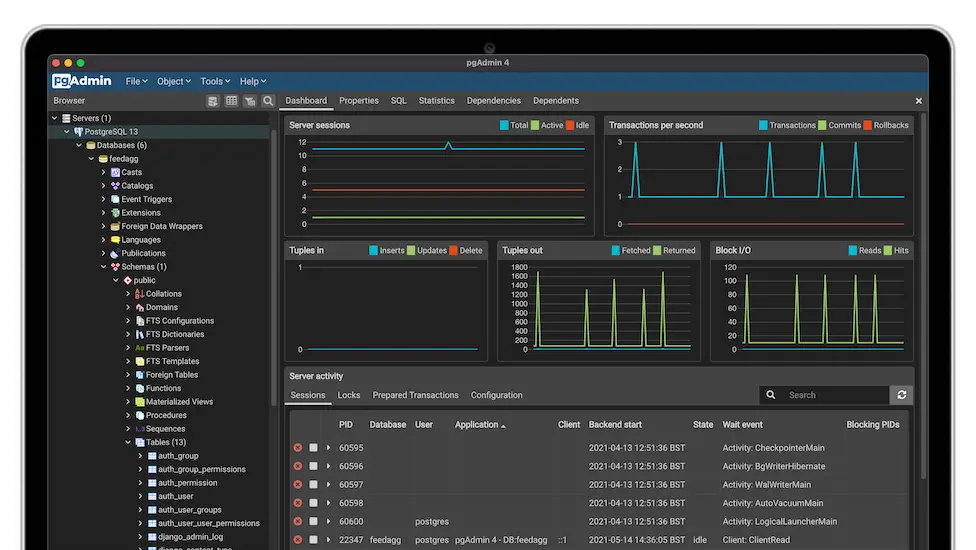
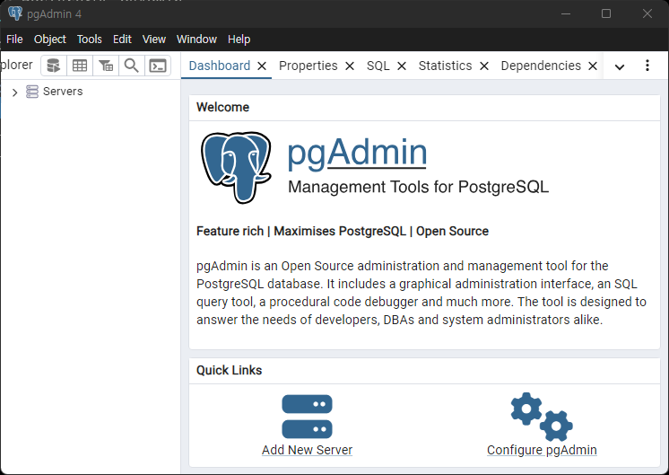
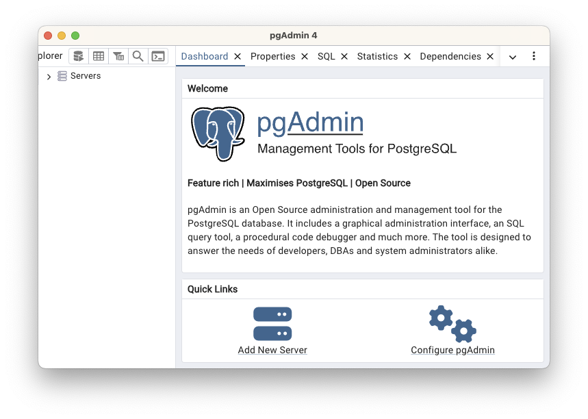
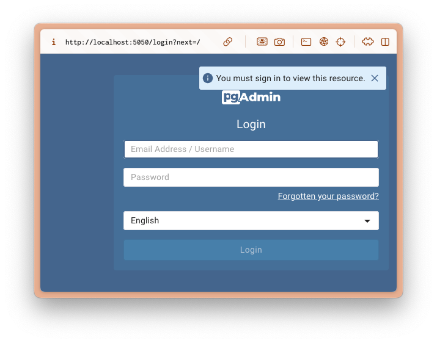

==================================
Postgres 관리도구 pgAdmin 4
==================================

pgAdmin은 PostgreSQL 데이터베이스를 위한 가장 인기있는 오픈소스 관리 도구입니다. 웹 기반의 GUI 인터페이스를 제공하여 데이터베이스 관리, 쿼리 실행, 테이블 관리 등 다양한 데이터베이스 작업을 쉽게 수행할 수 있게 해줍니다.
개발 및 운영 환경 모두에서 유용하게 사용할 수 있는 도구이며, Postgres를 사용하는 프로젝트에서 필수적인 도구로 자리잡고 있습니다.

공식 사이트 : https://www.pgadmin.org

주요 기능:

* 데이터베이스 생성/관리
* SQL 쿼리 에디터
* 테이블/뷰/함수 등의 데이터베이스 객체 관리 
* 백업/복원 기능
* 사용자 권한 관리
* 서버 모니터링

`공식 사이트 Download <https://www.pgadmin.org/download/>`_ 페이지에서 여러 운영체제에 대한 배포파일을 다운로드 하실 수 있습니다.

설치하기
=============

윈도우
-------------

`winget을 통한 설치 <https://winget.run/pkg/PostgreSQL/pgAdmin>`_\를 추천드립니다.

.. code-block:: bash

    winget install -e --id PostgreSQL.pgAdmin

혹은 `Windows용 다운로드 <https://www.pgadmin.org/download/pgadmin-4-windows/>`_ 페이지에서 수동으로 다운로드 후 설치하실 수도 있습니다.

설치를 완료하신 후에 ``pgAdmin 4`` 애플리케이션을 찾아 실행해주세요.

맥
-------------

`homebrew를 통한 설치 <https://formulae.brew.sh/cask/pgadmin4>`_\를 추천드립니다. 설치 후에 업그레이드도 homebrew를 통해 쉽게 할 수 있습니다.

.. code-block:: bash

    brew install --cask pgadmin4

혹은 `macOS용 다운로드 <https://www.pgadmin.org/download/pgadmin-4-macos/>`_ 페이지에서 수동으로 다운로드 후 설치하실 수도 있습니다.

설치를 완료하신 후에 ``pgAdmin 4`` 애플리케이션을 찾아 실행해주세요.

도커
-------------

`공식문서 <https://www.pgadmin.org/docs/pgadmin4/latest/container_deployment.html>`_\를 참고해서
``dpage/pgadmin4`` 이미지를 통해 컨테이너로 웹 모드로 구동하실 수 있습니다.
이때 환경변수를 통해 로그인 이메일 주소와 암호를 지정해주어야 합니다.

.. code-block:: bash

    docker pull dpage/pgadmin4
    docker run -p 5050:80 \
        -e 'PGADMIN_DEFAULT_EMAIL=user@domain.com' \
        -e 'PGADMIN_DEFAULT_PASSWORD=SuperSecret' \
        -d dpage/pgadmin4

컨테이너 생성 후에 서버가 준비되기까지 시간이 조금 걸릴 수 있구요.
잠시 후 http://localhost:5050 페이지로 접속해보면 로그인 페이지가 보일 것입니다.
``docker run`` 명령에서 지정한 이메일/암호를 사용해서 로그인하실 수 있습니다.

이 외에도 `다양한 환경변수가 지원 <https://www.pgadmin.org/docs/pgadmin4/latest/container_deployment.html#environment-variables>`_\됩니다.
`예제 공식문서 <https://www.pgadmin.org/docs/pgadmin4/latest/container_deployment.html#examples>`_\에서는
SSL 설정과 리버스 프록시/Nginx 설정에 대해서 다루고 있으니 참고해주세요.

우분투 리눅스
-------------

우분투 리눅스 기본 저장소에서는 ``pgadmin4`` 패키지가 제공되지 않습니다.
`pgadmin4 APT 공식문서 <https://www.pgadmin.org/download/pgadmin-4-apt/>`_\를 참고하여
먼저 저장소를 추가하신 후에

.. code-block:: bash

    # 저장소의 공개키 설치 (이전에 하지 않았다면):
    curl -fsS https://www.pgadmin.org/static/packages_pgadmin_org.pub | sudo gpg --dearmor -o /usr/share/keyrings/packages-pgadmin-org.gpg

    # 저장소 설정 파일 생성 및 업데이트
    sudo sh -c 'echo "deb [signed-by=/usr/share/keyrings/packages-pgadmin-org.gpg] https://ftp.postgresql.org/pub/pgadmin/pgadmin4/apt/$(lsb_release -cs) pgadmin4 main" > /etc/apt/sources.list.d/pgadmin4.list && apt update'

.. admonition:: arm64 CPU는 지원하지 않습니다.
    :class: warning

    arm64 CPU 환경의 우분투 리눅스에서는 위 "저장소 설정 파일 생성 및 업데이트" 명령에서 아래 오류가 발생합니다.

    N: Skipping acquire of configured file 'main/binary-arm64/Packages' as repository 'https://ftp.postgresql.org/pub/pgadmin/pgadmin4/apt/noble pgadmin4 InRelease' doesn't support architecture 'arm64'

APT 업데이트가 오류없이 완료되셨다면 아래 명령으로 ``pgadmin4`` 패키지를 설치하실 수 있습니다.

.. code-block:: bash

    # 데스크톱과 웹 모드 모두 설치
    sudo apt install pgadmin4

    # 데스크톱 리눅스 환경이시라면, 데스크톱 모드만 설치
    sudo apt install pgadmin4-desktop

    # 서버 리눅스 환경이시라면, 웹 모드만 설치
    sudo apt install pgadmin4-web 

    # 웹 모드를 설치한 경우 웹서버 설정이 필요합니다.
    sudo /usr/pgadmin4/bin/setup-web.sh

파이썬 팩키지
-------------

.. tip::

    파이썬 팩키지로도 제공되기에 파이썬에서 ``pip install pgadmin4`` 명령으로도 설치하시고
    ``pgadmin4`` 명령으로 실행하실 수도 있습니다.
    하지만 애플리케이션으로서 사용하실려면 설치형으로 설치하시기를 추천드립니다.

    공식문서: https://www.pgadmin.org/download/pgadmin-4-python/
