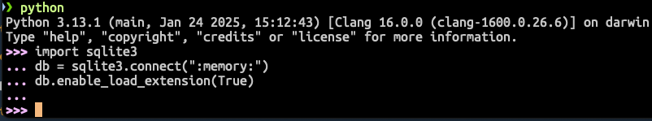

==========================
리눅스에 파이썬 설치
==========================

내장 파이썬
=================

우분투 리눅스 22.04 LTS 버전 기준으로 파이썬 3.12.3 버전이 설치되어있습니다.
이 파이썬 버전으로 충분하시다면 이를 쓰셔도 되겠구요.

.. code-block:: text

   $ /usr/bin/python3 --version
   Python 3.12.3

2025년 1월 기준으로 최신 버전인 ``3.13.1`` 버전을 ``pyenv``\를 통해 추가로 설치해보겠습니다.
시스템에 설치된 파이썬은 시스템에서 사용하기에 절대 업그레이드를 하거나 삭제하지 않습니다.

파이썬 빌드를 위한 의존 팩키지 설치
============================================

리눅스에서 파이썬 빌드에 의존성있는 팩키지들을 미리 설치해야 합니다.
팩키지들이 설치되어있지 않으면 ``BUILD FAILED`` 나 ``ModuleNotFoundError`` 에러 메시지를 보실 수 있습니다.
아래는 Ubuntu 24.04 LTS 기준으로 파이썬 3.13.1 버전 빌드 시에 필요했던 팩키지들입니다.

.. code-block:: shell

    sudo apt update
    sudo apt install -y build-essential libssl-dev zlib1g-dev \
                        libncurses5-dev libncursesw5-dev libreadline-dev \
                        libsqlite3-dev libgdbm-dev libdb5.3-dev libbz2-dev \
                        libexpat1-dev liblzma-dev tk-dev libffi-dev \
                        git wget curl llvm xz-utils

pyenv 설치
=================

`pyenv 공식문서 <https://github.com/pyenv/pyenv?tab=readme-ov-file#1-automatic-installer-recommended>`_\에서
안내하는 자동 설치 명령을 터미널에서 수행합니다.

.. code-block:: shell

    curl -fsSL https://pyenv.run | bash

그럼 아래와 같이 출력이 되구요. 쉘에서 ``pyenv``\를 로딩하기 위한 설정이 안내되고 있습니다.
12번째~14번째 줄의 코드를 사용하시는 쉘 설정파일에 추가해주세요.
현재 사용하시는 쉘은 ``echo $SHELL`` 명령으로 확인하실 수 있으며,
``bash 쉘``\의 경우 ``~/.bashrc`` 파일 끝에,
``zsh 쉘``\의 경우 ``~/.zshrc`` 파일 끝에 추가해주세요.

.. tip::

    리눅스에서는 GUI가 아닌 CLI 환경에서 각종 텍스트 파일을 편집할 일이 많습니다.
    이때 ``vim``\이나 ``nano``\ 같은 텍스트 편집기를 사용하시면 편리합니다.

아래 설정은 ``pyenv``\가 업데이트 됨에 따라 변경될 수 있습니다.
반드시 여러 줄의 출력에서 해당 설정을 찾아 쉘 설정 파일에 추가해주세요.

.. code-block:: text
    :linenos:
    :emphasize-lines: 1,12-14

    $ curl -fsSL https://pyenv.run | bash
    Cloning into '/home/allieus/.pyenv'...
    생략

    WARNING: seems you still have not added 'pyenv' to the load path.

    # Load pyenv automatically by appending
    # the following to
    # ~/.bash_profile if it exists, otherwise ~/.profile (for login shells)
    # and ~/.bashrc (for interactive shells) :

    export PYENV_ROOT="$HOME/.pyenv"
    [[ -d $PYENV_ROOT/bin ]] && export PATH="$PYENV_ROOT/bin:$PATH"
    eval "$(pyenv init - bash)"

    # Restart your shell for the changes to take effect.

    # Load pyenv-virtualenv automatically by adding
    # the following to ~/.bashrc:

    eval "$(pyenv virtualenv-init -)"

서버에 접속하셨다면 서버 접속을 끊으셨다가 다시 접속해주세요.
로컬이라면 터미널을 껐다가 다시 켜주세요.

``pyenv --help`` 명령이 동작하신다면, pyenv가 정상적으로 설치된 것입니다.

.. code-block:: bash

   pyenv --help

pyenv로 설치 가능한 파이썬 버전 목록 확인
=============================================

``pyenv install --all`` 명령으로 설치 가능한 파이썬 버전 목록을 확인해보실 수 있습니다. 파이썬 ``2.1`` 버전부터 최신 버전까지 지원하며,
이 외에도 ``anaconda3``, ``graalpython``, ``jython``, ``miniconda3``, ``pypy3`` 등 다양한 배포판을 ``pyenv``\를 통해 설치할 수 있습니다.

.. code-block:: text

   $ pyenv install --all

   Available versions:
     생략
     3.12.8
     3.13.0
     3.13.1
     생략
     anaconda3-5.3.1
     생략

pyenv로 파이썬에 sqlite3 지원을 추가하여, 빌드하기
===========================================================

``pyenv`` 명령이나 ``asdf`` 명령을 통해 파이썬을 설치하실 때 이미 빌드된 바이너리를 복사하는 것이 아니라 매번 새롭게 빌드합니다.
파이썬 빌드 시에 방금 설치한 ``sqlite`` 모듈이 사용되도록 환경변수들을 맞춰주고, 파이썬을 빌드합니다.
아래 명령은 파이썬 ``3.13.1`` 버전을 빌드합니다. 원하시는 버전으로 빌드해주세요.

.. code-block:: bash
   :emphasize-lines: 5

   CFLAGS="-DSQLITE_ENABLE_LOAD_EXTENSION=1" \
   PYTHON_CONFIGURE_OPTS="--enable-loadable-sqlite-extensions" \
   pyenv install 3.13.1

``pyenv``\를 통해 설치한 파이썬 목록은 ``pyenv versions`` 명령으로 확인하실 수 있습니다.

.. code-block:: text
   :emphasize-lines: 1

   $ pyenv versions
   * system (set by /home/allieus/.pyenv/version)
     3.13.1

``pyenv global 3.13.1`` 명령으로 현재 유저 계정에서는 ``3.13.1`` 버전을 전역으로 지정합니다.

.. code-block:: text

   pyenv global 3.13.1

현재 유저가 사용하는 ``python`` 명령은 현재 유저 계정에서 설치된 ``3.13.1`` 버전을 사용하게 됩니다.

.. code-block:: text
   :emphasize-lines: 1

   $ pyenv versions
     system
   * 3.13.1 (set by /home/allieus/.pyenv/version)

터미널을 다시 열어서 ``python`` 명령을 실행해보면, 현재 유저 계정에서 설치된 ``3.13.1`` 버전을 사용하는 것을 확인해보실 수 있습니다.

.. code-block:: text
   :emphasize-lines: 1

   $ python --version
   Python 3.13.1

파이썬 쉘에서 아래 코드가 오류없이 수행이 되면, SQLite 확장도 지원하는 파이썬 빌드 성공입니다.

.. code-block:: python

    import sqlite3
    db = sqlite3.connect(":memory:")
    db.enable_load_extension(True)

.. admonition:: 특정 프로젝트에서만 다른 파이썬 버전을 사용하실려면?
   :class: tip

   ``global`` 버전은 한번 설정하시면 가급적 변경하지 마시고,
   특정 프로젝트에서만 다른 파이썬 버전을 사용하실려면, 해당 프로젝트 루트 디렉토리에서 ``pyenv local 3.13.1`` 명령을 실행해주세요.
   그럼 그 디렉토리에 ``.python-version`` 파일이 생기고 그 파일이 있는 디렉토리에서는 ``python`` 명령은
   로컬로 지정한 파이썬으로 동작하게 됩니다.
