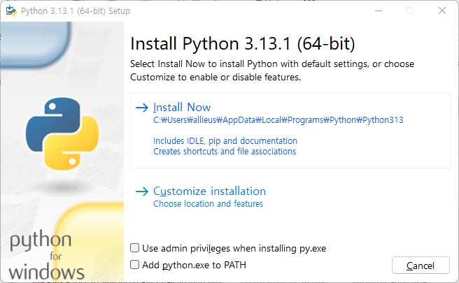
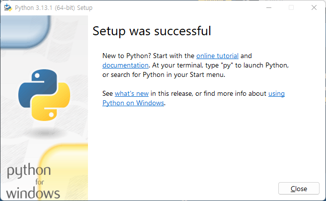
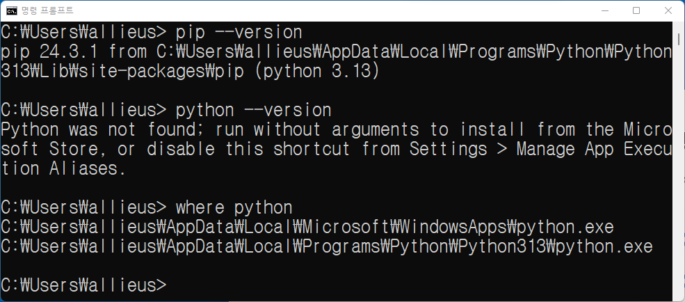
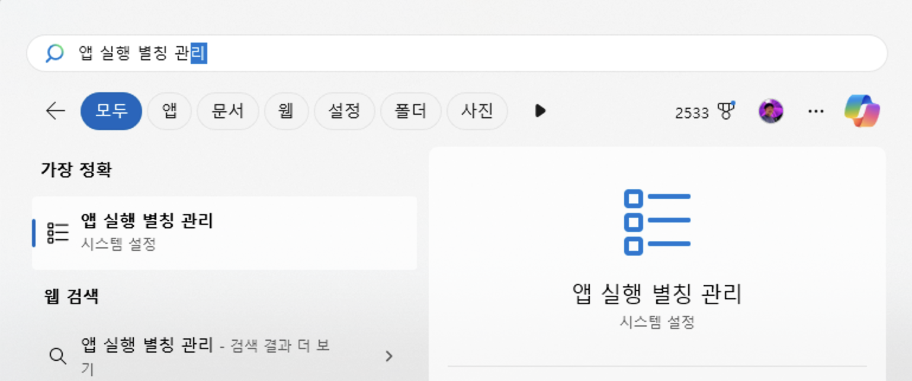
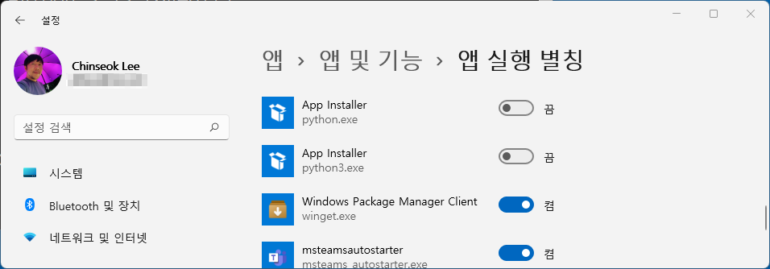
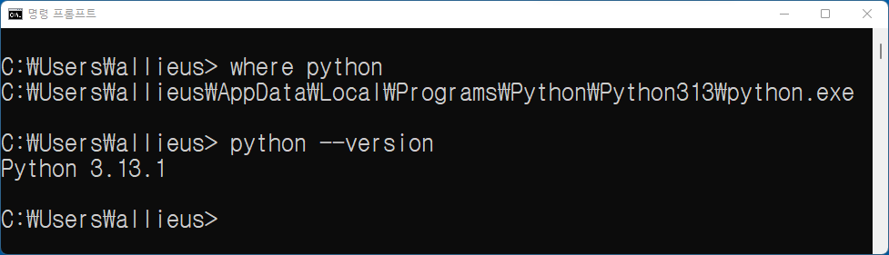
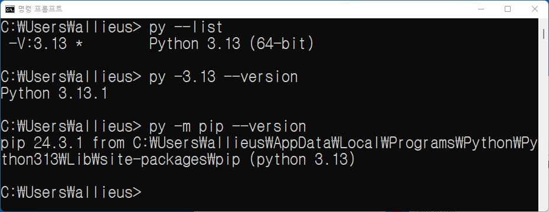

윈도우 파이썬 설치
==========================

윈도우에서는 파이썬을 설치하고 활용하는 방법은 다양합니다. 상황에 따라 적절한 방법을 선택해서 사용하실 수 있습니다.

* `python.org <https://www.python.org>`_ 에서 파이썬 공식 배포판을 다운받아 설치 (추천)

* `Anaconda Python <https://www.anaconda.com>`_ 에서 아나콘다 파이썬 배포판을 다운받아 설치

* `Microsoft Store <https://apps.microsoft.com/search?query=python>`_\를 통한 설치

* 윈도우 팩키지 매니저 `winget <https://docs.microsoft.com/ko-kr/windows/package-manager/winget/>`_\을 통한 설치 (추천)

* 파이썬 버전 매니저 `pyenv-win <https://github.com/pyenv-win/pyenv-win>`_\을 통한 설치

* `Windows Subsystem for Linux (WSL) <https://learn.microsoft.com/ko-kr/windows/wsl/install>`_\를 활용하여 리눅스 환경에서 파이썬 활용

* `도커 <https://www.docker.com>`_\를 통한 파이썬 활용

윈도우에서 머신러닝 관련 라이브러리들이 바이너리 파일로 제공되지 않고 ``C 소스`` 파일로 배포되던 시절이 있었습니다.
이런 라이브러리들을 설치하기 위해서는 파이썬 소스 컴파일을 해야 했습니다. 라이브러리 설치할 때 ``Visual Studio``\과 같은 빌드 툴이 필요하다라는 에러는
이런 이유에서 였습니다. 라이브러리 개발자가 아닌 유저들은 빌드 툴을 설치하실 필요가 없습니다.

이때 ``Anaconda Python``\은 머신러닝 관련 라이브러리들을 바이너리 파일로 제공하여 파이썬 소스 컴파일을 하지 않아도 되도록 해줬고,
명령 한 번에 다양한 머신러닝 관련 라이브러리들을 설치할 수 있었습니다. ``Anaconda Python``\이 널리 전파가 된 이유입니다.
이런 관성으로 인해 윈도우에서 파이썬을 설치할 때 ``Anaconda Python``\을 설치하는 경우가 많습니다. (설치 팩키지 용량: 1GB)

가장 대중적인 방법인 공식 배포판을 직접 다운로드해서 설치하는 방법과 ``winget`` 명령을 통해 파이썬을 설치하는 방법이 추천드리고,
아래에서 각 방법에 대해 자세히 설명드리겠습니다.

공식배포판을 직접 다운로드해서 설치하는 방법
-------------------------------------------------------------

공식 파이썬 배포판은 용량이 70MB 정도로서 매우 가볍고,
파이썬 기본 라이브러리 저장소인 `pypi.org <https://pypi.org>`_\에 요즘 수많은 라이브러리들이 바이너리 파일로 제공되고 있기에,
``Anaconda Python``\을 사용하지 않으셔도 공식 파이썬 배포판 만으로 충분하실 수 있습니다.

https://python.org 에서 파이썬 최신 버전을 다운받아 설치해주세요.

.. admonition:: 주의. ARM 노트북에서도 amd64 버전을 설치해주세요.
   :class: warning

   윈도우 배포판에서 Windows Installer (64-bit) 버전과 Windows Installer (ARM64) 버전이 있습니다.
   설치 파일명은 64-bit 버전은 ``python-3.13.1-amd64.exe`` 이고, ARM64 버전은 ``Python 3.13.1-arm64.exe`` 입니다.

   요즘 윈도우 노트북도 ARM 계열이 차즘 많아지고 있는 데요. ARM 노트북에서 파이썬을 자동 설치하시다보면 ARM64 버전이 설치되기도 합니다.
   ARM64 파이썬에서는 기본 파이썬은 구동이 되지만, ARM64를 아직 지원하지 않는 라이브러리가 아직 많은 편입니다.
   그러니 ARM64 노트북에서도 웹개발을 위해서라면 64-bit 버전을 설치하시기를 권장드립니다.

다운받은 설치 파일을 실행하면 다음과 같은 화면이 나타납니다.
아래 화면에서 ``Add python.exe to PATH`` 체크박스를 꼭 체크하시고, ``Install Now`` 버튼을 눌러주세요.
파이썬 경로를 시스템 경로에 추가하셔야만, 명령행에서 ``python`` 관련 명령은 손쉽게 실행하실 수 있습니다.
체크하지 않으시면 분명 파이썬이 설치되어있음에도 불구하고 ``python`` 명령이 없다는 에러를 만나시게 됩니다.

   Python Windows Installer (64-bit) 첫 화면

그럼 설치가 진행되고, 아래와 같이 설치가 완료됩니다.

기존에 열어둔 명령창은 모두 닫고, 환경변수를 다시 로딩하기 위해 새로운 명령창을 열어주세요.
``pip --version`` 명령과 ``python --version`` 명령을 실행해서 파이썬이 정상적으로 설치되었는지 확인합니다.

그런데 ``pip --version`` 명령은 동작하지만 ``python --version`` 명령은 동작하지 않는 경우가 있습니다.
``where python`` 명령을 실행해보면 방금 설치한 파이썬보다
``C:\Users\사용자\AppData\Local\Microsoft\WindowsApps\python.exe``\가 우선순위가 높은 상황입니다.
이는 파이썬 인터프리터가 아니라 "앱 실행 별칭 (App Execution Aliases)"으로서 쉬운 파이썬 설치를 도와주는 윈도우 기능입니다.
실행하면 Microsoft Store를 통해 파이썬 설치가 시도됩니다.
이미 파이썬을 설치한 상황이니 "앱 실행 별칭"은 필요가 없습니다. 제거를 추천드립니다.

제거하실려면, 윈도우 설정에서 "앱 실행 별칭"을 찾아주세요.

   윈도우 10 (설정 → 앱 → 앱 및 기능 → 앱 실행 별칭),
   윈도우 11 (설정 → 앱 → 앱 및 기능 → 기타 설정 → 앱 실행 별칭)

App Installer (python.exe)와 App Installer (python3.exe) 항목을 모두 비활성화해주세요.

   윈도우 11 화면. "앱 실행 별칭"을 통한 파이썬 실행은 하지 않을 것이기에, 비활성화해주세요.

그럼 아래와 같이 ``where python`` 명령에서 해당 항목이 사리지고,
우리가 설치한 파이썬만 남아있음을 확인하실 수 있습니다.

팩키지 매니저 winget을 활용하는 방법
--------------------------------------------------

``winget`` 명령행 도구는 마이크로 소프트에서 공식 지원하는 팩키지 매니저입니다.
macOS의 ``Homebrew``, 리눅스의 ``apt``, ``yum`` 등과 같은 역할을 하구요.
윈도우 11, 최신 버전의 윈도우 10 및 윈도우 서버 2025에서 사용할 수 있습니다.

명령행에서 ``winget`` 명령어를 확인해보시구요.

.. code-block:: text

   $ winget --version
   v1.9.25200

``winget`` 명령이 확인되셨다면, 다음 명령어로 파이썬을 설치하실 수 있습니다.

.. code-block:: shell

   # 파이썬 3.13 설치
   winget install --id=Python.Python.3.13 --silent

``winget`` 명령이 없으실 경우, 마이크로소프트 공식문서
`WinGet 도구를 사용하여 애플리케이션 설치 및 관리 <https://learn.microsoft.com/ko-kr/windows/package-manager/winget/>`_
를 참고해서 설치해주세요.

윈도우에서는 py 명령어를 꼭 쓰세요.
---------------------------------------------

윈도우에서만 python launcher인 ``py`` 명령이 지원됩니다.
윈도우에서 여러 버전의 파이썬을 설치한 경우, 나중에 설치한 파이썬이 우선순위를 높이 가져 항상 실행되고,
처음 설치한 파이썬은 실행에 어려움을 겪으시는 경우가 많습니다.

이때 ``py`` 명령을 활용하시면 윈도우에 설치된 여러 버전의 파이썬들을
``py -3.12 --version``, ``py -3.13 --version`` 처럼 버전을 지정하여 손쉽게 실행하실 수 있습니다.

