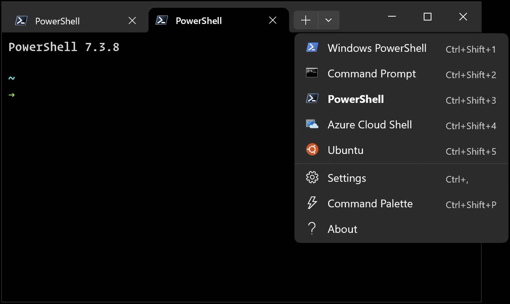

윈도우 터미널
===================

윈도우의 명령프롬프트와 기본 파워쉘은 마이크로소프트의 더 나은 터미널 프로그램이 있으니, 설치를 추천드립니다.

기존
---------

윈도우의 기본 터미널 환경은 맥과 리눅스에 비해서 많이 아쉽습니다. 

* 명령 프롬프트 : 파워쉘 이전 명령행 프로그램.
* 윈도우 파워쉘 : 윈도우 기본 파워쉘. 버전 5.x.

추천
----------

더 나은 터미널 환경을 경험하실 수 있습니다. 둘 다 마이크로소프트에서 개발했습니다.

* `파워쉘 코어 7.x <https://learn.microsoft.com/ko-kr/powershell/scripting/install/installing-powershell-on-windows>`_ : 최신 파워쉘. 크로스 플랫폼 지원 (윈도우, 맥, 리눅스, 클라우드)

  - 최신 파워쉘은 더 나은 개발 경험을 제공합니다.

* `윈도우즈 터미널 <https://learn.microsoft.com/ko-kr/windows/terminal/install>`_ : 마이크로소프트에서 개발한 통합 터미널 프로그램. 다양한 폰트 및 탭 지원.

  - 윈도우 기본 터미널은 탭을 지원하지 않고 폰트 설정도 제한적이었죠. 윈도우즈 터미널을 설치하시면 탭 지원, 폰트 설정 등 다양한 기능을 사용할 수 있습니다.
    아래 유튜브 영상으로 확인하세요. ;-)

.. raw:: html

    

        <iframe
            src="https://www.youtube.com/embed/8gw0rXPMMPE?si=sfj-n0FQoZQnFdlC"
            title="YouTube video player"
            frameborder="0"
            allow="accelerometer; autoplay; clipboard-write; encrypted-media; gyroscope; picture-in-picture; web-share"
            referrerpolicy="strict-origin-when-cross-origin"
            allowfullscreen></iframe>
    

winget을 통한 설치
--------------------------------

직접 다운로드해서 설치하셔도 되구요. ``winget`` 명령어를 통해서도 설치할 수 있습니다.

.. code-block:: shell

   # 파워쉘 7 코어 설치
   winget install --id=Microsoft.PowerShell --silent

   # 윈도우 터미널 설치
   winget install --id=Microsoft.WindowsTerminal --silent

설치된 화면
-----------------

   Windows Terminal
